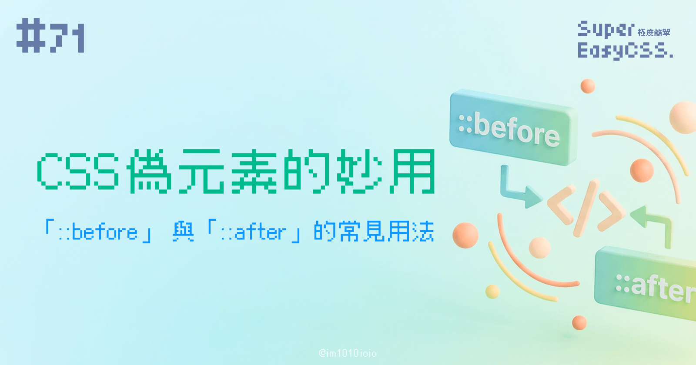
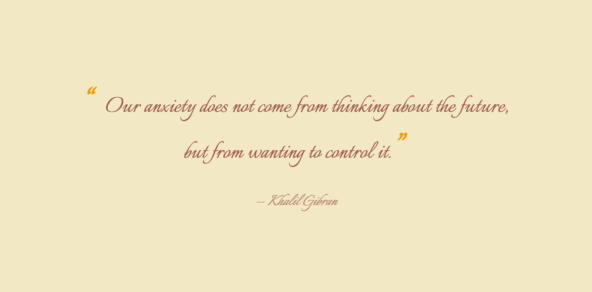
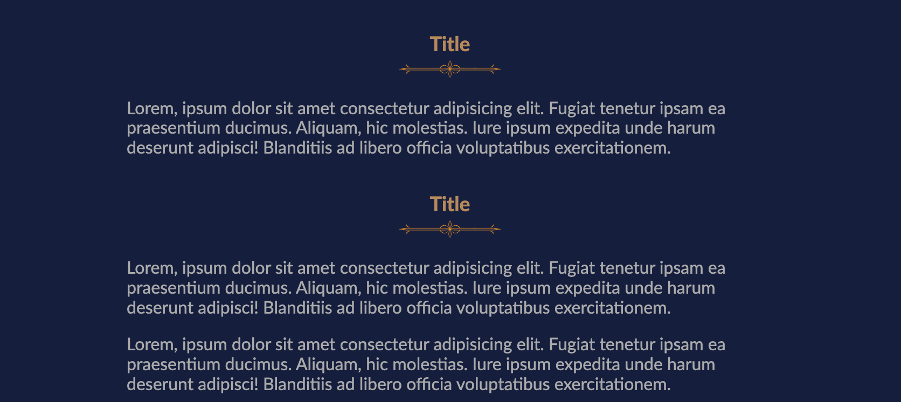
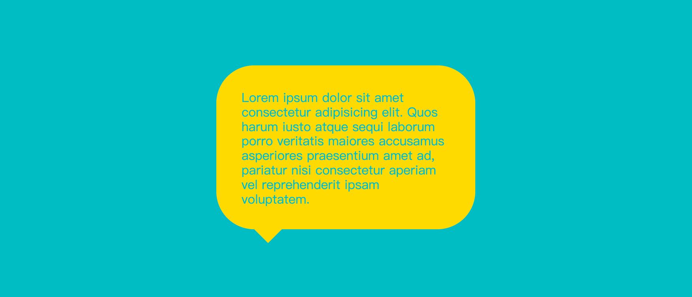

之前寫的文章，雖然有提到過，但是居然沒有好好地解釋過 CSS 的偽元素（Pseudo），也就是 `::before` 與 `::after`。這超級實用的，怎麼能沒有呢？所以今天就來好好地認識一下它們吧！

它們用在不修改 HTML 的情況下加入裝飾性內容，是前端開發的必備技能。

`::before` 與 `::after`，簡單來說，就像是你在 HTML 元素的前後，額外加上了兩個裝飾用的「影子」元素。而且，你完全不需要去動到原本的 HTML 結構，應用範圍非常地廣。

---

## 一、偽元素 `::before` 與 `::after` 的語法

```css
div::before{
    content: "";
}
```

在開始寫 `::before` 與 `::after` 之前，有個非常重要的觀念要知道：  
「要讓 `::before` 或 `::after` 成功顯示出來，**content 屬性是絕對必要的**。」

少了 `content`，就算你設定了背景、寬高等其他樣式，他們是無法出現的喔！

### `content` 屬性的值

`content` 屬性的值可以是：

* **空字串** `""`：如果你只是想利用偽元素來畫圖形或做樣式，不需要任何文字內容。
    
* **一般文字** `"文字"`：可以直接填入你想顯示的文字，例如引號。
    
* **屬性值** `attr()`：可以抓取 HTML 元素的屬性值作為內容。
    
* **計數器** `counter()`：用於製作編號清單。
    

這篇我們主要講解「空字串 `""`」與「一般文字 `"文字"`」這兩種最常見的應用方式，  
下一篇我們再介紹「屬性值 `attr()`」和「計數器 `counter()`」的用法。

---

## 二、應用範例

### 1\. 為文字添加引號

一段引用名言，通常會在前後加上引號。



> DEMO 連結：[Quotation Marks with CSS Pseudo ::before & ::after](https://codepen.io/im1010ioio/pen/gbPbZyo)

這時候每次都要手動在 HTML 裡加上 `“` 與 `”`，太麻煩了。  
這時候就適合使用 `::before` 和 `::after` 了，這樣無論文字是什麼，  
這個 `<blockquote>` 的前後永遠會有引號。

```css
blockquote{
    &::before{ content: "“"; }
    &::after{  content: "”"; }
    
    &::before, &::after{
        font-size: 1.5em;
        font-weight: bold;
        margin-right: 0.25em;
        color: #EF9F00;
    }
}
```

---

### 2\. 裝飾性內容：分隔線

可以利用偽元素添加各種裝飾，像是標題底下的裝飾線、區塊的邊角圖案等等，讓頁面視覺更豐富，同時也不必每次都要在 HTML 放入裝飾用的元素。



> DEMO 連結：[Divider with CSS Pseudo ::after](https://codepen.io/im1010ioio/pen/pvgvGYg)

```css
.title {
    position: relative;
    /* 其他樣式 (略) */
    &::after {
        /* content 內容為空，單純做樣式 */
        content: ""; 
        position: absolute;
        bottom: 0;
        left: 0;
        width: 100%;
        height: 1rem;
        background-image: url("https://im1010ioio.github.io/super-easy-css/71/divider.png");
        background-position: center center;
        background-size: contain;
        background-repeat: no-repeat;
    }
}
```

---

### 3\. 裝飾性內容：對話框或 Tooltip 的三角形

再來一個常見的裝飾性元素 —— 對話框或 Tooltip 會有的那種三角形，通常這樣的小裝飾都會使用偽元素去做。



> DEMO 連結：[Dialog arrow with CSS Pseudo ::after](https://codepen.io/im1010ioio/pen/jEWPOdw)

而畫三角形的方法請看這篇文章有詳細的解說，在這裡就不仔細說明了：  
[#42 用 CSS border 繪製三角形箭頭 (等腰/直角三角形)](https://ithelp.ithome.com.tw/articles/10356527)

```css
.card{
    --card-color: #FFD900;
    --card-radius: 3rem;
    
    position: relative;
    /* 其他樣式 (略) */
    &::after{
        /* content 內容為空，單純做樣式 */
        content: "";
        position: absolute;
        top: 100%;
        left: var(--card-radius);
        height: 0px;
        width: 0px;
        border-top: 2vw solid var(--card-color);
        border-left: 2vw solid transparent;
        border-right: 2vw solid transparent;
    }
}
```

---

### 4\. 清除浮動 (Clearfix)

如果網頁是使用 block `float` 排版（雖然已經比較少見了），最後都需要有一個元素具有 `clear: both;` 的樣式，才能清除浮動，否則父元素會無法被撐開，導致高度塌陷、版面錯亂。

詳細 block 排版方法可以看這篇：  
[#17 CSS block、inline、inline-block：網頁排版的御三家](https://ithelp.ithome.com.tw/articles/10333384)

但是這個要有 `clear: both;` 的東西，又不是我們內容所需要的，每次都為這個加一個空的 HTML 元素很麻煩，也很難管理，所以這時，我們就可以用 `::after` 來解決，這是從前非常常見的做法：

```css
.clearfix::after {
  content: "";
  display: block; /* 轉換為 block 元素 */
  clear: both;    /* 清除左右浮動 */
  height: 0;
  visibility: hidden;
}
```

你只需要將 `.clearfix` 這個 class 加到浮動元素的父層容器上，就能完美解決高度塌陷的問題。

---

### 5\. 製作小圖示 (Icon Font)

之前我們在講解字型設定時，有提到 iconfont (圖示字體)：  
[#27 網頁載入字體、Icon Font 與 CSS font-family、font-weight](https://ithelp.ithome.com.tw/articles/10339314)

幫大家複習一下，那時候我們用了 `::before`，在不增加額外 HTML 標籤的情況下，在 `<ul>` 清單的前方加上了 icon 圖示（不過當時是使用舊版的 Font Awesome 作 DEMO）。


> DEMO 連結：[List with font awesome icon](https://codepen.io/im1010ioio/pen/PKpObM)

```css
ul {
    & li {
        list-style-type: none;
        &:before {
            content: "\f091"; /* FontAwesome 圖示的 Unicode 編碼 */
            font-family: FontAwesome;
            margin-left: -1.25rem;
            margin-right: .25em;
        }
    }
}
```

---

今天介紹的 `::before` 與 `::after` 都是開發網頁時常用到的小技巧，善用偽元素，能讓 HTML 結構更乾淨，也能讓 CSS 的有更多創意。

下一篇，我們將會深入探討偽元素的進階應用，看看如何搭 `data-*` 屬性做出實用的 RWD `<table>` 表格，以及如何搭配 `counter()` 函式打造客製化的編號清單樣式。那，我們明天見囉！

> 延伸閱讀：
> 
> * [MDN - ::before](https://developer.mozilla.org/en-US/docs/Web/CSS/::before)
>     
> * [CSS 偽元素 ( before 與 after )](https://www.oxxostudio.tw/articles/201706/pseudo-element-1.html)
>     

---

#### ↓↓↓↓↓↓↓↓↓↓↓↓↓↓↓↓↓↓↓↓

感謝看到最後的你，若你覺得獲益良多，請不要吝嗇給我按個喜歡。❤️

如果你喜歡我的創作，還想看看其他有趣的分享與日常，  
可以追蹤我的 IG [@im1010ioio](https://www.instagram.com/im1010ioio/)，或者是[🧋送杯珍奶鼓勵我](https://im1010ioio.bobaboba.me/)，謝謝你🥰。

