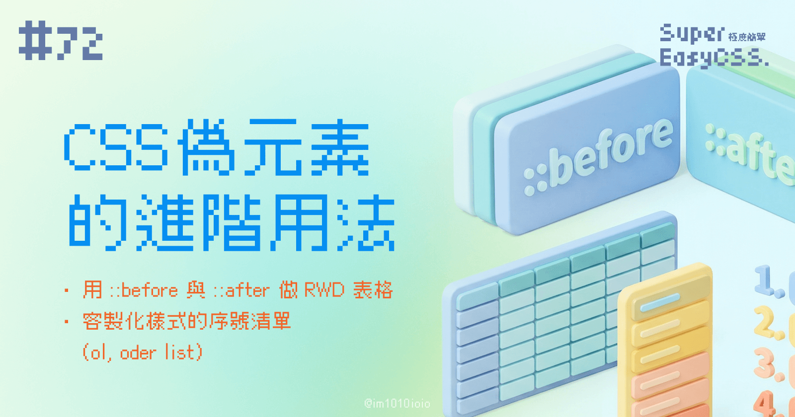
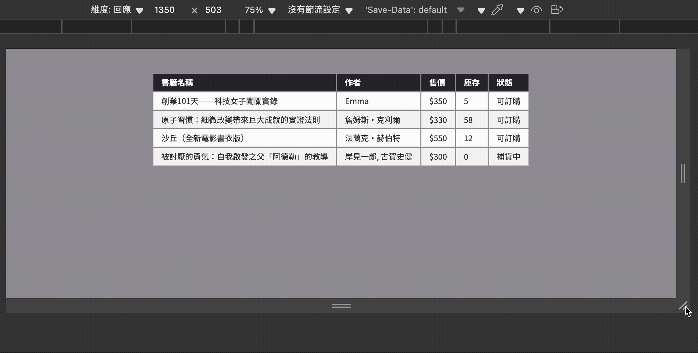
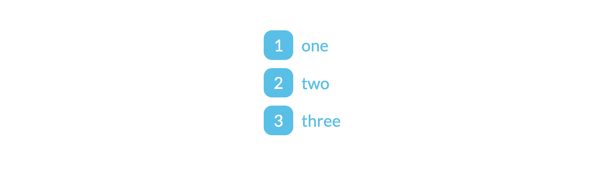

上一篇我們學到了 `::before` 與 `::after` 的基本用法，像是輕鬆添加引號、點綴裝飾性內容、清除浮動，甚至是製作小圖示。

這次，讓我們來探索更進階的用法，解決兩個常見的網頁設計難題：`<table>` 手機版與客製化 `<ol>` 清單。

---

## 一、RWD Table：會變身的響應式表格 (HTML `data-*`)

要做到 `<table>` RWD 手機版，需要運用 HTML 的 `data-*` 屬性，然後再使用 CSS `::before` 的 content 屬性透過 `attr()` 取值。

另外，還要做一些樣式設定：當畫面寬度變窄時，我們先隱藏原本的 `<th>` 標題，然後讓每個 `<td>` 變成不是 table 的樣式（例如：block 或 flex），最後就能讓表格在手機版上變成一目了然的卡片格式。



> DEMO 連結：[Responsive Table](https://codepen.io/im1010ioio/pen/dPGoKyO)

**HTML 結構**

我們在每個 `<td>` 元素中，預先使用 `data-th` 屬性存放對應的欄位標題。

```html
<table class="rwd-table">
    <thead>
        <tr>
            <th>書籍名稱</th>
            <th>作者</th>
            <th>售價</th>
            <th>庫存</th>
            <th>狀態</th>
        </tr>
    </thead>
    <tbody>
        <tr>
            <td data-th="書籍名稱">創業101天──科技女子闖關實錄</td>
            <td data-th="作者">Emma</td>
            <td data-th="售價">$350</td>
            <td data-th="庫存">5</td>
            <td data-th="狀態">可訂購</td>
        </tr>
        <!-- (略) -->
    </tbody>
</table>
```

**CSS**

在窄螢幕的樣式中，我們用 `td:before` 的 `attr()` 來抓取 `data-th` 的值，並將它顯示出來。

```css
.rwd-table {
    /* 手機版預設樣式 */
    tbody tr{
        display: block;
        padding: 1rem;
        margin: 1rem;
        border-radius: 1rem;
    }
    th { display: none; }

    td {
        display: flex;
        border-bottom: 0;

        /* 透過 ::before 偽元素來顯示標題 */
        &::before {
            content: attr(data-th) "：";
            display: block;
            font-weight: bold;
            min-width: 6.5em;
            max-width: 6.5em;
            color: #2B2932;
        }
    }

    /* 平板與桌面版樣式 */
    @media (min-width: 768px) {
        tbody tr{
            display: table-row;
            &:nth-child(even) {
                background-color: #f5f5f5;
            }
        }
        th, td {
            display: table-cell;
            padding: .5rem 1rem;
            border-bottom: 1px solid #eee;
        }

        /* 在大螢幕隱藏偽元素標題 */
        td::before {
            display: none;
        }
    }
}
```

---

## 二、客製化 ol 清單：我的序號我做主 (CSS 計數器 `counter()`)

覺得瀏覽器預設的 `1, 2, 3...` 或 `a, b, c...` 清單樣式太單調了嗎？利用 CSS 計數器（counter）與偽元素，我們可以隨心所欲地打造獨一無二的清單序號樣式！

### 1\. 原理

這個技巧的原理是：

1. 首先用 `counter-reset` 初始化一個計數器，
    
2. 接著在清單項目 `<li>` 中使用 `counter-increment` 讓計數器自動遞增，
    
3. 最後透過 `::before` 偽元素與 `content: counter()` 將計數器的值呈現出來，並為它加上喜歡的樣式。
    



> DEMO 連結：[Custom order list](https://codepen.io/im1010ioio/pen/XJXbYxK)

**HTML 結構**

```html
<ol>
    <li>one</li>
    <li>two</li>
    <li>three</li>
</ol>
```

**CSS**

```css
ol {
    list-style-type: none; /* 隱藏預設的數字序號 */
    padding: 0;
    counter-reset: step-counter; /* 初始化一個名為 step-counter 的計數器 */
}

ol li {
    counter-increment: step-counter; /* 讓計數器在每個 li 遞增 1 */
    margin-bottom: .5rem;
    color: #11c2eb;
}

ol li:before {
    content: counter(step-counter); /* 顯示計數器的當前值 */
    
    display: inline-flex;
    align-items: center;
    justify-content: center;
    
    width: 1.8rem;
    height: 1.8rem;
    margin-right: .5rem;
    
    color: white;
    background: #11c2eb;
    font-size: 1rem;
    border-radius: .5rem;
}
```

原本樸素的數字清單，瞬間變成了有自己樣式的圓角矩形序號！

### 2\. 修改 `counter()` 的序號樣式：`list-style-type`

那如果我今天不想要 1, 2, 3… 的格式，我想要使用英文字母 a, b, c…，或是羅馬數字 I, II, III… 怎麼辦呢？  
很簡單，只需要在剛剛的 `counter()` 函式中加入對應的 `list-style-type` 值即可，用來指定計數器的樣式：

```css
ol li:before {
    counter([counter-name], [list-style-type]);
}
```

例如：

```css
ol li:before {
    counter(counter-name, lower-alpha);
}
```

以下是一些 `<ol>` 常用的 `list-style-type` 種類：

* `decimal`: 數字 (1, 2, 3…) (`<ol>` 的預設值)
    
* `lower-alpha`: 小寫字母 (a, b, c…)
    
* `upper-alpha`: 大寫字母 (A, B, C…)
    
* `lower-roman`: 小寫羅馬數字 (i, ii, iii…)
    
* `upper-roman`: 大寫羅馬數字 (I, II, III…)
    
* `lower-latin`: 小寫拉丁字母 (a, b, c…)
    
* `upper-latin`: 大寫拉丁字母 (A, B, C…)
    
* `cjk-ideographic` 或 `trad-chinese-informal`: 繁體中文小寫 (一, 二, 三…)
    
* `trad-chinese-formal`: 繁體中文大寫，常用於正式文件或金融領域 (壹, 貳, 參…)
    
* `simp-chinese-informal`: 簡體中文小寫 (一, 二, 三…)
    
* `simp-chinese-formal`: 簡體中文大寫 (壹, 贰, 叁…)
    
* `cjk-heavenly-stem`: 天干 (甲, 乙, 丙…)
    
* `cjk-earthly-branch`: 地支 (子, 丑, 寅…)
    

### 3\. 補充：單獨使用 `list-style-type`

這個 `list-style-type` 也可以用在沒有客製化 `<ul>`, `<ol>` 樣式的時候：

```css
ul {
    list-style-type: circle;
}

ol {
    list-style-type: upper-roman;
}
```

本篇的主軸是有序列表 (`<ol>`)，不過補充一下，無序列表 (`<ul>`) 時，常見的則有以下的 `list-style-type` 的選項可以使用：

* `disc` (實心圓點, `<ul>` 的預設值)
    
* `circle` (空心圓圈)
    
* `square` (實心方塊)
    
* `none` (無符號，常用在導覽列或選單，因為這它們通常不需要項目符號)
    

---

CSS 偽元素 `::before` 與 `::after` 不只是用來做些裝飾效果，它也可以解決複雜排版問題、提升使用者體驗的強大語法。  
下次遇到類似的設計挑戰時，你也試試 `::before` 與 `::after` 的進階應用吧！

> 延伸閱讀：
> 
> * [Bootstrap教學－實現Table表格也支援RWD自適應效果](https://www.minwt.com/webdesign-dev/html/14066.html)
>     

---

#### ↓↓↓↓↓↓↓↓↓↓↓↓↓↓↓↓↓↓↓↓

感謝看到最後的你，若你覺得獲益良多，請不要吝嗇給我按個喜歡。❤️

如果你喜歡我的創作，還想看看其他有趣的分享與日常，  
可以追蹤我的 IG [@im1010ioio](https://www.instagram.com/im1010ioio/)，或者是[🧋送杯珍奶鼓勵我](https://im1010ioio.bobaboba.me/)，謝謝你🥰。

