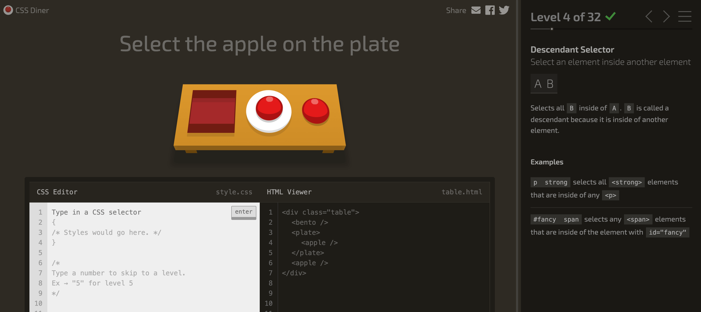

上一篇我們學習了 CSS 基本選擇器，現在讓我們進入進階的部分！  
這些選擇器功能強大，能讓你用純 CSS 做到更多有趣的效果，學起來後可以說是掌握了 CSS 的「隱藏技能」！

> #### ↓ 今日學習重點 ↓
> 
> * 了解 `::before` 和 `::after` 偽元素的用法
>     
> * 學習屬性選擇器 `[attr]` 的各種符號
>     
> * 認識 `:is`、`:where`、`:has` 等新式選擇器
>     

---

### 7\. `::Before`, `::After`**（偽元素）**

`::before` & `::after` 可以在元素內部的前和後添加東西，不過因為它們是偽元素，所以無法跟任何東西互動，滑鼠點也點不到。

這樣無中生有又無法點擊的東西，我們經常把它用 CSS 魔改後，變成裝飾性元素。

#### CSS

```css
/* 如果在 content 內打文字，會接續在內容的前或後 */
p::before { content: "把東西加在前面"; }
p::after  { content: "把東西加在後面"; }

/* 當成裝飾性元素時，我們會這樣使用： */
p::before { 
    content: "";    /* content 一定要有定義才會出現，可以是空的 */
    display: block; /* display 也一定要有定義 */
    /* 其餘是自訂的樣式 */
}
```

`::before` & `::after` 也可以寫成一個冒號的 `:before` & `:after`，不過為了區分偽類和偽元素，還是建議寫成兩個冒號喔！

> 延伸閱讀：[CSS | 全都是假的！關於那些偽類和偽元素 - 基本用法. 先來說說偽類（ Pseudo-classes ）吧！所有的偽類都會用 …](https://medium.com/enjoy-life-enjoy-coding/css-%E5%85%A8%E9%83%BD%E6%98%AF%E5%81%87%E7%9A%84-%E9%97%9C%E6%96%BC%E9%82%A3%E4%BA%9B%E5%81%BD%E9%A1%9E%E5%92%8C%E5%81%BD%E5%85%83%E7%B4%A0-%E5%9F%BA%E6%9C%AC%E7%94%A8%E6%B3%95-4de48feb8607)

---

### 8\. **反選偽類**

#### HTML

```xml
<a href="abc.docx"   download><a>
<a href="info.docx"  download>info.docx<a>
<a href="detail.jpg" download>detail.jpg<a>
```

#### CSS

```css
a:not(:last-child) { ... }            /* 選取不是最後一個的 a */
a:empty            { display: none; } /* 選取標籤內容是空的 a */
```

---

### **9\. 屬性選擇器**

CSS 也可以針對 HTML 中的屬性去選擇元素。

#### HTML

```xml
<a href="https://">                                   連結文字 </a>
<a href="https://" disabled>                          連結文字 </a>
<a href="http://"  target="_blank">                   連結文字 </a>
<a href="https://www.instagram.com/" target="_blank"> 連結文字 </a>
<a href="/files/info.docx" download>                  連結文字 </a>


```

#### CSS

```css
a[disabled]          { ... } /* 選取有 disabled 屬性的 a */
a[target="_blank"]   { ... } /* 選取有新開視窗屬性的 a */
a[href~="instagram"] { ... } /* 選取連結文字有包含 "instagram" 的 a */
a[href^="https" i]   { ... } /* 選取連結開頭有 "https" 的 a, 不分大小寫 */
a[href$="docx" i]    { ... } /* 選取連結結尾有 "docx" 的 a,  不分大小寫 */
img[alt*="cats"]     { ... } /* 選取 alt 的「單字」(要有空格)有包含 "cats" 的 img */
                             /* 例如：「alt="cute cats"」可以，但「alt="cutecats"」不可以  */
```

關於屬性選擇器的各種等於符號：`~=`、`^=`、`$=`、`*=`，其實十分有用。我們可以不用透過 JS，單靠 CSS 就能做到很多判斷，依據不同條件加上不同樣式。例如：

* 如果連結中有某種 social media 的關鍵字，就使用 `::before` 加入該 social media 的 icon。
    
* 如果連結不是 https 開頭，就使用 `::after` 於尾巴加上「（可能為不安全連結）」的文字。
    
* 如果連結是某種檔案格式結尾，就使用 `::before` 加入該種檔案的 icon。
    

---

### 10\. `:is`、`:where`（偽類函數）

`:is` 和 `:where` 是新推出的選擇器，它們提供了新的方式讓你綜合選取多個元素，再往下統一設定 CSS。

#### CSS

```css
/* 用 where 不會增加權重，反之 is 會，所以 is 權重大於 where */
/* 不能與 ::before 和 ::after 併用 */
:is(header, main, footer)    a:hover { ... }
:where(header, main, footer) a:hover { ... }

/* 
如果沒有使用 where 或 is，過往沒有巢狀 CSS 的情況下要這麼寫：
header a, main a, footer a { ... }

不夠一目瞭然，而且重複寫了好多 a。
*/

/*
其實這樣類似巢狀 CSS 的結果：
header, main, footer ｛
    a:hover { ... }
｝
*/
```

> 延伸閱讀：[CSS :is, :where 和 :has 伪类选择器如何工作 - 掘金 (juejin.cn)](https://juejin.cn/post/7174749819276099642)

---

### 11\. 父層選擇器

`:has` 也是新推出的選擇器，他可以讓你選到父層（不只侷限於爸爸，爺爺也可以）。

寫文的當下還不支援，現已支援各大瀏覽器囉！

順便提一下，當 CSS 支援度還不高時，我不會使用在會影響到版面配置，這種重要的地方；相反地，我會使用在一些 UI 的小優化，例如 hover 到刪除鈕，父層的背景色就變為淺紅色，這樣即使沒有也不影響操作，有的話則會對使用者更好。

#### CSS

```css
tr:has(.btn-delete:hover) > td{ ... }
/* 當 tr 裡面有 class 叫 btn-delete 的元素被 hover 時，他的親兒子 td 會變 ... */
```

---

### 12\. **變數相關**

`:root` 選擇器是指 CSS 的根，目前只有使用在定義變數上，下篇我們將會詳細解說。

#### CSS

```css
:root{
    --color-default: #666;
}

body{
    color: var(--color-default);
}
```

---

### 補充：CSS 選擇器小遊戲——CSS Dinner

如果覺得要學很多選擇器很累，可以來玩個 CSS 小遊戲，輕鬆一點，透過遊戲認識 CSS 選擇器吧！

> 連結：[CSS Diner - Where we feast on CSS Selectors!](https://flukeout.github.io/)



---

---

> 👈 **上一篇：[CSS 選擇器入門：Tag、Class、Id、孩子兄弟、偽類一次搞懂](/basics/css-selectors)**

---

#### ↓↓↓↓↓↓↓↓↓↓↓↓↓↓↓↓↓↓↓↓

感謝看到最後的你，若你覺得獲益良多，請不要吝嗇給我按個喜歡。❤️

如果你喜歡我的創作，還想看看其他有趣的分享與日常，  
可以追蹤我的 IG [@im1010ioio](https://www.instagram.com/im1010ioio/)，或者是[🧋送杯珍奶鼓勵我](https://im1010ioio.bobaboba.me/)，謝謝你🥰。

