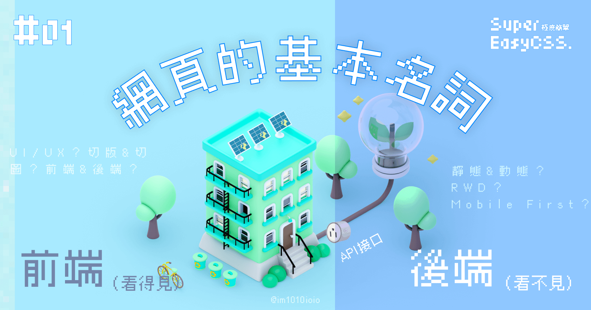
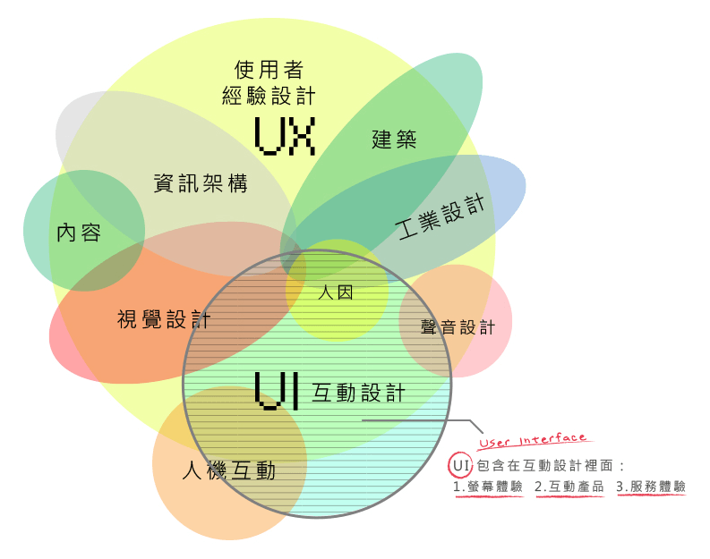
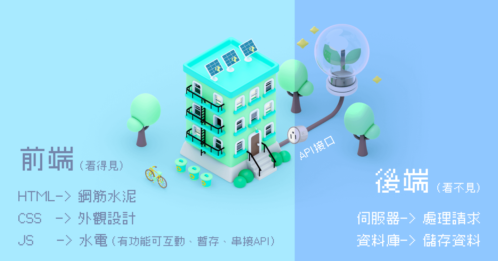
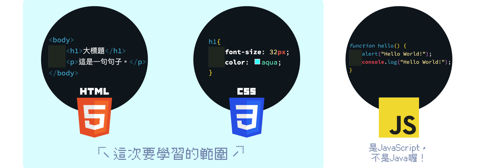
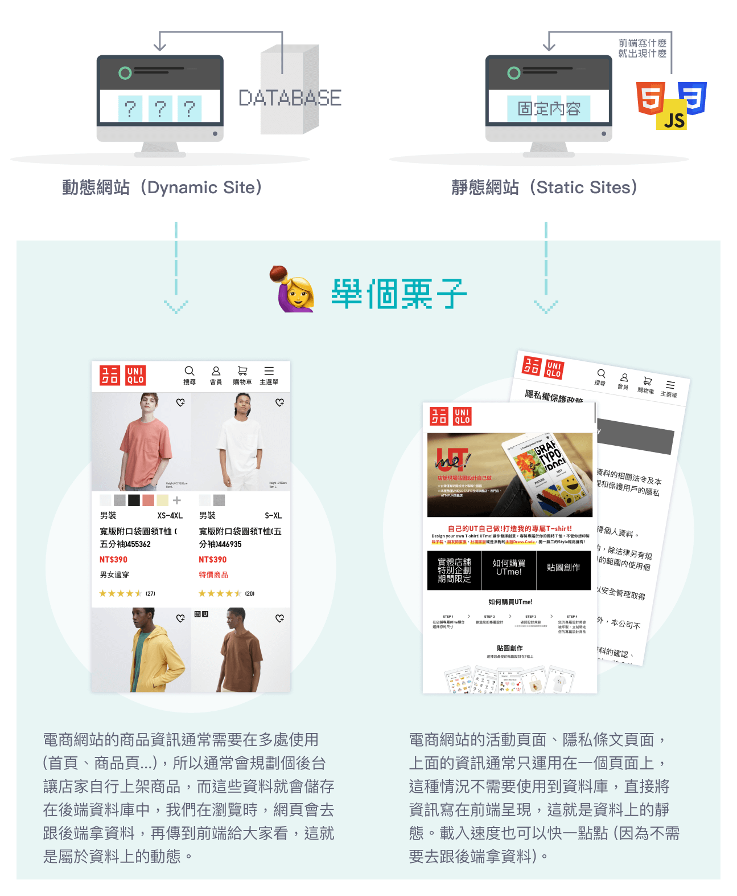
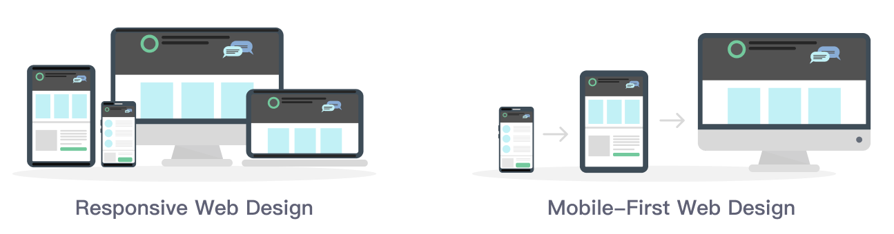
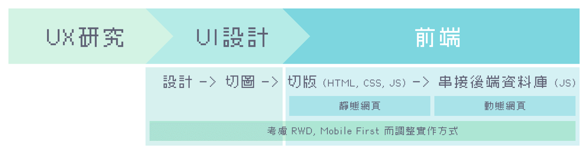

> #### ↓ 今日學習重點 ↓
> 
> * 理解網頁設計師、工程師常用的詞彙是什麼？
>     

## 網頁的基本名詞

### UI/UX？

UI/UX 分別代表使用者介面設計（User Interface Design，簡稱 UI）和使用者體驗設計（User Experience Design，簡稱 UX）。它們是設計領域中與軟體、網站、應用程式等產品的使用者互動和使用體驗相關的兩個重要概念。

#### UI（User Interface）使用者介面

UI 指的是數位產品的外觀和互動設計，大多數時候指的是在「螢幕」這個介面上的設計，包含了按鈕、文字、icon、色彩、版面配置等。UI 設計目標在於讓產品的界面看起來美觀、易於理解和操作。UI 設計師負責創造具有視覺吸引力的元素，同時確保它們在不同設備和螢幕上都能正常運作。

當然，也有聲音上、VR 上等其他介面的設計，只不過比較少。

#### UX（User Experience）使用者經驗

UX 強調的是使用者在使用產品時的整體體驗，包含使用者的感受、情感和互動過程。這個體驗不單單只侷限於畫面上，也可能延伸至物理空間，更聚焦在產品的操作過程。UX 設計師/研究員會使用各種設計方法進行使用者研究、測試原型（Prototype、Wireframe、Mockup）、數據分析，改進產品的功能和流程。

> 延伸閱讀：[**初學者的 Prototype**](https://blog.akanelee.me/posts/276909-beginners-of-prototype/)  
> （關於 UI/UX 中的 Prototype、Wireframe、Mockup 也有許多人會混淆，上面這篇文章中有詳細的說明。）

#### 小結

UI 是 UX 中的一環，而且分界十分模糊，所以許多人會融合這兩個角色，統一稱為 UI/UX。而能做到 UI/UX 分離的公司可能要規模夠大，才有資源獨立出 UX 研究。不然，在台灣一般情況下，大家所提到的 UI/UX，其實大部分指的是具有基本 UX 通識的 UI 設計。

在網頁開發上，會由 UI 設計師設計網頁，設計好後切圖給前端工程師切版、串接後端。

---

### 切圖、切版是什麼意思呢？

`Image by`[`Freepik`](https://www.freepik.com/free-vector/image-upload-concept-landing-page_5754821.htm#query=resize%20photo%203d&position=33&from_view=search&track=ais)

#### 切圖

切圖，指的是設計師將設計稿交付給工程師的過程。

以前，設計師是用繪圖軟體的切片工具（例如：[Figma Slice Tool](https://help.figma.com/hc/en-us/articles/360040028114-Export-from-Figma#Use_the_Slice_tool)）把設計稿的圖片切下來，然後整理交給工程師。

不過現在交付的方式變得很多元又更方便，例如：Figma、XD 等設計軟體都有多種匯出方式，已不一定是用切片工具出圖交付給工程師。只是這個用詞就這樣保留了下來。

#### 切版

切版，指的是工程師將設計稿變成網頁版面的過程。

以前，工程師把這些設計師切下來的圖片，一張一張放到 HTML 版面中，加上連結或程式，把網頁做出來（很久以前的 table 排版）。當然，現在的網頁已經不是用這種方式實作了，和切圖一樣，這個用詞被保留了下來。

---

### 網頁的前端與後端？

網頁的世界分為「前端」與「後端」。

`(Image by`[`Freepik`](https://www.freepik.com/free-psd/3d-rendering-isometric-ecologic-concept_33753082.htm#page=2&query=home%203d&position=49&from_view=search&track=ais)`and`[`chikenbugagashenka`](https://www.freepik.com/free-vector/smar-plug-set-cartoon-vector-illustration_28629112.htm#query=extension%20cord%203d&position=10&from_view=search&track=ais)`on Freepik)`

#### 網頁的前端（Front-End）

是由 HTML、CSS 與 JS 所組成，大部分是用戶看得見的事物，作用範圍在瀏覽器上。

以建築來比喻的話，

* HTML 是鋼筋水泥，是網頁的基底架構；
    
* CSS 是外觀設計，讓網頁呈現不同的外表；
    
* JS 是水電、家電或智慧居家，可以做些互動功能，管理暫存資訊，可以透過 API 與後端連接；
    
* 而 API（Application Programming Interface）可以比喻爲插坐，是程式與應用程式連接的介面，簡單說就是兩套軟體間的溝通橋樑，常用於前端與後端間的串接。
    

HTML、CSS 與 JS 的語法長得像上面圖片那樣。  
之後會再詳細教給大家。

#### 網頁的後端（Back-End）

包含網頁伺服器 （Web Server）和資料庫（Database），是大部分是用戶看不見的事物，作用於背後，處理來自用戶的請求。

假設我們今天要打開家裡的電燈：

* 我們是住戶（`客戶端 Client`），
    
* 當我們按下開關提出需求（`請求 Request`），
    
* 台電會檢查並依據我們的需求（如：有沒有權限用電？ 是 110V 或 220V 的電？）提供對應的服務（`伺服器端 Server`），
    
* 然後回應我們結果（`回應 Response`），沒問題的話，就能收到符合我們需求的電力。
    

如果有需要資料要儲存，依據需求可以安裝資料庫（`Database`），存放一些特定資料。

---

### 靜態網頁與動態網頁

在開發上，如果提到網頁的靜態與動態，通常並不是指網頁畫面會不會動，而是指在這個網頁的內容是不是由資料庫而來的。

#### 動態網頁（Dynamic Site）

有資料庫的網站稱為動態網頁，能儲存使用者互動的資訊，像大家常用的各種系統：FB、IG、Google 等等都是。依據後端資料的不同，可能會使前端的畫面內容產生「變動」。

不過，提到「動態網頁」，有的人是指資料上的動態，也有的人是指互動上的動態。所以遇到這個詞的時候，可以依據前後文判斷對方是說哪一種，若真的不確定可以問一下避免溝通誤會。

#### 靜態網頁（Static Sites）

反之，沒有資料庫的就是靜態網站，前端寫什麼就出現什麼。大部分常見的用途是官方網站，單純單方面提供訊息給用戶；或是，有些心理測驗或計算機等小功能，也不需要儲存資料，即使有許多動態效果，也是屬於靜態網頁。

> 延伸閱讀：[Static vs Dynamic Websites: Key Differences (](https://www.wix.com/blog/static-vs-dynamic-website)[wix.com](http://wix.com)[)](https://www.wix.com/blog/static-vs-dynamic-website)

[`Image by vector4stock`](https://www.freepik.com/free-vector/responsive-web-design-mockup-computer-tablet-smartphone-screens_26195961.htm#query=Responsive%20Web%20Design&position=2&from_view=search&track=ais)`on Freepik`

---

### 響應式網頁 (RWD) ？Mobile First (行動優先) 網頁？它們是什麼呢？

[`Image by vector4stock`](https://www.freepik.com/free-vector/responsive-web-design-mockup-computer-tablet-smartphone-screens_26195961.htm#query=Responsive%20Web%20Design&position=2&from_view=search&track=ais)`on Freepik`

#### 響應式網頁設計（RWD，Responsive Web Design）

以前的網頁設計需要手動縮放並滾動來查看內容，十分不便。所以人們提出了響應式網頁設計（RWD）這種技術，讓網頁能夠根據設備大小自動調整版面，使網頁能夠在各種的設備上提供最佳的使用體驗。

實務上，RWD 會以螢幕寬度作為調整的依據，行銷網頁從最小的手機寬度約 320px，到桌機的 1920px，整整相差 6 倍的寬度內，都要能合理地呈現畫面。

各個螢幕裝置常見的大小大約會這樣抓：

* 手機：小於 767 px；
    
* 平板：介於 768 px - 991 px；
    
* 桌機：992 px - 1920px （甚至以上，但是情況非常少）。
    

在設計上，最理想的情況下一個頁面會設計手機、平板直式、平板橫式、桌機 4 個版本給前端工程師。最常見的情況會設計 3 個版本。如果因時程或成本等因素沒有辦法，最少要設計 2 個版本，可以：

* 設計手機與平板版本，桌機沿用平板版本再微調；或是
    
* 設計手機與桌機版本，中間的平板版本依靠討論溝通。
    

詳細的尺寸單位介紹，和如何實作 RWD 在後續的文章會再介紹。

#### 行動優先網頁設計（Mobile-First Web Design）

行動優先網頁設計（Mobile-First Web Design）是一種設計方法，設計師與開發者在初期就要以手機操作為首要設計方向，包含要考慮：版面、觸控操作、速度、效能、網路狀況等等。如果手機體驗好，SEO（搜尋引擎優化）排名也能提升。

> 延伸閱讀：[Google的行動版內容優先索引系統](https://developers.google.com/search/docs/crawling-indexing/mobile/mobile-sites-mobile-first-indexing?hl=zh-tw)

一般來說，文字與按鈕會設計得比較大一點，讓使用者容易閱讀與點擊。設計與切版也會從手機版開始進行。

#### 小結

雖然響應式網頁（RWD）和行動優先網頁（Mobile-First）的出發點有所不同，但是它們可以並用，而且對於目前 B2C（公司對客戶）的行銷網頁這兩者通常是必備。

然而，如果是系統網頁，尤其是 B2B（公司對公司）的商業環境中，不一定要具備 Mobile-First，因為在這個環境下，筆電和桌機是使用者最主要的工具，根據需求有可能只需要支援桌機尺寸就好。

而 RWD 在大部分情況下都需要，即使是 B2B，桌機上還是有多種螢幕大小（992 px - 1920px）需要留意。

---

## 結論

本篇所提到的名詞，在開發流程中的關係如上圖所示，希望這樣能夠更清楚一點。

如果覺得有一堆新的專有名詞很爆炸也沒關係，不用一次全部記起來，因為在這條路上一定會再遇到很多次，遇到的時候再複習一次就好了。

好的，那麼今天就先到這裡了，而其餘的基礎知識會在後續再補充。

---

#### ↓↓↓↓↓↓↓↓↓↓↓↓↓↓↓↓↓↓↓↓

感謝看到最後的你，若你覺得獲益良多，請不要吝嗇給我按個喜歡。❤️

如果你喜歡我的創作，還想看看其他有趣的分享與日常，  
可以追蹤我的 IG [@im1010ioio](https://www.instagram.com/im1010ioio/)，或者是[🧋送杯珍奶鼓勵我](https://im1010ioio.bobaboba.me/)，謝謝你🥰。

