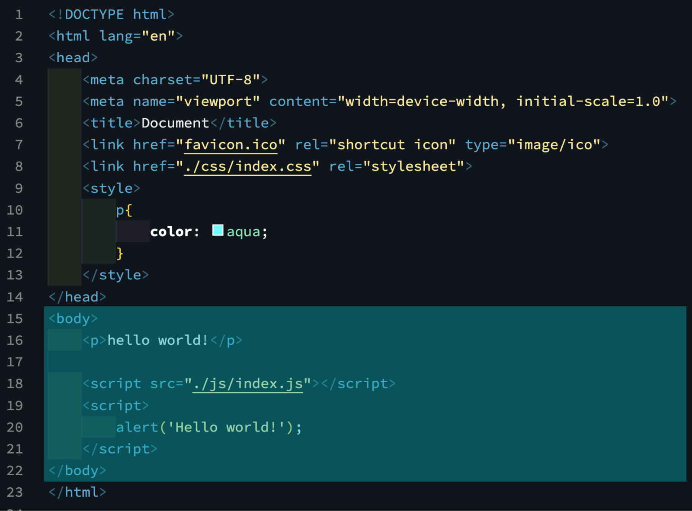
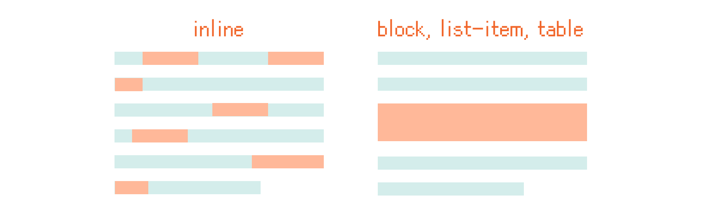
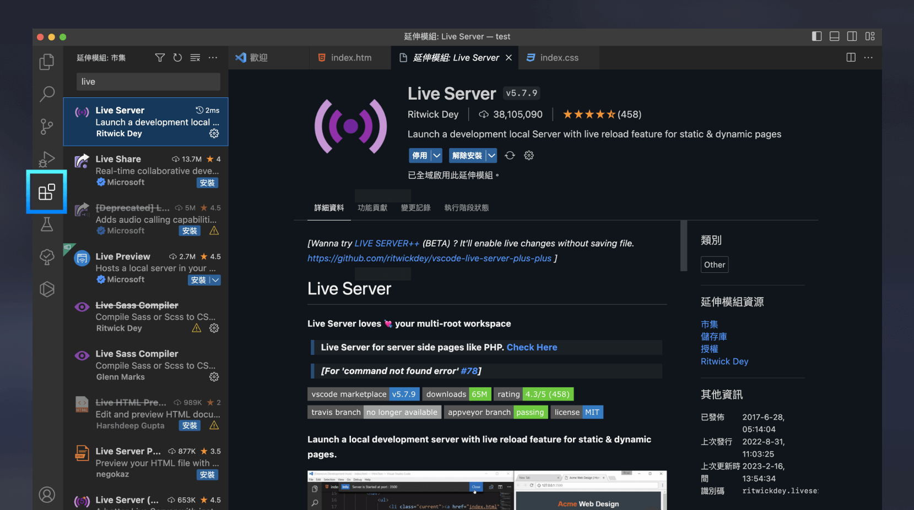
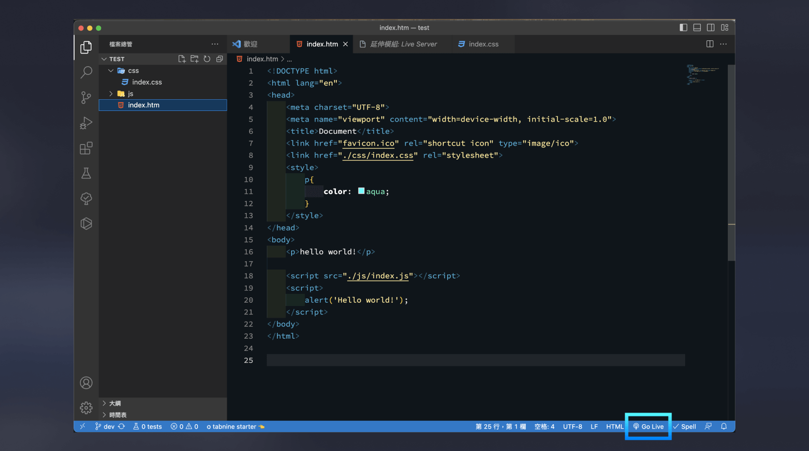

上一篇我們學了 HTML 的整體結構與 `head` 的常見元素，現在讓我們深入 `body` 的世界！  
`body` 內的標籤是真正出現在畫面上的內容，包含了文字、多媒體、表單、清單、表格等等。

> #### ↓ 今日學習重點 ↓
> 
> * 了解 `body` 內各種常見 HTML 標籤的用途
>     
> * 學習如何建立表單、清單與表格
>     
> * 知道 JS 要放在 HTML 的哪個位置？
>     

---

## 一、 `body` 的常見 HTML 標籤



`body` 內會放網頁要被他人看見的內容。就是我們在上篇所說的 `main`、`p` ⋯⋯ 大部分的標籤都會放在這裡。

### 1\. HTML 預設的 `display`

這些標籤有預設的版面特質（`display`）：`inline（行內元素）`、`block（區塊元素）`、`list-item`、`table` 等等。



如果放在文字間：

* `inline（行內元素）` 會穿插在文字間，也會隨著文字折行；
    
* `block（區塊元素）`、`list-item`、`table` 會佔據畫面的一整行，截斷文字區塊。
    

不同的標籤預設會有不同的 `display`，大家試寫看看就能大致上理解為何 HTML 會如此設計了，比如說超連結 `<a></a>` 需要穿插於文章間，所以預設是 `inline`。

當然，事後也可使用 CSS 改變 HTML 標籤的 `display`，之後的文章會再詳細說明。

### 2\. 常用的 HTML tag

以下列出一些常用的 HTML 標籤，供大家參考：

> 更詳細的 HTML 文件請參考：  
> [HTML Tutorial (w3schools.com)](https://www.w3schools.com/html/)  
> [HTML comment tag (w3schools.com)](https://www.w3schools.com/tags/tag_comment.asp)

#### (1) 容器

上篇我們有提過，在 HTML 中我們會透過巢狀結構，區分網頁中不同的區塊，所以 HTML 中有許多容器性質的標籤。以下除了 `div` 以外，其他都是語意化標籤。建議如果能使用語意化標籤就使用它，這樣能讓瀏覽器與 SEO 爬蟲明白這個區塊放的是什麼內容。

| HTML | 預設 Display | 用途 |
| --- | --- | --- |
| `<div></div>` | block | 區塊（division），一個純粹的容器，沒有代表任何意義。常用於排版上。 |
| `<nav></nav>` | block | 導覽區塊（navigation），裡面通常會放網站的導覽連結。 |
| `<aside></aside>` | block | 側邊欄，跟主要區塊內容無關的區塊，通常放額外資訊。 |
| `<main></main>` | block | 用來放主要資訊的區塊，一個網頁只能有一個。 |
| `<header></header>` | block | 頁首區塊，通常會放介紹性資訊，放網頁的標題、Logo、搜尋框等等。 |
| `<footer></footer>` | block | 頁尾區塊，通常會放會包含作者、版權、聯絡方式等。 |
| `<section></section>` | block | 有明顯意義的區塊，每一塊內容是獨立的，例如：產品網頁中的產品特色、產品使用情境可能就是兩個 `section`。 |
| `<article></article>` | block | 表示文章或留言。 |
| `<figure></figure>` | block | 裡面用來放獨立的內容，像是文字段落、圖片、圖表或程式碼片段等。可搭配 `<figcaption></figcaption>` 當這個內容的標題。 |

#### (2) 文字

`strong` 和 `em` 也是語意化標籤，雖然畫面呈現效果和 `b` 和 `i` 一樣，但是 SEO 會比較優喔！

| HTML | 預設 Display | 用途 |
| --- | --- | --- |
| `<h1></h1> ~ <h6></h6>` | block | 表示一級標題，數字越小，級別越高。總共有 1-6 級。一個網頁 `<h1></h1>` 只能有一個，其他的可以有多個。 |
| `<p></p>` | block | 文字段落（paragraph）。 |
| `<span></span>` | inline | 短句。 |
| `<b></b>` | inline | 粗體字（bold）。 |
| `<strong></strong>` | inline | 重要文字，預設是粗體。 |
| `<i></i>` | inline | 斜體字（italic）。 |
| `<em></em>` | inline | 強調文字（emphasized），預設是斜體。 |
| `<small></small>` | inline | 較小的文字。 |
| `<a href="..." target="_blank"></a>` | inline | 超連結，屬性 `href` 放連結的位置，如果寫內容寫 `mailto:` 或 `tel:` 分別可以開啟預設的寫信、撥號軟體。屬性 `target` 用來放連結互動的方式（不寫的話預設是 `_self` 會在原頁面開連結，常用的還有 `_blank` 是新開視窗）。 |

#### (3) 多媒體

| HTML | 預設 Display | 用途 |
| --- | --- | --- |
| `` | inline | 圖片。`src` 是圖片連結，`alt` 是圖片替代文字，當連結失效會顯示這段文字，視障瀏覽器也會念這個內容給使用者，SEO 也會依據這個，建議填寫喔！更詳細的圖片相關設定，之後會再說明。 |
| `<iframe src=""></iframe>` | block | 外嵌內容，放的是其他網頁的內容。放在裡面的網頁會有一些限制。在網頁上放 YouTube 影片就是使用這種方式外嵌進來。 |
| `<video></video>` | block | 影片，詳細的寫法請見：[HTML Video (](https://www.w3schools.com/html/html5_video.asp)[w3schools.com](http://w3schools.com)[)](https://www.w3schools.com/html/html5_video.asp) |

#### (4) 表單

一個基本的填寫表單會用 `<form></form>` 標籤包住表單內容，它的屬性 `action` 是表單資料傳送的位置，不過現在多數人都是將這個行為寫在 JS 中。

```xml
<form action=""> ... </form>
```

其他常用的表單標籤如下：

##### (4-1) 單行輸入框 `input`

##### `label` 加上屬性 `for="input的id"`，點擊 `label` 就可以選取這個 `input`。

```xml
<label for="userName">姓名</label>
<input type="text" id="userName">
```

##### (4-2) 多行輸入框 `textarea`

##### 加上屬性 `rows` 可以設定這個 `textarea` 的高度。

```xml
<label for="remark">備註</label>
<textarea id="remark" rows="3"></textarea>
```

##### (4-3) 單選欄位

##### 當 `radio` 的屬性 `name` 一樣時，表示是同一組單選欄位。

```xml
<input type="radio" name="gender" id="male" value="0">
<label for="male">男性</label>

<input type="radio" name="gender" id="female" value="1">
<label for="female">女性</label>
```

##### (4-4) 多選欄位

```xml
<input type="checkbox" id="agreePrivacy">
<label for="agreePrivacy">我同意隱私條款</label>
```

##### (4-5) 下拉選單

```xml
<select>
    <option>漢堡</option>
    <option>三明治</option>
    <optgroup label="組合套餐">
        <option>套餐A</option>
        <option>套餐B</option>
    </optgroup>
</select>
```

##### (4-6) 按鈕

`<button>` 預設的 `type` 是 `submit`，放在 `<form>` 中，預設會觸發送出行為。

但是如開頭所說，現在送出行為大多都是寫在 JS 中，由 JS 控制，這時候為了避免觸發 HTML 的原生 submit 行為，可以將 `<button>` 的 `type` 設為 `button`。

```xml
<button type="button">送出</button>
```

以上實際 DEMO 請看 [這裡](https://codepen.io/im1010ioio/pen/PoXQRbL)。

#### (5) 清單

清單的預設 Dispay 是 list-item，分為有序號（`ol`，ordered list）與沒有序號（`ul`，unordered list）的兩種清單，前者預設會有數字標號，後者會有點點標號。不過，也可以使用 CSS 去改變他們的標號格式（list-style），詳細可參考：[list-style - CSS: Cascading Style Sheets | MDN (](https://developer.mozilla.org/en-US/docs/Web/CSS/list-style)[mozilla.org](http://mozilla.org)[)](https://developer.mozilla.org/en-US/docs/Web/CSS/list-style)。

裡面會放 `li` 標籤作為每一個 item，每個 li 預設會有一些內縮間距。基本的格式如下：

```xml
<!-- 前面會有數字標號 -->
<ol>
    <li>清單</li>
    <li>清單</li>
<ol>

<!-- 前面會有點點標號 -->
<ul>
    <li>清單</li>
    <li>清單</li>
<ul>
```

#### (6) 表格

表格的預設 Dispay 是 table，`thead` 與 `tbody` 是表頭與表格內容，`tr` 是行，`th` 是標題格子，`td` 是一般格子。

`th` 與 `td` 使用屬性 `colspan` 可以合併橫向的格子，`rowspan` 則是合併直向的格子，使用後格子數量要對應調整。以下範例：

```xml
<table>
    <thead>
        <tr>
            <th></th>
            <th colspan="2"></th>
        </tr>
    </thead>
    <tbody>
        <tr>
            <th></th>
            <td></td>
            <td rowspan="2"></td>
        </tr>
        <tr>
            <th></th>
            <td></td>
        </tr>
    </tbody>
</table>
```

#### (7) 其他

| HTML | 預設 Display | 用途 |
| --- | --- | --- |
| `<hr>` | block | 分隔線 |
| `&nbsp;` | inline | 瀏覽器在解析 HTML，兩個以上的空白會被當成一個空白呈現，如果需要呈現許多空白，就需要寫 HTML 的符號編碼。這是最常見的空白，不過空白不只一種，詳細請見：[實用！在HTML插入空白的6種方式](https://aprilyang.home.blog/2020/02/14/6-ways-to-put-spaces-in-html/) |
| `&lt;` | inline | 小於 `<` 符號。由於大於和小於符號是 HTML 的保留字，兩個打在一起的 `<>` 會被當成標籤，如果要呈現出來必須寫 HTML 的符號編碼。 |
| `&gt;` | inline | 大於 `>` 符號，其餘概念同上。 |

### 3\. 載入 JavaScript

> 範例：`<script src="./js/index.js"></script>`  
> 範例：`<script> ... </script>`

要載入 JS，使用的是 `<script></script>` 標籤。  
你可以將 JS 語法直接寫在這個標籤內，也可以透過 `src="..."` 屬性將 JS 檔案載入進來。通常在開發上，為了好管理，我們會使用後者。

JS 建議放在 `<body>` 中的最末端，也就是 `</body>` 結束標籤前，這樣可以確保 JS 在執行時，頁面的 HTML（DOM）結構已經完全載入完畢，避免 JS 操縱尚未存在的元素，從而引發錯誤。

---

## 結論

好的，今天的教學就先到這裡了！今天介紹了許多 HTML 標籤，不過不需要一次全部背起來，只要先有概念和印象就好了。練習的時候，還會遇到很多次，每遇到一次就會多熟悉一次，這樣就可以了。

現在，就拿第 #04 篇建立的 HTML 檔案，隨意打一些 HTML tag，練習看看吧！

推薦大家安裝 VS Code 的 [Live Server](https://marketplace.visualstudio.com/items?itemName=ritwickdey.LiveServer) 套件，安裝後按下右下角的「Go live」，就能跑起你的網頁囉！





此外，操作 VS Code 時，推薦使用快捷鍵，詳細說明請參考這篇文章：

> [\[Editor\] CodePen / VS Code 常用快速鍵 - iT 邦幫忙](https://ithelp.ithome.com.tw/articles/10237385)

而其他 VS Code 版面設定與套件，可以參考我之前寫的這篇文章：

> [10 個 VS Code 設定及套件推薦：色彩、icon 主題、字體、註解、防錯標示，Mac Terminal 設定](https://im1010ioio.hashnode.dev/10-useful-settings-plugins-for-vs-code)

---

---

> 👈 **上一篇：[寫一份簡單的 HTML，常用 HTML Tag 總整理（HTML 結構與 head 篇）](/basics/html-strugtrue)**

---

#### ↓↓↓↓↓↓↓↓↓↓↓↓↓↓↓↓↓↓↓↓

感謝看到最後的你，若你覺得獲益良多，請不要吝嗇給我按個喜歡。❤️

如果你喜歡我的創作，還想看看其他有趣的分享與日常，  
可以追蹤我的 IG [@im1010ioio](https://www.instagram.com/im1010ioio/)，或者是[🧋送杯珍奶鼓勵我](https://im1010ioio.bobaboba.me/)，謝謝你🥰。

