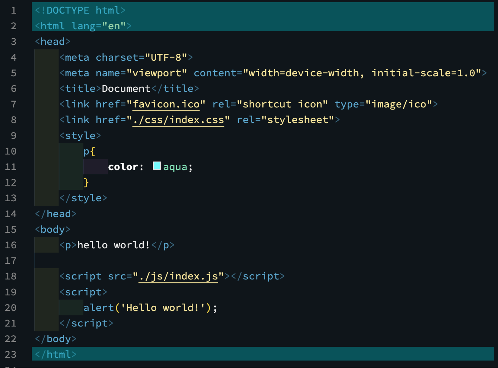
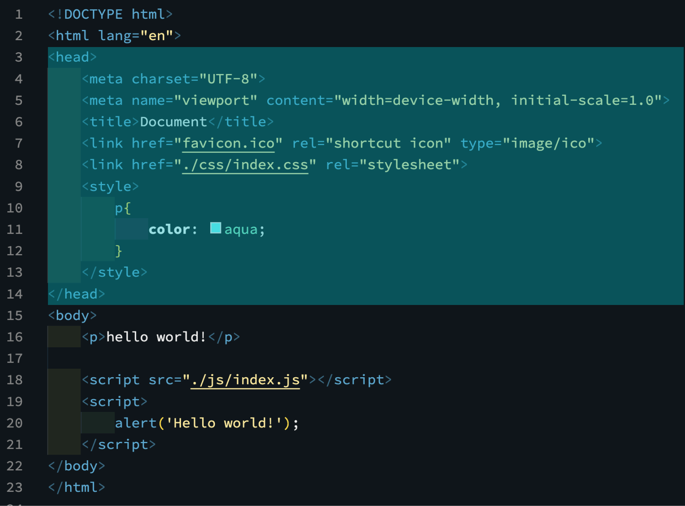
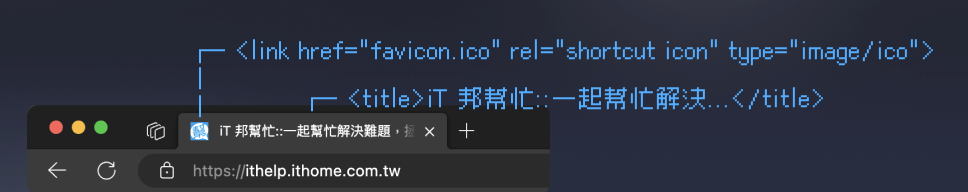

今天，讓我們來了解一份簡單的 HTML 會長什麼樣？  
然後，修改一下[第 #04 篇建立的 HTML 檔案](https://im1010ioio.hashnode.dev/git-github-gitpage-practice)，練習看看吧！

> #### ↓ 今日學習重點 ↓
> 
> * 練習使用 HTML 的各種標籤（tag）
>     
> * 知道 CSS 和 JS 要放在 HTML 的哪裡？
>     

---

## 一、HTML 的最外層

### 1\. HTML 的版本

> 範例：`<!DOCTYPE html>`

告訴瀏覽器這是哪一個版本的 HTML，以這個範例來說，這是一份 HTML5 文件。

### 2\. HTML 的根

> 範例：`<html> ... </html>`

HTML 文件的根，會包含住整個網頁的內容，其中的屬性 `lang="en"` 說明這份 HTML 的語言，瀏覽器的翻譯功能也會優先先抓這個屬性作為翻譯的判斷之一，搜尋引擎也會根據這個優化搜尋結果。

> 而 `lang` 這個屬性也可以放在其他的 tag 上，使用情境如：這份 HTML 是台灣地區的繁體中文，而其中一個 `p` 段落是英文的（雖然通常我沒有寫到這麼仔細）。
> 
> （台灣使用的繁體中文是：`lang="zh-Hant-TW"`，並不是寫作 `zh-TW` 喔！）
> 
> 以中文來說的話可以細分為：  
> [HTML5的lang速查 ( 注意：繁體中文不是zh-TW喔 ) - VECTOR COOL 威得數位行銷](https://vector.cool/html5%E7%9A%84lang%E9%80%9F%E6%9F%A5-%E6%B3%A8%E6%84%8F%EF%BC%9A%E7%B9%81%E9%AB%94%E4%B8%AD%E6%96%87%E4%B8%8D%E6%98%AFzh-tw%E5%96%94/)
> 
> 更多的 HTML Language Code 設定可參考：  
> [HTML ISO Language Code Reference (](https://www.w3schools.com/tags/ref_language_codes.asp)[w3schools.com](http://w3schools.com)[)](https://www.w3schools.com/tags/ref_language_codes.asp)

---

## 二、 `head` 內的常見元素

寫在 HTML `head` 的內容並不會呈現在網頁畫面上，主要是放一些網頁的基本資訊。

由於瀏覽器與網路爬蟲（如搜尋引擎）是由上往下讀取 HTML，會先讀取到 `head` ，所以 `head` 內會放「優先要讓瀏覽器、搜尋引擎知道的資訊」，如：基本資料（meta data、網頁標題、SEO 結構化資料等等）。

CSS 也會建議在此處載入，提早把樣式載進來，就不會一閃而過 HTML 單調的預設樣式，防止畫面閃爍。如果 CSS 內有字體、圖片資源也能提早下載，早點載完呈現給使用者。使用者體驗會較好。

`head` 中常使用的語法如下：

### 1\. 文字編碼

> 範例：`<meta charset="UTF-8">`

Charset 是指定網頁內容是用什麼文字編碼，現在大多數的網頁編碼都是 UTF-8。

> 延伸閱讀：[網站文字編碼採用Big5與UTF-8 的優點缺點](https://por.tw/Website_Design/%E7%B6%B2%E7%AB%99%E6%96%87%E5%AD%97%E7%B7%A8%E7%A2%BC%E6%8E%A1%E7%94%A8big5%E8%88%87utf-8-%E7%9A%84%E5%84%AA%E9%BB%9E%E7%BC%BA%E9%BB%9E/)

### 2\. 可見區域

> 範例：`<meta name="viewport" content="width=device-width, initial-scale=1.0">`

Viewport 是設定網頁的顯示方式，可以設定網頁的預設寬度、縮放比例、使用者可不可以縮放等等。

最基本的設定為：`content="width=device-width, initial-scale=1.0"` ，意思是「網頁的寬度等於瀏覽裝置的寬度，初始縮放比例為 1」。

> 所有可設定的項目可參考這裡：  
> [viewport meta 标记 - HTML（超文本标记语言） | MDN (](https://developer.mozilla.org/zh-CN/docs/Web/HTML/Viewport_meta_tag)[mozilla.org](http://mozilla.org)[)](https://developer.mozilla.org/zh-CN/docs/Web/HTML/Viewport_meta_tag)

### 3\. 網頁標題

> 範例：`<title>Documant</title>`

定義瀏覽器標籤中顯示的標題。

### 4\. 載入網頁小圖示 Favicon

> 範例：`<link href="favicon.ico" rel="shortcut icon" type="image/ico">`

HTML 中的 `<link>` 語法是用來載入外部資源使用的，他的屬性 `rel` 代表外部資源與這份 HTML 之間的關係（relationship），`href="..."` 則是檔案的連結。

> 關於如何寫連結，請參考這篇：  
> [#06補充 網頁的根、絕對路徑、相對路徑，那些關於路徑的小知識](https://im1010ioio.hashnode.dev/html-file-paths)

我們可以透過 `rel="shortcut icon"` 定義瀏覽器標籤中顯示的小圖示。Favicon 就如其名，是瀏覽器「我的最愛」的 icon（favorite icon）。

Favicon 可以自己指定路徑，如果沒寫瀏覽器預設會抓網頁的根（Root）底下的 `favicon.ico` 檔案，所以其實不一定要寫這一行，直接把 favicon 放在根目錄底下就可以了。只不過，為了讓瀏覽器讀取 favicon 順利，我還是會寫這一行。

> 轉換 ico 檔案好用工具：[Favicon Generator](https://www.favicongenerator.com/)  
> Favicon 的大小是 16px x 16px，不過考慮到像素密度，我會準備 48px 以上的圖檔。（關於像素密度，之後會再詳細解說）

### 5\. 載入 CSS

> 範例：``  
> 範例：`<link href="./css/index.css" rel="stylesheet">`

CSS 要套用在 HTML 上，第一種方式是可以在 `head` 內寫在 `` 內。

第二種方式，則是另外寫 CSS 檔案，與剛剛 favicon 相同，使用 `<link>` 載入，`rel="stylesheet"` 代表載入的是樣式表。通常為了好管理檔案，推薦使用這種方式載入 CSS。

關於寫在不同處有何不同，我們下篇會解說。

### 6\. SEO 相關設定

另外，SEO 的相關設定也會放在 `head` 內，關於 SEO 的部分，我們後續的文章會再解說。

---

---

## 繼續學習：body 裡面的 HTML 標籤

了解了 HTML 的整體結構與 `head` 之後，接下來要學的是 `body` 裡面的各種 HTML 標籤，包括文字、表單、清單、表格等等，內容也很豐富！

👉 **繼續閱讀下一篇：[HTML body 裡面怎麼寫？表單、清單、表格常用 HTML 標籤全解析](/basics/html-body-tags)**

---

#### ↓↓↓↓↓↓↓↓↓↓↓↓↓↓↓↓↓↓↓↓

感謝看到最後的你，若你覺得獲益良多，請不要吝嗇給我按個喜歡。❤️

如果你喜歡我的創作，還想看看其他有趣的分享與日常，  
可以追蹤我的 IG [@im1010ioio](https://www.instagram.com/im1010ioio/)，或者是[🧋送杯珍奶鼓勵我](https://im1010ioio.bobaboba.me/)，謝謝你🥰。

