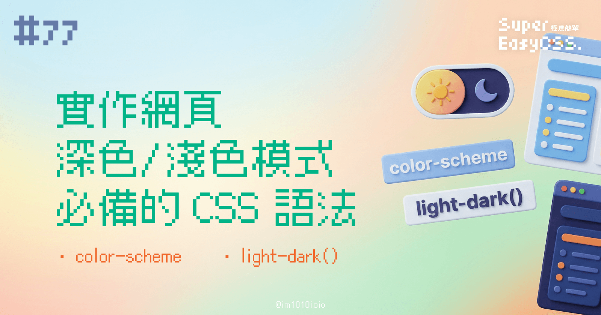
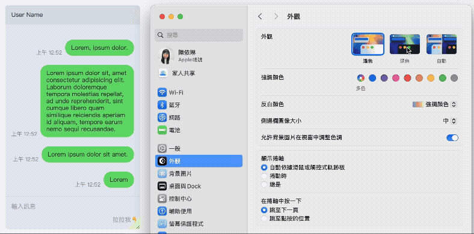
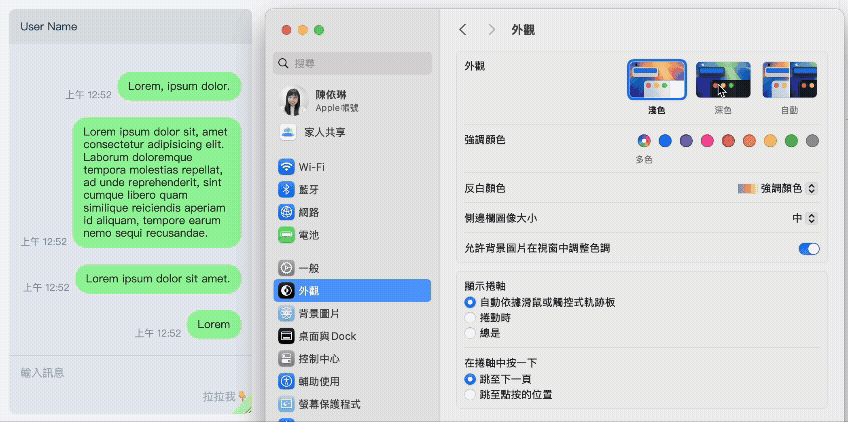

以前我們介紹過用 [CSS Media Queries 的 `prefers-color-scheme`](https://ithelp.ithome.com.tw/articles/10340843) 讓網頁打開時預設切換淺色/深色模式，但是居然沒有講到最基礎的設定，就是「告訴瀏覽器我的網頁有支援哪種顏色主題：`color-scheme`」。

另外，我們順便再講解 `light-dark()` 這個 CSS 函式，可以讓你的 CSS 屬性，針對這兩種風格，分別指定不同的顏色。

而且這兩個語法目前都全瀏覽器支援囉！  
詳細請看 Can I Use（[HTML color-scheme](https://caniuse.com/mdn-html_elements_meta_name_color-scheme) / [CSS color-scheme](https://caniuse.com/mdn-css_properties_color-scheme) / [light-dark()](https://caniuse.com/mdn-css_types_color_light-dark)）。

---

## 一、`color-scheme`：告訴瀏覽器我的色系是什麼？

想像一下，你的網頁是一棟房子，`color-scheme` 就像是告訴瀏覽器：「我的房子有兩種裝潢風格喔，一種是淺色系，一種是深色系。」他有在 HTML 與 CSS 中都有語法可以設定。

### 1\. HTML 語法

HTML 的設定方法是寫在 `<head>` 的 meta 資料，寫法如下：

```xml
<meta name="color-scheme" content="light dark">
```

其中 `content` 的值可以設定：

* `normal` ：不指定，依瀏覽器預設值
    
* `light` ：可以使用淺色主題
    
* `dark` ：可以使用深色主題
    
* `light dark` (或 `dark light`)：可以使用淺色與深色模式
    
* `only light` (或 `only dark`)：只限制一種顏色模式
    

### 2\. CSS 語法

在 CSS 中也可以設定 `color-scheme`，最常見的設定方式是在 `:root` 這個根元素上宣告，這樣整個網頁就都能適用了:

```css
:root {
    color-scheme: light dark;
}
```

可以設定的值跟 HTML 一模一樣。

### 3\. 我該用哪一種好，還是得要兩種都用？

答案是兩個都用最好，因為：

* `<meta name="color-scheme">`：  
    給瀏覽器「一開始繪製」的提示（CSS 還沒載入前），避免首屏閃白/閃黑，並影響瀏覽器 UI 與表單 `<input>` 等等的的預設配色。而且，如果 CSS 檔案因為某些原因載入失敗，這個 `<meta>` 標籤仍然能確定瀏覽器顯示正確的色系。
    
* CSS `color-scheme`：  
    雖然通常設定在 `:root`，但你也可以將 `color-scheme` 屬性應用在單一元素上，讓頁面的不同區塊有不同的色彩模式（像是淺色主題，但是程式碼區塊是深色主題），會比較彈性。
    

### 4\. 解決常見問題：淺色主題遇上 Android 上常見的「自動黑暗模式」

Chrome／WebView on Android 自 Chrome 96 起內建 Auto Dark Theme（又稱 Force Dark Mode），當使用者把系統或瀏覽器設成深色主題時，它會「聰明」地把**沒有**自己提供深色樣式的網頁自動反轉顏色。

如果你沒有特別設定 `color-scheme` 的話，就會變成你沒有用 CSS 寫的顏色（例如 html 或 body）全部都變成暗色系的，會造成顯示不佳，如深色文字在深色背景上之類的嚴重問題。

這時候最保險的做法，是在 HTML 與 CSS 上兩種都用，都設定只支援亮色：

#### HTML

```xml
<meta name="color-scheme" content="only light">
```

#### CSS

```css
/* 寫在第一行 CSS效果最好 */
:root{ color-scheme: only light; }
```

---

## 二、`light-dark()` 函式

而 `color-scheme` 是告訴瀏覽器你有兩種風格，那 `light-dark()` 就是讓你針對這兩種風格，分別指定不同顏色的調色盤，也是開發雙色模式很好用的語法。

### 1\. 語法

`light-dark()` 函式可以接受兩個顏色參數，很簡單：

* 第一個是淺色模式時要使用的顏色
    
* 第二個則是深色模式時的顏色。
    

它的語法長這樣：

```css
div {
    顏色屬性: light-dark([淺色模式時使用的顏色], [深色模式時使用的顏色]);
}
```

### 2\. 為何需要 `light-dark()`？

恩？不是像之前寫的文章一樣（[`prefers-color-scheme` 那一篇](https://ithelp.ithome.com.tw/articles/10340843)）將顏色自動反轉就好了嗎？為什麼還需要 `light-dark()`？

其實設計雙色模式不僅僅只是將顏色互相反轉就好了，例如將純白背景配黑字，直接變成純黑背景配白字，往往會帶來許多問題。最常見的就是：

* 過高的對比度，反而會造成眼睛的疲勞與不適，尤其是在低光源環境下。
    
* 或者，顏色在不同背景下的視覺效果會有所差異，直接反轉可能導致原本精心設計的品牌顏色變得刺眼或難以辨識。
    
* 在淺色模式中，我們習慣利用陰影來營造元件的層級感與深度。然而，陰影在深色背景上效果並不明顯，或是陰影變成光暈也會很怪。因此，在暗色模式下，需要透過不同的灰色階層或是在元件表面覆蓋不同透明度的白色，來區分前後層級關係。
    

所以實際設計與開發雙色模式要考慮的事情有很多，除了基本的反轉顏色外，還會因為這些因素，要另外調整一些例外的顏色設定與樣式等，這時就有可能需要設定到 `light-dark()`。

而且 `light-dark()` 這個語法也會讓 CSS 變得更簡潔！相較於以往使用媒體查詢 `@media (prefers-color-scheme: dark)` 的方式，`light-dark()` 讓你可以將兩種模式的顏色寫在同一行，更容易讀與維護。

### 3\. 實際應用 DEMO

說了這麼多，我們直接來看一個實際的例子吧！

我們直接拿 #33 篇（[`prefers-color-scheme` 那一篇](https://ithelp.ithome.com.tw/articles/10340843)）寫的例子來改，你會發現這個綠色對話框的背景在深色模式中感覺飽和度很好，可是在淺色模式卻有點暗沉，少了原本使用綠色想要的清爽感：



現在，我們來使用學到的 `light-dark()`，並且綜合前面說的 `color-scheme` 與 CSS 變數管理，重新寫一下，就會變成這樣：

```css
:root {
    color-scheme: light dark;
    --msg-bg-light: #9BF7A1;
    --msg-bg-dark: #67DC6F;
}

.msg p {
	background: light-dark( var(--msg-bg-light), var(--msg-bg-dark));
}
```



> DEMO 連結：[CSS color-scheme / light-dark()](https://codepen.io/im1010ioio/pen/jEWWdyx)

是不是感覺好多了呢？

如果這個效果使用 `prefers-color-scheme` 來寫，就需要兩邊的 Media Queries 都要各寫一遍顏色的設定，但是用 `light-dark()` 一行就解決了。

不過我們還是可以保留之前的方式作為最基礎的預設變數設定。

---

希望這篇能幫助你掌握實作網頁深色模式及淺色模式的訣竅！  
有了這篇關於 CSS 色彩的部分就算是補充完畢囉！

另外，關於支援度的部分：

* HTML 與 CSS 的 `color-scheme` 都已經是相當成熟的語法，可以安心使用。
    
* `light-dark()` 則是 2024/05 開始全面支援，所以可能無法在較舊的設備或瀏覽器上運作，要評估一下喔。但是在未來一定是個很好用的語法，可以先練習使用看看，或者是如何融入到你的 CSS 架構中。
    

詳細請看 Can I Use（[HTML color-scheme](https://caniuse.com/mdn-html_elements_meta_name_color-scheme) / [CSS color-scheme](https://caniuse.com/mdn-css_properties_color-scheme) / [light-dark()](https://caniuse.com/mdn-css_types_color_light-dark)）。

> 延伸閱讀：
> 
> * [MDN - &lt;meta name="color-scheme"&gt;](https://developer.mozilla.org/en-US/docs/Web/HTML/Reference/Elements/meta/name/color-scheme)
>     
> * [MDN - color-scheme](https://developer.mozilla.org/zh-CN/docs/Web/CSS/color-scheme)
>     
> * [MDN - light-dark()](https://developer.mozilla.org/en-US/docs/Web/CSS/color_value/light-dark)
>     
> * [2024 年了！ CSS 终于加入了 light-dark 函数！](https://juejin.cn/post/7443828372775764006)
>     

---

#### ↓↓↓↓↓↓↓↓↓↓↓↓↓↓↓↓↓↓↓↓

感謝看到最後的你，若你覺得獲益良多，請不要吝嗇給我按個喜歡。❤️

如果你喜歡我的創作，還想看看其他有趣的分享與日常，  
可以追蹤我的 IG [@im1010ioio](https://www.instagram.com/im1010ioio/)，或者是[🧋送杯珍奶鼓勵我](https://im1010ioio.bobaboba.me/)，謝謝你🥰。

