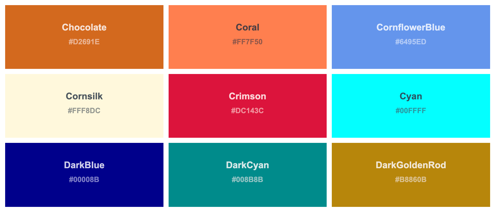
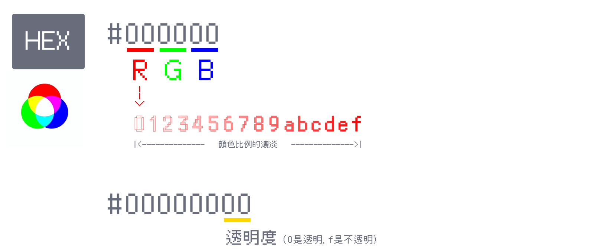
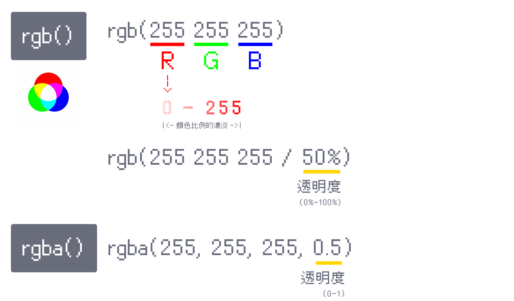
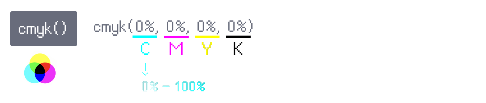
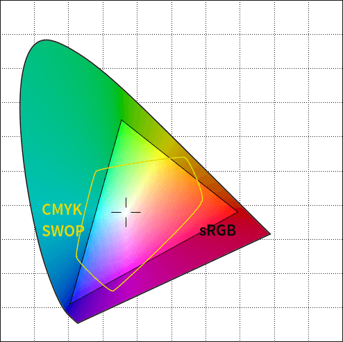
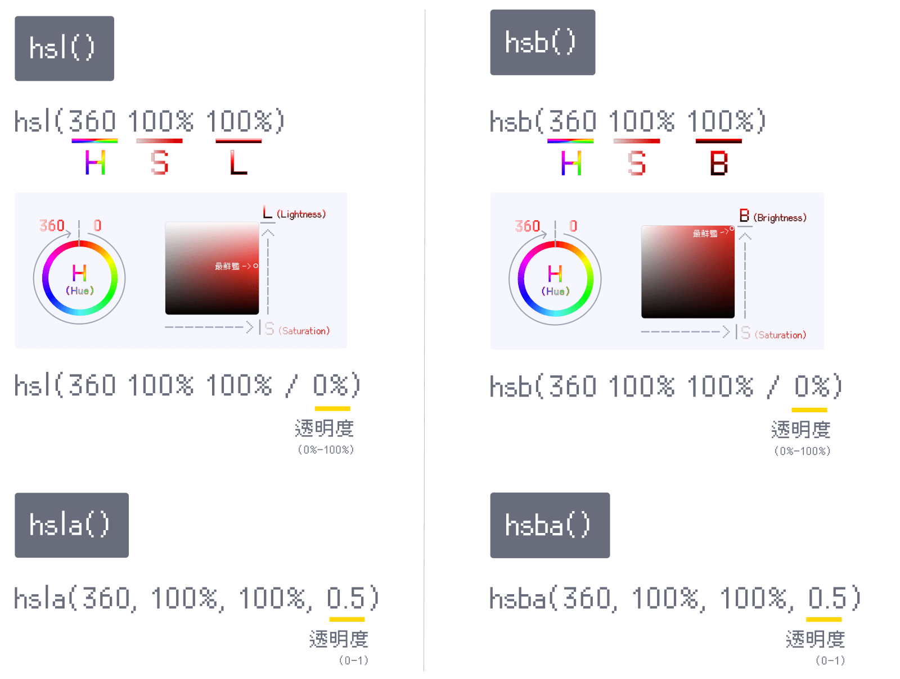
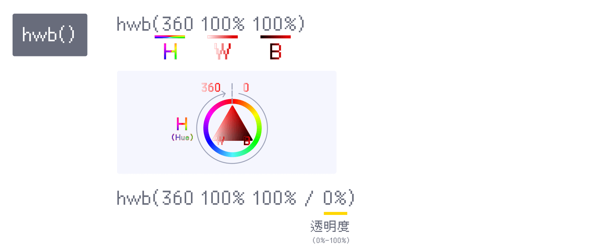

顏色在之前的範例中雖然有用到，但是一直沒有深入講解。

今天，我們就要來深入了解各種 CSS 設定顏色的原理及方式，我們要了解基本的 `hex`、`rgb()`、`cmyk()`、`hsl()`、`hsb()`、`hwb()`，與新推出、讓設定顏色更廣、更直覺、更符合人眼的 `lch()`、`oklch()`。

> #### **↓ 今日學習重點 ↓**
> 
> * 了解 hex、rgb()、cmyk()、hsl()、hsb()
>     
> * 了解廣色域是什麼
>     
> * 了解 lch()、oklch() 與他們的優勢
>     

---

## 一、CSS Color Names（⭐️常用）



CSS 中有 160 幾種顏色名稱，可以直接在 CSS 中指定 `white`、`black`、`red`、`blue`、`green` 等等，讓人可以很直覺設定基本的顏色。

```css
p {
    color: blue;
    background: white;
}
```

> 詳細所有顏色請參考：
> 
> * [&lt;named-color&gt; - CSS: Cascading Style Sheets | MDN](https://developer.mozilla.org/en-US/docs/Web/CSS/named-color)
>     
> * [CSS Colors](https://www.w3schools.com/cssref/css_colors.php)
>     

---

## 二、RGB

色光是由三原色組成，也就是 R 紅色、G 綠色、B 藍色這三種，有了這三種顏色我們可以組合出各種顏色，而他們合在一起最後就是變成白色光。

在 CSS 中，我們可以透過 `HEX` 與 `rgb()` 兩種寫法來指定顏色，兩者都是使用 16 進位來計算 RGB 三種顏色。由於這是最早出現指定顏色的方法，所以非常常見。

### 1\. HEX（⭐️常用）



CSS HEX 寫法是使用升記號 `#` 寫在最開頭，接續用 6 個英數代表 RGB 三種顏色，每個數字由 0 到 f（共 16 個），代表了該色光的濃淡，0 是最淡，最淡時是沒有光，就是黑色；而 f 是最亮。

也就是說，`#000000` 就是指都沒有光，是黑色；而 `#ffffff` 就會是白色。另外，這種寫法也可以簡寫成 3 個英數，例如：`#000` 或 `#fff`。

如果要使用透明度，也是使用一樣的方式在後面再加 2 個英數，0 是透明，而 f 是不透明。

---

### 2\. RGB（⭐️常用）



CSS 中的 `rgb()` 或 `rgba()` 寫法，與 HEX 寫法概念相似，不過它將 RGB 分別變為單一數字，一樣也是使用 16 進位，一個值的濃淡是由 0 到 255（因為 16x16=256 個數值）。

這種寫法有兩種：

* 新的寫法是直接寫三個顏色的數值，無需逗號，透明度則是使用斜線 `/` 隔開，透明度使用百分比表示；
    
* 而舊的寫法是使用逗號隔開，如需透明度則要使用 `rgba()`，透明度使用小數點表示。
    

---

## 三、CMYK



前面說到色光是由三原色組成，而在與之相對的印刷中，常見的是四色印刷，由四種顏色組成各種顏色：C 青色、M 洋紅、Y 黃色、K 黑色。理論上，前三種顏色 CMY 合在一起就會變成黑色。

雖然在網頁中使用的情境很少，但是在 CSS 中也可以設定 CMYK，使用百分比設定四種顏色的比例。

補個印刷小知識，`cmyk(0, 0, 0, 100%)` 會優於 `cmyk(100%, 100%, 100%, 0)`，印出來不僅省墨水，成色也比較不會濁，所以能使用 k 代表深色就使用 k。此外，為防止印刷機器不夠精準，數字建議為整數 0 或 5 結尾，成色會比較穩定，也比較不會濁。

再來，因為 CMYK 與 RGB 所能表現的顏色範圍不同，所以有些顏色四色印刷是印不出來的，尤其是螢光色，這時候可能會需要使用特殊色印刷。詳細的色域比較請參考下圖：



---

## 四、由色相選擇顏色

開頭我們所介紹的 HEX 與 RGB，是針對螢幕硬體所設計的選色方式，對於人類其實並不是很直覺，我們很難在腦內中想像如何混合色光。於是，在數位世界中發展出使用「色相環 Hue」選色的選色方式，如「HSL 和 HSB (又稱HSV) 色彩空間」與「HWB 色彩空間」等。

> 延伸閱讀：  
> [HSL和HSV色彩空間 - 維基百科](https://zh.wikipedia.org/zh-tw/HSL%E5%92%8CHSV%E8%89%B2%E5%BD%A9%E7%A9%BA%E9%97%B4)  
> [HWB色彩空間 - 維基百科](https://zh.wikipedia.org/wiki/HWB%E8%89%B2%E5%BD%A9%E7%A9%BA%E9%97%B4)

### 1\. HSL 與 HSB (又稱HSV)



HSL 與 HSB 將顏色分為三種數值：

1. **色相 Hue**：由 0 度到 360 度的彩虹圓圈，起始都是紅色。
    
2. **飽和度 Saturation**（又稱彩度）：由灰色到彩色，數值由 0% 到 100%。
    
3. **明度 Lightness/Brightness**：添加白色或是黑色，控制顏色的明暗，數值由 0% 到 100%。
    

CSS 中 HSL 和 HSB 的寫法，其實與 RGB 的設定方式大同小異，也是有新舊兩種寫法，區別在於有無逗號，與對於透明度的寫法。

#### (1) HSL（⭐️常用）

在 HSL 中，將明度（L，Lightness）的 0% 設為黑色，而 100% 則是白色，也就是說在明度上色彩最鮮豔處在 50% 的位置。

這樣添加黑白的方式很直覺，所以是滿多人推薦的選色方式。

#### (2) HSB（又稱 HSV）

在 HSB 中，將明度（B，Brightness）的 0% 設為黑色，而 100% 則是色彩最鮮豔處。

### 2\. HWB



HWB 雖然也是由色相出發，但是它沒有飽和度的概念，它僅用添加黑白來調整色彩，所以它有三種數值：

1. **色相 Hue**：由 0 度到 360 度的彩虹圓圈，起始都是紅色。
    
2. **白色 White**：由白色到彩色，數值由 0% 到 100%。
    
3. **黑色 Black**：由白色到彩色，數值由 0% 到 100%。
    

詳細的變化，可以玩玩看以下別人做的 Codepen Demo：

> [HWB color explorer](https://codepen.io/smashingmag/pen/xxLmOgV)

這樣添加黑白的方式雖然在明度方面很直覺，但是在調整飽和度時有些不便。在只調整單色調的明暗時或許可以考慮。而在繪圖軟體中，無法使用這種方式設定顏色，也沒有套件可以使用，所以與設計師合作時無法直接使用。整體來說有一點雞肋。

---

---

## 接下來：認識更科學的顏色系統

學完了 HEX、RGB、HSL 等傳統顏色設定後，你有沒有發現它們在某些地方有點「不直覺」？  
下一篇將介紹 CSS 顏色的新時代主角 —— **LCH 和 OKLCH**，它們更符合人眼視覺感知，還能使用廣色域！

👉 **繼續閱讀下一篇：[CSS 顏色新時代：為什麼 OKLCH 比 HEX、HSL 更好？廣色域與感知均勻](/color/css-colors-oklch-lch)**

---

#### ↓↓↓↓↓↓↓↓↓↓↓↓↓↓↓↓↓↓↓↓

感謝看到最後的你，若你覺得獲益良多，請不要吝嗇給我按個喜歡。❤️

如果你喜歡我的創作，還想看看其他有趣的分享與日常，  
可以追蹤我的 IG [@im1010ioio](https://www.instagram.com/im1010ioio/)，或者是[🧋送杯珍奶鼓勵我](https://im1010ioio.bobaboba.me/)，謝謝你🥰。

