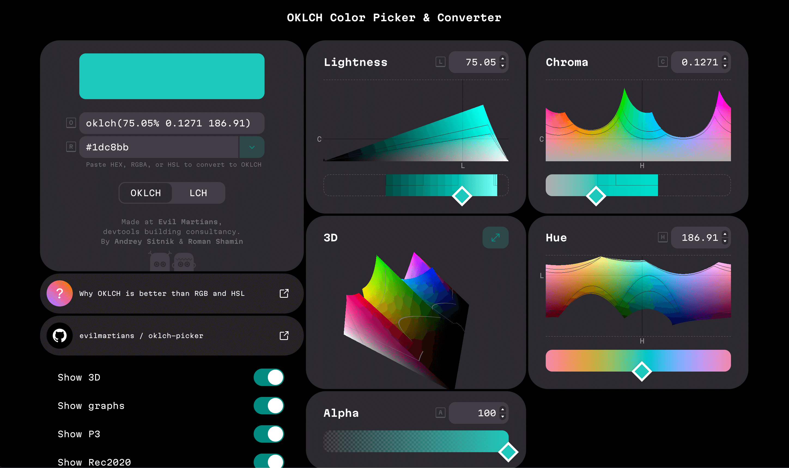
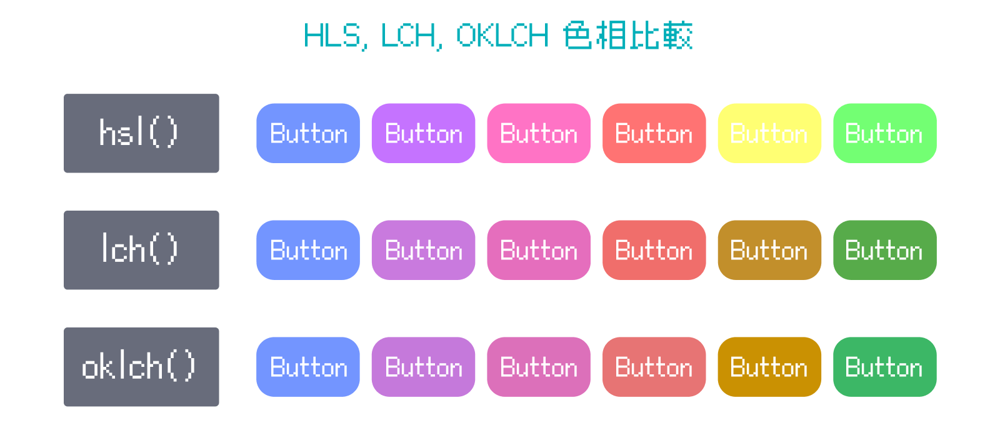
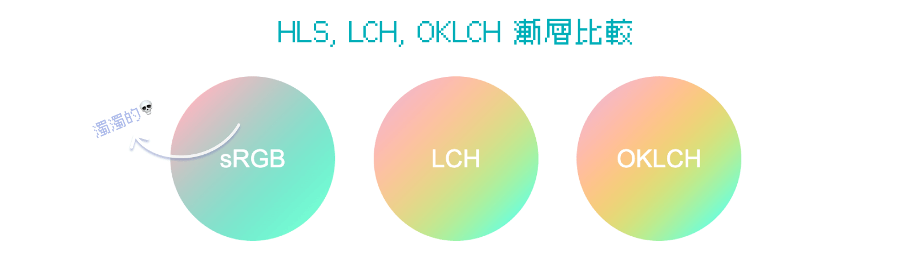
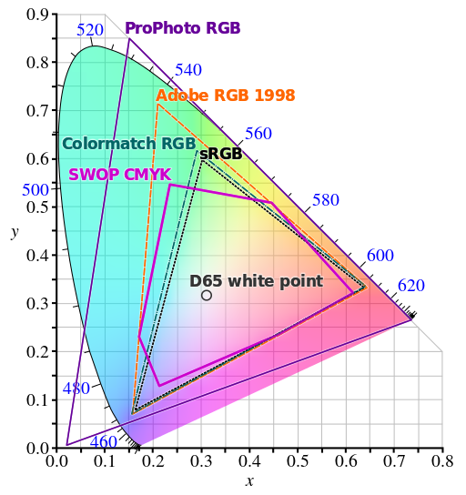
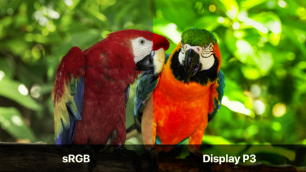
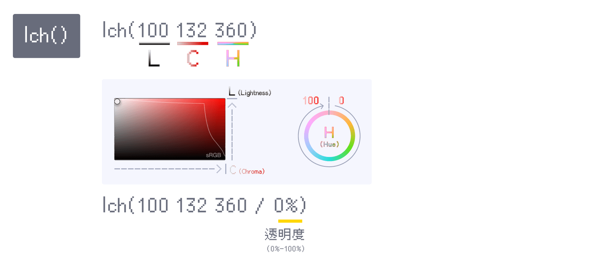
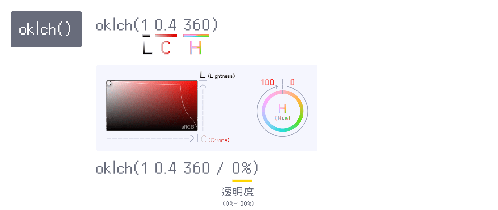
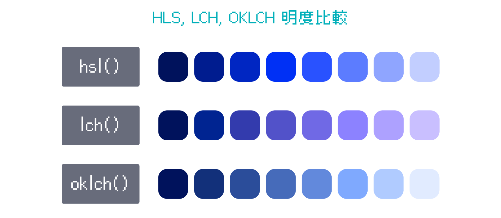
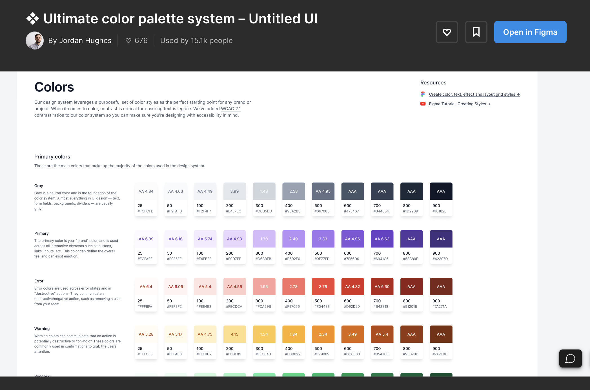

上一篇我們學了 HEX、RGB、HSL 等傳統顏色設定方式，這一篇來認識更科學、更符合人眼感知的新式顏色系統——**LCH 和 OKLCH**。  
它們不只解決了 HSL 色相不均勻的問題，還支援廣色域，讓你的顏色更鮮豔、漸層更乾淨！

> #### **↓ 今日學習重點 ↓**
> 
> * 了解廣色域是什麼，sRGB 有什麼限制
>     
> * 了解 lch()、oklch() 的優勢與語法
>     
> * 學會選擇什麼情境下使用 OKLCH
>     

---

## 一、廣色域 LCH/OKLCH：更符合人眼的顏色系統



LCH/OKLCH 是一種更符合人類感知的顏色表示方式。此外，LCH/OKLCH 還可以設定更寬廣的顏色範圍。

> 由於為了貼近人眼感知與支援廣色域，所以它們針對這三種變數做了很大的調整，並非單純線性結構，大家可以使用以下小工具玩玩看，就能明白了（詳細概念與數值設定，我們稍後會再解釋）：
> 
> 小工具：[LCH/OKLCH Color Picker & Converter](https://oklch.com/)

LCH/OKLCH 目前支援度已 100%，但是而在繪圖軟體中，還無法直接使用這種方式設定顏色，可以使用一些套件模擬，如：Figma 中的 [LCH](https://www.figma.com/community/plugin/969496279507778512)、[OkColor](https://www.figma.com/community/plugin/1173638098109123591)、[Perceptual Color](https://www.figma.com/community/plugin/1266828922235523696/perceptual-color)、[Chromatic Figma](https://www.figma.com/community/plugin/759433498184507623/) 等，但是它是使用一些數學運算 RGB 去模擬結果，本質依然沒有支援。

### 1\. 色相變化時，明度的修正



舊有 RGB 中的 `hex`、`rgb()`、`hsl()`、`hsb()` 、`hwb()` 是為了系統運算而生，所以存在著不符合人眼視覺的問題：相同明度但是感覺起來不一樣亮。在 LCH/OKLCH 中修正了這個問題，如上圖所示。

如此一來，當我們需要改變色相時，就不必擔心顏色對比度會跑掉，例如：更改按鈕顏色，卻因為改為黃色調而看不清楚文字。在設計時，也能更輕鬆掌握色彩，建立色彩系統，真希望繪圖軟體盡快支援。

#### 可修正漸層的灰色死亡地帶



延伸上一點，當我們在傳統 sRGB 描繪漸層時，由於不同色相間的視覺上的明度不一致，容易造成漸層顏色混濁。現在，使用 LCH/OKLCH 的色彩空間就可避免這個狀況，因為當色相切換時，明度的感知一致，飽和度也保留著，讓漸層能夠順順地過去。

> 延伸閱讀：  
> [設計女子艾瑪 - 為什麼我的漸層色髒髒的？運用 LCH 色彩升級你的漸層色](https://www.instagram.com/p/CvM9Ycgv9y2/)  
> [Better Gradients | Dan Hollick](https://typefully.com/DanHollick/better-gradients-ViH6Bu2kDRBJ)  
> [Non-Boring Gradients - A non linear CSS gradient generator](https://non-boring-gradients.netlify.app/)

#### 透過 Figma 套件使用 LCH 色彩空間

如果要製作網頁設計稿，但是目前 Figma 不支援 LCH/OKLCH 的顏色設定方式，這時候我們可以透過這個套件—— [Chromatic Figma](https://www.figma.com/community/plugin/759433498184507623) ，修正漸層顏色，它可以模擬 LCH 色彩空間運算，並且調整漸層的顏色。


#### 使用 CSS 設定漸層色彩空間（Interpolation color space）

這邊我們使用的是在 `background` 中的漸層色上加上指定的色彩空間，加上後瀏覽器會依據該色彩空間的方式混合顏色：

> DEMO 連結：[Color Space in Linear Gradient: sRGB vs. LCH vs. OKLCH](https://codepen.io/im1010ioio/pen/MWLwgMy)

```css
div {
    background: linear-gradient(135deg in lch, #b920f2 15%, #00FFD1 85%);
}
```

當然色彩空間不只這幾種可以設定，大家也可以去研究一下漸層的各種面貌：

> DEMO：[Gradient Color Spaces Exploration](https://codepen.io/argyleink/pen/OJObWEW)  
> 來源：[Color Spaces for More Interesting Gradients | CSS-Tricks](https://css-tricks.com/color-spaces-for-more-interesting-css-gradients/)

### 2\. 廣色域，接近人眼所能見的所有顏色

前面我們所介紹的顏色設定方式，除了 CMYK 外，其餘都是屬於螢幕中 sRGB 的色域，但是人眼能看到的色彩，比 sRGB 還要大上許多，sRGB 僅僅是人眼可見色彩的 35% 而已。

隨著液晶螢幕技術的進步，螢幕可顯示的顏色已大於 sRGB 的範圍，目前常見的背光源技術是「藍光 LED 搭配 RG 螢光粉」，它能凸顯分別代表長、中、短波長的RGB光譜分布，讓各頻帶能量更加集中，提高顏色的純度讓色域往外擴張，而這樣的技術稱為廣色域（wide color gamut，WCG），詳細請參考下圖：



> 延伸閱讀：[什麼是廣色域｜BenQ 台灣](https://www.benq.com/zh-tw/knowledge-center/technology/what-is-wide-color-gamut-tv.html)

例如，由 Apple 推出的 Display P3 色域，比起傳統 sRGB 的表現效果就鮮明許多：



> 圖片來源 & 延伸閱讀：[Get Started with Display P3 - WWDC17 - Videos - Apple Developer](https://developer.apple.com/videos/play/wwdc2017/821/)

#### LCH/OKLCH 使用的色彩空間

LCH/OKLCH 使用的色彩空間是 CIELAB，是目前最大的色彩空間之一，它甚至比 Apple 的 Display P3 大一點。

> 延伸閱讀：[CIELAB色彩空間 - 維基百科](https://zh.wikipedia.org/zh-tw/CIELAB%E8%89%B2%E5%BD%A9%E7%A9%BA%E9%97%B4)

#### 廣色域之於網頁設計

這一點優勢雖然是項突破，但是在一般網頁設計上其實不是必須（尤其是面對只需要改背景、按鈕或文字顏色等基本需求時），因為網頁必須要向下相容各種用戶的螢幕，所以 sRGB 就很夠用了。

不過，如果我們是要使用 CSS 或程式創作圖像，如酷炫的互動設計、未來的生成式藝術（Generative Art ）等等，或許就很有幫助了，可以增加更多顏色變化的可能性。當使用者螢幕好時，可以盡可能呈現更好的色彩。

> 註：目前 CSS 率先支援了廣色域，但是 p5.js 還沒有，所以創作生成式藝術可能還要等等，詳情請參考：[Support for new high definition color spaces. · Issue #6190 · processing/p5.js](https://github.com/processing/p5.js/issues/6190)。（2023/11）

#### 如果使用者的螢幕無法顯示廣色域的顏色怎麼辦？

使用廣色域的顏色時，如果使用者的螢幕不夠好，無法顯示超出的色域，瀏覽器會尋找最接近的顏色顯示，不用擔心顏色失效。

大家可以試看看一下的 DEMO，兩者皆是同色相的水藍色，飽和度與明度皆最高的顏色：


> DEMO：[oklch vs. hex color](https://codepen.io/im1010ioio/pen/Exrjygv)

### 3\. LCH



LCH 使用以下三種數值，基本上與 HSL 很相似：

1. **明度 Lightness**：添加白色與黑色，控制顏色的明暗，  
    由黑至白，數值將由 0% 到 100% 變化。
    
2. **色度 Chroma**：色彩的純度，與飽和度一樣的概念。  
    此處 0% 對應的數值為 0，100% 對應數值為 150。  
    最小值為 0，最大值理論上無上限（但實際不超過 230）。
    
3. **色相 Hue**：由 0 度到 360 度的彩虹圓圈，起始都是紅色（數值超過 360 就是第二圈，例如：數值 1 的色相等同於 361 的色相）。
    

如上圖所示，在 Chrome 的開發者模式中選色時，會標示一條 sRGB 的線，於這條線右側就是屬於廣色域的顏色。

> 延伸閱讀：[lch() - CSS：层叠样式表 | MDN](https://developer.mozilla.org/zh-CN/docs/Web/CSS/color_value/lch)

---

### 4\. OKLCH（⭐️ 會是明日之星嗎？）



OKLCH 和 LCH 基本上一樣，只有**明度 Lightness**與**色度 Chroma 的地方不一樣**：

1. **明度 Lightness**：添加白色與黑色，控制顏色的明暗，  
    由黑至白，數值將由 0 到 1 變化。
    
2. **色度 Chroma**：色彩的純度，與飽和度一樣的概念。  
    此處 0% 對應的數值為 0，100% 對應數值為 0.4。  
    最小值為 0，最大值理論上無上限（但實際上不超過 0.5）。
    
3. **色相 Hue**：由 0 度到 360 度的彩虹圓圈，起始都是紅色（數值超過 360 就是第二圈，例如：數值 1 的色相等同於 361 的色相）。
    

#### OKLCH 改善了 LCH 的致命傷

LCH 雖已改善了 RGB 色相變化時的感知明度，但是他仍有致命缺點：就是當色相 Hue 介於 270 至 330（大約是藍色與紫色區間），當明度 Lightness 有所改變時，他的色相會有所偏移。以下面的例子來說，LCH 在加亮時，從藍色調偏移到了紫色調：



色相偏移在為品牌建立色彩系統時，會造成問題，所以與 LCH 相比，建議大家使用 OKLCH。

以這個例子來說，在明度變化時，HSL 雖能夠維持同色相但是飽和度會突然變高；LCH 雖然飽和度穩定變化，但是色相偏移；而 OKLCH 幾乎沒有什麼缺點，它正是為了修正這個問題而誕生的，OKLCH 能完美地保持明度與色相的合理變化，非常值得被設計師與前端工程師使用。

> 這邊所謂的色彩系統，就是設計師為品牌定義好的一整套色彩計畫，通常被包含在 VIS 視覺識別系統設計中，例如：
> 
> 
> 
> 範例：[❖ Ultimate color palette system – Untitled UI](https://www.figma.com/community/file/1029506782158027808/ultimate-color-palette-system-untitled-ui)

大家可以去試試使用 OKLCH 調色喔！它的瀏覽器已經 100% 支援了。（真希望繪圖軟體也能夠盡快支援）

除了使用 OKLCH 調色，CSS 還新增了 `color-mix()`，可以快速建立起一整套顏色，我們將在下一篇解說。

> 延伸閱讀：  
> [oklch() - CSS：层叠样式表 | MDN](https://developer.mozilla.org/zh-CN/docs/Web/CSS/color_value/oklch)  
> [LCH vs OKLCH: what is the difference? | Atmos](https://atmos.style/blog/lch-vs-oklch)
> 
> 這篇文章有許多神奇的進階應用：  
> [OKLCH in CSS: why we moved from RGB and HSL—Martian Chronicles, Evil Martians’ team blog](https://evilmartians.com/chronicles/oklch-in-css-why-quit-rgb-hsl)

---

色彩的背後是一堆色彩 3D 空間和數學運算，研究了後我也還是不太懂它們的細節、座標是如何運算的，但是我們只要掌握運作原理，就能夠在適合的情景使用了。

---

---

> 👈 **上一篇：[CSS 顏色基礎：Color Names、HEX、RGB、CMYK、HSL 全解析](/color/css-colors-hex-rgb-hsl-lch-oklch)**

---

#### ↓↓↓↓↓↓↓↓↓↓↓↓↓↓↓↓↓↓↓↓

感謝看到最後的你，若你覺得獲益良多，請不要吝嗇給我按個喜歡。❤️

如果你喜歡我的創作，還想看看其他有趣的分享與日常，  
可以追蹤我的 IG [@im1010ioio](https://www.instagram.com/im1010ioio/)，或者是[🧋送杯珍奶鼓勵我](https://im1010ioio.bobaboba.me/)，謝謝你🥰。

