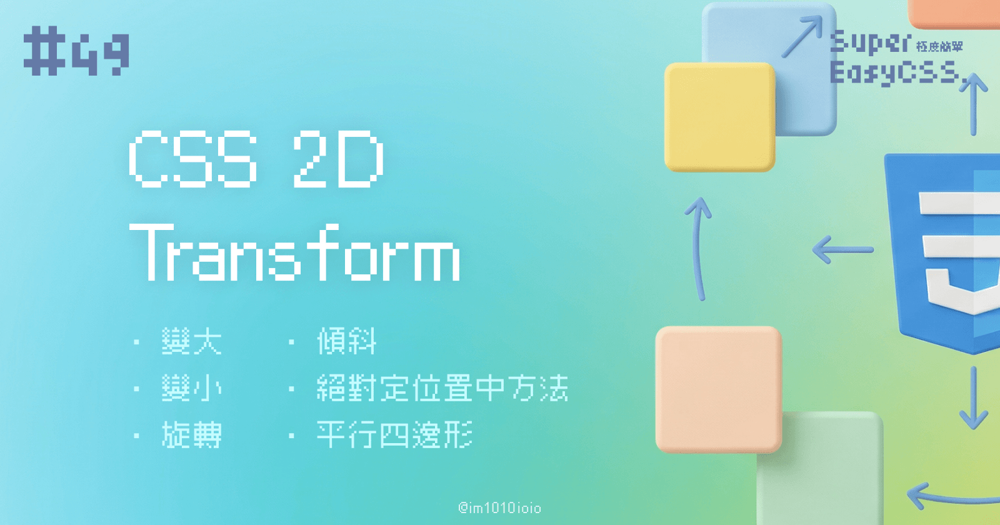
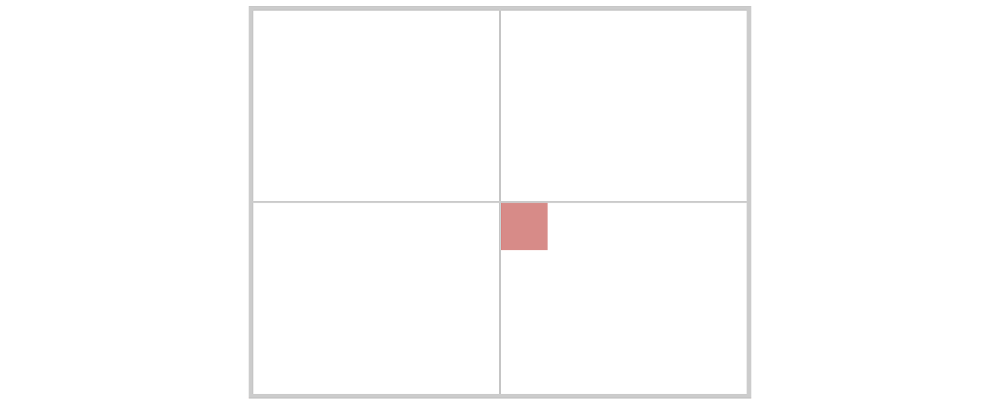
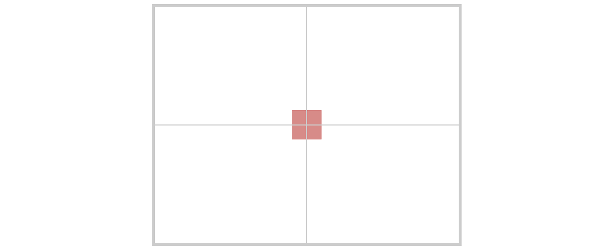
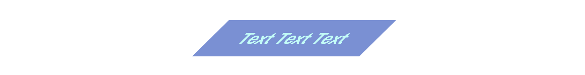
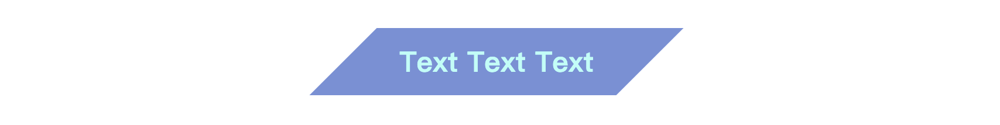

CSS 的 `transform` 屬性是一個功能強大的工具，它允許我們以簡單的方式對元素進行平移、縮放、旋轉和傾斜等 2D `transform` 效果，而不需要使用 JavaScript 或圖片編輯工具。`transform` 可以讓網站更具動態效果，提升視覺吸引力。

本文將詳細介紹常見的 `transform` 函數以及其應用方式。

---

## 基本語法

```css
selector {
  transform: 方法(數值);
}
```

`transform` 屬性接受多種函數組合，這些函數定義了如何改變元素的形狀、大小或位置。以下是常見的 2D `transform` 函數：

---

### 1\. `translate()` - 位移

`translate()` 函數用來移動元素，根據水平（X 軸）和垂直（Y 軸）的位移值來改變其位置。

* 語法：
    
    ```css
    transform: translate(x, y);
    ```
    
    * `x`: 水平位移，正值向右，負值向左
        
    * `y`: 垂直位移，正值向下，負值向上
        
* 範例：
    
    ```css
    .box {
      transform: translate(50px, 100px); /* 元素將向右移動 50px，向下移動 100px */
    }
    ```
    

#### 應用情境：

`translate()` 可以用來製作平滑的滑動效果或將元素從其原始位置進行微調。

#### DEMO: 絕對定位置中方法

如果你想要使用 CSS 絕對定位想要將東西置中，直接把 `top` 、 `left` 都設為 `50%` 的話，結果不是置中的，因為它對齊的東西的左上角：



這時候我們可以就使用 `transform: translate()` 解決這個問題，就是將這個東西，往上、往左移自身的 50%，這樣就能實質上的置中了：



```css
.box{
    position: absolute;
    top: 50%;
    left: 50%;
    transform: translate(-50%, -50%);
}
```

> DEMO: [CSS absolutely position in the center](https://codepen.io/im1010ioio/pen/PoMPWGe)

這其實是一個很常見的手法唷！

---

### 2\. `scale()` - 縮放

`scale()` 函數用來改變元素的大小，透過 X 軸和 Y 軸的縮放因子進行調整。

* 語法：
    
    ```css
    transform: scale(x, y);
    ```
    
    * `x`: 水平縮放比例，1 代表原始大小，大於 1 代表放大，介於 0 到 1 之間代表縮小
        
    * `y`: 垂直縮放比例，與 `x` 類似，未指定時預設與 `x` 相同
        
* 範例：
    
    ```css
    .box {
      transform: scale(1.5); /* 元素將以 1.5 倍放大，水平和垂直方向相同 */
    }
    .box-xy {
      transform: scale(2, 0.5); /* 元素將水平放大 2 倍，垂直縮小至原來的 0.5 */
    }
    ```
    

#### 應用情境：

`scale()` 非常適合用來製作縮放過渡動畫，或在懸停效果（hover）中動態改變元素的大小。

---

### 3\. `rotate()` - 旋轉

`rotate()` 函數用來讓元素繞著一個原點進行旋轉。預設情況下，旋轉的原點是元素的中心。

* 語法：
    
    ```css
    transform: rotate(angle);
    ```
    
    * `angle`：  
        旋轉的角度，正值表示順時針方向，負值則為逆時針方向。  
        單位可以使用角度 `deg` 或是圈數 `turn`。
        
* 範例：
    
    ```css
    .box {
      transform: rotate(45deg); /* 元素將順時針旋轉 45 度 */
    }
    ```
    

#### 應用情境：

`rotate()` 可以用來實現旋轉動畫效果，像是讓按鈕或圖標旋轉，來增強用戶體驗。

---

### 4\. `skew()` - 傾斜

`skew()` 函數讓元素在 X 軸或 Y 軸上產生傾斜效果，使元素看起來像是被斜拉伸。

* 語法：
    
    ```css
    transform: skew(x-angle, y-angle);
    ```
    
    * `x-angle`: 水平傾斜的角度
        
    * `y-angle`: 垂直傾斜的角度，未指定時預設為 0
        
* 範例：
    
    ```css
    .box {
      transform: skew(30deg, 10deg); /* 元素將水平傾斜 30 度，垂直傾斜 10 度 */
    }
    ```
    

#### 應用情境：

`skew()` 常用於建立特效文字或按鈕，製造動感的視覺效果。

#### DEMO: 製作一個平行四邊形

如果我們直接將文字方塊傾斜，你會發現連文字也一起被傾斜了：



這時候我們可以善用偽元素 `::before` or `::after` 製作傾斜的背景，就能達到我們想要的效果了：



```css
.skew-bg::before{
    content: "";
    position: absolute;
    top: 0;
    left: 0;
    right: 0;
    bottom: 0;
    z-index: -1;
    background: #7a90d3;
    transform: skew(-45deg);
}
```

> DEMO: [CSS parallelogram](https://codepen.io/im1010ioio/pen/RwzXXao)

---

### 5\. 多重 `transform`

CSS `transform` 支援多個 `transform` 函數同時使用，它們將依照從左到右的順序依次執行。

* 語法：
    
    ```css
    transform: translate(50px, 100px) scale(1.2) rotate(30deg);
    ```
    
* 範例：
    
    ```css
    .box {
      transform: translate(50px, 50px) scale(1.2) rotate(45deg);
    }
    ```
    

在這個範例中，元素會先位移、再放大，最後旋轉。這種組合使用方式可以創造出複雜的動畫效果。

---

### 6\. 設置 `transform` 原點 (`transform-origin`)

`transform-origin` 屬性用來設置 `transform` 的基準點，預設是元素的中心（50% 50%）。可以根據需求改變這個原點的位置，讓旋轉或縮放等效果從不同的位置開始。

* 語法：
    
    ```css
    transform-origin: x y;
    ```
    
* 範例：
    
    ```css
    .box {
      transform-origin: top left; /* 將 transform 的基準點設置為左上角 */
      transform: rotate(45deg);
    }
    ```
    

---

## `transform` 適合做動畫

使用 `transform` 製作動畫效果，比起直接改變寬度、高度等 CSS 基本佈局，會更加地節省效能，動畫會更加滑順喔！因為瀏覽器不需要一直重新渲染佈局。如果想要用 CSS 製作動畫、互動效果，`transform` 一定要好好學起來。

---

CSS `transform` 屬性是設計中極為實用的工具，它能夠通過簡單的語法讓網頁元素產生豐富的動態效果。無論是用來實現位移、縮放、旋轉，還是傾斜，這些 2D `transform` 都可以提升網頁的互動性和視覺吸引力。