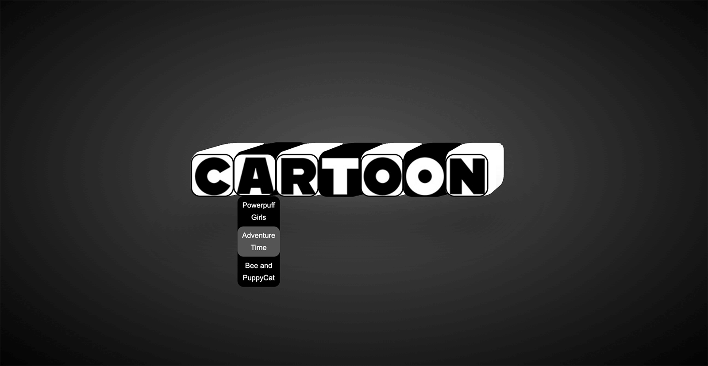

CSS 的 3D `transform` 讓我們可以在網頁上建立 3D 立體效果，讓元素看起來像是在一個 3D 空間中移動或旋轉。

要使用 3D `transform`，除了了解各種 3D 函數，還必須正確設置場景的深度和視角。在本篇文章中，我們將先了解如何建立 3D 場景，再學習常見的 3D `transform` 函數。

---

### 1\. 建立 3D 場景的基礎

在開始 3D `transform` 之前，我們需要設置一個具有深度的 3D 場景。這可以透過 `perspective`、`perspective-origin` 和 `transform-style: preserve-3d;` 這三個屬性來實現。

#### 1.1 `perspective` - 設定場景的深度

`perspective` 屬性決定了觀察者距離 3D 場景的距離，也就是說，它控制了元素的透視效果。

* 語法：
    
    ```css
    perspective: value;
    ```
    
    * `value`: 距離值，單位為 px。數值越小，透視效果越強烈，數值越大，則效果越弱。
        
* 範例：
    
    ```css
    .scene {
      perspective: 1000px; /* 距離場景 1000px，產生適度的透視效果 */
    }
    ```
    

#### 1.2 `perspective-origin` - 控制視角

`perspective-origin` 控制透視效果的視角點，默認是視窗的中心點，這個屬性可以用來改變觀察者的視角。

* 語法：
    
    ```css
    perspective-origin: x-axis y-axis;
    ```
    
    * `x-axis`: 定義水平視角位置，可以是 `left`、`center`、`right`，或者具體的 px、% 值。
        
    * `y-axis`: 定義垂直視角位置，可以是 `top`、`center`、`bottom`，或者具體的 px、% 值。
        
* 範例：
    
    ```css
    .scene {
      perspective: 1000px;
      perspective-origin: left top; /* 從場景的左上角觀看 3D 場景 */
    }
    ```
    

#### 1.3 `transform-style: preserve-3d` - 保留 3D `transform` 效果

當我們對子元素應用 3D `transform` 時，需要讓父容器使用 `transform-style: preserve-3d;`，以保留其子元素的 3D `transform` 效果。

* 語法：
    
    ```css
    transform-style: preserve-3d;
    ```
    
* 範例：
    
    ```css
    .scene {
      transform-style: preserve-3d;
    }
    ```
    

現在，我們已經建立了一個 3D 場景，可以開始使用 3D `transform` 函數來操作元素了。

---

### 2\. 常見的 CSS 3D `transform` 函數

3D `transform` 函數的使用方式與 2D `transform` 類似，只不過它們允許我們沿著三個軸進行操作：X 軸、Y 軸、Z 軸。

#### 2.1 `rotateX()` - 沿 X 軸旋轉

`rotateX()` 函數用來讓元素沿著 X 軸進行旋轉。

* 語法：
    
    ```css
    transform: rotateX(angle);
    ```
    
    * `angle`: 旋轉角度（正值順時針，負值逆時針）
        
* 範例：
    
    ```css
    .box {
      transform: rotateX(45deg); /* 沿 X 軸旋轉 45 度 */
    }
    ```
    

#### 2.2 `rotateY()` - 沿 Y 軸旋轉

`rotateY()` 函數讓元素沿著 Y 軸進行旋轉。

* 語法：
    
    ```css
    transform: rotateY(angle);
    ```
    
* 範例：
    
    ```css
    .box {
      transform: rotateY(60deg); /* 沿 Y 軸旋轉 60 度 */
    }
    ```
    

#### 2.3 `rotateZ()` - 沿 Z 軸旋轉

雖然 Z 軸的旋轉實際上也能在 2D `transform` 中使用，但它在 3D 場景中同樣重要。Z 軸旋轉會讓元素在平面內旋轉。

* 語法：
    
    ```css
    transform: rotateZ(angle);
    ```
    
* 範例：
    
    ```css
    .box {
      transform: rotateZ(90deg); /* 沿 Z 軸旋轉 90 度 */
    }
    ```
    

#### 2.4 `translateZ()` - 沿 Z 軸移動

`translateZ()` 函數讓元素在 Z 軸上移動，創造出遠離或接近觀察者的效果。

* 語法：
    
    ```css
    transform: translateZ(value);
    ```
    
    * `value`: 移動的距離，正值靠近觀察者，負值遠離觀察者
        
* 範例：
    
    ```css
    .box {
      transform: translateZ(200px); /* 元素將向觀察者靠近 200px */
    }
    ```
    

#### 2.5 `scaleZ()` - 沿 Z 軸縮放

`scaleZ()` 用來控制元素在 Z 軸上的縮放。

* 語法：
    
    ```css
    transform: scaleZ(value);
    ```
    
* 範例：
    
    ```css
    .box {
      transform: scaleZ(1.5); /* 在 Z 軸方向放大 1.5 倍 */
    }
    ```
    

#### 綜合應用：旋轉與縮放效果

```html
<div class="scene">
  <div class="container">
    <div class="box">3D 物件</div>
  </div>
</div>

<style>
  .scene {
    perspective: 800px;
  }

  .container {
    transform-style: preserve-3d;
  }

  .box {
    width: 100px;
    height: 100px;
    background: lightblue;
    transform: rotateX(30deg) rotateY(45deg) translateZ(100px);
  }
</style>
```

---

### 3\. 3D `transform` 的應用場景

#### 3.1 立方體效果

我們可以使用多個面組成一個立方體，並且將每一個面做不同的 3D `transform` 來構建立方體效果。

#### HTML

```xml
<div class="scene">
    <div class="cube">
        <div class="face front">Front</div>
        <div class="face back">Back</div>
        <div class="face left">Left</div>
        <div class="face right">Right</div>
        <div class="face top">Top</div>
        <div class="face bottom">Bottom</div>
    </div>
</div>
```

#### CSS

```css
.scene {
    perspective: 800px;
}

.cube {
    position: relative;
    transform-style: preserve-3d;
    transform: rotateX(45deg) rotateY(45deg);
    width: 100px;
    height: 100px;
}

.face {
    position: absolute;
    width: 100px;
    height: 100px;
    background: rgba(255, 165, 0, 0.8);
    border: 1px solid #fff;
}

.front  { transform: translateZ(50px); }
.back   { transform: rotateY(180deg) translateZ(50px); }
.left   { transform: rotateY(-90deg) translateZ(50px); }
.right  { transform: rotateY(90deg) translateZ(50px); }
.top    { transform: rotateX(90deg) translateZ(50px); }
.bottom { transform: rotateX(-90deg) translateZ(50px); }
```

#### DEMO



> DEMO: [3D Cube Cartoon Menu](https://codepen.io/im1010ioio/pen/epaGOZ)