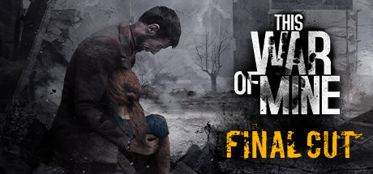
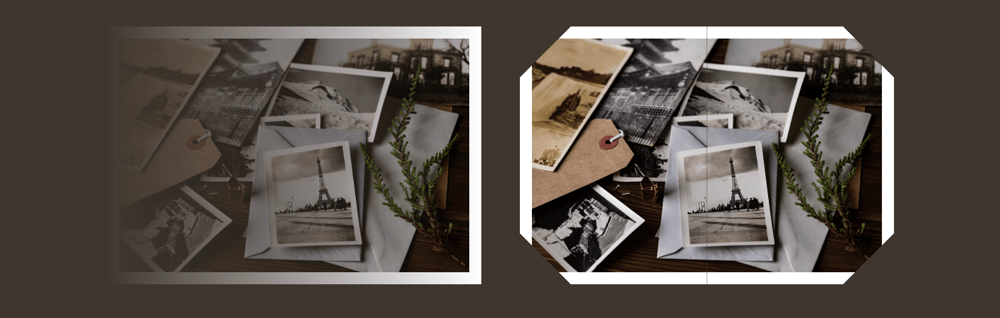
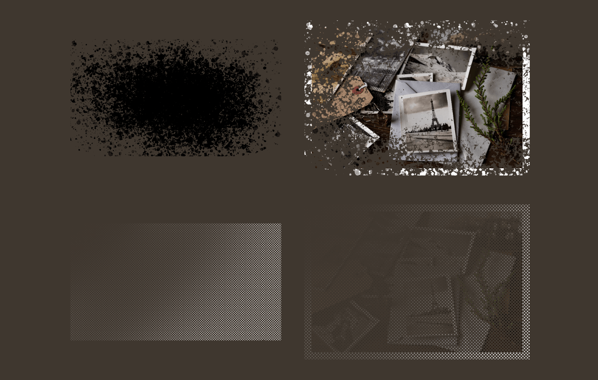
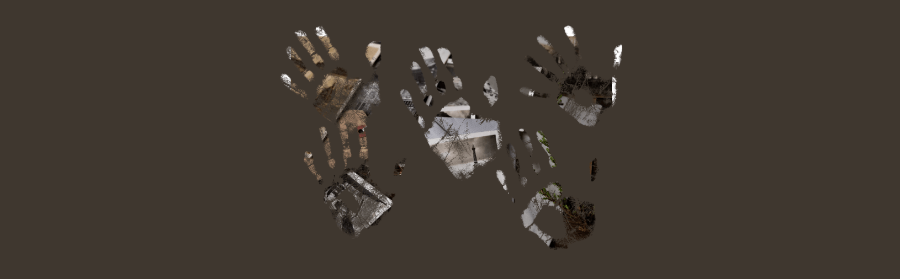
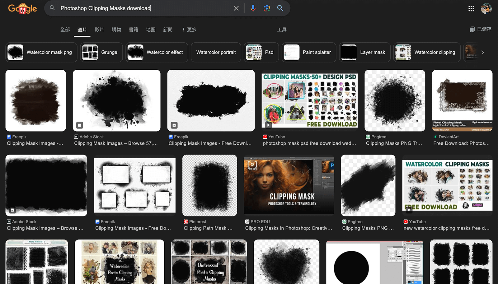
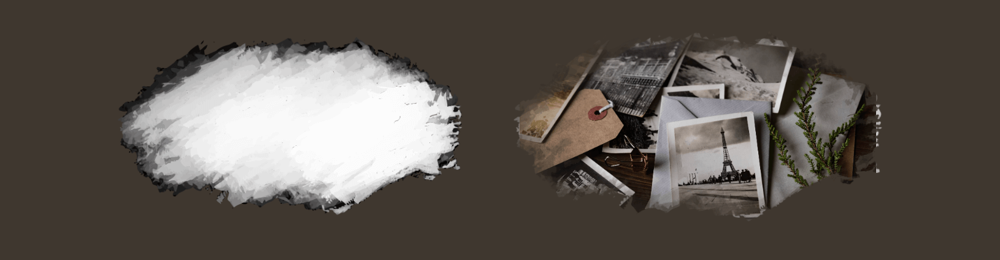

前幾篇寫到 CSS clip-path 時，可以剪裁任何 HTML 的元素，包含色塊、圖片、影片，但是他只限於精準的剪裁線條，萬一今天要有更複雜而且半透明的剪裁呢？

例如，我今天想要 LOGO 上面有個手印被裁掉，同時又有點半透明效果：



> 圖片來源：[Steam - This War of Mine](https://store.steampowered.com/app/282070/This_War_of_Mine/)

這時候就可以使用 CSS 的 `mask` 屬性，再加上一張裁剪用的半透明圖檔，做到我們要的效果，這幾乎跟 [Photoshop 中的剪裁遮色片](https://helpx.adobe.com/tw/photoshop-elements/using/clipping-masks.html)效果一模一樣。我覺得這種效果特別適合用在復古、恐怖或懸疑效果的網頁裡。

> #### **↓ 今日學習重點 ↓**
> 
> * 學會 CSS 遮罩 `mask` 的用法
>     
> * 了解 `mask-mode` 常用兩種模式下的差異
>     

---

## 一、基本語法

這個 `mask` 屬性允許你使用圖片或漸層來遮罩 HTML 元素的部分區域，實現透明、半透明的效果。在預設 `mask-mode` 為 `alpha` 時，它會根據「遮罩圖片的透明度」來決定是否顯示畫面：

* 黑色、白色區域則會顯示元素
    
* 透明區域則會隱藏元素
    
* 半透明區域則會根據「透明度」進行遮罩
    

```css
div {
  mask: <mask-source> <position> / <size> <repeat> <mode>;
}
```

* **mask-source**：遮罩的圖片，可以是圖片路徑、漸層或 SVG。
    
* **position**：遮罩的位置，類似於 `background-position`。
    
* **size**：定義遮罩圖像的大小，類似於 `background-size`。
    
* **repeat**：決定遮罩圖像是否重複顯示，類似於 `background-repeat`。
    
* **mode**：定義如何應用遮罩，常見值為依據明度 `luminance` 或依據透明度 `alpha` （預設）。
    

---

## 二、DEMO

### 1\. 使用漸層作為遮罩

CSS `mask` 可以使用 CSS 漸層、多重背景漸層來作為遮罩，做出許多更豐富的效果：



> DEMO: [CSS mask](https://codepen.io/im1010ioio/pen/gOVbGVd)

```css
.mask-gradient{
    mask: linear-gradient(90deg, transparent, #000);
}

.mask-gradient-2{
    mask:
        linear-gradient(135deg, transparent 30px, #fff 0)
        top left,
        linear-gradient(-135deg, transparent 30px, #fff 0)
        top right,
        linear-gradient(-45deg, transparent 30px, #fff 0)
        bottom right,
        linear-gradient(45deg, transparent 30px, #fff 0)
        bottom left;
    mask-size: 50% 50%;
    mask-repeat: no-repeat;
}
```

### 2\. 遮罩圖片（依據透明度 `alpha`，預設）

以下範例將圖片作為遮罩，讓元素的一部分呈現透明效果，  
左邊是使用的遮罩圖片，右邊是遮罩後的結果：



```css
.mask-img{
    mask: url(mask.png);
    mask-size: cover;
}
```

我們用 `mask` （簡寫）載入了一個外部的圖片作為遮罩，並使用 `mask-size: cover` 讓遮罩圖像覆蓋整個元素（使用方式與 `background` 類似），要用來當遮罩圖片需要具有透明或半透明區塊。

你也可以使用多重背景，搭配 `background-size` 、`background-position` 等調整多個 mask 的大小及位置，像以下例子：



```css

.mask-img {
    mask:
        url(handprint-1.png),
        url(handprint-2.png),
        url(handprint-3.png),
        url(handprint-4.png),
        url(handprint-5.png);
    mask-size: 30%;
    mask-position: 0 0, 50% 20%, 10% 80%, 90% 90%, 100% 0;
    mask-repeat: no-repeat;
}
```

### 3\. 遮罩圖片（依據明度 `luminance`）

如果今天這張遮罩不是由配合的設計師自己畫，而是想要找網上現有的資源，當你輸入「Photoshop clipping masks download」時，會發現這種遮罩資源上大多是黑白稿，而非含有不透明度的素材：



如果想使用這種素材，我們可以試著將 `mask-mode` 改為 `luminance` ，依據圖片的明度（亮度）進行遮罩，這時它的顯示方式會變成：

* 白色、透明區域則會顯示元素
    
* 黑色區域則會隱藏元素
    
* 灰色區域則會根據「明度」進行遮罩
    

咦？不對，這和我們找到的資源不是相反嗎？沒關係，這時候只需要將圖片黑白反轉（負片效果）就可以了！例如，我事先將以下的素材圖片用繪圖軟體反轉顏色，再將 `mask-mode` 改為 `luminance` ，就能達到我們預期中的效果了：

> [Freepik: Ink paint black brush stroke splatter set design](https://www.freepik.com/free-vector/ink-paint-black-brush-stroke-splatter-set-design_207422852.htm#page=3&query=clipping%20mask&position=4&from_view=keyword&track=ais_hybrid&uuid=bc519e8e-58f5-4653-abf1-f2bfbca98f74)



```css
.mask {
    mask: url(mask.png);
    mask-position: 50% 50%;
    mask-size: contain;
    mask-mode: luminance;
    mask-repeat: no-repeat;
}
```

基本上 `mask` 的使用方法都跟 CSS 的 `background` 很相似。

---

## 三、`mask` 與 `clip-path` 的比較

* `mask`: 可以使用圖片或漸層作為遮罩，提供更豐富的視覺效果，並且支持透明度的變化。
    
* `clip-path`: 更適合用於簡單的形狀（例如圓形、矩形、多邊形），但是無法實現漸層或半透明效果。
    

---

> 延伸閱讀：  
> [使用 CSS's mask-image 屬性為圖片套用特效  |  Articles  |](https://web.dev/articles/css-masking?hl=zh-tw)  [web.dev](http://web.dev)[  
> 奇妙的 CSS MASK本文将介绍 CSS 中一个非常有意思的属性 mask 。 顾名思义，mask 译为遮罩。在 CS - 掘金](https://juejin.cn/post/6846687594693001223)

---

#### ↓↓↓↓↓↓↓↓↓↓↓↓↓↓↓↓↓↓↓↓

感謝看到最後的你，若你覺得獲益良多，請不要吝嗇給我按個喜歡。❤️

如果你喜歡我的創作，還想看看其他有趣的分享與日常，  
可以追蹤我的 IG [@im1010ioio](https://www.instagram.com/im1010ioio/)，或者是[🧋送杯珍奶鼓勵我](https://im1010ioio.bobaboba.me/)，謝謝你🥰。

