`mix-blend-mode` 和 `background-blend-mode` 能讓元素或背景顏色和它們背後的元素或背景進行混合，從而產生不同的視覺效果。這些效果類似於 Photoshop 等圖像編輯軟件中的「混合模式」。

如果搭配 sticky 效果或是視差捲動，會非常酷炫喔！例如「板塊設計」的官網，在文字上使用了 `mix-blend-mode: difference;`，讓文字跟背景的石頭圖片產生相反顏色的效果：

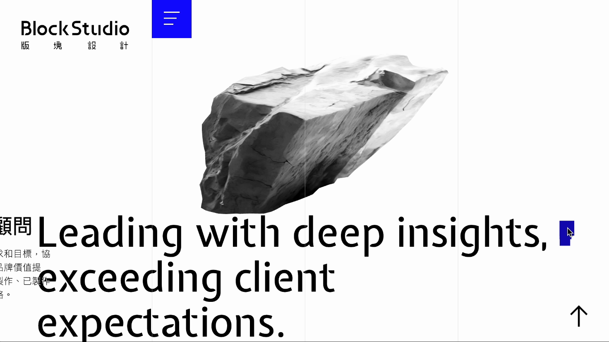

> 連結：[版塊 Block Studio](https://blockstudio.tw/)

---

> #### **↓ 今日學習重點 ↓**
> 
> * 了解 CSS 各種混合模式
>     
> * 將混合模式應用在 `mix-blend-mode` 和 `background-blend-mode` 上
>     

---

## 一、 `mix-blend-mode`

`mix-blend-mode` 用於設定一個元素如何與其父元素或背景中的其他元素進行混合。常見的應用包括圖片和文字在背景上的混合，讓內容與背景色彩產生有趣的視覺效果。

### 基本語法

```css
div {
    mix-blend-mode: difference;
}
```

我知道光用說的很難想像，讓我們用範例來理解吧！

---

---

### 1\. 預設

#### 1.1 `normal` **正常**

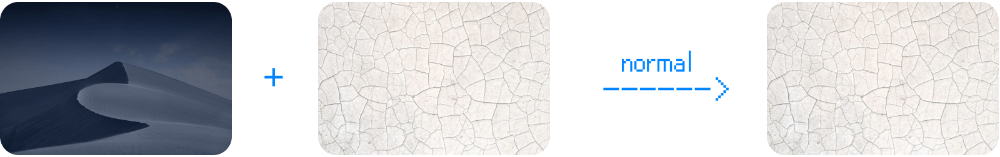

---

---

### 2\. 深色效果

以下這一系列的效果會讓顏色變暗，而大多白色背景會消失。

#### 2.1 `darken` **變暗**

顯示上下層較暗的部分。

下面的範例，由於上層的圖片顏色都比下層的圖片淺，所以最後只顯示了下層的圖片：

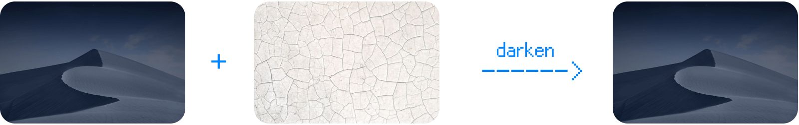

---

#### 2.2 `multiply` **色彩增值** （⭐️常用）

讓兩個圖層中的暗色混合在一起，而白色部分則會消失。

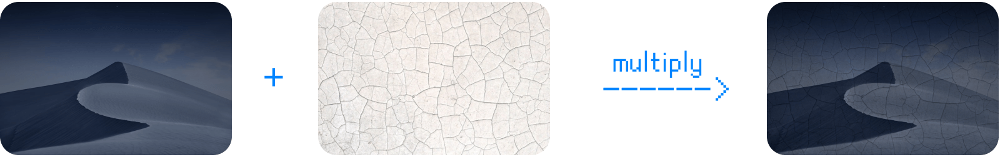

---

#### 2.3 `plus-darker`

效果比「`multiply` 色彩增值」與「`color-burn` 加深顏色」還要深。  
（這是 CSS 中新增的混合模式，Photoshop 中沒有）

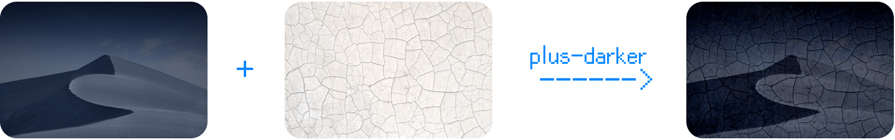

---

#### 2.4 `color-burn` **加深顏色**

效果比「`multiply` 色彩增值」還要深。

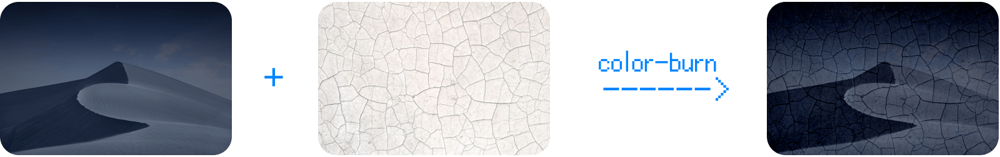

---

#### 2.5 使用情境 & DEMO

最常的使用情境是：

* 讓圖片上加一層淺色材質圖片，讓結果變得有紋理質感；
    
* 在圖片上加上文字或手繪圖案，「`multiply` 色彩增值」可以讓文字或手繪圖案看起來像是印在、畫在上面，例如：
    
    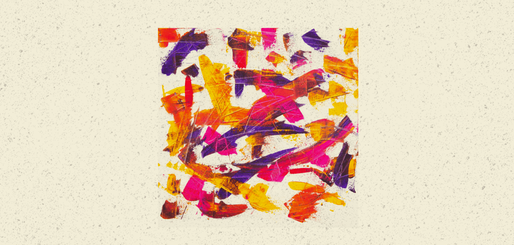
    
    > DEMO: [CSS mix-blend-mode multiply](https://codepen.io/im1010ioio/pen/ZEgbzzR)
    

---

---

### 3\. 明亮效果

以下這一系列的效果會讓顏色變亮，而大多黑色背景會消失。

#### 3.1 `lighten` **變亮**

上下層顯示較亮的部分。

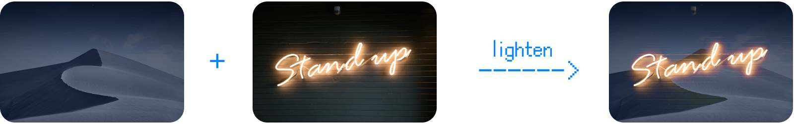

---

#### 3.2 `screen` **濾色**（⭐️常用）

增加重疊區域的亮度。黑色部分會變得透明，而白色部分會保留原色。

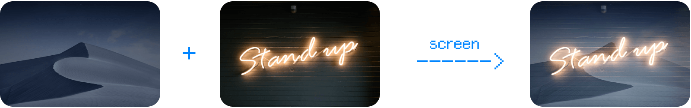

---

#### 3.3 `plus-lighter`

在重疊亮度時，也考慮了透明度。  
（這是 CSS 中新增的混合模式，Photoshop 中沒有）

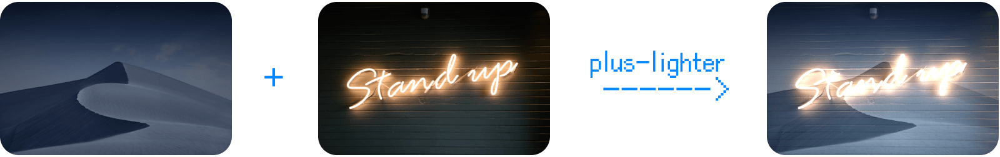

---

#### 3.4 `color-dodge` **加亮顏色**

效果比「`screen` 濾色」還亮，對比度也更高，更有衝擊力！

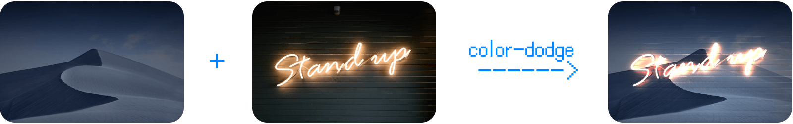

---

#### 3.5 使用情境 & DEMO

最常的使用情境是：使用黑色背景的特效素材（如：光束、雨），疊在圖片、影片上方。

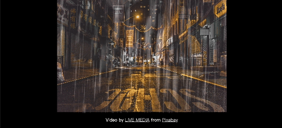

> DEMO: [CSS mix-blend-mode plus-lighter](https://codepen.io/im1010ioio/pen/Exqjqpp)

---

---

### 4\. 明暗效果兼具

以下這一系列的效果明暗顏色都保留，是重疊效果：

#### 4.1 `overlay` **覆蓋**

接近於「`multiply` 色彩增值」和「`screen` 濾色」，但都沒有去除白色與黑色的部分，並且增加對比度。

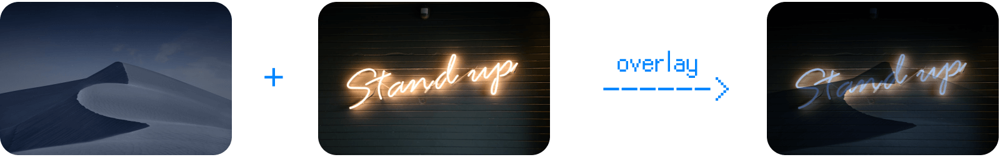

---

#### 4.2 `soft-light` **柔光**

明亮的部分變得更亮，黑暗區域變暗。

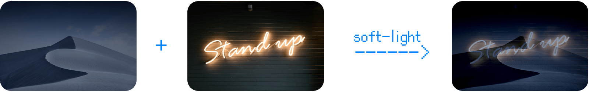

---

#### 4.3 `hard-light` **實光**

效果比「`soft-light` 柔光」更強。

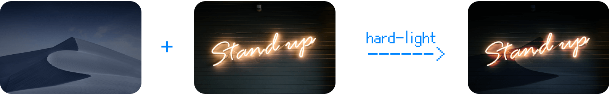

---

---

### 5\. 顏色差異的效果

以下這一系列的效果都是強調上下層的不同之處：

#### 5.1 `difference` **差異化**（⭐️常用）

強調與背景的差異之處，能有效提升辨識度。如果文字或其他元素需要同時出現在黑白兩種背景間，而且還要清楚辨識時，這會很好用！  
（如同我們開頭提到板塊設計官網的例子）

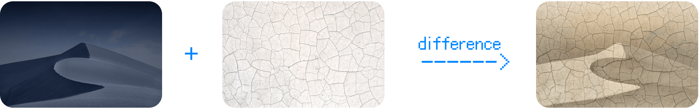

---

#### 5.2 `exclusion` **排除**

效果對比度比「`difference` 差異化」弱一點。

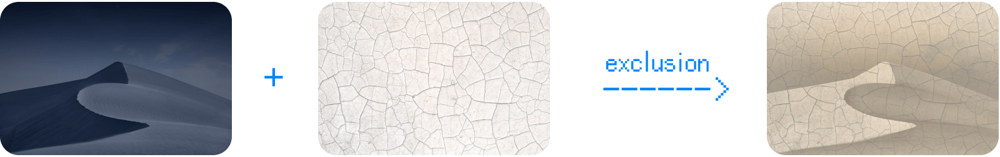

---

---

### 6\. HSL 顏色混合效果

以下這一系列的效果都是在 HSL 色彩空間中合成顏色，如同使用濾鏡調色：

#### 6.1 `hue` **色相**

保留下層的明亮度（L）和飽和度（S），但使用**上層的色相（H）的顏色**。

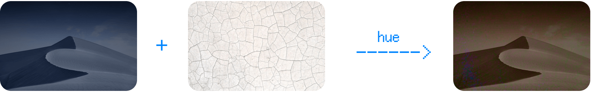

---

#### 6.2 `saturation` **飽和度**

保留下層的明亮度（L）和色相（H），但使用**上層的飽和度（S）的顏色**。

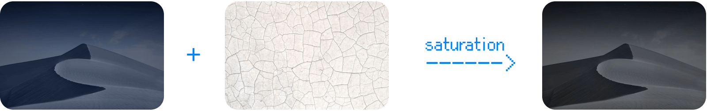

---

#### 6.3 `color` **顏色**

保留下層的明亮度 （L），但使用**上層的飽和度（S）和色相（H）的顏色**。

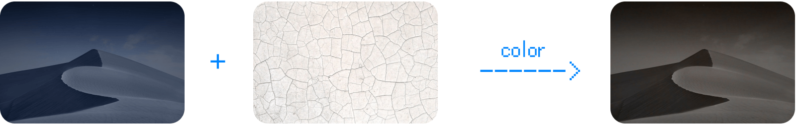

---

#### 6.4 `luminosity` **明度**

保留下層的飽和度（S）和色相（H），但使用**上層的明亮度（L）的顏色**。

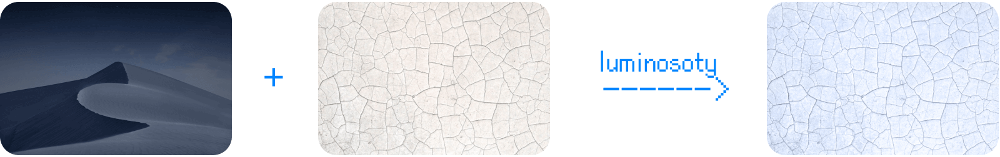

---

---

## 二、`background-blend-mode`

`background-blend-mode` 是當你使用多重背景（背景圖片、顏色、漸層等）時，可以控制它們的混合模式。使用方法與可用的數值基本上與 `mix-blend-mode` 基本上一樣。

### 基本語法

```css
div {
    background-blend-mode: difference;
}
```

### DEMO

以下範例我們也是用「`multiply` 色彩增值」，做出了顏料畫在牆上的效果，只不過這次是使用 `background` 屬性：

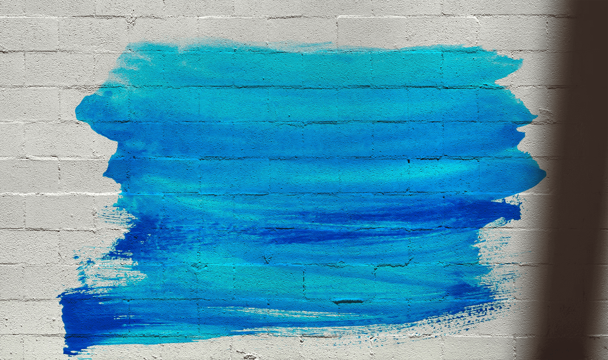

> DEMO: [CSS background-blend-mode](https://codepen.io/im1010ioio/pen/KKOzzmq)

---

## 三、用 Figma 模擬效果

如果覺得以上解說還是太抽象，很難想像會怎麼樣呈現結果，建議大家用繪圖軟體模擬看看，可以使用 Figma，因為 Figma 這套繪圖軟體是基於網頁技術製作的，而且裡面所有的混合模式都有。

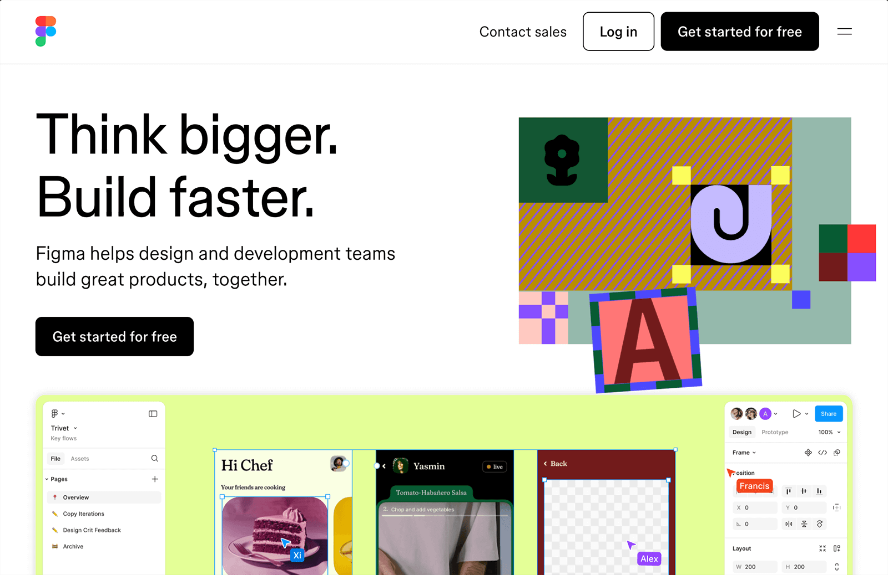

> 連結：[Figma: The Collaborative Interface Design Tool](https://www.figma.com/)

### 操作步驟

1. 進到 Figma 後新建一個「New design file」。
    
2. 隨意在畫面上建立一個白色背景的 Frame：
    
    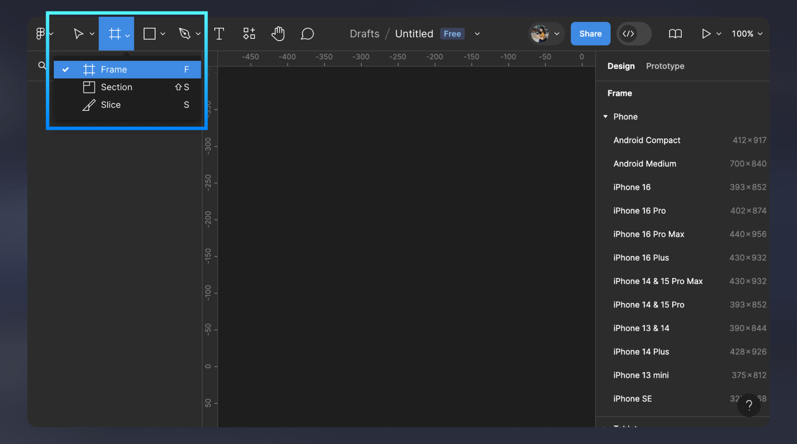
    
3. 把圖片拖曳進去相疊在一起，選取要改變混合模式的圖片，在右邊可以改變 Layer 的模式，就可以試試看各種不同混合模式的效果了：
    
    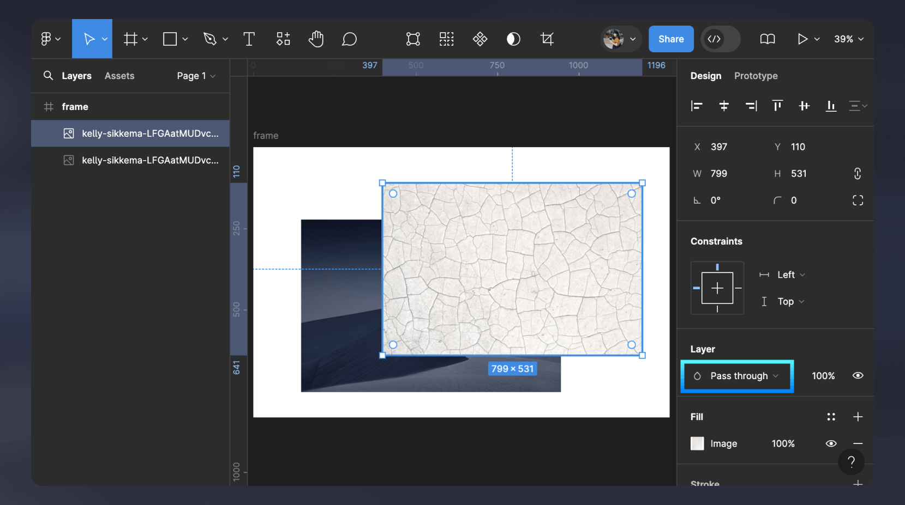
    
    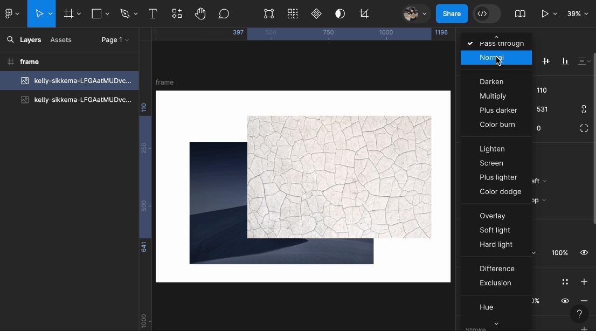
    

---

這些 CSS 屬性可以帶來許多創意上的可能性，讓網頁設計更加豐富和視覺化。如果你想更深入學習這些效果，可以逐步嘗試各種混合模式，並觀察它們在不同情境下的效果。

> 延伸閱讀：
> 
> * [Adobe Photoshop 中的混合模式](https://helpx.adobe.com/tw/photoshop/using/blending-modes.html)
>     
> * [動手玩 CSS Blend Mode - 根本 Photoshop 的圖層效果](https://www.casper.tw/css/2016/01/10/css-blend-mode/)
>     
> * [深入探索CSS属性mix-blend-mode：创意叠加效果的艺术之旅](https://blog.csdn.net/weixin_68127493/article/details/137744165)
>     
> * [CSSのブレンドモードが素敵！ mix-blend-modeを使いこなそう](https://ics.media/entry/7258/#%E6%9A%97%E3%81%84%E5%8A%B9%E6%9E%9C%E3%81%8C%E5%BE%97%E3%82%89%E3%82%8C%E3%82%8Bcss%E3%83%96%E3%83%AC%E3%83%B3%E3%83%89%E3%83%A2%E3%83%BC%E3%83%89)
>     

---

#### ↓↓↓↓↓↓↓↓↓↓↓↓↓↓↓↓↓↓↓↓

感謝看到最後的你，若你覺得獲益良多，請不要吝嗇給我按個喜歡。❤️

如果你喜歡我的創作，還想看看其他有趣的分享與日常，  
可以追蹤我的 IG [@im1010ioio](https://www.instagram.com/im1010ioio/)，或者是[🧋送杯珍奶鼓勵我](https://im1010ioio.bobaboba.me/)，謝謝你🥰。

