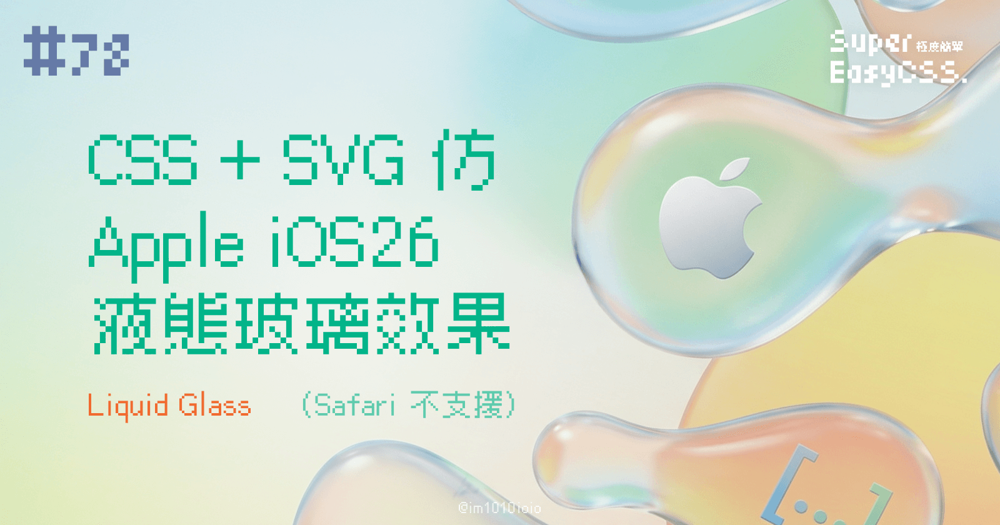
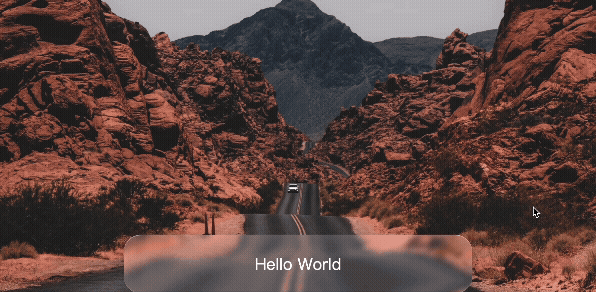

iOS 26 的液態玻璃（Liquid Glass）效果，今天我們來試試看網頁能不能做到。  
這個效果的核心概念是「模糊背景」再加上「不規則扭曲」，就像透過一杯正在晃動的水看東西一樣。



> DEMO 連結：[Liquid Glass Effect](https://codepen.io/im1010ioio/pen/wBMGxGX)

---

## 一、原理

用 SVG 濾鏡的位移地圖（`feDisplacementMap`）把「背景影像」扭曲，  
再搭配 `backdrop-filter: blur()` 做出像液態玻璃在流動的視覺。

傳統的毛玻璃效果，我們用 `backdrop-filter: blur(10px);` 就能輕鬆搞定。但那只是一個均勻的模糊，看起來很「平」。而「液態」效果的關鍵在於**不均勻的扭曲**。

光線穿過一塊完全平坦的毛玻璃，和穿過一塊表面凹凸不平、像水波一樣的玻璃，看到的景象肯定不同。後者會產生更多奇妙的折射和位移。我們的目標，就是用一張「凹凸不平的紋理圖」，來告訴瀏覽器如何去扭曲、置換背景的像素。

---

## 二、準備 HTML

首先，我們需要一個要套用效果的元素，以及一個隱藏的 SVG 濾鏡。

```html
<div class="liquid">Hello World</div>

<!-- 藏起來的 SVG 濾鏡，這是效果的靈魂 -->
<svg width="0" height="0" style="position:absolute;left:-9999px;top:-9999px">
  <defs>
    <filter id="liquid_glass_filter">
      <!-- 產生碎形雜訊 -->
      <feTurbulence type="fractalNoise" baseFrequency="0.003" numOctaves="2" seed="7" result="noise"/>
      <!-- 將雜訊模糊化，讓它更平滑 -->
      <feGaussianBlur in="noise" stdDeviation="1.2" result="map"/>
      <!-- 用模糊後的雜訊圖來扭曲我們的元素 -->
      <feDisplacementMap in="SourceGraphic" in2="map" scale="110" xChannelSelector="R" yChannelSelector="G"/>
    </filter>
  </defs>
</svg>
```

**重點解釋：**

* `<div class="liquid">`: 這是我們想變成液態玻璃的任何內容。
    
* `<svg>`: 這段 SVG 定義了一個名為 `liquid_glass_filter` 的濾鏡，它才是讓魔法發生的關鍵。
    
    * 它透過 `feTurbulence` 產生自然的雜訊，
        
    * 用 `feGaussianBlur` 使其平滑，
        
    * 最後透過 `feDisplacementMap` 將這個平滑的雜訊應用到我們的元素上，造成扭曲的效果。
        

---

## 三、CSS 樣式

接下來，就是用 CSS 把濾鏡和一些視覺效果加到 `.liquid` 元素上。

```css
.liquid {
    /* 真正的液態關鍵：先模糊背景，再套用 SVG 濾鏡扭曲 */
    backdrop-filter: blur(4px) url(#liquid_glass_filter);

    /* 用多層次的 box-shadow 營造玻璃的厚度與光暈 */
    box-shadow:
      inset 0 1px 0 rgba(255,255,255,0.45), /* 內上光暈 */
      inset 0 -1px 0 rgba(255,255,255,0.18), /* 內下陰影 */
      inset 6px 6px 16px rgba(255,255,255,0.12), /* 內側光暈 */
      0 10px 28px rgba(0,0,0,0.35); /* 外陰影 */
    
    /* 半透明的背景色 */
    background: rgba(255,255,255, 0.1);
}
```

**重點解釋：**

1. `backdrop-filter`: 這是最重要的屬性！我們先用 `blur(4px)` 對元素背後的內容進行模糊，再用 `url(#liquid_glass_filter)` 套上我們在 SVG 中定義好的扭曲濾鏡。
    
2. `box-shadow`: 這裡我們不用 `border`，而是改用多層次的 `inset`（內陰影）和一般陰影來模擬玻璃的邊緣厚度與光影反射，讓它看起來更立體。
    
3. `background`: 一個帶有透明度的背景色是必須的，這樣才能透出底下被模糊和扭曲的內容。
    

---

## 四、微調 SVG 濾鏡參數

另外，可以試著調整 SVG 濾鏡裡的參數：

* **更波動 (會變錘紋玻璃)**：  
    將 `<feTurbulence>` 的 `baseFrequency` 調高到 `0.025` 左右，或把 `<feDisplacementMap>` 的 `scale` 調到 `120` 以上。
    
* **更柔順**：  
    將 `<feGaussianBlur>` 的 `stdDeviation` 調高到 `1.6` ~ `2.2`。
    
* **減少垂直晃動**：  
    把 `<feDisplacementMap>` 的 `yChannelSelector="G"` 改成 `B`，因為藍色通道的雜訊通常比較弱，上下位移就會減緩。
    

---

透過 `backdrop-filter` 和強大的 SVG 濾鏡，也做到類似 iOS26 的液態玻璃效果。

不過目前還有一點缺陷，就是 iOS26 的液態玻璃效果，在中間的區塊是不會扭曲的（看看 DEMO 中的雙黃線就知道），但是如果要為了這個效果疊加多層不同的 HTML 元素又太冗。

另外，而且發現 Safari 無法運作，目前還沒有想到更好的解法，而且 Apple 官方也沒有在自家官網實作，就讓我們看看未來官方有沒有給網頁的解法吧！

如果有更好的辦法，我會更新在這裡。

> 延伸閱讀：
> 
> * [Liquid Glass Effect macOS (button background)](https://codepen.io/lucasromerodb/pen/vEOWpYM)
>     
> * [Liquid Glass](https://codepen.io/Mikhail-Bespalov/pen/MYwrMNy)
>     
> * [用CSS實現Apple的液態玻璃（Liquid Glass）UI](https://aoimonotw.blogspot.com/2025/06/liquid-glass-ui.html)
>     
> * [HTML + CSS 实现 Liquid Glass 液态玻璃效果](https://juejin.cn/post/7514618352829448244)
>     

---

#### ↓↓↓↓↓↓↓↓↓↓↓↓↓↓↓↓↓↓↓↓

感謝看到最後的你，若你覺得獲益良多，請不要吝嗇給我按個喜歡。❤️

如果你喜歡我的創作，還想看看其他有趣的分享與日常，  
可以追蹤我的 IG [@im1010ioio](https://www.instagram.com/im1010ioio/)，或者是[🧋送杯珍奶鼓勵我](https://im1010ioio.bobaboba.me/)，謝謝你🥰。

