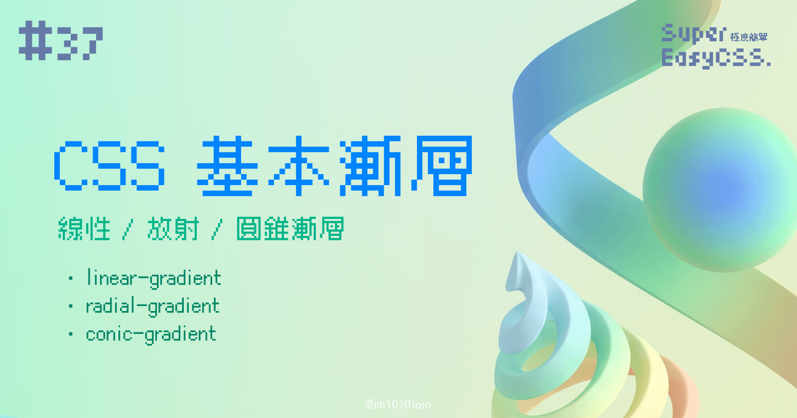

除了背景圖片，漸層色也是屬於 CSS 的背景一種，今天我們就來練習畫各種漂亮漸層吧！

單純用漸層色就能夠表現出許多漂亮的視覺效果，例如模仿大自然中天空的顏色等等。

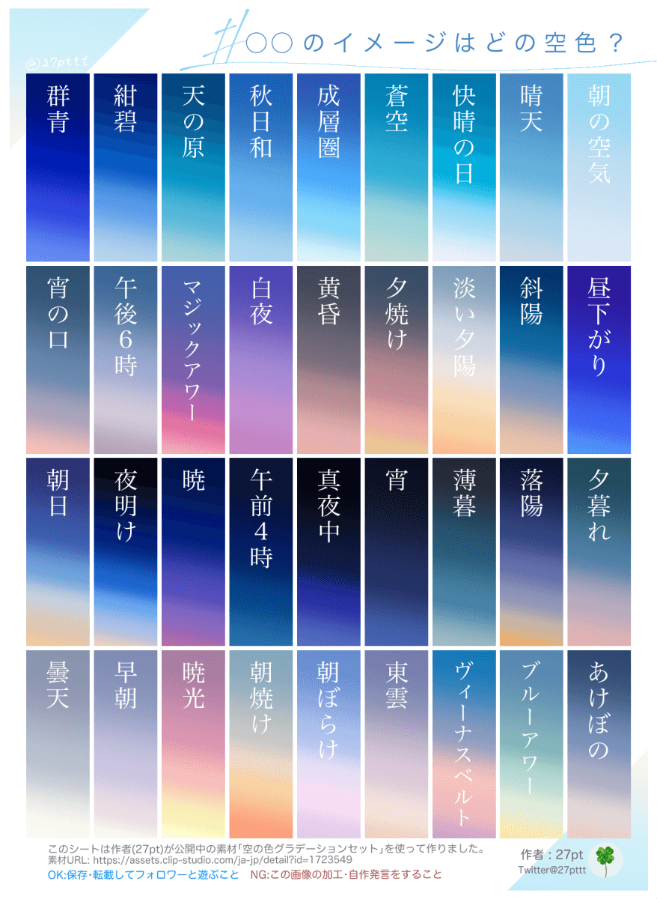

> 來源：[27pt(クリスタ素材) / X](https://x.com/27pttt/status/1604363572426915840)

---

> #### **↓ 今日學習重點 ↓**
> 
> * 學會使用線性/放射/圓錐漸層
>     
> * 了解如何設定漸層的色彩空間
>     

---

而在 CSS 中，漸層分為三種，分別是：線性、放射與圓錐漸層：


> 其實我們之前在特效文字的時候已經有偷偷用過了一些了，只不過沒有深入探討。
> 
> 延伸閱讀：[#29 CSS 立體字、霓虹字、外框字、漸層字：text-shadow、-webkit-text-stroke、-webkit-background-clip](https://im1010ioio.hashnode.dev/css-text-effect)

---

## 一、線性漸層 (`linear-gradient`)

線性漸層，是由一種色彩到另一種色彩「單一直線方向」的平滑過渡漸層。

### 基本語法

以下是一個基本線性漸層的例子：

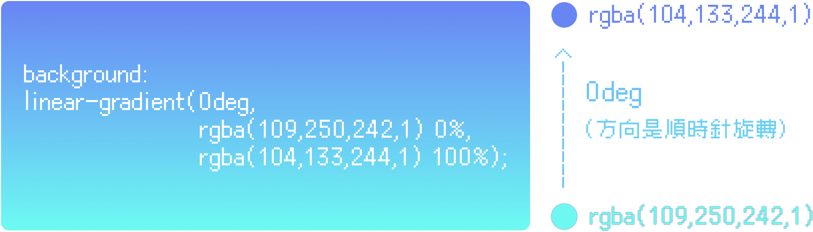

```css
.linear-gradient{
    background:
        linear-gradient(漸層方向的角度,
                        顏色1 顏色1的位置,
                        顏色2 顏色2的位置);
}
```

### 漸層方向的角度 `angle`

我們要設定漸層方向的角度，隨著角度增大，漸層方向將會順時針旋轉。

在 CSS 中要設定角度，常用會使用以下幾種方式設定：

* `deg` （度）  
    是角度度數，從 `0deg` 到 `360deg` 。
    
* `turn` （圈）
    
    是圈數的單位。一個完整的圓就是 `1turn`，例如：`0turn`、`0.25turn`。
    

### 顏色

顏色設定的方式可以參考前幾篇：

> [#31 CSS 顏色設定：基本的 hex、rgb()、cmyk()、hsl()、hsb() 、hwb() 與明日之星的 lch()、oklch()](https://im1010ioio.hashnode.dev/css-colors-hex-rgb-hsl-lch-oklch)

### 顏色的位置

顏色的位置是使用百分比表示。  
不過，也可以不寫顏色的位置，不寫的話顏色就會平均分配。

### 小技巧：漸層 + 變數

而漸層的顏色與位置，我們還可以進一步使用 CSS 變數控制，這樣就會比較容易管理 code，之後要維護就不用從落落長的語法中找到該顏色的數值：

```css
:root{
    --color1: rgba(109,250,242,1);
    --color1-position: 0%;
    --color2: rgba(104,133,244,1);
    --color2-position: 100%;
}

.linear-gradient{
    background:
        linear-gradient(0deg, var(--color1) var(--color1-position),
                        var(--color2) var(--color2-position));
}
```

> DEMO: [CSS Linear Gradient](https://codepen.io/im1010ioio/pen/KKjLGdg)

---

## 二、放射漸層 (`radial-gradient`)

放射漸層，是由內而外的平滑過渡漸層，可以設定：漸層形狀、漸層結束形狀的大小還有中心點位置，用說的有點抽象，我們往下看圖解會比較清楚。

### 基本語法

以下是一個基本放射漸層的例子：

```css
.conic-gradient {
    background:
        radial-gradient(漸層形狀 漸層結束形狀的大小 at 中心點位置,
                        顏色1 顏色1的位置,
                        顏色2 顏色2的位置);
}
```

### 漸層形狀 `ending-shape`

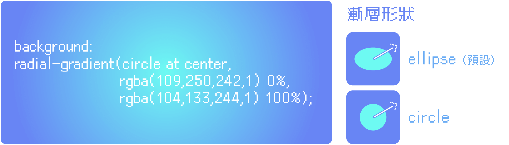

### 漸層結束形狀的大小 `size`

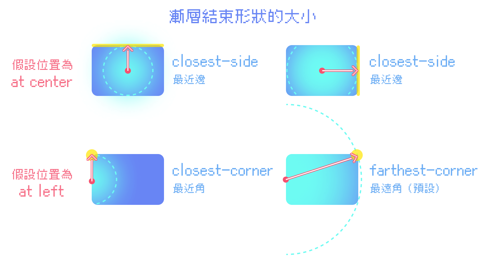

> * ***closest-side***：最近邊
>     
> * ***farthest-side***：最遠邊
>     
> * ***closest-corner***：最近角
>     
> * ***farthest-corner***：最遠角 ( 預設值 )
>     

### 中心點位置 `position`

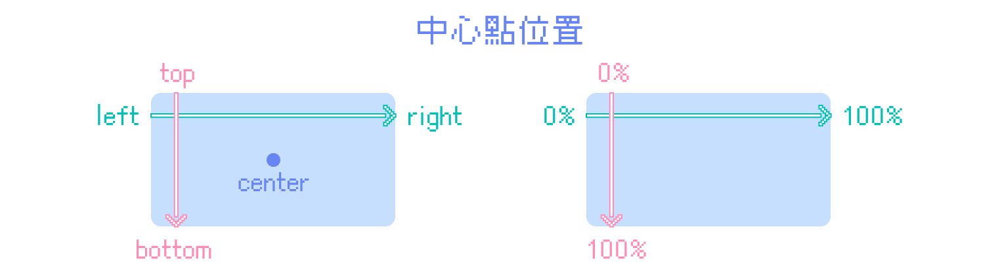

中心點位置的寫法是：

* 直接寫 `at` 然後加上「上下左右」（`top`、`bottom`、`left`、`right`），使用空格隔開。
    
* 或者是，使用百分比表示位置：順序為先左右、後上下；由左至右、由上至下是 `0%` - `100%`。
    
* 兩種方式也可以混用，比方說：`left 25%`。
    
* 也可以不寫顏色的位置，不寫的話顏色就會平均分配位置。
    

### 顏色的位置

和線性漸層一樣，顏色的位置是使用百分比表示。  
不寫顏色的位置的話，顏色就會平均分配。

---

## 三、圓錐漸層 (`conic-gradient`)

圓錐漸層，看起來像是一個圓錐形狀的漸層，雖然與放射漸層有點類似，都是由內而外，但是圓椎漸層必定會有一個開始的邊，且有一個明顯的中心點位置，要設定起始角度。

### 基本語法

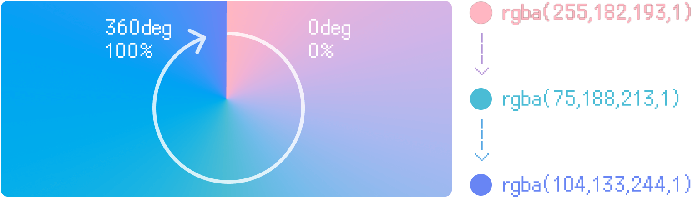

以下是一個基本圓錐漸層的例子：

```css
.conic-gradient {
    background: conic-gradient(from 起始角度 at 中心點位置,
                               顏色1 顏色1角度,
                               顏色2 顏色2角度);
}
```

> DEMO: [CSS Conic Gradient](https://codepen.io/im1010ioio/pen/NWZVOOd)

### 起始角度 `angle`

設定漸層開始的角度，設定方式和線性漸層的漸層方向角度一樣。

### 顏色的角度 `angle`

每個顏色的角度是相對於起始角度的，也可以不寫顏色的角度，不寫的話顏色就會平均分配角度位置。

### 中心點位置 `position`

中心點位置的設定方式與剛剛的放射漸層一樣。

---

## 四、用色彩空間 LCH/OKLCH，修復漸層的灰色死亡地帶

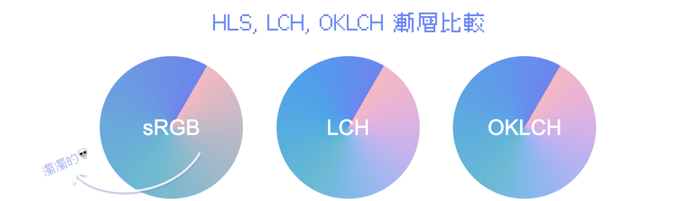

如果是使用 RGB 色彩，而且顏色跨度太大，會有漸層的死亡灰色地帶，這時候我們可以試著改變色彩空間，換一種顏色的計算方式。

### 色彩空間

只要在顏色前面的逗號前加上 `in 色彩空間` 就可以了，色彩空間調整為 `lch` 或 `oklch`，就能夠修復漸層的灰色死亡地帶。更詳細的解說，可以參考之前寫關於 CSS 色彩的文章：

> 延伸閱讀：[#31 CSS 顏色設定：基本的 hex、rgb()、cmyk()、hsl()、hsb() 、hwb() 與明日之星的 lch()、oklch()](https://im1010ioio.hashnode.dev/css-colors-hex-rgb-hsl-lch-oklch#heading-lchoklch)

### 語法

```css
div {
    background: conic-gradient(from 起始角度 at 中心點位置 in 色彩空間, 顏色1 顏色1角度, 顏色2 顏色2角度);
}
```

> DEMO:  
> [Color Space in Linear Gradient: sRGB vs. LCH vs. OKLCH](https://codepen.io/im1010ioio/pen/gOJvZoj)

### 透過 Figma 套件使用 LCH 色彩空間

如果要製作網頁設計稿，但是目前 Figma 不支援 LCH/OKLCH 的顏色設定方式，這時候我們可以透過這個套件—— [Chromatic Figma](https://www.figma.com/community/plugin/759433498184507623) ，修正漸層顏色，它可以模擬 LCH 色彩空間運算，並且調整漸層的顏色。

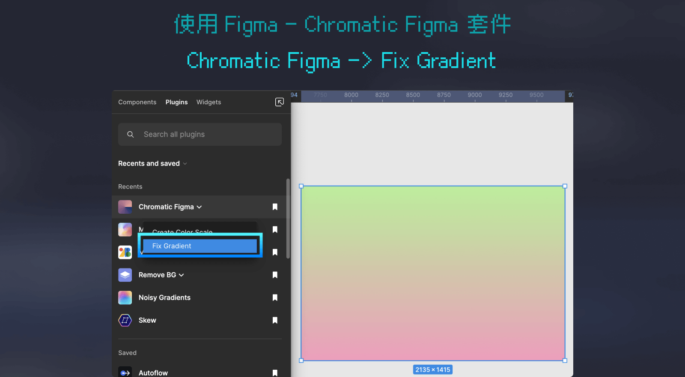

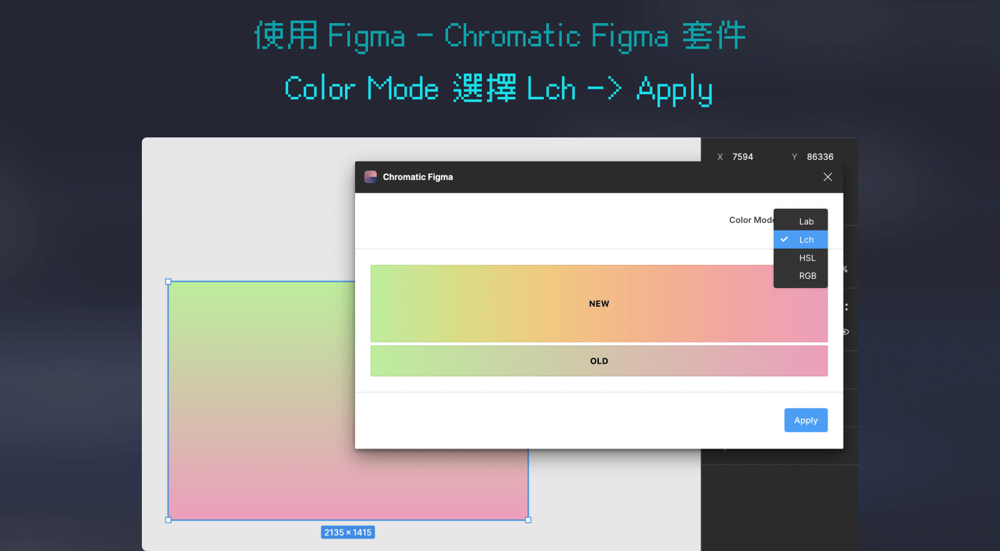

---

## 五、漸層繪製小工具

如果覺得自己寫漸層，很難想像，網路上其實有很多漸層小工具可以使用，以下推薦兩個：

### 1\. CSS Gradient

> 連結：[CSS Gradient — Generator, Maker, and Background](https://cssgradient.io/)

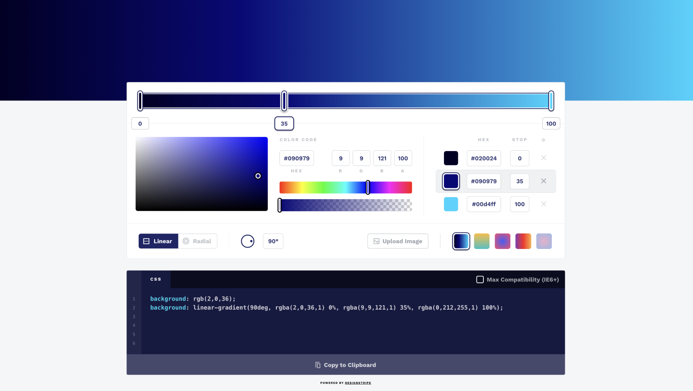

這是我很常使用的漸層工具之一，操作介面很直覺，而且還有所見即所得，就像在操作繪圖軟體的漸層調整一樣。

### 2\. CSS HD Gradients

> 連結：[CSS HD Gradients](https://gradient.style/#type=linear&space=oklab&linear_named_angle=to+right&linear_angle=90&stops=%7B%22kind%22%3A%22stop%22%2C%22color%22%3A%22oklch%2870%25+0.5+340%29%22%2C%22auto%22%3A%220%22%2C%22position1%22%3A%220%22%2C%22position2%22%3A%220%22%7D&stops=%7B%22kind%22%3A%22hint%22%2C%22auto%22%3A%2250%22%2C%22percentage%22%3A%2250%22%7D&stops=%7B%22kind%22%3A%22stop%22%2C%22color%22%3A%22oklch%2890%25+0.5+200%29%22%2C%22auto%22%3A%22100%22%2C%22position1%22%3A%22100%22%2C%22position2%22%3A%22100%22%7D)

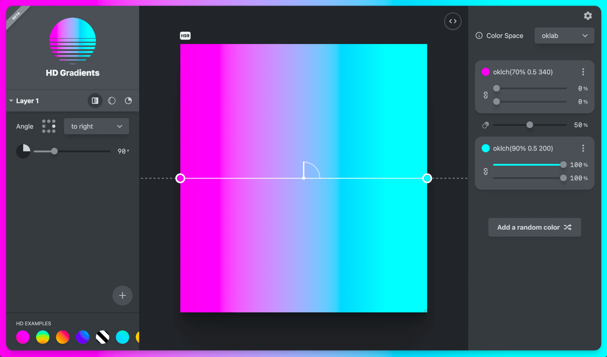

這是另一個最近我發現的小工具，這個小工具還增加了色彩空間可以設定。

---

## 六、參考資料

* [深入理解 CSS 漸層 ( CSS Gradient ) -](https://www.oxxostudio.tw/articles/202008/css-gradient.html)[OXXO.STUDIO](http://OXXO.STUDIO)
    
* [radial-gradient()的前世今生-CSDN博客](https://www.oxxostudio.tw/articles/202008/css-gradient.html)
    

---

#### ↓↓↓↓↓↓↓↓↓↓↓↓↓↓↓↓↓↓↓↓

感謝看到最後的你，若你覺得獲益良多，請不要吝嗇給我按個喜歡。❤️

如果你喜歡我的創作，還想看看其他有趣的分享與日常，  
可以追蹤我的 IG [@im1010ioio](https://www.instagram.com/im1010ioio/)，或者是[🧋送杯珍奶鼓勵我](https://im1010ioio.bobaboba.me/)，謝謝你🥰。

