除了單純的漸層色外，漸層還能夠延伸畫出其他的圖案：如條紋、格子、點點、棋盤格背景等等，很神奇吧！這些特殊背景是我從一本 CSS 好書「CSS Secrets」中學到的，這本書裡面還有很多神奇 CSS 小知識，大家可以去借來看看。

> 延伸閱讀：[csssecrets](http://play.csssecrets.io/)

不過因為書是 2016 年出的，有些語法當初不支援，但現在已支援了，本篇文章以現在的為主，省去了一些過去的作法。

在看本篇文章前，你要先會運用基本的漸層色與了解多重背景，詳細可以看本系列前兩篇文章：

> * [#37 CSS 基本漸層：線性/放射/圓錐漸層 (CSS linear-gradient, radial-gradient, conic-gradient)](https://im1010ioio.hashnode.dev/css-gradient)
>     
> * [#38 CSS background 組合技：多重背景、背景位置、簡易視差滾動 (iOS 不支援)](https://im1010ioio.hashnode.dev/multiple-backgrounds)
>     

---

> #### **↓ 今日學習重點 ↓**
> 
> * 學會繪製各種條紋、格子背景
>     
> * 學會繪製各種點點背景
>     
> * 學會繪製各種棋盤格背景
>     

---

## 一、條紋背景

要製作條紋背景很簡單，原理是使用線性漸層，當兩個顏色的位置重疊，就能製造出顏色的斷點。

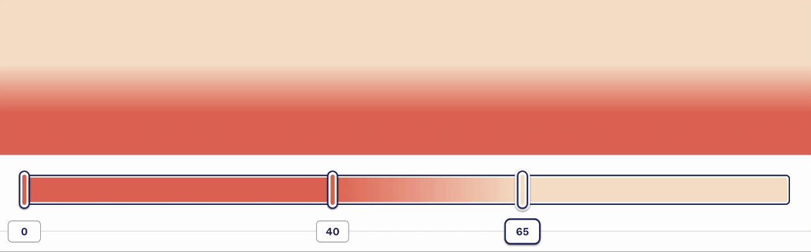

接著，再使用 `background-size` 設定條紋的尺寸，最後利用 CSS 背景預設會重複（`background-repeat: repeat`）的條件，就能夠製造出不同重複的條紋背景了。

### 1\. 水平條紋

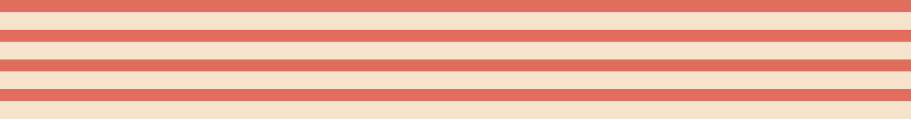

用這樣的想法，製作出的條紋背景的 CSS code 會是：

```css
div {
    background: linear-gradient(
                    #e16e5c 0%,
                    #e16e5c 40%,
                    #f6e3cd 40%);
    background-size: 100% 50px;
}
```

但是其實有更簡潔的做法。這裡有一個重點：

> 若一個顏色的位置小於在它前面的任何顏色的位置，那它的位置就會被設定為在它前面任何顏色停止點的最大位置。

這表示假如我們把第二個顏色的位置設為 0，瀏覽器會把它的位置調整成前面顏色停止點的位置，因此，我們的 CSS code 就會更簡潔、更 DRY：

```css
div{
    background: linear-gradient(
                    #e16e5c 40%,
                    #f6e3cd 0);
    background-size: 100% 50px;
}
```

建立兩個以上的顏色也是一樣的道理。

> 另外，漸層中同個顏色開始、結束的位置（又叫作停止點），現在已支援可以寫在一起，如下面的 `#edb71e 0 66.66%`，不用再像以前要重複寫第二次。後面的示範全都使用這樣的寫法。
> 
> 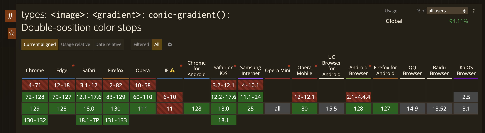

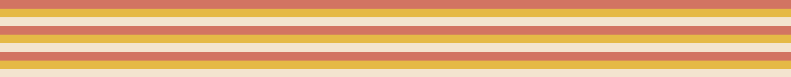

```css
div {
    background: linear-gradient(
                    #e16e5c 33.33%,
                    #edb71e 0 66.66%,
                    #f6e3cd 0);
    background-size: 100% 30px;
}
```

> DEMO: [CSS horizontal stripes background](https://codepen.io/im1010ioio/pen/JjQgNav)

### 2\. 垂直條紋

如果想要製作垂直的條紋，也很簡單。只需要多設定一個漸層方向 `90deg` 或 `to right`，接著把 `background-size` 的值相反設定就可以了。

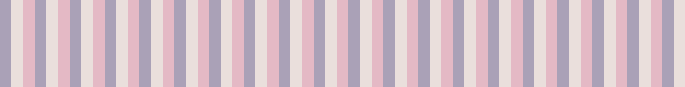

```css
div {
    background: linear-gradient(
                    90deg,
                    #a9a1b7 33.33%,
                    #eadfdb 0 66.66%,
                    #e4b9c5 0);
    background-size: 50px 100%;
}
```

> DEMO: [CSS vertical stripes background](https://codepen.io/im1010ioio/pen/PorMjmN)

### 3\. 斜線條紋

如果想要製作斜線條紋，以我們以剛剛的方式，直接改變角度的話，會悲劇：

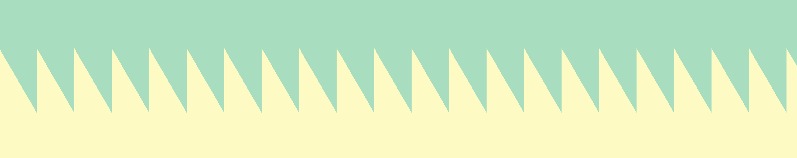

因為我們需要考慮 `background-size` 與角度之間的關係等等的計算。

但是，現在我們有更簡單的做法，就是運用「重複線性漸層 `repeating-linear-gradient` 」這個方法，它重複的是線性漸層的**整個週期**，形成無限的條紋或漸變效果。

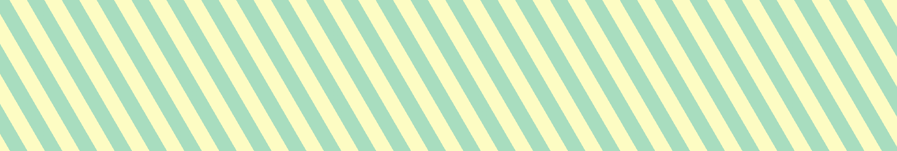

```css
div {
    background: repeating-linear-gradient(
                    60deg, 
                    #fdfbc3 0 15px,
                    #a8ddbf 0 30px);
}
```

> DEMO: [CSS diagonal stripes background](https://codepen.io/im1010ioio/pen/LYKwLQw)

### 4\. 不規則寬度的條紋

有一個原則叫作「蟬原則（Cicada Principle）」，是由 Alex Walker 所提出，是一種讓事物的重複出現符合「自然隨機性」的規則，他提出可以利用「互質」或「質數」創造隨機性。

所以我們可以試試看運用在漸層背景上：

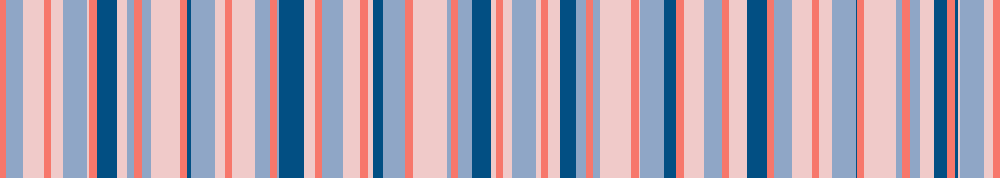

```css
div {
    background-color: #F0CAC9;
    background-image: 
        linear-gradient(90deg, #F7776A 7px, transparent 0),
        linear-gradient(90deg, #8FA6C6 23px, transparent 0),
        linear-gradient(90deg, #034F83 23px, transparent 0);
    background-size: 43px 100%, 61px 100%, 89px 100%;
}
```

> DEMO: [CSS irregular stripes background (Cicada Principle)](https://codepen.io/im1010ioio/pen/KKjOXWd)

以上面的例子，運用了多重背景，重疊了很多一個顏色+一個透明的條紋，數值都使用質數。畫面寬度至少要到 233,447px（ `background-size` 43px × 61px × 89px），才會出現重複。

這個方法其實不只運用在背景，也可以用在其他圖形上，有興趣的人可以進一步研究看看：

> 延伸閱讀：  
> [“蟬原則”與CSS3隨機多背景隨機圓角等效果 « 張鑫旭-鑫空間-鑫生活](https://www.zhangxinxu.com/wordpress/2017/02/%e8%9d%89%e5%8e%9f%e5%88%99-background-border-radius/)  
> [蟬原則（Cicada Principle） | LaySent's Site](https://laysent.com/blog/post/cicada-principle/)

---

## 二、格子背景

如果想要製作格子背景，其實很簡單，我們只要運用剛剛學到的水平條紋與垂直條紋，然後使用多重背景，就能做出來了！

下面的例子，我們將條紋顏色改成半透明，就能做出交錯且有顏色變化的格子，做出了一個格格 Blue。

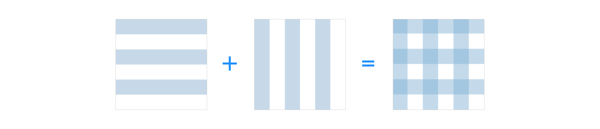

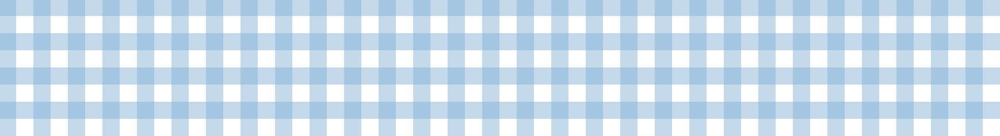

```css
div {
    background:
        linear-gradient(rgba(134,181,214, .5) 50%, transparent 0),
        linear-gradient(90deg, rgba(134,181,214, .5) 50%, transparent 0);
    background-size: 100% 30px, 30px 100%;
}
```

> DEMO: [CSS plaid staggered background](https://codepen.io/im1010ioio/pen/gONVXab)

我們也可以把格子的線條改成很細，然後再多重疊一層較粗較大的格子，疊出不同的效果。

「我看倒有點像是稿紙。」  
（還有人知道雅量梗嗎？😂）

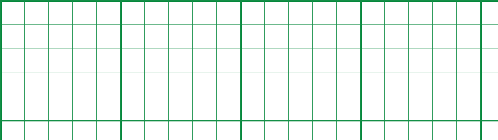

```css
div {
    background:
        linear-gradient(#128f48 1px, transparent 0),
        linear-gradient(90deg, #128f48 1px, transparent 0),
        linear-gradient(#128f48 3px, transparent 0),
        linear-gradient(90deg, #128f48 3px, transparent 0);
    background-size: 100% 40px, 40px 100%, 100% 200px, 200px 100%;
}
```

> DEMO: [CSS plaid background](https://codepen.io/im1010ioio/pen/LYKwOyv)

---

## 三、點點背景

如果想要製作出點點背景，我們用 CSS 的放射漸層 (radial-gradient) 就能輕易做到。

#### 點點背景

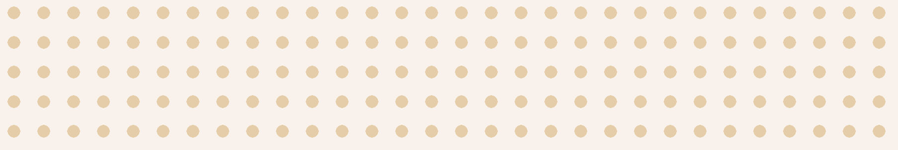

```css
div {
    background-color: #f9f2ec;
    background-image: radial-gradient(#E6CDA9 30%, transparent 0);
    background-size: 30px 30px;
}
```

> DEMO: [CSS polka background](https://codepen.io/im1010ioio/pen/poXMdZL)

#### 從圓心開始的點點背景

但是，如果我們希望位置偏移一點，邊緣從圓形的中心開始，就需要使用多重背景去拼貼，然後用 `background-position` 調整偏移的位置。

> `background-position` 的位置會是 `background-size` 的 1/2。

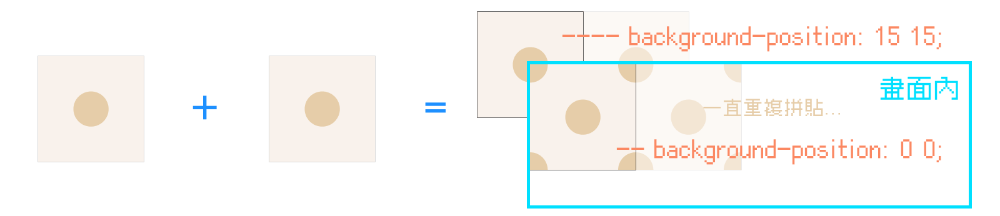

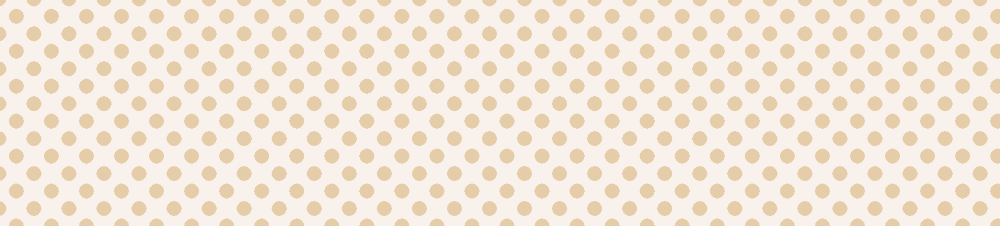

```css
div {
    background-color: #f9f2ec;
    background-image:
        radial-gradient(#E6CDA9 30%, transparent 0),
        radial-gradient(#E6CDA9 30%, transparent 0);
    background-size: 30px 30px;
    background-position: 0 0, 15px 15px;
}
```

> DEMO: [CSS polka background (position offset)](https://codepen.io/im1010ioio/pen/OJeKOKj)

只不過這樣會變得有點難維護，很多同樣的數值重複出現，改個顏色或大小要改很多地方，如果你會使用 Sass(SCSS) / Less，可以考慮將它抽成 Mixin。

#### 多種顏色點點背景

當然我們也可以用同樣的方法，製作多種顏色的點點背景。

> 假如我想要分成三種顏色，`background-position` 的位置會是 `background-size` 的 1/3。

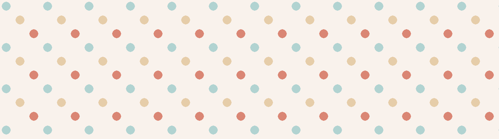

```css
div {
    background-color: #f9f2ec;
    background-image:
        radial-gradient(#E6CDA9 15%, transparent 0),
        radial-gradient(#DA8674 15%, transparent 0),
        radial-gradient(#B1D3D1 15%, transparent 0);
    background-size: 60px 60px;
    background-position: 0 0, 20px 20px, 40px 40px;
}
```

> DEMO: [CSS colorful polka background](https://codepen.io/im1010ioio/pen/eYwqyda)

---

## 四、棋盤格子背景

如果想要繪製棋盤格子背景，我們可以使用「圓錐漸層 (conic-gradient) 的重複版 —— `repeating-conic-gradient`」，原理是用圓錐漸層繪製出一個四分之一的色塊後，然後不停地重複它。

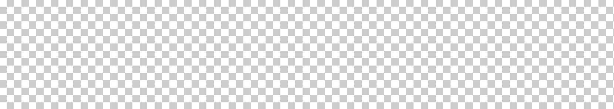

```css
div {
    background-color: #f9f2ec;
    background-image: repeating-conic-gradient(
                          #ccc 0 25%,
                          #fff 0 50%);
    background-size: 20px 20px;
}
```

> DEMO: [CSS checkerboard background](https://codepen.io/im1010ioio/pen/wvLVmqo)

（不過，如果是設計師的話，可能會認為這些格子是透明的 XD）

---

## 五、幾何背景繪製小工具

CSS 漸層可以繪製這麼多圖案，當然會有更進階的變化，而網路上有些人也分享了許多自己繪製的圖案，並且將其做成了小工具。

### 1\. CSS Pattern

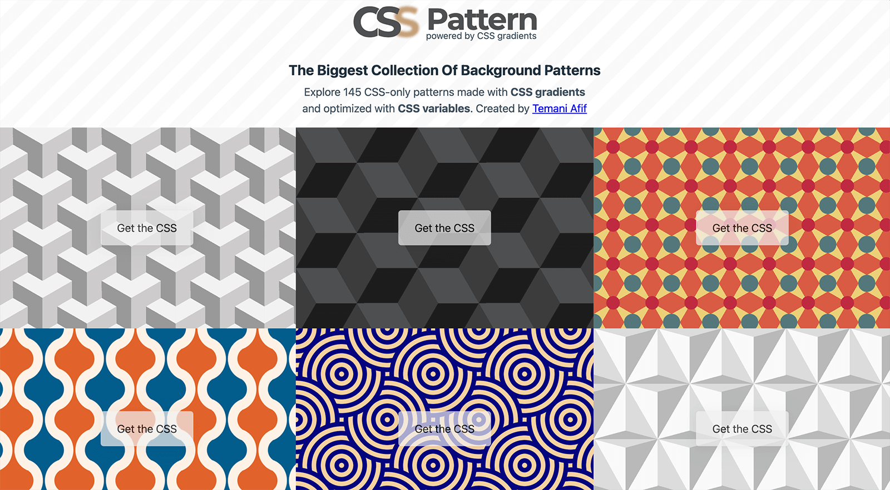

> 連結：[CSS Pattern: Fancy backgrounds with CSS gradients](https://css-pattern.com/)

### 2\. CSS Background Patterns

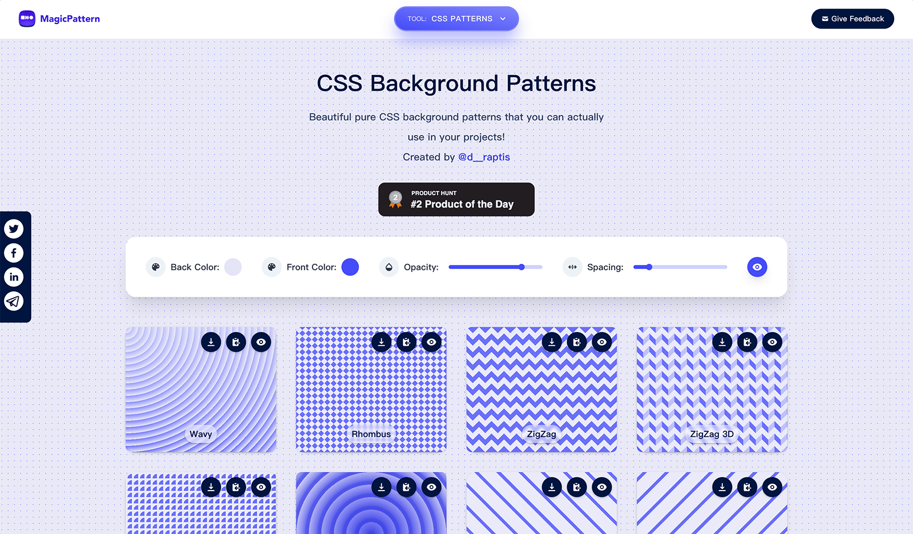

> 連結：[CSS Background Patterns by MagicPattern](https://www.magicpattern.design/tools/css-backgrounds)

### 3\. Bennett Feely Gradients

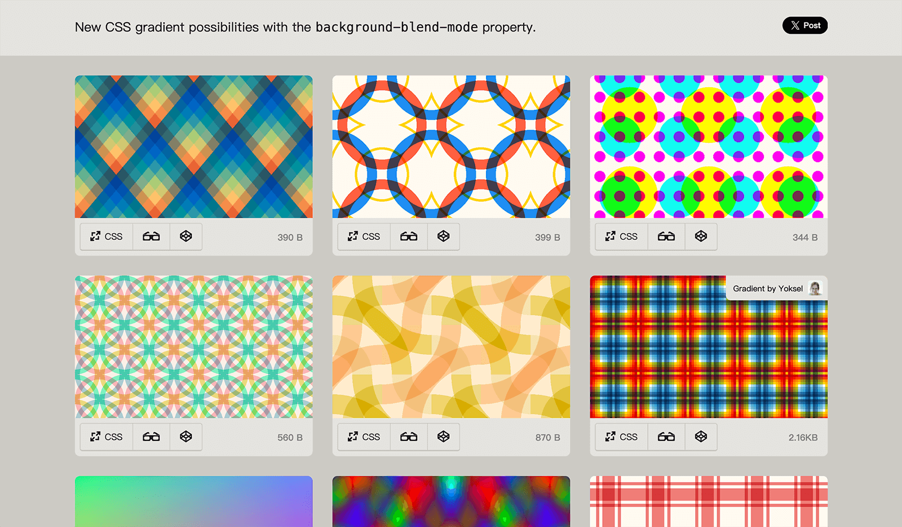

> 連結：[CSS Gradients with background-blend-mode](https://bennettfeely.com/gradients/)

這個網站特別的是運用了 `background-blend-mode` 顏色的混合模式，讓顏色呈現出因重疊而展生的效果，這是屬於特效的部分，我們之後還會提到。

---

#### ↓↓↓↓↓↓↓↓↓↓↓↓↓↓↓↓↓↓↓↓

感謝看到最後的你，若你覺得獲益良多，請不要吝嗇給我按個喜歡。❤️

如果你喜歡我的創作，還想看看其他有趣的分享與日常，  
可以追蹤我的 IG [@im1010ioio](https://www.instagram.com/im1010ioio/)，或者是[🧋送杯珍奶鼓勵我](https://im1010ioio.bobaboba.me/)，謝謝你🥰。

