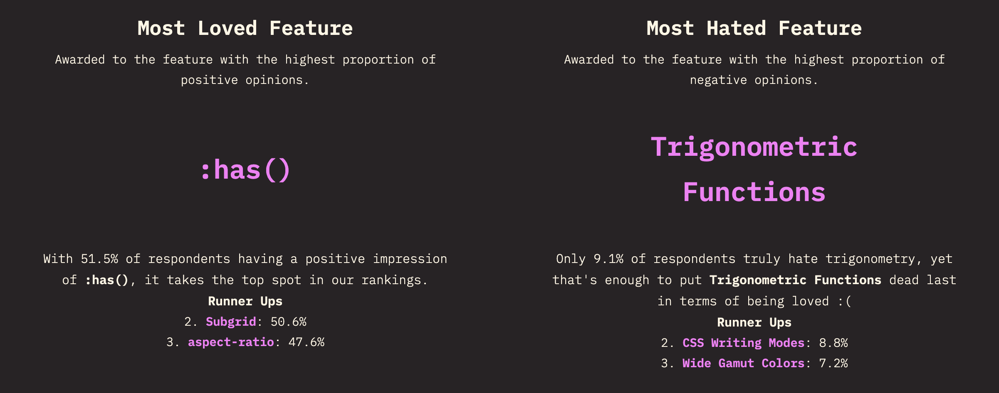

今天我們要來研究一個 CSS 中相對較新、但功能強大的工具：三角函數。

沒錯，就是那些年我們在數學課上又愛又恨的 sin、cos、tan！現在，它們已經可以用 CSS 寫了，而且很早就全面支援了（詳細請看 [Can I Use](https://caniuse.com/mdn-css_types_sin)）。

我們可以不需依賴 JS，就能輕鬆做出更複雜、更動態的網頁效果。

CSS 中的三角函數家族，共有：`sin()`、`cos()`、`tan()` 以及他們的相反函數 `asin()`、`acos()`、`atan()` 和 `atan2()`。

---

## **一、核心三角函數：**`sin()`**,** `cos()`**,** `tan()`

首先，我們來複習一下這三位最核心的成員：

* `sin()`: 回傳一個角度的正弦值，範圍介於 -1 到 1 之間。
    
* `cos()`: 回傳一個角度的餘弦值，同樣介於 -1 到 1 之間。
    
* `tan()`: 回傳一個角度的正切值，範圍則介於負無限大到正無限大之間。
    

在 CSS 中使用它們時，可以直接傳入角度（deg）或弧度（rad）作為參數，非常方便。

---

## **二、反三角函數：**`asin()`**,** `acos()`**,** `atan()`**,** `atan2()`

除了基本的三個函數，CSS 也提供了它們的反函數：

* `asin(x)`: 計算一個數值的反正弦值，回傳一個介於 -90deg 到 90deg 之間的角度。
    
* `acos(x)`: 計算一個數值的反餘弦值，回傳一個介於 0deg 到 180deg 之間的角度。
    
* `atan(x)`: 計算一個數值的反正切值，回傳一個介於 -90deg 到 90deg 之間的角度。
    
* `atan2(y, x)`: 這位比較特別，它接受兩個參數（y 和 x 座標），並回傳原點到該座標點的方位角，範圍在 -180deg 到 180deg 之間。 這在需要根據兩個點的位置來計算角度時非常有用。
    

---

## 三、DEMO

讓我們直接來看幾個三角函數實用的範例吧！

### **1\. DEMO 1：讓東西依據圓形排列**

這是三角函數最經典的應用之一，像是時鐘的刻度或環狀菜單，都可以輕鬆實現。 概念是利用 `sin()` 和 `cos()` 來計算出在圓周上每個元素的 x 和 y 座標。


> DEMO 連結：[Rrond Animation by CSS trigonometric functions](https://codepen.io/im1010ioio/pen/EaPgwNL)

**HTML:**

```html
<div class="circle-container">
    <div class="item"></div>
    <div class="item"></div>
    <div class="item"></div>
    <div class="item"></div>
    <div class="item"></div>
    <div class="item"></div>
</div>
```

**CSS:**

```css
@property --base-angle {
    syntax: "<angle>";
    inherits: true;
    initial-value: 0deg;
}

@keyframes rotate-circle {
    to { --base-angle: 360deg; }
}

.circle-container {
    position: relative;
    width: 200px;
    height: 200px;
    border-radius: 50%;
    border: 10px solid #eee;
    animation: rotate-circle 10s linear infinite;
}

.item {
    position: absolute;
    top: 50%;
    left: 50%;
    width: 30px;
    height: 30px;
    background-color: #98D6DF;
    border-radius: 50%;
}

.item:nth-child(1) { --item-angle: 0deg; }
.item:nth-child(2) { --item-angle: 60deg; }
.item:nth-child(3) { --item-angle: 120deg; }
.item:nth-child(4) { --item-angle: 180deg; }
.item:nth-child(5) { --item-angle: 240deg; }
.item:nth-child(6) { --item-angle: 300deg; }

.item {
    --total-angle: calc(var(--item-angle) + var(--base-angle));

    /*
    先用第一個 translate() 根據三角函數計算圓周上的位置，
    再用第二個 translate(-50%, -50%) 將元素自身向左、向上移動
    自身寬高的一半，達到完美的中心點定位。 */
    transform:
        translate(
            calc(cos(var(--total-angle)) * 100px),
            calc(sin(var(--total-angle)) * 100px))
        translate(-50%, -50%);
}
```

### **2\. DEMO 2：實現優雅的波浪動畫**

`sin()` 函數的波形特性，非常適合用來製作自然的波浪動態。


> DEMO 連結：[Wave Animation by CSS trigonometric functions](https://codepen.io/im1010ioio/pen/ogbzapV)

**HTML:**

```html
<div class="wave-container">
    <div class="wave-dot"></div>
    <div class="wave-dot"></div>
    <!-- ...可以複製更多 wave-dot -->
</div>
```

**CSS:**

```css
@property --angle {
    syntax: "<angle>";
    inherits: false;
    initial-value: 0deg;
}

@keyframes wave-flow {
    to { --angle: 360deg; }
}

.wave-container {
    display: flex;
}

.wave-dot {
    width: 10px;
    height: 10px;
    background-color: #2ecc71;
    border-radius: 50%;
    animation: wave-flow 2s linear infinite;
}

/* 透過 animation-delay 讓每個點產生相位差 */
.wave-dot:nth-child(2) { animation-delay: -0.1s; }
.wave-dot:nth-child(3) { animation-delay: -0.2s; }
.wave-dot:nth-child(4) { animation-delay: -0.3s; }
.wave-dot:nth-child(5) { animation-delay: -0.4s; }
.wave-dot:nth-child(6) { animation-delay: -0.5s; }
/* ...依此類推 */

.wave-dot {
    transform: translateY(calc(sin(var(--angle)) * 20px));
}
```

---

## 四、我早就忘記怎麼算三角函數了，怎麼辦？

「我知道有個酷東西，但我早就把數學還給老師了，怎麼辦？」別擔心！我也是…

現在有 AI 的時代，其實不需要自己從頭開始複習數學。  
關鍵是「**知道何時該用**」、「**如何描述你的問題讓 AI 幫你**」還有「**知道自己在 Vibe Coding 什麼**」。

### 1\. 第一步：忘掉公式，記住「圖案——圓/弧、波、角」

不需要記得 `sin` 是「對邊/斜邊」。你只需要記住，當你看到或想要做出以下幾種視覺圖案時，腦中就要亮起一個小燈泡：「啊！這可能可以用三角函數 CSS！」

當你今天要做的圖形是「**圓**/**弧**、**波**、**角**」，就可以想到三角函數：

1. **圓形 & 弧形排列**：
    
    * **情境**：你想把一堆頭像、圖標或按鈕排成一個完美的圓圈或半圓弧形。例如：環形菜單、時鐘的刻度、儀表板的指針軌跡。
        
    * **為什麼會更省事？**  
        如果不用三角函數，你得手動一個一個去計算每個元素的 `top` 和 `left` 絕對座標。只要數量一多，或圓圈大小一改，你就得全部重算，簡直是惡夢！用三角函數，你只需要改個變數（例如總數量、半徑），所有元素的位置就會自動算好，非常有彈性。
        
2. **自然的波浪起伏**：
    
    * **情境**：你想做出像水波、聲波或旗幟飄揚那樣，有規律又平滑的上下擺動效果。例如：載入動畫、背景動態效果。
        
    * **為什麼會更省事？**  
        `sin()` 函數的圖形本身就是一條完美的波浪線。用它來做動畫，效果會比你自己用 `@keyframes` 手動設定好幾個 `transform: translateY()` 的中間點要來得流暢、自然得多。
        
3. **指向特定目標的角度**：
    
    * **情境**：你想讓一個元素（例如一個箭頭、一個角色的眼睛）永遠「朝向」另一個點（例如滑鼠游標、畫面中心）。
        
    * **為什麼會更省事？**  
        `atan2()` 這個函數天生就是做這件事的專家。它能根據兩個點的 X 和 Y 座標，直接算出正確的旋轉角度。如果靠自己用 JS 算，程式碼會複雜很多，而 CSS 現在可以直接搞定。
        

當你的設計需求脫離了單純的「水平、垂直、方塊」，進入了「曲線、旋轉、角度」的領域時，就是三角函數大顯身手的時候。

### 2\. 第二步：「詠唱」向 AI 下指令

既然知道何時該用，下一步就是如何請 AI 幫你寫出程式碼。

這裡推薦一個簡單的詠唱公式： `[你的目標] + [具體細節] + [指定技術]`

例如：

* **你的想法**：「我想把 6 個按鈕圍成一個圈。」
    
* **套用公式後，你該對 AI 說：**
    
    * `[你的目標]`：將 6 個 div 平均排列在圓圈上。
        
    * `[具體細節]`：class 是 `.menu-item`、數量 6 個、直徑 300px。
        
    * `[指定技術]`：用 CSS 三角函數。
        

然後，拿到初步成果後，自己簡單調整或繼續問問題與溝通，直到調整成你最終想要的樣子。你不需要成為數學家，你只需要成為一個好的「藝術總監」。

這樣一來，數學不會就是不會，也不會是個大問題啦！

---

身為一個高中時候任性地不背三角函數公式的人，這一篇主題我本來很煩惱，差一點要寫不出來，還好我換了個思路，還好有 AI！而且發現它們其實非常有趣且實用！

另外，在規劃今年鐵人賽篇數時，看到 [State of CSS 2025](https://2025.stateofcss.com/en-US/awards/) 大家最不喜歡的 CSS 屬性就是三角函數，他們統計結果說：

> 「只有 9.1% 的受訪者真正討厭三角學，但這足以讓**三角函數**在受到喜愛方面墊底:(」



看到的時候噗嗤笑了一下，心想：原來大家跟我一樣不喜歡數學呀…

> 延伸閱讀：
> 
> * [web.dev - CSS 的三角函式](https://web.dev/articles/css-trig-functions?hl=zh-tw)
>     

---

#### ↓↓↓↓↓↓↓↓↓↓↓↓↓↓↓↓↓↓↓↓

感謝看到最後的你，若你覺得獲益良多，請不要吝嗇給我按個喜歡。❤️

如果你喜歡我的創作，還想看看其他有趣的分享與日常，  
可以追蹤我的 IG [@im1010ioio](https://www.instagram.com/im1010ioio/)，或者是[🧋送杯珍奶鼓勵我](https://im1010ioio.bobaboba.me/)，謝謝你🥰。

