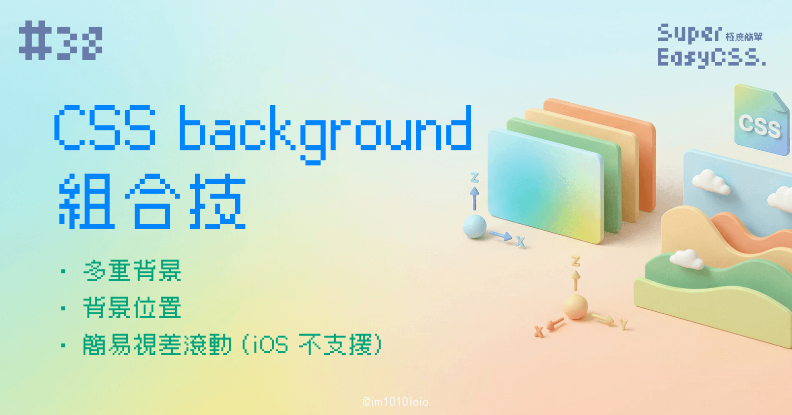
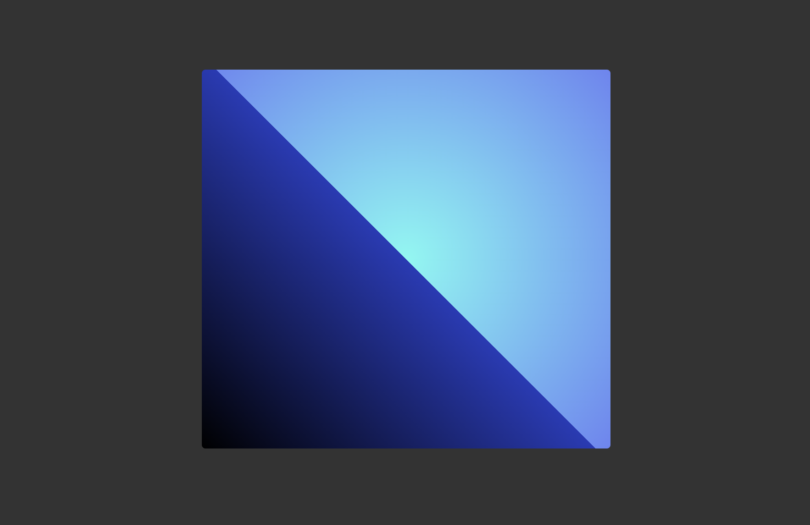
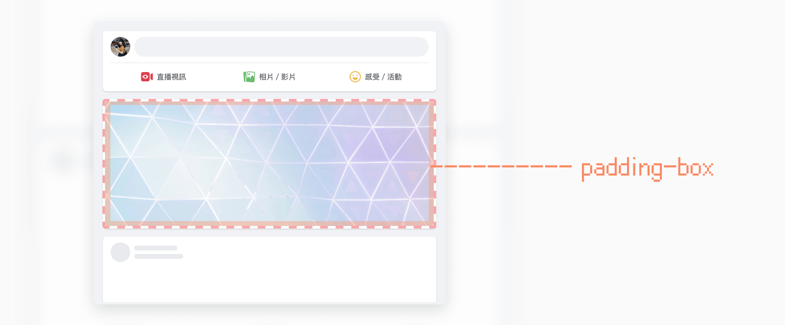
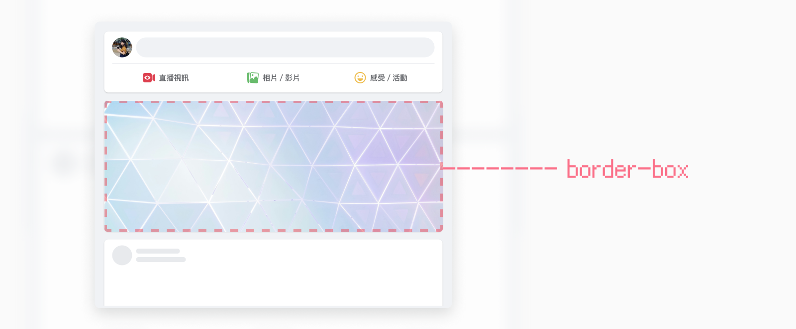
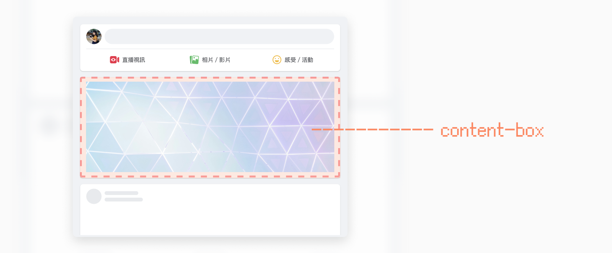
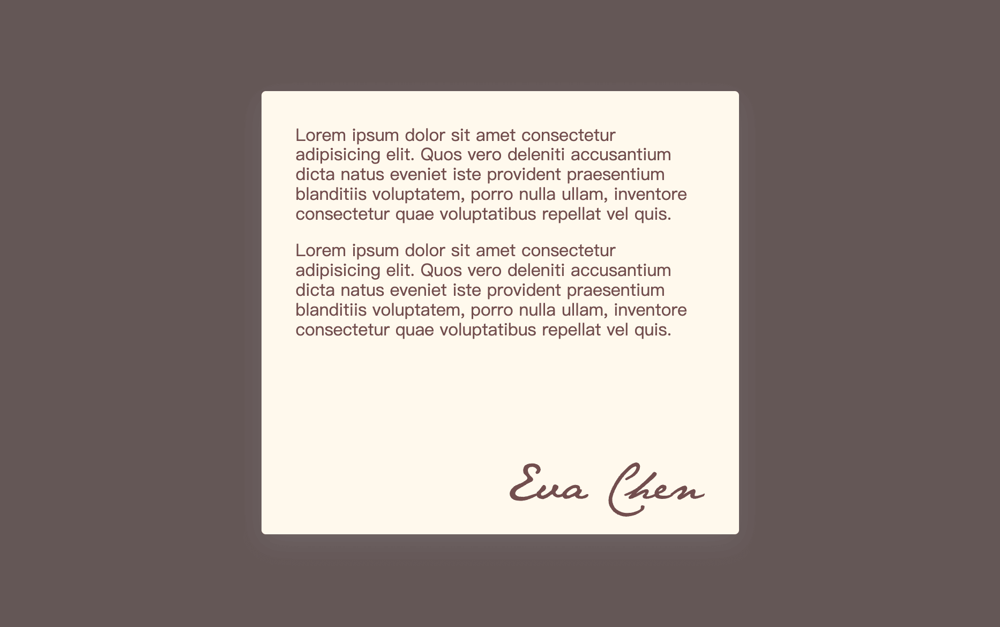

我們了解如何設定背景圖，了解了如何畫漸層，接下來就可以靠著多重背景、 `background size` 、 `background position` 與 `background origin` 等等屬性，打出一連串的組合技。

> #### **↓ 今日學習重點 ↓**
> 
> * 學會 CSS 背景的詳細設定方式
>     
> * 學會使用多重背景，並了解使用情境
>     
> * 學會設定背景的原點 background origin，及了解他的使用情境
>     
> * 學會使用簡易的視差滾動
>     

---

## 多重背景

在 CSS background 屬性中，還有一個很實用的設定方法，就是多重背景。設定方法很簡單，只要使用逗號隔開不同的背景就行了，寫在越前面的背景會在越上面。

```css
div {
    background: 背景1, 背景2, 背景3;
}
```

例如，我們可以重疊漸層色，其中線性漸層設定為透明：

> DEMO: [CSS Multiple Background](https://codepen.io/im1010ioio/pen/Yzoomge)

```css
div {
    background:
        linear-gradient(45deg, rgba(0,0,0,1) 0%, rgba(37,59,185,1) 50%, rgba(0,0,0,0) 50%),
        radial-gradient(circle, rgba(109,250,242,1) 0%, rgba(104,133,244,1) 100%);
}
```



另外也可以重疊透明背景圖，搭配 `background-size` 設定每個背景的尺寸：

> DEMO: [CSS Multiple Background with Images](https://codepen.io/im1010ioio/pen/mdZNbVQ)

```css
.container{
    background: 
        url(https://im1010ioio.github.io/super-easy-css/38/bg-1.png) no-repeat 0 50%,
        url(https://im1010ioio.github.io/super-easy-css/38/bg-2.png) no-repeat 100% 50%,
        radial-gradient(circle, rgba(109,250,242,1) 0%, rgba(104,133,244,1) 100%);
    background-size: 25%, 25%, 100%; /* 依照順序設定 */
}
```


> 延伸閱讀：  
> [Background-image 之二- 金魚都能懂的CSS必學屬性](https://ithelp.ithome.com.tw/articles/10248148)  
> [Day 06 | 就是那麼有層次 - 多重背景一天](https://ithelp.ithome.com.tw/articles/10241331)

---

## 背景的作用範圍 `background-origin`

還記得 CSS 的盒子模型嗎？

> 延伸閱讀：[#13 CSS 盒子模型 (Box Model)：border-box & content-box](https://im1010ioio.hashnode.dev/css-box-model)

在設定背景時，其實我們可以使用 `background-origin` 這個屬性，指定背景圖作用的範圍是要盒子中的哪個範圍：

* `background-origin: padding-box;` (預設)  
    背景圖片從 padding 的範圍開始出現，但不在 border 內。
    
    
    
* `background-origin: border-box;`
    
    背景圖片從 border 的範圍開始出現。
    
    
    
* `background-origin: content-box;`
    
    背景圖片從 content （內容）的範圍開始出現，不包含 padding，也不包含 border。
    
    
    

有了這個，我們就可以利用 `background-origin: content-box` ，做出一張有簽名圖片或是 LOGO 的卡片，讓簽名圖案與文字保持一樣的 padding：

```css
.card {
    /* background-image background-color */
    background: url(https://im1010ioio.github.io/super-easy-css/38/signature.svg) no-repeat #FFF9ED bottom right;
    background-origin: content-box;
}
```



> DEMO: [Signature Background (background-origin)](https://codepen.io/im1010ioio/pen/JjQQQxj)

---

## 簡易的視差滾動 `background-attachment`

在 CSS `background` 中，只要設定 `background-attachment: fixed;` 就能製造出視差捲動背景。

> BUT！很可惜，iOS Safari 不 work。  
> （而且 Apple 認為這是 feature，為了使用者的效能，所以估計永遠不會 work 了🥲）  
> 所以使用時要斟酌喔！


> DEMO：[Pure CSS Parallax Scrolling Background](https://codepen.io/im1010ioio/pen/XWQKXGK)
> 
> 延伸閱讀：[用CSS表現最簡單的視差滾動](https://www.webdesigns.com.tw/CSS-Parallax-Scrolling.asp)

### 替代方案——使用 Sticky

雖然可能有些不同，這樣不算是視差捲動，但是有點像，大家可以參考用 `sticky` 疊上背景，也很酷！


> DEMO: [Sitcky Page](https://codepen.io/im1010ioio/pen/dyEKRYg)
> 
> 延伸閱讀：  
> [https://www.threads.net/@easonchiu713/post/C8ma83bSKwf?xmt=AQGz\_LsblvjWfbMDzs6mN1DxCt1sBU0gf9m1PaX8HGHgnA](https://www.threads.net/@easonchiu713/post/C8ma83bSKwf?xmt=AQGz8ePPChEl0PTn9vElSxjQL7owFBCcsIf5jLG91s1gWA)
> 
> [SCSS overlapping sticky cards](https://codepen.io/esdesignstudio/pen/RwYrNzJ)

---

#### ↓↓↓↓↓↓↓↓↓↓↓↓↓↓↓↓↓↓↓↓

感謝看到最後的你，若你覺得獲益良多，請不要吝嗇給我按個喜歡。❤️

如果你喜歡我的創作，還想看看其他有趣的分享與日常，  
可以追蹤我的 IG [@im1010ioio](https://www.instagram.com/im1010ioio/)，或者是[🧋送杯珍奶鼓勵我](https://im1010ioio.bobaboba.me/)，謝謝你🥰。

