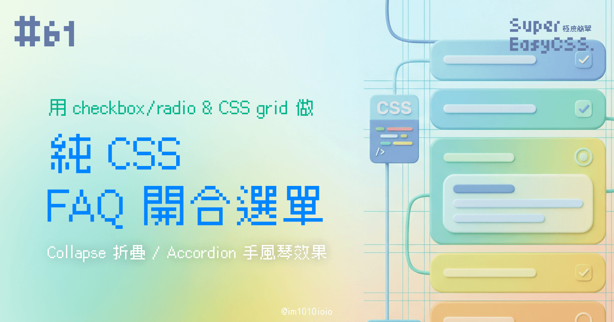
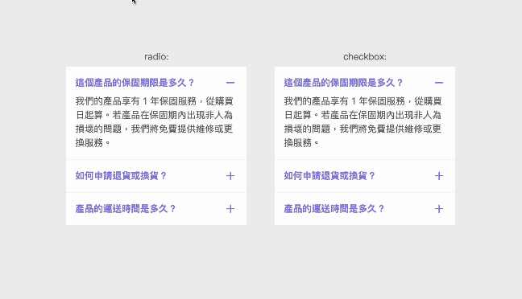

前幾篇我們有提到 CSS `transition` 的特性：

> 延伸閱讀：[#51 CSS Transition 與一些小技巧：倒帶、影響相鄰的兄弟](https://ithelp.ithome.com.tw/articles/10361708)
> 
> `transition` 是兩個狀態之間的過渡效果，但這個過渡效果只適用於可以計算的數值型屬性。例如，`width`、`height`、`opacity` 等等。所以，像 `auto` 、 `display: none` 或 `background-image` 這類非數值型屬性是無法有過渡效果的。

所以，通常要做內容長度不固定的 FAQ 文字摺疊選單，都要使用 JS 去計算文字欄位的總長度，再用這個數字去縮合選單。

不過，之前看了「請網這邊走 This Web」寫的這篇文章：[如何用 CSS 做 Accordion 手風琴？不再需要用 JS 計算高度](https://www.thisweb.dev/post/css-accordion) ，學到原來利用 Grid 的 `grid-template-rows`，從 `0fr` 到 `1fr` 就可以做到 `transition` 過渡效果，等於說變相實現了從 `0` 到 `auto` 的動畫。真神奇！

> 如果想複習 Grid，可以參考很久以前的這篇：  
> [#19 CSS Grid、Subgrid：網頁排版的神奇格子，來排個照片牆與雞腿便當吧！](https://ithelp.ithome.com.tw/articles/10334918)

所以，我想可以結合「請網這邊走 This Web」教的 Grid 伸縮原理，再加上這幾篇練習用 `checkbox` / `radio` 做 toggle 行為，把整個 code 都改為純 CSS，結果是可以的！

---

### DEMO

* 由於 `radio` 是單選行為，所以可以做出「Accordion 手風琴效果」，一次固定只能開啟一個內容（然後無法全關）。
    
* 而 `checkbox` 是多選，所以可以一直開開關關都沒問題，是常見的「Collapse 折疊效果」。
    



> DEMO: [Pure CSS Collapse/ Accordion FAQ](https://codepen.io/im1010ioio/pen/Jjgbmdb)

以下列出控制開關的關鍵部分，其餘的 code 詳見 DEMO。

```css
.faq-text {
    display: grid;
    grid-template-rows: 0fr;
    transition: .4s ease-in-out;
    > * {
        overflow: hidden;
    }
}

/* radio or checkbox */
.faq-toggle {
    display: none;
    &:checked{
        ~ .faq-title{
            padding-bottom: .5rem;
        }
        ~ .faq-title .material-icons:before{
            content: "remove";
        }
        ~ .faq-text{
            grid-template-rows: 1fr;
        }
    }
}
```

這些 DEMO 是為了解釋基本原理，實際在開發中，排版的細節可能更多，也可能會搭配自己定義的變數或 UI 框架，到時候需要依據自己的需求調整喔！