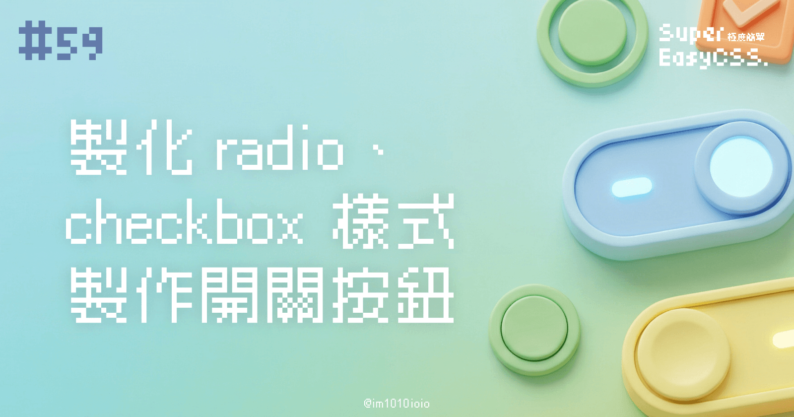
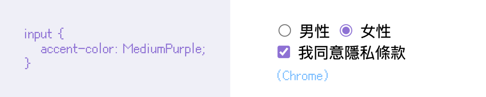
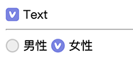
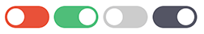

在日常前端開發中，`radio` 和 `checkbox` 是非常常用的表單元素，但瀏覽器預設的樣式往往不符合設計需求。因此，學會如何客製化這些元素樣式是每個前端設計師的必備技能之一。在這篇教學文中，我們將介紹如何使用 CSS 來客製化 `radio` 和 `checkbox`，而且進一步用 `checkbox` 做出一個開關按鈕 (Switch Button)。

---

## ㄧ、改變 **checkbox/radio 顏色：accent-color**

在之前的文章，我們曾經有提過：

> [#32 CSS 顏色變數 currentcolor、checkbox/radio 顏色、input placeholder、閃動的光標顏色、文字反白的顏色，混色的 color-mix()](https://ithelp.ithome.com.tw/articles/10340648)
> 
> 我們雖然無法改變瀏覽器中預設 input 勾選框的樣子，但是我們可以使用 CSS 中的 `accent-color` 改變它們勾起來時的顏色，例如下面例子，我們將 radio 和 checkbox 改為紫色：
> 
> 

這是調整 `radio` 和 `checkbox` 最基本的方法，但是勾選框的樣子我們還是無法變更，會受到作業系統與瀏覽器的影響。

---

## 二、客製化的 `radio` / `checkbox` 按鈕

### 基本概念

如果今天我們想要客製化自己的勾選框，必須善用：

1. HTML 中 `<label>` 中的 `for` 屬性可以選取到 `radio` / `checkbox` 的 id 的特性，例如：
    
    ```xml
    <div class="check-group">
        <input type="checkbox" id="check-1">
        <label for="check-1">Text</label> <!-- 點選文字可勾起 checkbox -->
    </div>
    ```
    
2. CSS 中的選取兄弟的選擇器（`~` 或 `+`），幫大家複習一下選擇器：
    
    1. 使用加號 `+` 是選取到**後面的第一個**
        
    2. 使用波浪號 `~` 是選取到**後面全部兄弟**
        
        > 延伸閱讀：[#08 CSS 選擇器總整理！id、class、:nth-child(n)、:not、:where、:is、:has 都難不倒我](https://ithelp.ithome.com.tw/articles/10326365)
        
3. CSS 中的偽類 `::checked`。
    

### DEMO



> DEMO: [Custom radio/ checkbox](https://codepen.io/im1010ioio/pen/jOgVwQG)

接著，有了這些知識後，我們就可以開始作出自訂的勾選框按鈕了！  
我們的思路是：

1. 首先，我們用 `display: none` 隱藏預設的 `checkbox` / `radio` 按鈕。
    
2. 接著用選擇器 `+` 選到後面的 `<label>`，分別畫出「還沒勾選時」的按鈕圖形與文字樣式。
    
3. 接著，用 `:checked` 調整「勾選時的樣子」，這邊使用多重背景設定了的勾勾圖片。
    
4. 最後，做出 `radio` 與 `checkbox` 的分別，微調一下共用的樣式，並且補上一些 hover 效果就完成了。
    

#### HTML 結構

```html
<div class="check-group">
    <input type="checkbox" id="check-1">
    <label for="check-1" class="btn-check"></label>
    <label for="check-1" class="text-check">Text</label>
</div>
```

#### CSS 樣式

```css
:root{
    --color-active: #7b84e1;
}

/* check style */
.check-group{
    input[type="checkbox"], input[type="radio"]{
        display: none;
        + label{
            vertical-align: middle;
        }
        + .btn-check{
            position: relative;
            display: inline-block;
            width: 0.9rem;
            height: 0.9rem;
            border: 2px solid #ccc;
            border-radius: .25rem;
            background-color: #eee;
            background-size: 60%;
            background-position: 50% 50%;
            background-repeat: no-repeat;
        }
        &:checked + .btn-check{
            background-color: var(--color-active);
            background-image: url(https://im1010ioio.github.io/super-easy-css/59/check-mark.svg);
            border-color: var(--color-active);
        }
    }
    input[type="radio"] + .btn-check{
        border-radius: 50%;
    }
}

/* hover and other style */
.check-group{
    display: inline-block;
    .btn-check, .text-check{
        cursor: pointer;
        transition: .3s;
    }
    &:hover {
        input[type="checkbox"], input[type="radio"]{
            + .btn-check{
                border-color: var(--color-active);
            }
            + .text-check{
                color: var(--color-active);
            }
        }
    }
}
```

---

## 三、製作開關按鈕 (Switch Button)

### 基本概念

我們可以用類似的概念去製作開關按鈕，不過有點不一樣的地方，就是：

1. 這次我們使用 `<label>` 包住所有的內容，一樣也可以觸發裡面的 `checkbox` 。
    
2. 使用 `opacity: 0` 隱藏預設的 `checkbox`，寬高都設為 0，並且加上 `pointer-events: none` 避免被誤按。
    
3. 使用 `.slider` 來設計開關外觀，當 `checkbox` 被勾選後，透過 `:checked` 改變背景色及按鈕圓形位置（使用偽元素 `::before` 做），達到開關按鈕的效果。
    
4. 另外加上 `:disabled` 開和關時的樣式。
    

### DEMO



> DEMO: [Checkbox Switch Buttons](https://codepen.io/im1010ioio/pen/XWvNzYB)

#### HTML 結構

```html
<label class="switch">
    <input type="checkbox">
    <span class="slider"></span>
</label>
```

#### CSS 樣式

```css
.switch {
    position: relative;
    display: inline-block;
    width: 50px;
    height: 25px;
    input[type="checkbox"] {
        opacity: 0;
        width: 0;
        height: 0;
        pointer-events: none;
    }
}

.slider {
    position: absolute;
    top: 0;
    left: 0;
    right: 0;
    bottom: 0;
    background-color: #e9513a;
    transition: 0.4s;
    border-radius: 25px;
    cursor: pointer;
    &::before {
        content: "";
        position: absolute;
        width: 19px;
        height: 19px;
        top: 0;
        bottom: 0;
        margin: auto;
        left: 3px;
        background-color: white;
        transition: 0.4s;
        border-radius: 50%;
    }
}

.switch input[type="checkbox"]:checked + .slider {
    background-color: #4fbe79;
    &::before {
      transform: translateX(25px);
    }
}

.switch input[type="checkbox"]:disabled + .slider {
    cursor: not-allowed;
    background-color: #ccc;
}

.switch input[type="checkbox"]:disabled:checked + .slider {
    background-color: #545564;
}
```

---

## 四、實務上的應用情況

這些小技巧能讓我們能夠製作出符合設計需求的 `radio`、`checkbox` 及開關按鈕 (Switch Button)。進一步，可以根據實際專案中的配色方案進行調整，搭配 CSS 變數一起管理樣式，讓你的 UI 元素更加一致。

不過，為了資安，有時可能會在表單不可編輯（Readonly）時，為避免有人使用前端偵錯工具，自行解除 input 的 disabled 狀態，再偷偷發送請求出去，所以會選擇在此時隱藏起 input。

然而，這樣一來，剛剛我們依賴著 input 所寫的樣式會全部壞掉。這時候就會需要另外寫 class 去處理，例如 `.switch.is-checked` 裡面的樣式和剛剛我們寫的 `.switch input[type="checkbox"]:checked` 一樣，所以修改後就會像下面這樣：

#### HTML 結構

```xml
<label class="switch readonly">
    <span class="slider"></span>
</label>

<label class="switch readonly is-checked">
    <span class="slider"></span>
</label>
```

#### CSS 樣式

```css
.switch input[type="checkbox"]:checked + .slider,
.switch.is-checked .slider{
    background-color: #4fbe79;
    &::before {
        transform: translateX(25px);
    }
}

.switch input[type="checkbox"]:disabled + .slider,
.switch.readonly .slider {
    cursor: not-allowed;
    background-color: #ccc;
}

.switch input[type="checkbox"]:disabled:checked + .slider,
.switch.readonly.is-checked .slider  {
    background-color: #545564;
}
```