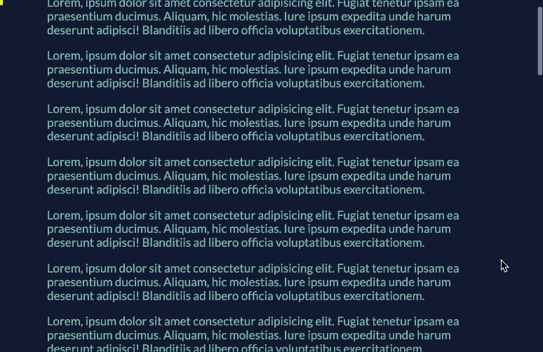
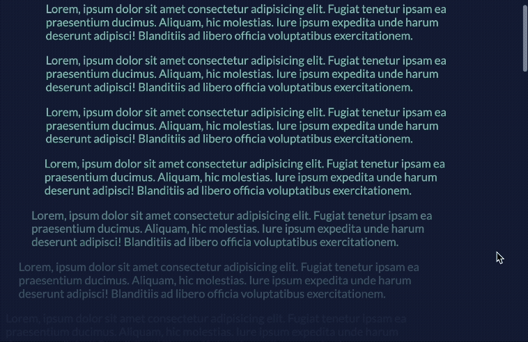

上一篇我們介紹了 `animation-timeline` 的核心觀念與語法，這一篇進入實戰！  
我們將實作兩個超常見的滾動動畫效果，以及介紹命名時間軸的用法，跟著一起做看看吧！

> #### **↓ 今日學習重點 ↓**
> 
> * 實作頁面滾動進度條（`scroll()`）
>     
> * 實作段落飛入動畫（`view()`）
>     
> * 了解命名時間軸（`scroll-timeline-name`）的寫法
>     

---

## 一、實際範例

### 1\. 方式一：匿名的時間軸 `scroll()` 和 `view()`

這是最直覺也最簡單的方法，直接在元素的動畫屬性中，使用函式來指定動畫要跟隨的進度。

這裡我們使用做了常見的兩種應用方式：

* 頁面滾動進度條
    
* 文字段落由左淡入出現
    

> DEMO 連結：[CSS Scroll-driven Animation with animation-timeline (scroll() & view())](https://codepen.io/im1010ioio/pen/emJmOmp)

#### **(1)** `scroll()` **的應用：頁面滾動進度條**

讓我們來製作了一個簡單的頂部進度條，它的寬度會隨著整個頁面的滾動而變化。



```css
#progressbar{
    position: fixed;
    top: 0;
    z-index: 1000;
    width: 100%;
    height: 10px;
    background-color: yellow;
    transform-origin: top left; /* 讓縮放從左邊開始 */

    /* 將 pagePercent 動畫連結到頁面滾動條 */
    animation-name: pagePercent;
    animation-direction: alternate;
    animation-timeline: scroll();
}
@keyframes pagePercent {
    from { transform: scaleX(0); }
    to {   transform: scaleX(1); }
}
```

這裡的 `animation-timeline: scroll();` 是核心：

* 它告訴 `#progressbar` 的動畫進度要完全跟隨**滾動條**的進度。
    
* 因為沒有指定 `scroller`，它會預設跟隨 `root` (根滾動條)，也就是整個頁面。當頁面滾到最頂部時，進度條 `scaleX` 為 0；滾到最底部時，`scaleX` 為 1。
    

#### **(2)** `view()` 的應用：文字段落由左淡入出現



另外一個範例則是讓每一個 `<p>` 段落在進入畫面時，  
才觸發自己的淡入兼移入動畫（不過這個動畫效果更常出現在照片上）。

```css
p {
    opacity: 0; /* 初始狀態為透明 */

    /* 將 moveIn 動畫連結到元素自身的可見進度 */
    animation: moveIn linear forwards;
    animation-timeline: view();
    animation-range: entry 50% cover 50%;
}

@keyframes moveIn {
    0%   { translate: -10%; opacity: 0; }
    100% { translate: 0%;   opacity: 1; }
}
```

關於這裡的 `animation-timeline: view();` ：

* 將動畫的時間軸，綁定到**每一個** `<p>` 文字段落，進入畫面到結束的過程。
    
* `animation-range: entry 50% cover 50%;` 表示動畫的播放區間：
    
    * 動畫會在 `<p>` 元素的中心點 (`50%`) 進入 (`entry`) 視窗時開始，
        
    * 並在它的中心點到達視窗頂部 (`cover 50%`) 時播放完畢。
        

#### (3) 進階用法：一次使用多個動畫（時間軸）

一個元素可以同時執行多個動畫，並讓它們分別跟隨不同的匿名時間軸。只需要用逗號 `,` 隔開多個動畫設定即可。

**範例**：  
讓一個方塊在**整個頁面滾動時會旋轉**（使用 `scroll()`），  
同時，當它**自己進入畫面中央時會改變顏色**（使用 `view()`）。

```css
.box {
  /* 1. 定義兩個動畫，用逗號分隔 */
  animation-name: rotate-effect, color-effect;
  /* 2. 按順序讓每個動畫跟隨各自的時間軸 */
  animation-timeline: scroll(root), view();
  /* 其他動畫屬性... */
}
```

這裡的對應關係是**按順序的**：第一個動畫 `rotate-effect` 會跟隨第一個時間軸 `scroll(root)`，而第二個動畫 `color-effect` 則會跟隨第二個時間軸 `view()`。

---

### 2\. 方式二：為時間軸命名： `scroll-timeline-name` 用法

在 `scroll()` 和 `view()` 成為標準前，我們需要用比較繁瑣的兩個步驟來定義時間軸：

1. **在滾動容器上定義並命名時間軸**
    
2. **在動畫元素上引用該時間軸**
    

雖然比較麻煩，不建議使用，但是了解的話，萬一遇到了，就能看得懂。

> DEMO 連結：[CSS Scroll-driven Animation with animation-timeline (named scroll progress timelines)](https://codepen.io/im1010ioio/pen/xbZxWKJ)

#### (1) 等同於 `scroll()` 的基本用法

我們用語剛剛的第一個例子「頁面滾動進度條」改寫看看，重點是「**要在滾動容器上定義並命名時間軸**」：

```css
/* 在滾動容器上定義並命名時間軸 */ 
html {
    /* 在 html 這個滾動容器上，建立一個名為 --page-percent 的時間軸 */
    scroll-timeline-name: --page-percent;
}

#progressbar {
    animation-name: pagePercent;
    /* 在動畫元素上引用該時間軸 */
    animation-timeline: --page-percent;
}

/* keyframes 略 */
```

#### (2) 等同於 `view()` 的基本用法

我們用語剛剛的第二個例子「文字段落由左淡入出現」改寫看看，重點是「**追蹤「自身」在滾動容器中的 viewprot 進度」**：

```css
p {
    opacity: 0; /* 初始狀態為透明 */

    /* 追蹤 p 元素「自身」在滾動容器中的 viewprot 進度 */
    view-timeline-name: --p-appearance;

    /* 將 moveIn 動畫連結到我們剛剛在它自己身上創建的 --p-appearance 時間軸 */
    animation: moveIn linear forwards;
    animation-timeline: --p-appearance;
    animation-range: entry 50% cover 50%;
}

/* keyframes 略 */
```

#### (3) 如果同個滾動容器有多個時間軸

如果一個滾動容器上要定義多個命名的時間軸，可以在 `scroll-timeline-name` 用逗號 `,` 隔開多個動畫名稱即可：

```css
html {
    scroll-timeline-name:
        --page-percent,
        --square-timeline;
}
```

---

`animation-timeline` 將動畫的控制權從 JS 交還給了瀏覽器本身，這代表著無與倫比的流暢與效能。不只能做視差效果，還能用來做滾動進度條、圖片的 Lazyload 動畫、飛入效果等等，可能性無窮無盡，甚至挑戰常見的 JS 套件（如 [GSAP](https://gsap.com/) 等等）。

雖然目前還需要注意瀏覽器的支援度，但接下來就等待你來試試看這個語法囉！  
希望有朝一日能全面支援，這樣的話會很方便！

這是滾動系列的最後一篇了！  
明天開始我們來補充一些之前沒有提到過的新語法。

另外，與滾動相關的 CSS，之前有一個新語法 `container-type: scroll-state` （[Chrome for Developer 的介紹文章](https://developer.chrome.google.cn/blog/css-scroll-state-queries?hl=zh-tw)），未來或許能讓我們用 `@container` 查詢來偵測元素的滾動狀態，但目前 Safari 和 Firefox 都尚未支援，所以就還沒有寫這篇囉！如果未來這語法支援了，也許我會再寫篇來介紹。

---

> **延伸閱讀：**
> 
> * [MDN - animation-timeline](https://developer.mozilla.org/en-US/docs/Web/CSS/animation-timeline)
>     
> * [Chrome for Developer - 使用捲動式動畫呈現捲動時的元素動畫](https://developer.chrome.com/docs/css-ui/scroll-driven-animations?hl=zh-tw)
>     
> * [animation-timeline : view() | scroll() | gsap scroll killer](https://codepen.io/abhishek-bhardwaj/pen/QWzqpgz)
>     

---

---

> 👈 **上一篇：[CSS 滾動動畫入門：animation-timeline 的核心概念與語法解說](/interaction-scroll/css-animation-timeline)**

---

#### ↓↓↓↓↓↓↓↓↓↓↓↓↓↓↓↓↓↓↓↓

感謝看到最後的你，若你覺得獲益良多，請不要吝嗇給我按個喜歡。❤️

如果你喜歡我的創作，還想看看其他有趣的分享與日常，  
可以追蹤我的 IG [@im1010ioio](https://www.instagram.com/im1010ioio/)，或者是[🧋送杯珍奶鼓勵我](https://im1010ioio.bobaboba.me/)，謝謝你🥰。

