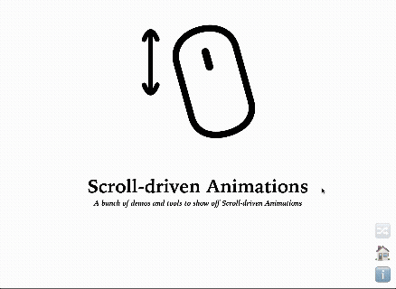
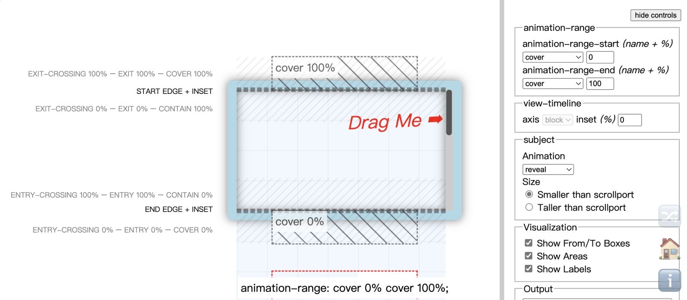

你一定看過那種很酷的網頁：當你向下滾動時，背景圖片移動得比前景文字慢，或者某個元素會隨著滾動淡入、旋轉、放大，創造出引人入勝的深度和故事感。

這種效果，我們稱之為「**捲動式動畫** (Scroll-driven Animations)」或「**視差滾動** (Parallax Scrolling)」。

> 為了寫這篇，我發現了一個超實用的網站！
> 
> 這個網站 [Scroll-driven Animations](https://scroll-driven-animations.style/) 收集了許多由滾動驅動的動畫， 甚至還有程式碼，CSS 與 JS 版本都有：
> 
> 

過去，要實現這種效果，幾乎是 JS 的專屬任務。我們需要監聽 `scroll` 事件，不斷計算元素的位置，然後用 JS 去更新它的 CSS 樣式。這樣做不僅麻煩，而且在效能不好的裝置上，還可能因為頻繁的計算導致畫面卡頓。

但是現在，CSS 有了原生解決方案，能將動畫與滾動完美連結的新屬性 —— `animation-timeline`。 讓我們可以**用滾動的位置來驅動 CSS 動畫的進度**，完全告別 JS！

> 注意：這個語法 Firefox 暫不支援，不過 Safari 最新的 iOS26 將支援，所以我認為這是值得期待的新屬性，詳情請看 [Can I Use](https://caniuse.com/mdn-css_properties_animation-timeline)。 （本系列文章介紹的語法，都是大於等於 3 個瀏覽器以上有支援的）

---

## 一、核心概念：從「時間軸」到「滾動軸」

在我們開始之前，先來理解一個最重要的觀念轉變。

傳統的 CSS `@keyframes` 動畫是基於**時間**的。 例如，`animation-duration: 3s;` 代表這個動畫會在 3 秒內從 0% 播放到 100%。

而 `animation-timeline` 所做的事情，就是把這個**時間軸**，替換成**滾動軸**。

動畫不再關心「過了幾秒」，而是關心「**您滾動了多少距離**」。 例如，我們可以設定： 當使用者從頁面頂部滾動到底部時，動畫剛好從 0% 播放到 100%。

滾動條，就是您的動畫進度條。

---

## 二、實現方式與語法

要啟用這個新功能，我們主要會用到幾個新屬性，它們通常會一起搭配使用。

### 1\. `animation-timeline` - 跟隨哪一個進度軸

這個屬性負責**指定**動畫要跟隨哪一個進度軸。它可以接受 `scroll()` 或 `view()` 函式。

#### (1) `scroll()`

將動畫連結到一個**滾動容器 (scroller)** 的滾動進度上。0% 代表滾動條在起點，100% 代表在終點。

##### **語法：**

```css
div {
    animation-timeline: scroll( [scroller] [axis] );
    /* 參數順序可對調 */
}
```

* `scroller` (滾動容器)：指定要監聽哪一個滾動條。
    
    * `nearest` (預設值): 尋找最近的、擁有滾動條的祖先元素。
        
    * `root`: 文件的根元素，通常指整個頁面的滾動條。
        
    * `self`: 元素自身的滾動條（需設定 `overflow: scroll` 等）。
        
* `axis` (軸向)：決定要監測哪個方向的滾動條。
    
    * `block` (預設值): 塊軸。在「橫書模式」下指的就是垂直滾動 (`y`)。
        
    * `inline`: 行內軸。在「橫書模式」下指的就是水平滾動 (`x`)。
        
    * `y`: 垂直軸。
        
    * `x`: 水平軸。
        

> **注意**：單獨使用 `scroll()` 等同於 `scroll(nearest block)`。如果指定的軸向沒有滾動條，動畫將不會觸發。

#### (2) `view()`

將動畫連結到**元素自身在可見區域 (Viewport) 中的可見進度**上。當元素進入或離開畫面時，動畫會隨之推進。

##### **語法：**

```css
div {
    animation-timeline: view( [axis] [inset] );
}
```

* `axis` (軸向)： 與 `scroll()` 中的 `axis` 相同 (`block`, `inline`, `x`, `y`)。
    
* `inset` (邊距)： 調整用來判斷「可見性」的區域範圍，可以設定一個或兩個值 (start/end)。例如 `view(block 100px 200px)` 表示當元素進入「距離視窗頂部 100px、距離視窗底部 200px」這個縮小的區域時，動畫才會開始播放。
    

### 2\. `animation-range` - 滾動範圍

如果 `animation-timeline` 是指定「跟誰跑」，那 `animation-range` 就是定義「**從哪裡跑到哪裡**」。 它是 `animation-range-start` 和 `animation-range-end` 的縮寫，用來精確設定動畫在時間軸上的生效區間（從 0% 播放到 100% 的範圍）。

##### **語法：**

它的值通常由**開始點**和**結束點**兩部分組成：

```css
div {
    animation-range: [開始點] [結束點];
}
```

這些點可以使用非常這些「範圍名稱 (timeline-range-name)」來定義：

* `cover`: 涵蓋元素**從開始進入**視窗，到**完全離開**視窗的整個過程。
    
* `contain`: 元素**完全包含**在視窗內的過程。
    
* `entry`: 元素從**開始進入**視窗，到**完全進入**視窗的過程。
    
* `exit`: 元素從**開始離開**視窗，到**完全離開**視窗的過程。
    
* `entry-crossing`: 元素**橫跨**視窗「起始邊緣」的過程。
    
* `exit-crossing`: 元素**橫跨**視窗「結束邊緣」的過程。
    

**精細微調與縮寫：**

* **搭配百分比**：你可以在範圍名稱後加上百分比或長度，進行更精確的控制。例如：
    
    * `entry 0%`: 指元素頂部剛好碰到視窗底部的那一刻。
        
    * `entry 100%`: 指元素底部剛好碰到視窗底部的那一刻。
        
    * `exit 50%`: 指元素中心點離開視窗頂部的那一刻。
        
* **預設值**：`normal` 是預設值，代表時間軸的起點或終點。
    
* **單值縮寫**：
    
    * `animation-range: entry;` 等同於 `animation-range: entry 0% entry 100%;`
        

> **推薦小工具**：[View Timeline Ranges Visualizer](https://scroll-driven-animations.style/tools/view-timeline/ranges/)
> 
> 
> 
> 這些範圍名稱的對應位置可能有點抽象，推薦使用 [View Timeline Ranges Visualizer](https://scroll-driven-animations.style/tools/view-timeline/ranges/) 這個工具來幫助你理解它們，它幫助你視覺化這些進度，這個和開頭的分享是同個作者做的。

---

---

## 接下來：看實際範例與進階用法

語法都熟悉了嗎？下一篇會有完整的實際範例，包含滾動進度條、飛入文字動畫，以及命名時間軸的進階用法！

👉 **繼續閱讀下一篇：[animation-timeline 實戰：進度條、飛入動畫、命名時間軸全範例](/interaction-scroll/css-animation-timeline-examples)**

---

#### ↓↓↓↓↓↓↓↓↓↓↓↓↓↓↓↓↓↓↓↓

感謝看到最後的你，若你覺得獲益良多，請不要吝嗇給我按個喜歡。❤️

如果你喜歡我的創作，還想看看其他有趣的分享與日常，  
可以追蹤我的 IG [@im1010ioio](https://www.instagram.com/im1010ioio/)，或者是[🧋送杯珍奶鼓勵我](https://im1010ioio.bobaboba.me/)，謝謝你🥰。

