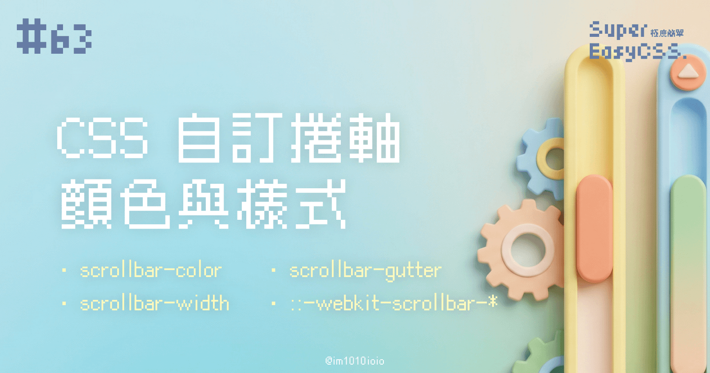
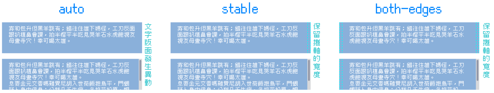
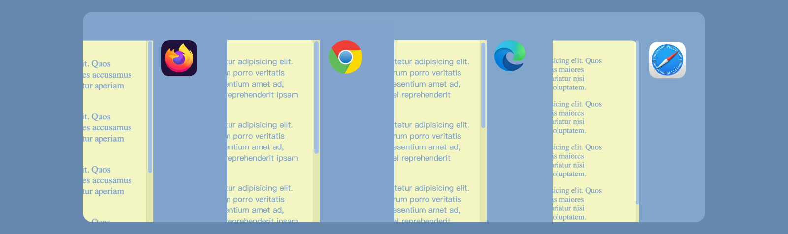

今天我們要客製化瀏覽器捲軸的樣式，  
捲軸通常會有「滑桿 thumb」、「軌道 track」與「按鈕」：


不過實際上要依據作業系統而定，像是在 Mac 中的捲軸就沒有按鈕。

通常我們要改變捲軸的樣式，指是改變捲軸的顏色與大小，讓捲軸也能符合我們畫面的色彩搭配。

---

## 一、捲軸顏色 `scrollbar-color`

`scrollbar-color` 可以寫兩個顏色，依序是滑桿與軌道的顏色：

```css
.scrollable {
    scrollbar-color: 滑桿顏色thumb 軌道顏色track;
}
```

> 只不過要注意的是，以上語法 Safari 目前不支援（2024/10）。

---

## 二、捲軸寬度 `scrollbar-width`

`scrollbar-width` 可調整捲軸的寬度，甚至可以隱藏捲軸，可以填寫的數值有三種：

* `auto`：預設捲軸寬度。
    
* `thin`：比預設更細一點的捲軸。
    
* `none`：隱藏捲軸，但是仍然可以捲動。
    

```css
.scrollable {
    scrollbar-width: thin;
}
```

> 只不過要注意的是，以上語法 Safari 目前不支援，預計未來會支援（2024/10）。

---

## 三、`scrollbar-gutter`

在研究 scrollbar 相關屬性時，還有一個屬性叫做 `scrollbar-gutter` 。

`scrollbar-gutter` 能為滾動條保留空間，防止隨著內容的增長而發生一點點寬度改變，同時還可以避免在不需要滾動時出現不必要的視覺效果。他有三個數值可以設定：



* `auto` 預設，當沒有捲軸時，不保留捲軸寬度。
    
* `stable` 當沒有捲軸時，保留捲軸的寬度。
    
* `both-edges` 當沒有捲軸時，兩邊都保留捲軸的寬度。
    

> 只不過要注意的是，以上語法 Safari 目前不支援，預計未來會支援（2024/10）。

---

## **四、舊版** `::-webkit-scrollbar-*`

前幾個語法 Safari 目前都不支援，那怎麼辦呢？我們可以使用舊版的語法 `::-webkit-scrollbar-*`。對應的語法為以下三種：

* `::-webkit-scrollbar-thumb`：  
    **捲軸的滑桿 thumb**，使用 `background` 設定顏色，也支援 `border` 等樣式。
    
* `::-webkit-scrollbar-track`：  
    **捲軸的滑桿 thumb**，使用 `background` 設定顏色，也支援 `border` 等樣式。
    
* `::-webkit-scrollbar`：  
    **捲軸的寬度**，要輸入捲軸寬度、高度數值。
    

```css
.scrollable {
    &::-webkit-scrollbar-thumb {
        background: #9cc2e6;
        border-radius: 5px;
    }
    &::-webkit-scrollbar-track {
        background: #e3e7a7;
        border-radius: 5px;
    }
    &::-webkit-scrollbar {
        max-width: 10px;
        max-height: 10px;
    }
}
```

> 不過，我們曾經說過 CSS 語法有前綴 `-webkit-` 代表是以 webkit 為核心的瀏覽器的實驗性語法。而 Firefox 不是 webkit 核心，所以以上語法 Firefox 不支援。
> 
> 讓我們來複習一下瀏覽器的小知識：  
> [#02 關於各家瀏覽器，前端必備的小知識：支援度、市佔率、CSS 實驗語法 -webkit-, -moz-... PostCSS Autoprefixer](https://ithelp.ithome.com.tw/articles/10321286)

---

## 五、綜合解法

以上我們介紹的 `scrollbar-color`、`scrollbar-width`、`scrollbar-gutter` 與 `::-webkit-scrollbar-*` ，前幾個 Safari 不支援，而最後一個 Firefox 不支援。這時候我們可以使用 CSS 的 `@supports` 屬性：當支援時就套用適合的語法。並且，同時使用 CSS 變數管理，這樣要修改捲軸樣式時，就不必一次要改很多地方：

```css
.scrollable {
    --scrollbar-color-thumb: #9cc2e6;
    --scrollbar-color-track: #e3e7a7;
    --scrollbar-width: thin;
    --scrollbar-width-number: 6px;
}

/* Chrome / Edge / Firefox */
@supports (scrollbar-width: auto) {
    .scrollable {
        scrollbar-color: var(--scrollbar-color-thumb) var(--scrollbar-color-track);
        scrollbar-width: var(--scrollbar-width);
    }
}

/* Chrome / Edge / Safari */
@supports selector(::-webkit-scrollbar) {
    .scrollable {
        &::-webkit-scrollbar-thumb {
            background: var(--scrollbar-color-thumb);
            border-radius: calc(var(--scrollbar-width-number) / 2);
        }
        &::-webkit-scrollbar-track {
            background: var(--scrollbar-color-track);
            border-radius: calc(var(--scrollbar-width-number) / 2);
        }
        &::-webkit-scrollbar {
            max-width: var(--scrollbar-width-number);
            max-height: var(--scrollbar-width-number);
        }
    }
}
```

實際套用起來結果如下（MacOS）：



> DEMO: [Custom scrollbar style](https://codepen.io/im1010ioio/pen/GRVrxjL)

---

> 延伸閱讀：
> 
> * [捲軸樣式  |  CSS and UI  |  Chrome for Developers](https://developer.chrome.com/docs/css-ui/scrollbar-styling?hl=zh-tw)
>     
> * [还有完没完，怎么又来了个 scrollbar-gutter？](https://www.zhangxinxu.com/wordpress/2022/01/css-scrollbar-gutter/)
>