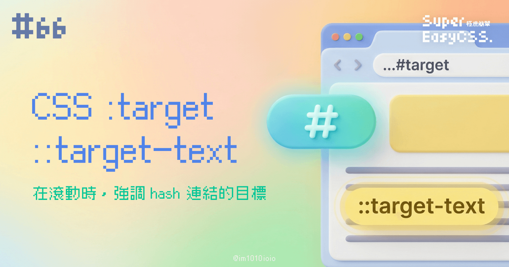
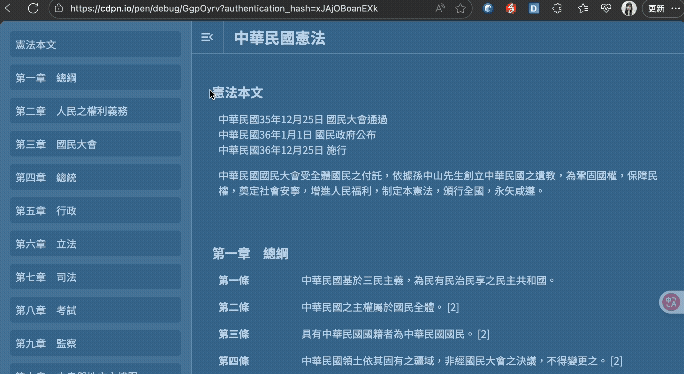
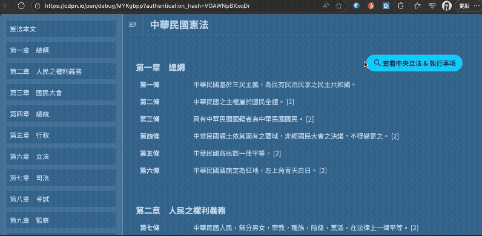

昨天我們讓很長內容的滾動範圍可以用 hash 連結滑順地滾動，今天我們要進一步優化它。

當網頁內容很長，使用者滾來滾去時可能會搞不清楚目前位置，所以今天我要來用 CSS 最簡單的方法 Highligh hash 連結的目標。

今天我們要介紹 2 個 CSS 選擇器語法：

* `:target`：針對 HTML 元素去調整樣式
    
* `::target-text`：針對指定的「文字片段」去調整樣式
    

非常簡單喔！讓我們一起來學吧！

---

## 一、`:target`：針對 HTML 元素去調整樣式

`:target` 是 CSS 的偽類，可以選到這個元素為目標狀態的時候。用法非常簡單，如以下例子：

```css
/* 每一個 .ch-content 都有不同的 ID，
   透過 hash 連結讓不同 ID 成為目標。
   當 .ch-content 為目標時，
   他裡面的 .card 與 h2 改變了樣式。 */
.ch-content:target{
    .card{
        background: rgba(0,0,0, .1);
        transition: .3s;
    }
    h2{
        color: var(--color-active);
    }
}
```

呈現結果如下圖：



> DEMO 連結：[CSS Text Highlight by :target](https://codepen.io/im1010ioio/pen/GgpOyrv)

不過如果要另外在滾動時，隨時偵測目前的所在位置，並且強調對應的區塊，這個目前 CSS 還不能做到，要搭配 JS 偵測喔！

此外，`:target` 還可以有很多其他應用方式，例如做純 CSS 的光箱或 Tab 等神奇運用方式，但是這已經脫離了本篇探討的「在滾動時」強調 hash 連結目標的用法，所以我們明天再討論。

---

## 二、 `::target-text`：針對指定的「文字片段」去調整樣式

另外一個要介紹的是 `::target-text`，這個使用方法比較少人知道。

HTML 的 hash 連結其實也可以指定「一段文字」，而不是一個 HTML 元素，點了後會自動跳轉到瀏覽器畫面正中央，另外可以搭配 CSS `::target-text` 屬性去調整樣式。

### 1\. 基本用法與 DEMO

HTML hash 連結**最基本的**指定方式如下：

* `#:~:text=這段文字的開始`
    

例如，當內容很多，而我只想跟你分享一句話時，就可以這麼做：

```css
::target-text { 
    background-color: yellow; 
    color: black; 
    transition: background-color 0.5s ease; 
}
```

結果就會如下：



> DEMO 連結：[CSS Text Highlight by :target-text](https://codepen.io/im1010ioio/pen/MYKgbpp)

### 2\. 指定「文字片段」的所有可設定的參數

其實在指定這段文字時，還可以設定更詳細的參數，包含了：

* `textStart`：這段文字的開始，是**必要**，也是剛剛的 DEMO 使用的方式。
    
* `textEnd`：這段文字的結束，**非必要**。
    
* `prefix-`：textStart **前面**的文字，但是**不會被選到**，用來精準定位，**結尾必須加上一槓** `-`。
    
* `-suffix`：textStart (或 textEnd) **後面**的文字，它的作用和 prefix- 完全一樣，一樣**不會被選到**，用來精準定位，**開頭必須加上一槓** `-`。
    

寫起來會像這樣：

```xml
#:~:text=[prefix-,]textStart[,textEnd][,-suffix]
```

舉個全部都使用的例子，像這樣的網址：

* `https://example.com#:~:text=第二章-,開發流程,的細節,-。`  
    （要選取的文字在「`第二章`」與「`。`」之間，選取其中的「『`開發流程` 』到『`的細節`』」這段文字。）
    

最後將會選取到以下標記的位置：

* 在第一章，我們討論開發流程的重要性。在第二章，我們將深入探討`開發流程還有實際案例的細節`。
    

善用這些參數，就可以不用在連結上將 textStart 列一大串，如剛剛的 DEMO。

另外，使用這個語法時如果有重複、符合條件的段落，只會選取到第一個，要注意一下。

### 3\. 應用情境

這個語法可以用在：

* 搜尋結果的跳轉
    
* 分享與引用特定段落，例如：學術引用、客服引導、協作溝通等等。
    

用的好的話，可以讓導航變得更加有效率，省去了使用者在頁面中手動尋找資訊的麻煩。

---

#### ↓↓↓↓↓↓↓↓↓↓↓↓↓↓↓↓↓↓↓↓

感謝看到最後的你，若你覺得獲益良多，請不要吝嗇給我按個喜歡。❤️

如果你喜歡我的創作，還想看看其他有趣的分享與日常，  
可以追蹤我的 IG [@im1010ioio](https://www.instagram.com/im1010ioio/)，或者是[🧋送杯珍奶鼓勵我](https://im1010ioio.bobaboba.me/)，謝謝你🥰。

