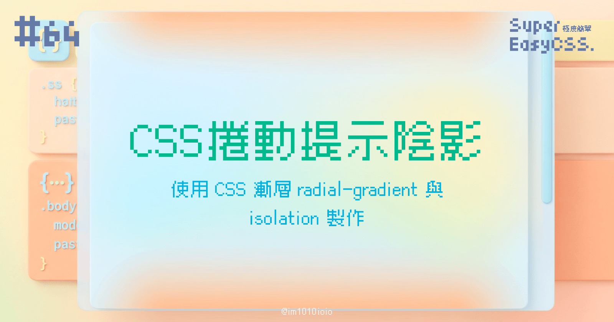
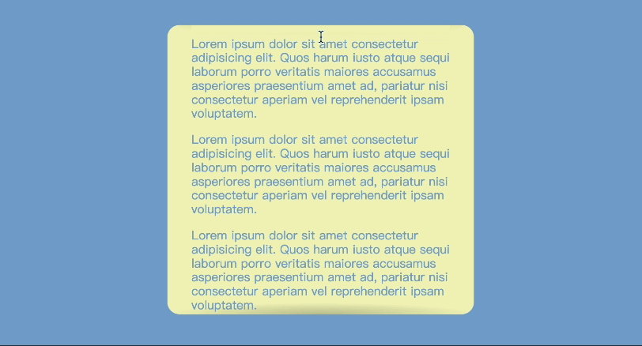
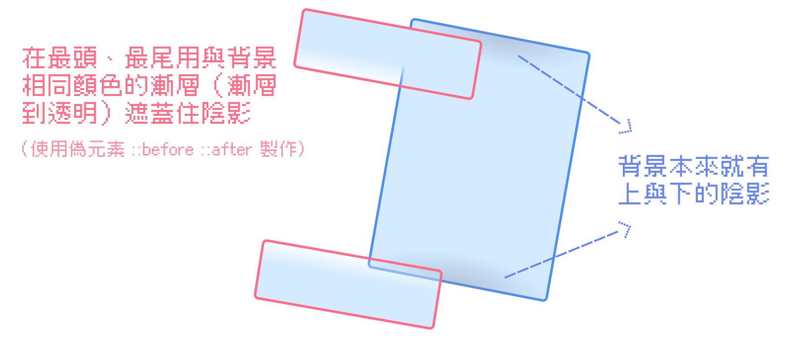
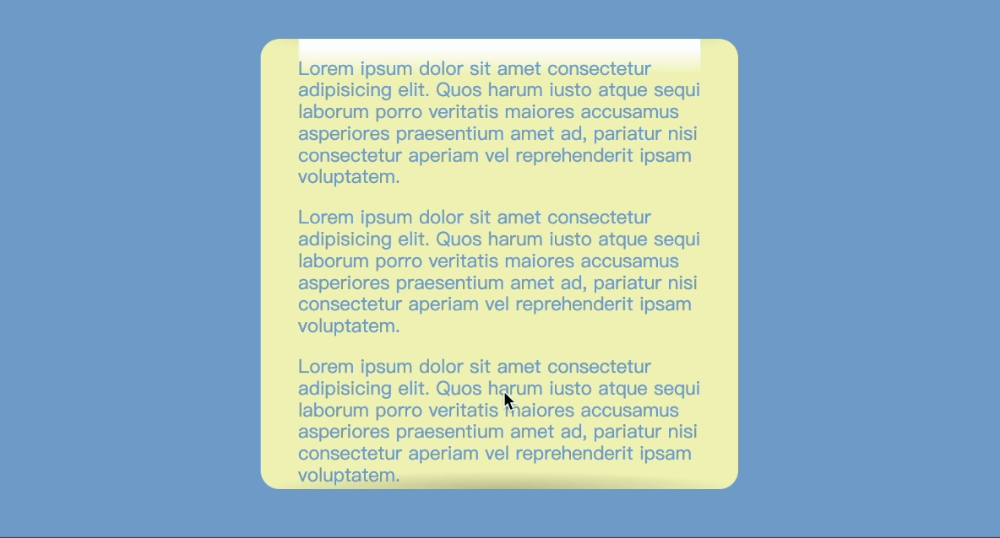

今天我們要來製作一個捲動提示陰影效果：在捲動框的最頂端、最尾端沒有陰影，但是在捲動時有淡淡的陰影出現，提示使用者上面、下面還有內容。



> DEMO: [Scrolling Shadows with CSS isolation](https://codepen.io/im1010ioio/pen/JjgEvyg)

---

## 一、原理



原理很簡單，其實是個障眼法：

* 整個捲動框的背景本來就有上面與下面的陰影，
    

* 在最頭、最尾用與背景相同顏色的漸層（漸層到透明）遮蓋住陰影。我們把 DEMO 中的漸層色改成與背景不同，這個原理就會很明顯了：
    



接著，讓我們繼續看下去怎麼製作吧！

---

## 二、捲動框的陰影

首先，我們要先畫出陰影，我們使用圓形漸層 `radial-gradient` 製作，做出最開頭和最尾端的半圓形陰影：

```css
.scrollable {
    background-image:
        radial-gradient(farthest-side at 50% 0, var(--color-shadow), transparent),
        radial-gradient(farthest-side at 50% 100%, var(--color-shadow), transparent);
    background-position: 0 0, 0 100%;
    background-size: 100% var(--height-shadow);
    background-repeat: no-repeat;
}
```

---

## 三、最頭、最尾的漸層

### 1\. 繪製漸層

接著我們用 CSS 偽元素 `::before` 與 `::after` 製作，從背景色漸層到透明，高度是陰影的兩倍高，然後我們不希望這個漸層佔據畫面的高度，所以使用 `margin-bottom` 與 `margin-top` 分別設定高度的負數：

```css
.scrollable {
    --color-bg: #f2f5bc;
    --height-shadow: 15px;

    &:before, &:after{
        content: "";
        z-index: -1;
        display: block;
        width: 100%;
        height: calc(var(--height-shadow) * 2);
    }
    &:before{
        margin-bottom: calc(var(--height-shadow) * -2);
        background: linear-gradient(to bottom, var(--color-bg), var(--color-bg) 30%, transparent);
    }
    &:after{
        margin-top: calc(var(--height-shadow) * -2);
        background: linear-gradient(to bottom, transparent, var(--color-bg) 70%, var(--color-bg));
    }
}
```

### 2\. 調整漸層的定位

接著，我們要讓「背景色漸層」介於背景色和文字中間。

我們來試著做做看，將他們設定為 `position: static` 以外的定位，並且設定為 `z-index: -1` 。不過，這樣一來，你會發現我們的 `::before` 與 `::after` 跑到背景色後面了。

這該怎麼辦呢？有個很新的小技巧是 —— CSS `isolation` 屬性。

`isolation` 是隔離的意思，他的值若設定為 `isolate` 能建立新的 **stacking context**，隔離掉 `mix-blend-mode` 或 `z-index` 的層數。

也就是說，設定了 `isolation: isolate` 我們的背景色的 `z-index` 和我們的 &lt;p&gt; 標籤、`::before` 與 `::after` 等等的 `z-index` 變成不同 **stacking context** 的 `z-index` 體系，所以背景色被隔離獨立了出來。

於是，就可以讓「背景色漸層」介於背景色和文字中間：

```css
.scrollable {
    position: relative;
    isolation: isolate;
    &:before, &:after{
        position: relative;
        z-index: -1;
    }
}
```

這樣就做好捲動提示陰影效果囉！詳細的詳細的 code 請看 DEMO。

---

> 延伸閱讀：
> 
> * [Scrolling shadows](https://kizu.dev/shadowscroll/)
>     
> * [\[译\]你需要知道的CSS属性isolation](https://segmentfault.com/a/1190000044450654)
>     
> * [\[css\] 你從未瞭解的 z-index / stacking context](https://blog.camel2243.com/posts/you-never-understand-z-index-stacking-context/)
>     
> * [\[css\] isolation](https://blog.camel2243.com/posts/css-isolation/)
>     

---

## 後記

今天完賽了！好開心！

這次果然不該事先偷懶，然後想著什麼來體驗看看「真·鐵人賽」——不存稿、每日寫、每日發，結果沒有想到遇到重感冒，我的精神在期間內都快被擊潰了好幾次。😂

雖然這可能不是終點，還有一些要調整的地方，還有一些要加的，但是算是個里程碑吧！🥹

本來這系列是想整理前端中已經會的知識+研究新的 CSS 語法，原來我會的東西兩個鐵人賽是寫不完的，我果然不該妄自菲薄，寫完覺得自信一點了。XD

接下來要出國玩了，其他的調整都等我回來再說囉！