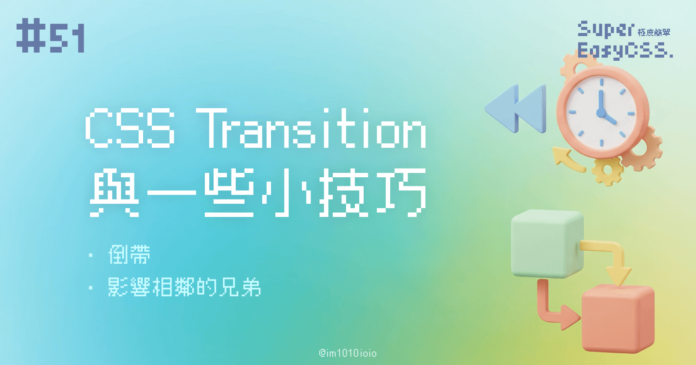
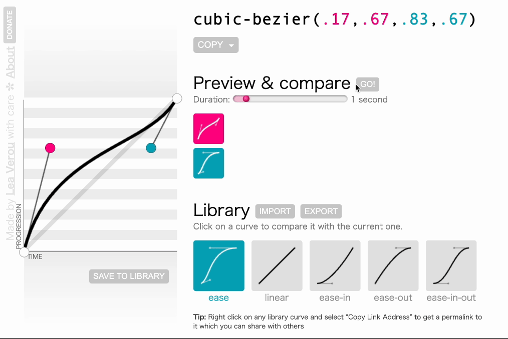

CSS 的 `transition` 是是兩個狀態之間的動畫過渡效果。但在實際應用中，常常會遇到一些容易忽略的細節與技巧。今天我們就來聊聊那些你可能還不知道的 `transition` 進階用法。

---

### 1\. `transition` 的運作原理：可計算的屬性

`transition` 是兩個狀態之間的過渡效果，但這個過渡效果只適用於可以計算的數值型屬性。例如，`width`、`height`、`opacity` 等等。所以，像 `auto` 、 `display: none` 或 `background-image` 這類非數值型屬性是無法有過渡效果的。

* **例子：**
    
    ```css
    div {
      width: 100px;
      height: 100px;
      background-color: blue;
      transition: width 0.5s;
    }
    
    div:hover {
      width: 200px;
    }
    ```
    
    當鼠標 `:hover`（懸停）時，`width` 將從 100px 緩慢過渡到 200px。相反，如果 `width` 設置為 `auto`，`transition` 將不起作用。
    

### 2\. `transition` 的速率控制：貝茲曲線

控制 `transition` 過程中的速率曲線很重要。CSS 提供了多種速率控制方式，例如線性 (linear)、加速 (ease-in)、減速 (ease-out) 等。

大家可使用下面的小工具模擬過渡動畫行進間的速率：



> 連結：[cubic-bezier()](https://cubic-bezier.com/)

如果需要更精確地控制過渡動畫的曲線時，也可以調整速率的曲線，這種曲線被稱為貝茲曲線 (cubic-bezier) ，是個強大的工具。

* **例子：**
    
    ```css
    div {
      transition: all 0.5s cubic-bezier(0.68, -0.55, 0.27, 1.55);
    }
    ```
    
    這是一個非線性的曲線，可以創造出更具彈性或獨特的過渡效果。你可以使用在線貝茲曲線生成器來調整效果。
    

### 3\. `transition` 的倒帶效果

你可能遇到過這樣的場景：鼠標移入時觸發 `transition`，但當移出時，如何讓過渡倒帶回初始狀態呢？其實只需要在 `:hover` 狀態中調整 `transition-delay` 的數值就可以了。

這在 iThome 鐵人講堂 Amos 老師的直撥中有提及過喔！大家可以去看看：

> 連結：[打造絢麗網頁，CSS動畫這樣玩起來](https://itplus.ithome.com.tw/vod-page/850)

* **例子：**
    
    ```css
    div {
        width: 100px;
        height: 100px;
        background-color: #faa;
        transition: width 1s 1s,
                    height 1s;
        &:hover {
            background-color: #f66;
            width: 300px;
            height: 300px;
            transition: width 1s,
                        height 1s 1s;
        }
    }
    ```
    
    > `hover` 在手機端不支援，會變成類似 `focus` 的效果，但並不是很保證能正常運作，因此這種效果僅適用於桌面瀏覽器。
    

### 4\. 進階應用：使用選擇器 `+` 和 `~`

除了單一元素的 `transition`，我們還可以使用 CSS 的兄弟選擇器 `+` 和 `~` 來實現相鄰元素或相關元素的過渡效果。

* **例子：**
    
    ```css
    .box {
      width: 100px;
      height: 100px;
      background-color: blue;
      transition: background-color 0.5s;
    }
    
    .box:hover + .box {
      background-color: red;
    }
    ```
    
    當鼠標懸停在第一個 `.box` 元素上時，第二個 `.box` 的背景色將過渡變為紅色，這樣可以實現相互影響的過渡效果。
    

---

透過這些進階技巧，靈活地掌控 CSS `transition`，就可以打造出更加流暢和專業的過渡動畫效果。

延伸閱讀：
[前端 - 你可能不知道的 transition 技巧与细节 - iCSS - SegmentFault 思否](https://segmentfault.com/a/1190000039139676)