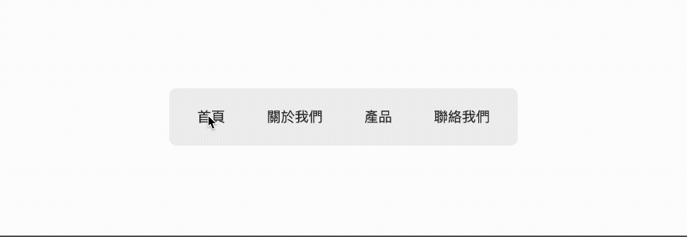
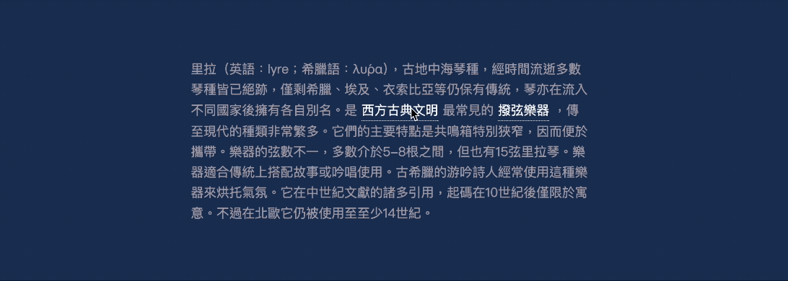

從前要用 CSS 精準地將一個元素（例如：Tooltip、下拉式選單）對齊另一個元素，總是要大費周章，甚至需要動用 JS 來計算位置。現在，CSS 推出了一個眾所期待的新功能：**Anchor Positioning**。它讓我們能以更單純的 CSS，將元素彼此「錨定」，輕鬆解決各種的定位難題。

---

## 一、Anchor Positioning 核心語法

Anchor Positioning (錨點定位) 就像在一個元素（錨點 an anchor）上掛上另一個元素（目標 a target）。無論錨點元素如何移動或改變大小，目標元素都會跟著它，並保持相對應的位置。

要使用 Anchor Positioning，主要會用到以下幾個新的 CSS 屬性：

### 1\. 定義錨點 `anchor-name`

在你想當作「錨點」的元素上，用這個屬性為它取一個獨一無二的名字（必須以 `--` 開頭，就像 CSS 變數一樣）。

```css
abbr {
  anchor-name: --my-anchor;
}
```

### 2\. 連結目標 `position-anchor`

在「目標」元素上，用這個屬性來指定它要跟隨的錨點名稱。

```css
/* .tooltip 會跟隨著名為 --my-anchor 的錨點 */
.tooltip {
  position-anchor: --my-anchor;
}
```

### 3\. 設定位置

你可以用以下兩種方式，告訴目標元素要顯示在錨點周圍的哪個位置：

* **精準定位：**`anchor()` 函式 這是最核心且彈性的定位方式。`anchor()` 函式可以取得錨點元素的各個邊界位置（如 `top`, `bottom`, `left`, `right`, `center`），讓你將目標元素的邊界與之對齊。
    
    * **範例：** `top: anchor(bottom);` 的意思是「**將目標元素的** `top` 對齊錨點的 `bottom`」。這會讓目標元素剛好出現在錨點元素的正下方。
        
* **快速方位：**`position-area` 屬性 當你只需要一個大概方位時，`position-area` 就非常方便。它將錨點周圍想像成一個 3x3 的網格，你可以用 `top`、`bottom`、`left`、`right`、`center` 等關鍵字，快速將目標元素放置在對應的格子裡。
    
    * **範例：** `position-area: bottom;` 是一個簡化的指令，它會將目標元素放置在錨點下方的中間區域。
        

---

## 二、實戰範例 DEMO

讓我們直接來看兩個超實用的例子吧！

### 1\. 滑順的 Tab 切換動畫

過去要做出 Tab 底線跟隨點擊項目移動的動畫，通常需要用 JavaScript 計算每個 Tab 的寬度和位置。現在有了 Anchor Positioning，一切都變得非常簡單！

#### **DEMO 效果**

當點擊不同的 Tab 時，底下的白色區塊會平滑地移動到對應的位置。



> DEMO 連結：[Tabs Switch by CSS Anchor Positioning](https://codepen.io/im1010ioio/pen/EaPVGRG)

**作法：**

1. **設定錨點 (Anchor):** 我們將目前被選中的 Tab（擁有 `data-state='active'` 屬性）設定為錨點，並命名為 `--active-tab`。
    
2. **設定目標 (Target):** 我們利用 `::before` 偽元素來當作那個會移動的白色區塊，並將它的 `position-anchor` 指向 `--active-tab`。
    
3. **定位與動畫:** 最後，我們使用 `anchor()` 函式設定目標元素的位置，讓它的寬度和位置完全等於錨點元素（例如 `left: anchor(left)` 和 `right: anchor(right)`），再加上 `transition` 屬性，流暢的動畫就完成了！
    

這個方法的好處是，無論你的 Tab 寬度是否一致，或是未來增減了 Tab 項目，CSS 都能自動幫你搞定，完全不需要用 JS 計算位置（不過 DEMO 中切換 active 狀態的 Class 還是使用 JS 喔）。

---

### 2\. 動態綁定的 Tooltip 提示框

在這個範例中，我們將展示如何**用一個 Tooltip 元件，來服務頁面上多個不同的觸發點**，這在實際開發中非常常見。

#### **DEMO 效果**

點擊段落中帶有底線的詞彙時，下方會出現對應的解釋 Tooltip。再次點擊或點擊頁面其他地方則會關閉。



> DEMO 連結：[Tooltip by CSS Anchor Positioning](https://codepen.io/im1010ioio/pen/wBMMJjo)

**作法：**

這個效果結合了 HTML、CSS 與 JS：

1. **HTML 結構：** 將需要提示的文字用 `<abbr>` 包起來，並將提示內容放在 `data-hint` 屬性中。頁面上只需要一個 `<span class="hint-tooltip"></span>` 作為共用的 Tooltip 顯示區。
    
2. **CSS 定位：** 設定 Tooltip 的基本樣式，並使用 `position-anchor` 將它與我們約定好的錨點名稱（例如 `--anchor-el`）綁定。
    
    ```css
    .hint-tooltip {
      /* 綁定到一個名為 --anchor-el 的錨點 */
      position-anchor: --anchor-el;
      
      /* 快速定位於錨點下方 */
      position-area: bottom;
      
      /* 其他樣式，預設透明隱藏 */
      opacity: 0;
      pointer-events: none;
      transition: opacity 0.2s;
    }
    
    .hint-tooltip.show {
      opacity: 1;
    }
    ```
    
3. **JavaScript 動態綁定：** 這是此範例的關鍵！我們不用在 HTML 寫死 `anchor-name`，而是在使用者點擊時才動態指定。
    
    ```javascript
    const tooltip = document.querySelector('.hint-tooltip');
    const abbrs = document.querySelectorAll('abbr');
    
    abbrs.forEach(abbr => {
      abbr.addEventListener('click', (e) => {
        // ... 省略重置樣式與判斷是否重複點擊的程式碼 ...
    
        // 1. 動態設定：將當前點擊的 abbr 設為錨點
        abbr.style.setProperty('anchor-name', '--anchor-el');
    
        // 2. 更新內容：讀取 data-hint 的文字，填入 tooltip
        const msg = abbr.getAttribute('data-hint');
        tooltip.textContent = msg;
    
        // 3. 顯示 Tooltip
        tooltip.classList.add('show');
      });
    });
    ```
    

透過這種方式，CSS Anchor Positioning 負責處理複雜的「定位」問題，而 JavaScript 只專注於處理「互動與資料」，分工明確，程式碼也變得更加簡潔優雅。

不過我也發現 CSS Anchor Positioning 在錨點是 inline 元素且換行時，會抓到一整行，所以這邊 `<abbr>` 我設定為 `inline-block`，讓他折行時會整串文字移動到下一行。

---

CSS Anchor Positioning 是一個非常新的功能，目前在 iOS 26 起的 Safari 剛支援，而 Firefox 目前尚未支援（詳細請看 [Can I Use](https://caniuse.com/css-anchor-positioning)）。 雖然還沒有全部瀏覽器支援，但它有強大潛力，因為它將許多以往只能依賴 JS 才能實現的複雜 Layout，回歸到 CSS 的裡。

> 延伸閱讀：
> 
> * [MDN - Using CSS anchor positioning](https://developer.mozilla.org/en-US/docs/Web/CSS/CSS_anchor_positioning/Using)
>     
> * [MDN - CSS anchor positioning](https://developer.mozilla.org/en-US/docs/Web/CSS/CSS_anchor_positioning)
>     
> * [Chrome for Developers - 錨定定位](https://web.dev/learn/css/anchor-positioning?hl=zh-tw)
>     

---

#### ↓↓↓↓↓↓↓↓↓↓↓↓↓↓↓↓↓↓↓↓

感謝看到最後的你，若你覺得獲益良多，請不要吝嗇給我按個喜歡。❤️

如果你喜歡我的創作，還想看看其他有趣的分享與日常，  
可以追蹤我的 IG [@im1010ioio](https://www.instagram.com/im1010ioio/)，或者是[🧋送杯珍奶鼓勵我](https://im1010ioio.bobaboba.me/)，謝謝你🥰。

