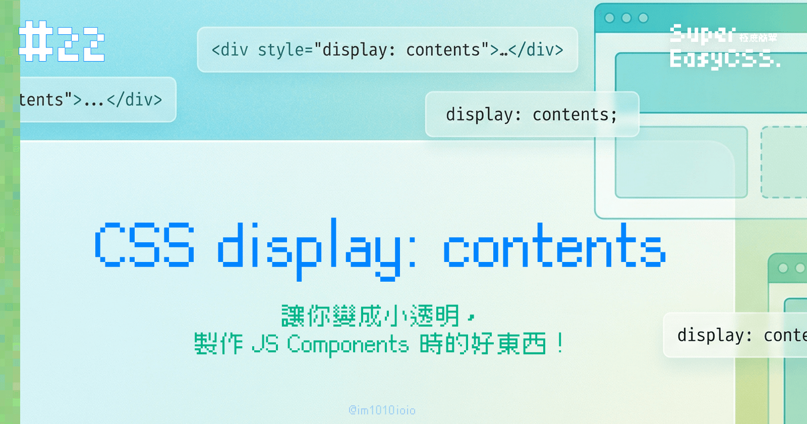
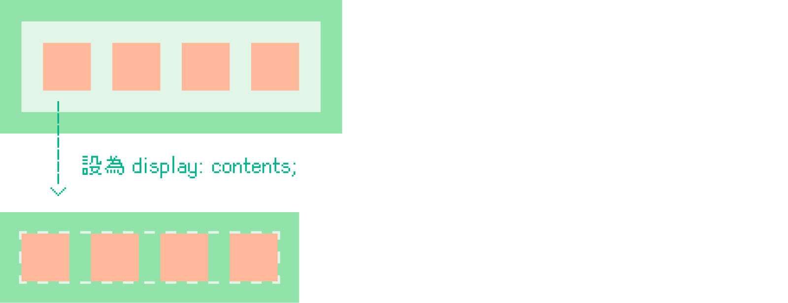
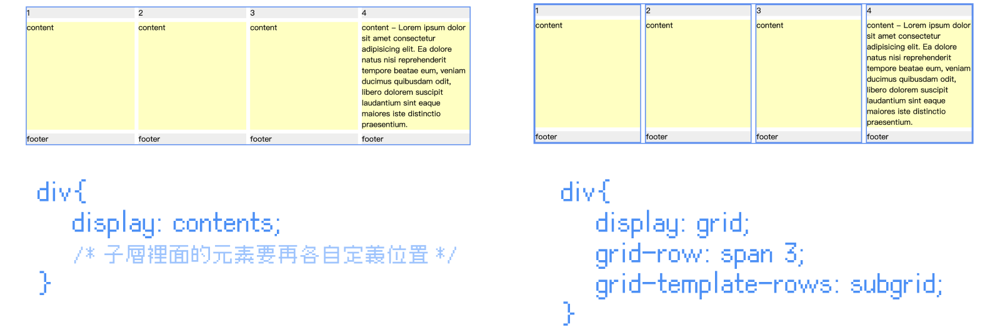
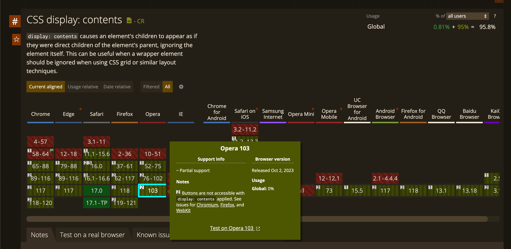

前幾篇在研究 Grid 與 Subgrid 時，發現有人說過去是使用 `display: contents;` 來代替 `subgrid` 的效果，我才知道原來還有這種 display。於是這篇就打算來研究這個屬性。

> #### **↓ 今日學習重點 ↓**
> 
> * 了解 display: contents; 是什麼？
>     
> * 了解 display: contents; 的運用時機
>     
> * 了解 display: contents; 與 subgrid 的差異
>     

---

## `display: contents;` 是什麼？

`display: contents;` 的主要作用是讓被設定元素不會產生任何盒子模型 (Box Model)，設定了後它的樣式和佈局將被視為透明的，也就是說不會有任何 margin、padding、background 等效果，但是它的子層會正常顯示，並且受到它的爺爺層的影響。

誰被設為 `display: contents;` 誰就變成小透明。

> 延伸閱讀：  
> [#13 CSS 盒子模型 (Box Model)：border-box & content-box](https://im1010ioio.hashnode.dev/css-box-model)  
> [#19 CSS Grid、Subgrid：網頁排版的神奇格子，來排個照片牆與雞腿便當吧！](https://im1010ioio.hashnode.dev/css-grid)

---

## 運用情境：製作 JS Components 時

這個屬性非常適合用在 JS Components 的時候，當我們將東西抽成 Components 時，常常需要再包一層 div 才能運作，但是許多排版會因爲了這一層而失效。

當我們希望樣式不受 Components 的容器影響，這時候 `display: contents;` 就派上用場了。

> 延伸閱讀：[巧用 display: contents 增强页面语义 - 掘金](https://juejin.cn/post/6844903973678219277)

---

## `display: contents` vs. `subgrid`

> * [display: contents DEMO 連結](https://codepen.io/im1010ioio/pen/LYMMGRY)
>     
> * [Subgrid DEMO 連結](https://codepen.io/im1010ioio/pen/XWoyrOe)
>     

回到一開始，為什麼使用 `display: contents;` 可以來代替 `subgrid` 的效果呢？原來是透過 `display: contents;` 忽略容器後，再另外設定每個子層在爺爺層 Grid 中的位置。

不過，相較於新的 `subgrid` 語法，這樣的設定比較麻煩，結論，Subgrid 勝！  
詳細請參考並比較上面 DEMO。

---

## 注意：目前無法使用在 button 上

> 支援度：["display: contents" | Can I use... Support tables for HTML5, CSS3, etc](https://caniuse.com/?search=display%3A%20contents)

不過，要注意的是，這個屬性目前雖然支援度 OK，但是在 Chrome、Edge、Firefox、Opera 上，無法運作在 `<button>` 上（2023/10）。

---

## 結語

有了 `display: contents;`，我們在寫網頁時能夠更彈性運用 HTML 結構，尤其是在開發 JS Components 的時候。希望這篇文章能夠幫助你。

---

#### ↓↓↓↓↓↓↓↓↓↓↓↓↓↓↓↓↓↓↓↓

感謝看到最後的你，若你覺得獲益良多，請不要吝嗇給我按個喜歡。❤️

如果你喜歡我的創作，還想看看其他有趣的分享與日常，  
可以追蹤我的 IG [@im1010ioio](https://www.instagram.com/im1010ioio/)，或者是[🧋送杯珍奶鼓勵我](https://im1010ioio.bobaboba.me/)，謝謝你🥰。

