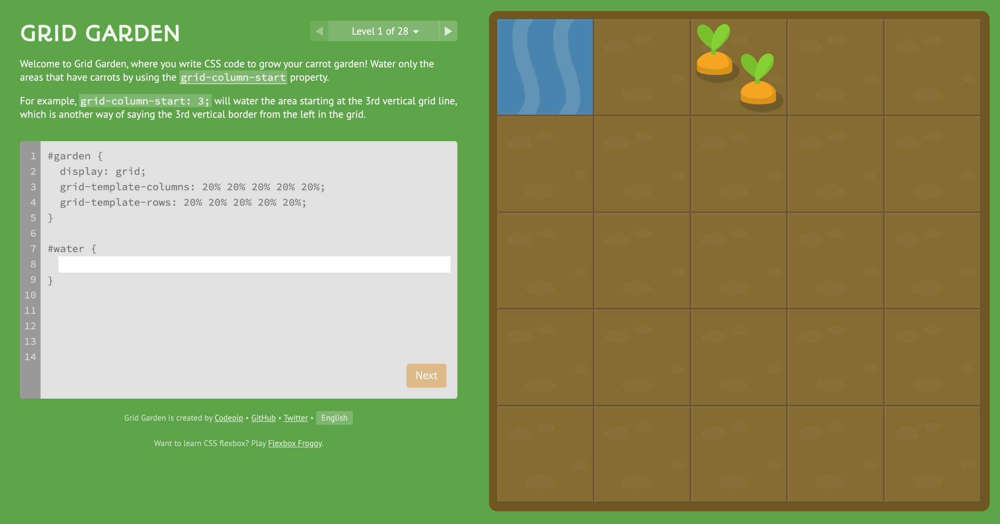
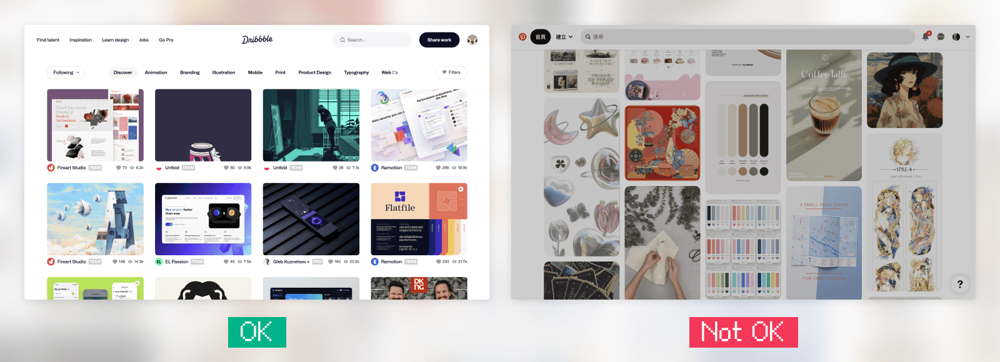

上一篇我們掌握了 Grid 的基礎，這一篇進入更多好用的功能！  
Subgrid 讓子元素也能對齊父層格線、gap 設定間距、order 調整排序，最後還有照片牆與 Bento Grid 的實戰應用！

> #### ↓ 今日學習重點 ↓
> 
> * 了解 Subgrid 的應用場景
>     
> * 學習 gap 與 order 的使用方法
>     
> * 認識照片牆和 Bento Grid 的排版方式
>     

---

## 一、Subgrid

> [DEMO 連結：Subgrid](https://codepen.io/im1010ioio/pen/XWoyrOe)

`subgrid` 是 `grid-template-columns` 和 `grid-template-rows` 新的屬性。讓子層繼承父層所定義的欄位大小、數量、gap。

最實用的情境如 DEMO，可統一內容的高度。

```css
.grid-container{
	display: grid;
	grid-template-rows: 1; /* 預設為 1，會自動延展 */
	grid-template-columns: repeat(4, 1fr);
	gap: .5rem;
	
	> div {
		display: grid;
		grid-row: span 3;
		/* 繼承了父層的 grid-template-rows 與 gap，自動延展對其所有內容 */
		grid-template-rows: subgrid;
	}
}
```

> 延伸閱讀：  
> [Firefox開始支援CSS Grid Level 2子網格，能產生過去不可能出現的網格布局 | iThome](https://www.ithome.com.tw/news/131145)  
> [【Day15】Grid再進化 - Subgrid - iT 邦幫忙](https://ithelp.ithome.com.tw/articles/10321145)

---

## 二、間距：gap


昨天我們有提過，`gap` 是 `row-gap` 與 `column-gap` 的縮寫，可以設置間距，可用在 `grid` 與 `flex` 排版上。

> 過去 grid 是使用 `grid-gap` 這個屬性設定間距，但現已被棄用，現在是使用 `gap` 與 flex 通用。

```css
.flex-container {
    /* 單值: 上下左右 */
    /* 雙值: 上下(row-gap) | 左右(column-gap) */
    gap: 2rem 1rem;

    /* 等同於：
    row-gap: 2rem;
    column-gap: 1rem; */
}
```

> 延伸閱讀：[gap - CSS: Cascading Style Sheets | MDN](https://developer.mozilla.org/en-US/docs/Web/CSS/gap)

---

## 三、順序調整：Order

與 flex 一樣，grid 也可以使用這個屬性可以重新排序，預設值為 0，讓 grid item 不再照著原本 html 的順序排序。

```css
.item {
    order: -1;
}
```

---

## 四、Grid 練習小遊戲

網路上有一些練習 CSS 的小遊戲，這裡介紹關於學習 Grid 的，分享給大家來玩玩看！

### GRID GARDEN

> 連結：[Grid Garden - A game for learning CSS grid](https://cssgridgarden.com/)



多年前 Amos 老師的直撥分享影有有帶著大家玩過，這部影片講解得十分詳細：

%[https://youtu.be/fYcz3FUqv7M?si=AtqWe-3AM63sijyd] 

---

## 五、Grid 適合使用的地方

### 1\. 照片牆、圖鑑



如上面有提到的，`minmax(最小值, 最大值)` 非常適合用在照片牆、圖鑑上（如：[Dribbble](https://dribbble.com/shots/popular/web-design) 或[寶可夢圖鑑](https://codepen.io/Rplus/pen/MbddMe)）。

不過，目前還無法使用 Gird 排版出瀑布流（如：[Pinterest](https://www.pinterest.com/)，照片高度不規則，尾端等距接續在一起），Grid 瀑布流還在實驗階段，目前要達成瀑布流效果還是得要靠 JS。

> 未來展望：[masonry-auto-flow - CSS: Cascading Style Sheets | MDN](https://developer.mozilla.org/en-US/docs/Web/CSS/masonry-auto-flow)

### 2\. Bento Grid UI Design

此外，最近還有一種很流行的設計風格叫作 Bento Grid，也非常適合使用 Grid 排版，本篇的標題有便當就是因此而來 XD。


> 延伸閱讀：  
> [2023 網頁設計趨勢：Bento Grid](https://medium.com/designforu/2023-%E7%B6%B2%E9%A0%81%E8%A8%AD%E8%A8%88%E8%B6%A8%E5%8B%A2-bento-grid-c94dacf6e45e)  
> [BentoGrids](https://bentogrids.com/)

當然，Grid 能使用的地方當然不只這些，前陣子一砲而紅的 [Threads 的網頁版](https://www.threads.net/)也是使用 Grid 排版的。

> 延伸閱讀：[深挖 Threads App 帖子布局，我进一步加深了对CSS网格布局的理解\_前端达人的博客-CSDN博客](https://blog.csdn.net/Ed7zgeE9X/article/details/132114173)

CSS Grid 要如何使用，就交給大家去自由探索囉！

---

## 後記

其實在寫這篇之前我不會 Grid，我全都使用 Flex 排版，現在才學會這個好東西。

鐵人賽中途寫了 10 幾篇後覺得自己好棒，想放鬆，就去看完了派對咖孔明，結果咧⋯⋯存稿就用光了，還要學一堆 Grid 新東西，差點要棄賽啦！好險趕得及！XD

我⋯⋯下幾篇要寫少一點的東西⋯⋯😂

> 教學資源：  
> [CSS GRID / CSS格線好好玩【完整版】 | CSS教學 | CSS格線](https://youtu.be/fYcz3FUqv7M?si=AtqWe-3AM63sijyd)  
> [強大的CSS grid網格排版-介紹與應用 · 這裡是YUKI](https://yukihiew.com/about-css-grid/)  
> [CSS Grid 网格布局教程 - 阮一峰的网络日志](https://ruanyifeng.com/blog/2019/03/grid-layout-tutorial.html)

---

---

> 👈 **上一篇：[CSS Grid 排版入門：建立格子、劃分區域、fr 單位與 minmax() 實用語法](/layout/css-grid)**

---

#### ↓↓↓↓↓↓↓↓↓↓↓↓↓↓↓↓↓↓↓↓

感謝看到最後的你，若你覺得獲益良多，請不要吝嗇給我按個喜歡。❤️

如果你喜歡我的創作，還想看看其他有趣的分享與日常，  
可以追蹤我的 IG [@im1010ioio](https://www.instagram.com/im1010ioio/)，或者是[🧋送杯珍奶鼓勵我](https://im1010ioio.bobaboba.me/)，謝謝你🥰。

