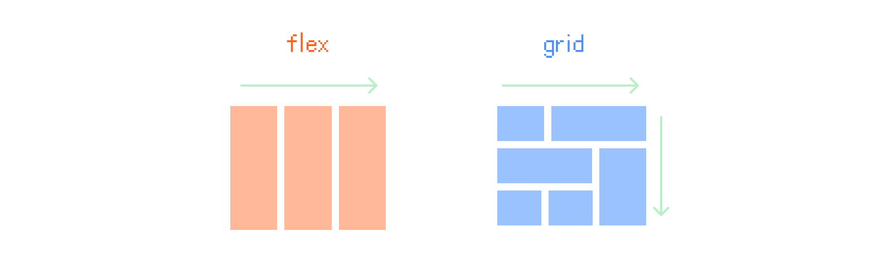
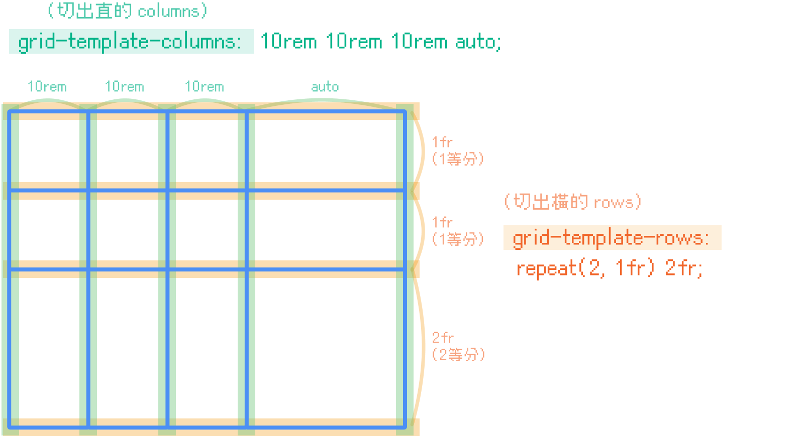
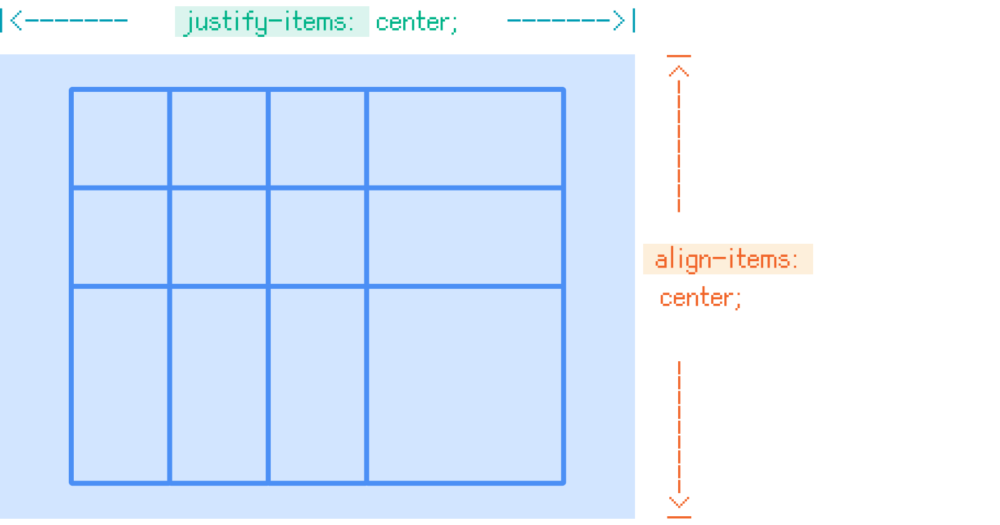
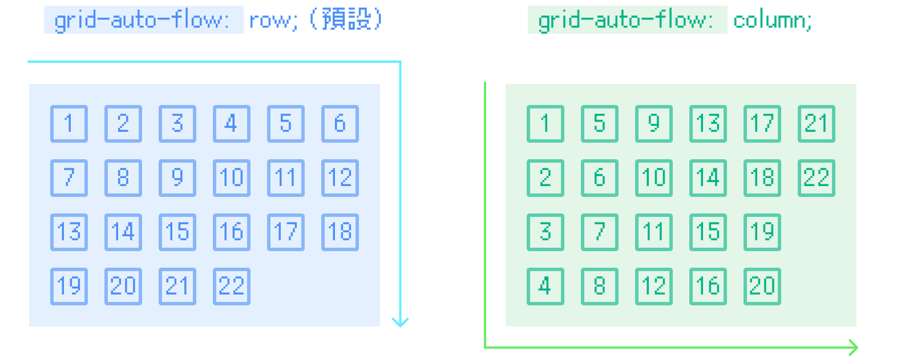
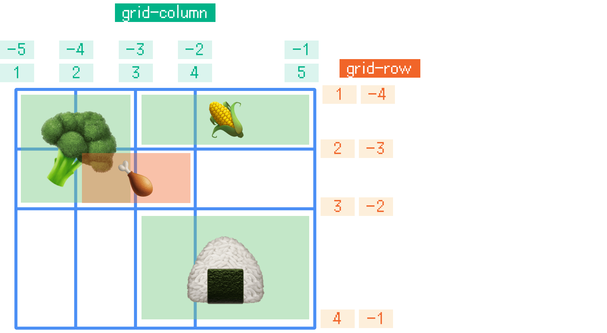
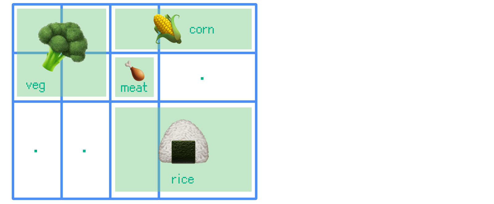

昨天我們介紹的 `flex` 是單向的排版，而今天我們要探討 `grid` ，它是雙向的排版，可以創造很多行與列。`grid` 也是十分好用的 CSS，大家一起學起來吧！



> #### ↓ 今日學習重點 ↓
> 
> * 學習 Grid 容器的各種設定
>     
> * 了解如何劃分 Grid 區域
>     
> * 了解 Subgrid
>     
> * 學習 Grid 細節設定：Gap、Order
>     

---

## 一、Grid 容器

和 flex 一樣，首先要準備一個 `grid` 容器。

### 1\. 建立一個基本的 Grid

我們將這個容器設為 `display: grid;`，接著我們要使用：

* `grid-template-rows` （切出**橫的 rows**）和
    
* `grid-template-columns` （切出**直的 columns**）來畫格子。
    

我們以一個範例來說明：

> [DEMO 連結：Grid Container](https://codepen.io/im1010ioio/pen/MWZqRmN)



### 2\. 排列

* `justify-items` 設定儲存格內容的水平位置（左中右），
    
* `align-items` 設定儲存格內容的垂直位置（上中下），
    
* 而 `place-items` 是 `align-items` 和 `justify-items` 的合併簡寫形式。
    



```css
.container {
    justify-items: start | end | center | stretch;
    align-items:   start | end | center | stretch;

    /* 簡寫：
    place-items: align-items的值 justify-items的值;
     */
}
```

### 3\. Grid 專用的關鍵字與語法

#### (1) 自動延展：`auto`

在 grid 中，當單位設為 `auto`，會隨著父層自動填滿剩餘空間。

#### (2) 幾等分：`fr`

在 grid 中，除了可以使用一般的 CSS 單位外，還可以使用一個 grid 專用的單位： `fr`（fraction），意思是「平均幾等分」。

#### (3) 重複：`repeat()`

重複的部分可以使用 `repeat(個數, 單位)` 簡寫。  
例如：`repeat(2, 1fr)` 是「重複 2 個平均二等分」。

#### (4) 自動填滿：`auto-fill`

> [DEMO 連結：Grid auto-fill](https://codepen.io/im1010ioio/pen/QWzZQRG)

`auto-fill` 會自動計算並於剩餘空間內填滿格子，無需手動指定每個格子的數量。  
例如：`repeat(auto-fill, 100px)` 是「重複，並自動填滿多個 100px 格子」。

#### (5) 最大最小值：`minmax(最小值, 最大值)` （好用！重要！）

> [DEMO 連結：Grid auto-fill + minmax()](https://codepen.io/im1010ioio/pen/jOXezNB)，  
> 另外可參考網路上 R+ 大大的 DEMO：[**Pokédex in CSS grid**](https://codepen.io/Rplus/pen/MbddMe)

指定格子的大小範圍，可以設定最大最小值。  
例如：`repeat(auto-fill, minmax(100px, 1fr))` 是「**重複，並自動填滿多個格子，每個格子最小是 100px，最大是平均一等分**」。這個超級好用！很適合做照片牆或圖鑑。

### 4\. 排序方式：`grid-auto-flow`



#### (1) `row` / `column`

`grid-auto-flow` 決定排列的方式，預設值是 `row`，就是「先橫的，再直的」，也可以將它設為 `column`，變成「先直的，再橫的」。

#### (2) `dense`

除了設定成 `row` 和 `column`，還可以設成 `row dense` 和 `column dense`，意思是如果有多的空間就填滿，這個情況比較常發生在有大有小的格子上。

> 延伸閱讀：  
> [CSS Grid 网格布局教程 - 阮一峰的网络日志](https://ruanyifeng.com/blog/2019/03/grid-layout-tutorial.html)  
> [CSS grid-auto-flow深入理解 « 张鑫旭-鑫空间-鑫生活](https://www.zhangxinxu.com/wordpress/2020/01/css-grid-auto-flow/)

---

## 二、劃分 Grid 區域

有了基本的格子後，我們可以開始劃分區域，1 個格子可以佔據 2 格或是多格的寬度，劃分的方法有兩種：

1. 依據「格線」
    
2. 依據「區域命名」
    

只不過，Grid 劃分區域時，只能指定矩形區域，沒辦法指定 L 形或 T 形區域。

### 1\. 依據「格線」：`grid-area` (`grid-row`/`grid-column`)

依據格線劃分區域時，我們可以指定 `grid-row` 與 `grid-column`，是從哪條線到哪條線。這兩者可以使用 `grid-area` 簡寫。

寫法是使用線的序號指定：

* 序號由 1 開始，用斜線隔開。
    
* 若數值為負的，則是指倒數過來第幾條線。
    
* 也可使定跨越的格子：`span 跨越的格數`，這邊的 span 並不是指 HTML 中的 `<span>`。
    

使用這種方法，指定的區域是可以重疊的，可以另外設定 `z-index`，調整他的前後。

```css
.cell-corn{
    /* 若只寫一個數值，代表由這條線開始到下一條線 (1格) */\
	grid-row: 1;
	grid-column: 3 / -1; /* 由第 3 條到倒數第 1 條線 */

 /* 等同於：
    grid-area: 1 / 3 / 2 / -1 ; 
    grid-area: row-start / column-start / row-end / column-end */
}

.cell-meat{
	grid-row: 2;
	grid-column: 2 / span 2; /* 由第 2 條線開始，跨 2 格 */
	
	/* 使用 z-index 將這格調到前面 */
	z-index: 2;
}
```

另外，也可以將格線命名，命名方式在畫線時使用中括號 `[]` 定義：

```css
.grid-container{
	/* 線是可以命名的 */
	grid-template-columns: [first-col-line]10rem 10rem 10rem auto;
}

.cell-veg{
	/* 使用線的名稱 */
	grid-column: first-col-line / 3 ;
}
```

以下是實際範例，讓我們來排版一個雞腿便當：

> [DEMO 連結：Grid Area (Grid Row / Grid Column)](https://codepen.io/im1010ioio/pen/rNoqpYN)



### 2\. 依據「區域命名」：`grid-template-areas`

另外一種方式，是先將區塊用 `grid-area` 命名後，再使用 `grid-template-areas` 用冒號一行一行照順序排列，如果是空白格則使用 `.` 代表。

使用這種方式，沒辦法建立重疊的區域。

這種方式的優點是在格線簡單時，一目了然，可是當格線複雜時，反而會很難閱讀。

```css
.cell-veg{  grid-area: veg; }
.cell-corn{ grid-area: corn; }
.cell-rice{ grid-area: rice; }
.cell-meat{ grid-area: meat; }

.grid-container {
	grid-template-areas:
		"veg veg corn corn"
		"veg veg meat  .  "
		" .   .  rice rice";
}
```

以下是實際範例，讓我們來排版一個雞腿便當：

> [DEMO 連結：Grid Area (Grid Template Areas)](https://codepen.io/im1010ioio/pen/QWzZQry)



### 3\. 隱形格線

Grid 有個特性，如果指定位置，在現有格子的外面。 例如：Grid 只有 3 行，但是某一個 item 指定在第 5 行。 這時，瀏覽器會自動產生多餘的格子。

#### (1) `grid-auto-columns` / `grid-auto-rows`

`grid-auto-columns` 和 `grid-auto-rows` 就是用來設定，這些多餘格子的寬和高。如果不指定，格子的高度是依據內容物的大小。

```css
.container {
    display: grid;
    grid-template-columns: 100px 100px 100px;
    grid-template-rows: 100px 100px 100px; /* 有三排 row */
    
    /* 第三排以後多餘的 row 的格子高度為 50px */
    grid-auto-rows: 50px; 
}
```

---

## 三、Subgrid

> [DEMO 連結：Subgrid](https://codepen.io/im1010ioio/pen/XWoyrOe)

`subgrid` 是 `grid-template-columns` 和 `grid-template-rows` 新的屬性。讓子層繼承父層所定義的欄位大小、數量、gap。

最實用的情境如 DEMO，可統一內容的高度。

```css
.grid-container{
	display: grid;
	grid-template-rows: 1; /* 預設為 1，會自動延展 */
	grid-template-columns: repeat(4, 1fr);
	gap: .5rem;
	
	> div {
		display: grid;
		grid-row: span 3;
		/* 繼承了父層的 grid-template-rows 與 gap，自動延展對其所有內容 */
		grid-template-rows: subgrid;
	}
}
```

> 延伸閱讀：  
> [Firefox開始支援CSS Grid Level 2子網格，能產生過去不可能出現的網格布局 | iThome](https://www.ithome.com.tw/news/131145)  
> [【Day15】Grid再進化 - Subgrid - iT 邦幫忙](https://ithelp.ithome.com.tw/articles/10321145)

---

## 四、間距：gap


昨天我們有提過，`gap` 是 `row-gap` 與 `column-gap` 的縮寫，可以設置間距，可用在 `grid` 與 `flex` 排版上。

> 過去 grid 是使用 `grid-gap` 這個屬性設定間距，但現已被棄用，現在是使用 `gap` 與 flex 通用。

```css
.flex-container {
    /* 單值: 上下左右 */
    /* 雙值: 上下(row-gap) | 左右(column-gap) */
    gap: 2rem 1rem;

    /* 等同於：
    row-gap: 2rem;
    column-gap: 1rem; */
}
```

> 延伸閱讀：[gap - CSS: Cascading Style Sheets | MDN](https://developer.mozilla.org/en-US/docs/Web/CSS/gap)

---

## 五、順序調整：Order

與 flex 一樣，grid 也可以使用這個屬性可以重新排序，預設值為 0，讓 grid item 不再照著原本 html 的順序排序。

```css
.item {
    order: -1;
}
```

---

## 六、Grid 練習小遊戲

網路上有一些練習 CSS 的小遊戲，這裡介紹關於學習 Grid 的，分享給大家來玩玩看！

### GRID GARDEN

> 連結：[Grid Garden - A game for learning CSS grid](https://cssgridgarden.com/)


多年前 Amos 老師的直撥分享影有有帶著大家玩過，這部影片講解得十分詳細：

%[https://youtu.be/fYcz3FUqv7M?si=AtqWe-3AM63sijyd] 

---

## 結論：Grid 適合使用的地方

### 1\. 照片牆、圖鑑


如上面有提到的，`minmax(最小值, 最大值)` 非常適合用在照片牆、圖鑑上（如：[Dribbble](https://dribbble.com/shots/popular/web-design) 或[寶可夢圖鑑](https://codepen.io/Rplus/pen/MbddMe)）。

不過，目前還無法使用 Gird 排版出瀑布流（如：[Pinterest](https://www.pinterest.com/)，照片高度不規則，尾端等距接續在一起），Grid 瀑布流還在實驗階段，目前要達成瀑布流效果還是得要靠 JS。

> 未來展望：[masonry-auto-flow - CSS: Cascading Style Sheets | MDN](https://developer.mozilla.org/en-US/docs/Web/CSS/masonry-auto-flow)

### 2\. Bento Grid UI Design

此外，最近還有一種很流行的設計風格叫作 Bento Grid，也非常適合使用 Grid 排版，本篇的標題有便當就是因此而來 XD。


> 延伸閱讀：  
> [2023 網頁設計趨勢：Bento Grid](https://medium.com/designforu/2023-%E7%B6%B2%E9%A0%81%E8%A8%AD%E8%A8%88%E8%B6%A8%E5%8B%A2-bento-grid-c94dacf6e45e)  
> [BentoGrids](https://bentogrids.com/)

當然，Grid 能使用的地方當然不只這些，前陣子一砲而紅的 [Threads 的網頁版](https://www.threads.net/)也是使用 Grid 排版的。

> 延伸閱讀：[深挖 Threads App 帖子布局，我进一步加深了对CSS网格布局的理解\_前端达人的博客-CSDN博客](https://blog.csdn.net/Ed7zgeE9X/article/details/132114173)

CSS Grid 要如何使用，就交給大家去自由探索囉！

---

## 後記

其實在寫這篇之前我不會 Grid，我全都使用 Flex 排版，現在才學會這個好東西。

鐵人賽中途寫了 10 幾篇後覺得自己好棒，想放鬆，就去看完了派對咖孔明，結果咧⋯⋯存稿就用光了，還要學一堆 Grid 新東西，差點要棄賽啦！好險趕得及！XD

我⋯⋯下幾篇要寫少一點的東西⋯⋯😂

> 教學資源：  
> [CSS GRID / CSS格線好好玩【完整版】 | CSS教學 | CSS格線](https://youtu.be/fYcz3FUqv7M?si=AtqWe-3AM63sijyd)  
> [強大的CSS grid網格排版-介紹與應用 · 這裡是YUKI](https://yukihiew.com/about-css-grid/)  
> [CSS Grid 网格布局教程 - 阮一峰的网络日志](https://ruanyifeng.com/blog/2019/03/grid-layout-tutorial.html)

---

#### ↓↓↓↓↓↓↓↓↓↓↓↓↓↓↓↓↓↓↓↓

感謝看到最後的你，若你覺得獲益良多，請不要吝嗇給我按個喜歡。❤️

如果你喜歡我的創作，還想看看其他有趣的分享與日常，  
可以追蹤我的 IG [@im1010ioio](https://www.instagram.com/im1010ioio/)，或者是[🧋送杯珍奶鼓勵我](https://im1010ioio.bobaboba.me/)，謝謝你🥰。

