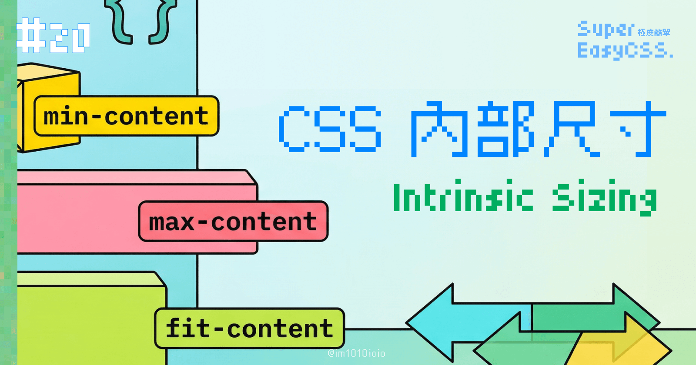
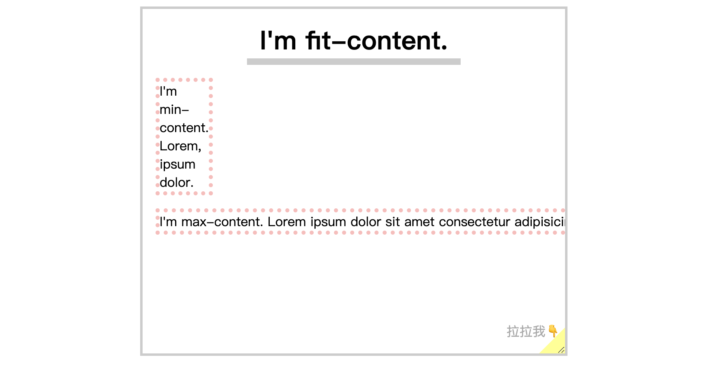
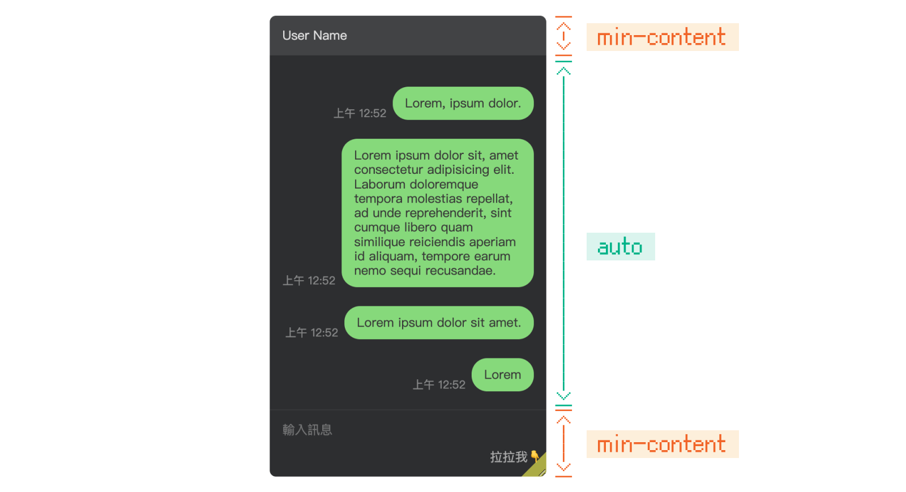
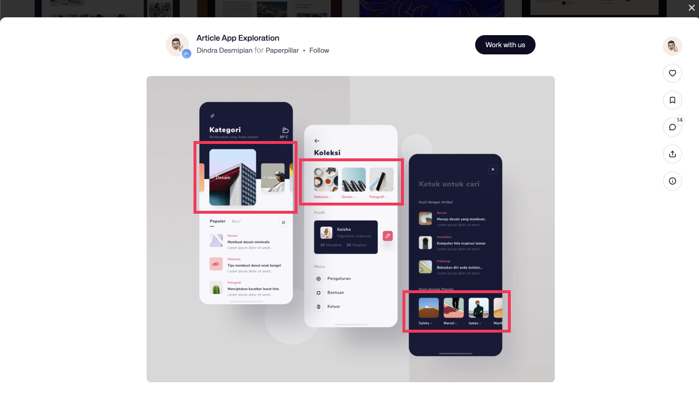
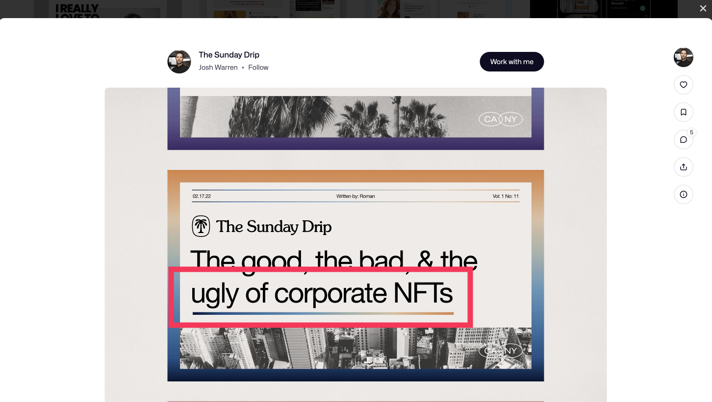

今天來點簡單的主題！

CSS 中的尺寸分為兩種，一種叫做「外部尺寸（Extrinsic Sizing）」，尺寸由元素的外部決定，我們在之前提過的單位介紹，好比說 px、em、rem⋯⋯都是屬於這類。

另外，還有一種新的尺寸，叫做「內部尺寸（Intrinsic Sizing）」，尺寸由元素的內部決定，共有以下三種：`min-content`、`max-content` 和 `fit-content` 。我發現許多人會搭配上篇介紹的 Grid 使用。

> #### **↓ 今日學習重點 ↓**
> 
> * 了解 3 個 CSS 內部尺寸與實際應用：`min-content`、`max-content` 和 `fit-content`
>     

---

要快速了解這三種單位，我簡單做了以下的 DEMO：

> [DEMO 連結：CSS Intrinsic Sizing: min-content, max-content, fit-content](https://codepen.io/im1010ioio/pen/rNoQVRz)



---

## 1\. `min-content`

`min-content` 是元素最小的（單字）長度。  
在使用 Grid 時，可以使用這個單位來固定 header 或 footer 之類的固定高度區塊，比如說一個聊天版面：

> [DEMO 連結：Grid with min-content](https://codepen.io/im1010ioio/pen/GRPwpjR)



```css
.grid-container{
	display: grid;
	grid-template-rows: min-content auto min-content;
	align-items: stretch;
}
```

---

## 2\. `max-content`

`max-content` 是如果容器有足夠的空間，元素內容最長的長度，當容器太小也不會折行。  
它的效果幾乎和 `white-space: nowrap;` 一模一樣。

不過有了這個單位，還能用在文字以外的地方，也和 flex nowrap 很像，不過有了它就可以只設定寬度就輕鬆實現。比如說：文章是動態產生時，當數量超過螢幕寬度時不要折行，可以左右滾動，如下圖紅框處：



> [參考設計：Article App Exploration](https://dribbble.com/shots/6290143-Article-App-Exploration?utm_source=Clipboard_Shot&utm_campaign=dindrad&utm_content=Article%20App%20Exploration&utm_medium=Social_Share&utm_source=Clipboard_Shot&utm_campaign=dindrad&utm_content=Article%20App%20Exploration&utm_medium=Social_Share)

---

## 3\. `fit-content`

`fit-content` 在容器寬度夠的情況下是元素內容最長的尺寸，不過當容器太小時會折行。  
這個用在文字標題、文字段落等等的裝飾設計時，會非常實用，如開頭的 DEMO，或下圖紅框處的漸層線條裝飾：



> [參考設計：The-Sunday-Drip](https://dribbble.com/shots/18611934-The-Sunday-Drip?utm_source=Clipboard_Shot&utm_campaign=joshwarren&utm_content=The%20Sunday%20Drip&utm_medium=Social_Share&utm_source=Clipboard_Shot&utm_campaign=joshwarren&utm_content=The%20Sunday%20Drip&utm_medium=Social_Share)

---

## 結論

有了這幾種內部尺寸，可以打破了原先 `display` 的寬度特性；也就是說，我們可以在不改變元素 `display` 的情況下，去改變它的尺寸，避免其他相依於這個 display 性質的東西壞掉。

例如：`block` 明明應該佔據一整行，但是當我添加了 `width: fit-content;`，這個 `block` 只擁有自己內容的寬度。

當然，也可以做到相反的事情：當我內容應該只有自身的長度，卻佔據一整行，不過這是個叫做 `stretch` (`fill`/`fill-available`) 的屬性，目前還沒有正式支援，要加上前綴字才能使用，所以本篇並沒有介紹，我們可以再觀望一下。

> ["fill-available" | Can I use... Support tables for HTML5, CSS3, etc](https://caniuse.com/?search=fill-available)

總之，這些新單位讓我們排版變得更彈性了（也更難了），大家可以來試試看！如果你們發現內部尺寸還有什麼實用的用法，歡迎在底下留言告訴我喔！

> 延伸閱讀：  
> [理解CSS3 max/min-content及fit-content等width值 « 张鑫旭-鑫空间-鑫生活](https://www.zhangxinxu.com/wordpress/2016/05/css3-width-max-contnet-min-content-fit-content/)

---

#### ↓↓↓↓↓↓↓↓↓↓↓↓↓↓↓↓↓↓↓↓

感謝看到最後的你，若你覺得獲益良多，請不要吝嗇給我按個喜歡。❤️

如果你喜歡我的創作，還想看看其他有趣的分享與日常，  
可以追蹤我的 IG [@im1010ioio](https://www.instagram.com/im1010ioio/)，或者是[🧋送杯珍奶鼓勵我](https://im1010ioio.bobaboba.me/)，謝謝你🥰。

