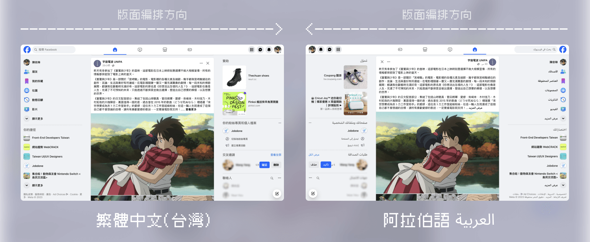
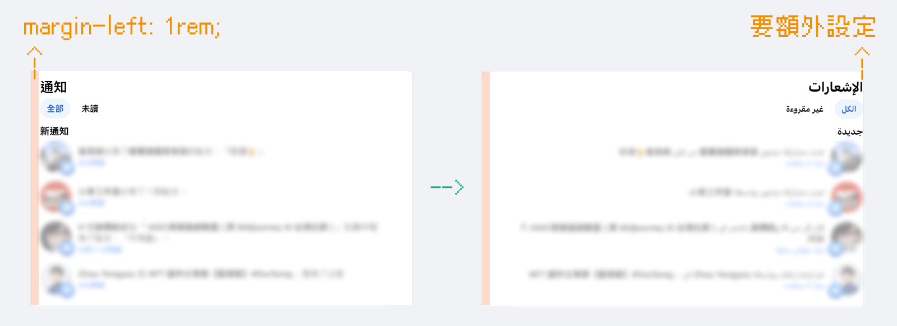
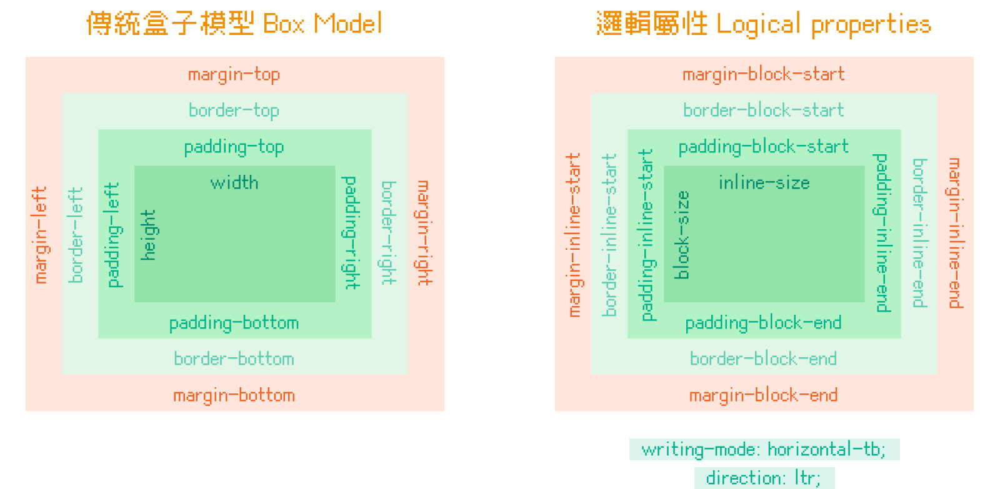
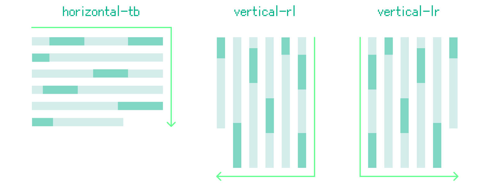
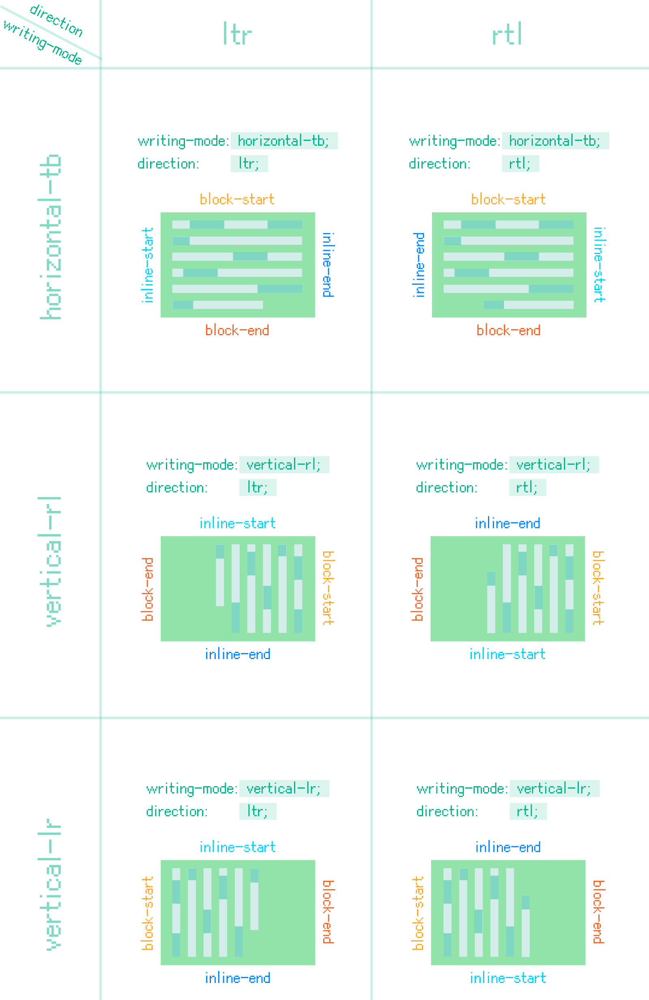
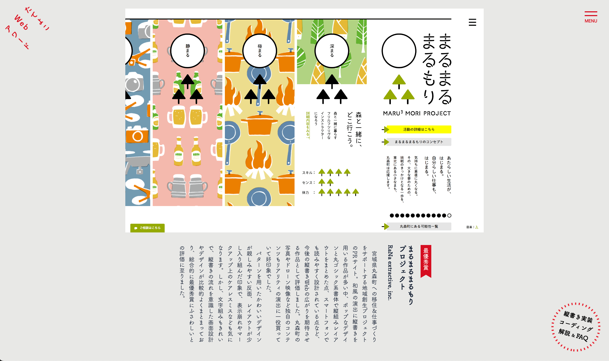
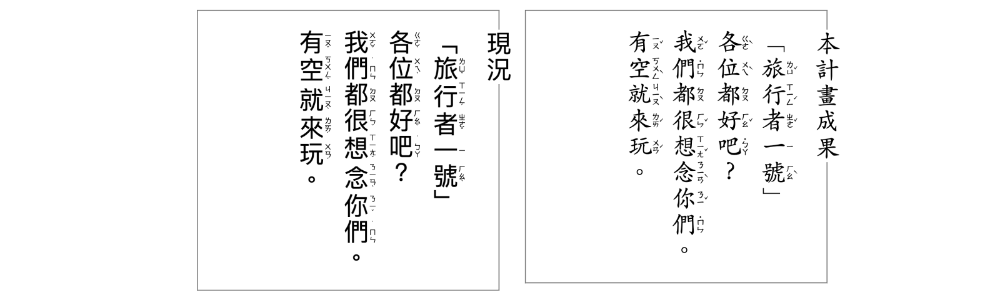

CSS 新推出了另外一種排版邏輯，叫作邏輯屬性（Logical properties），特別是針對需要處理多語系和不同書寫方向的內容。

今天，讓我們來了解邏輯屬性是什麼吧！

> #### **↓ 今日學習重點 ↓**
> 
> * 了解 CSS 邏輯屬性的使用情境
>     
> * 了解 CSS 邏輯屬性的語法
>     

---

## CSS 邏輯屬性是什麼？

CSS 邏輯屬性是基於內容的語言和書寫方向來設定樣式。舉個例子，FB 就針對阿拉伯語由右至左書寫，做了整體版面的調整：



以前，我們通常使用傳統的盒子模型（Box Model）來設定樣式，但這在處理多語言網頁時可能會造成一些麻煩。例如，如果我們只用「`left` 或 `right`」調整左右方向的排版時，可能會遇到這個情況：



所以，CSS 發展出了邏輯屬性（Logical properties），讓版面能夠針對語言的方向自動調整。

---

## 邏輯屬性的語法



凡是有「方向」概念的 CSS 屬性都可以轉換為邏輯屬性，命名的大方向是將原有的 `left` 或 `right` 改為 `block`、 `inline`、`start` 與 `end`：

### 1\. 寬度

* `width` -&gt; `inline-size`
    
* `min-width` -&gt; `min-inline-size`
    
* `max-width` -&gt; `max-inline-size`
    

### 2\. 高度

* `height` -&gt; `block-size`
    
* `min-height` -&gt; `min-inline-size`
    
* `max-height` -&gt; `max-inline-size`
    

### 3\. Position 定位屬性

* `top` -&gt; `inset-block-start`
    
* `bottom` -&gt; `inset-block-end`
    
* 以上可簡寫為：`inset-block`
    
* `left` -&gt; `inset-inline-start`
    
* `right` -&gt; `inset-inline-end`
    
* 以上可簡寫為：`inset-inline`
    

### 4\. Margin / Padding / Border

* `margin-top` -&gt; `margin-block-start`
    
* `margin-bottom` -&gt; `margin-block-end`
    
* 以上可簡寫為：`margin-block`
    
* `margin-left` -&gt; `margin-inline-start`
    
* `margin-right` -&gt; `margin-inline-end`
    
* 以上可簡寫為：`margin-inline`
    
* `padding-*` 與 `border-*` 就是把以上的 `margin` 換為 `padding` 與 `border`
    

### 5\. Float

* `float: left;` -&gt; `float: inline-start;`
    
* `float: right;` -&gt; `float: inline-end;`
    

### 6\. Text-align

* `text-align: left;` -&gt; `text-align: start;`
    
* `text-align: right;` -&gt; `text-align: end;`
    

### 7\. Flex 與 Grid

Flex 與 Grid 不需要改變語法，就能適應邏輯屬性的變化。

或許，你能從 Flex 與 Grid 的語法命名中推敲出，這是因為有考量到邏輯屬性才如此設計命名。

---

## 邏輯屬性的依據：`writing-mode`、`direction`

當我們將元素設定為邏輯屬性時，這些有「方向」概念的 CSS 屬性的將會隨著 CSS 的 `writing-mode` 與 `direction` 變更，詳細可以玩玩看：

> [網路上對岸大神大漠的邏輯屬性 DEMO](https://codepen.io/airen/pen/yLyPzee) 。

### 1\. writing-mode



> [writing-mode - CSS：层叠样式表 | MDN](https://developer.mozilla.org/zh-CN/docs/Web/CSS/writing-mode)

`writing-mode` 屬性用於指定元素的書寫模式，可以是：

* `horizontal-tb` (horizontal top bottom)：水平（預設）
    
* `vertical-rl` (vertical right left)：垂直（由右至左）
    
* `vertical-lr` (vertical left right)：垂直（由左至右）
    

### 2\. direction

> [direction - CSS: Cascading Style Sheets | MDN](https://developer.mozilla.org/en-US/docs/Web/CSS/direction)

`direction` 屬性用於指定文字的書寫方向，搭配 `writing-mode` 屬性，會有不一樣的方向：

* `ltr` (left to right)：由左至右 / 從上到下 / 從 `start` 到 `end`（預設）
    
* `rtl` (right to left)：由右至左 / 從下到上 / 從 `end` 到 `start`
    

```css
p {
    direction: rtl;
}
```

不過可以的話，避免使用 CSS 的 `direction`，而是使用 HTML `dir` 屬性，因為這樣 HTML 語意會比較好。以此延伸，CSS 也因此新增了選擇器 `:dir()`，只不過支援度還不夠好，目前只有 Safari 與 Firefox 支援（2023/10）。

```xml
<p dir="rtl">這是一段句子。</p>
```

```css
/* 目前只有 Safari 與 Firefox 支援以下寫法（2023/10）： */
p:dir(rtl) { ... }

/* 如果需要使用，可以考慮使用屬性選擇器： */
p[dir="rtl"] { ... }
```

> 支援度：["dir" | Can I use... Support tables for HTML5, CSS3, etc](https://caniuse.com/?search=dir)

---

## 邏輯屬性的結果

這邊將各種排列組合結果整理給大家參考：



---

## 結語

CSS 邏輯屬性雖然還沒有被廣泛使用，但目前支援度已經還不錯，而且它在製作多語言網站的時非常有幫助，所以我認為是值得被看好的 CSS 屬性。

文字書寫一直以來是人類文化紀錄的載體，可惜過去網路上的思想表達幾乎是以橫向為主，現在網頁開發終於變得更彈性，表達的自由度被大幅提高，讓設計可以更加不受限。

本篇介紹的範例都是阿拉伯文，但我期待未來的網頁可以有更多直式書寫的網頁設計，讓我們能夠創造出屬於我們文化的網頁。

### 直式網頁的可能性？

#### (1) 日本直式網頁設計推廣 & 比賽

> 連結：[縦書きWeb普及委員会](https://tategaki.github.io/)（[2017 比賽](https://tategaki.github.io/awards/) / [2016 比賽](https://tategaki.github.io/awards2016/) / [2015 比賽](https://tategaki.github.io/awards2015/)）



說到直式網頁設計，目前還是以日本設計的網頁居多，這邊和大家分享以前看到日本的直式網頁設計推廣組織「縦書きWeb普及委員会」。

他們以前辦了好幾年的直式網頁設計比賽，這些設計很值得參考，而且該組織官網本身就是日本 GOOD DESIGN AWARD 2018 年的優秀設計獎。可惜該組織到 2018 年後就沒有繼續舉辦比賽了。

#### (2) 台灣注音符號的數位排版

> [注音符號調號之數位排版](https://cmex-30.github.io/Bopomofo_on_Web/testpage/index.html)（[Github](https://github.com/cmex-30/Bopomofo_on_Web)）  
> [從注音字體談資訊設計. 為什麼在資訊結構上，我們得做得更多？ | by Bobby Tung | Medium](https://bobtung.medium.com/%E5%BE%9E%E6%B3%A8%E9%9F%B3%E5%AD%97%E9%AB%94%E8%AB%87%E8%B3%87%E8%A8%8A%E8%A8%AD%E8%A8%88-14cb09ff9d52)  
> [DEMO 連結：中文注音符號標示 Chinese Bopomofo with HTML RUBY](https://codepen.io/im1010ioio/pen/MWVYzXE)



雖然與這篇沒有正相關，順便與大家介紹之前發現關於注音符號音標於網頁上的研究計畫。

曾經有人討論過注音之所以難以推廣，有一部分也是因為書寫與顯示方式困難，也許搭配 CSS 的邏輯屬性，能讓我們未來的教育能更多種呈現方式，更容易推廣。

---

> 參考資料：
> 
> [CSS logical properties and values - CSS: Cascading Style Sheets | MDN](https://developer.mozilla.org/en-US/docs/Web/CSS/CSS_logical_properties_and_values)  
> [【译】是时候了解 CSS 逻辑属性了 - 知乎](https://zhuanlan.zhihu.com/p/342480370)  
> [【Hello CSS】第二章-CSS的逻辑属性与盒子模型 - 掘金](https://juejin.cn/post/6844903844715970568)  
> [New CSS Logical Properties!. The Next Step of CSS Evolution | by Elad Shechter | Medium](https://elad.medium.com/new-css-logical-properties-bc6945311ce7)  
> [CSS – Logical Properties - 兴杰 - 博客园](https://www.cnblogs.com/keatkeat/p/15967877.html)

---

#### ↓↓↓↓↓↓↓↓↓↓↓↓↓↓↓↓↓↓↓↓

感謝看到最後的你，若你覺得獲益良多，請不要吝嗇給我按個喜歡。❤️

如果你喜歡我的創作，還想看看其他有趣的分享與日常，  
可以追蹤我的 IG [@im1010ioio](https://www.instagram.com/im1010ioio/)，或者是[🧋送杯珍奶鼓勵我](https://im1010ioio.bobaboba.me/)，謝謝你🥰。.

