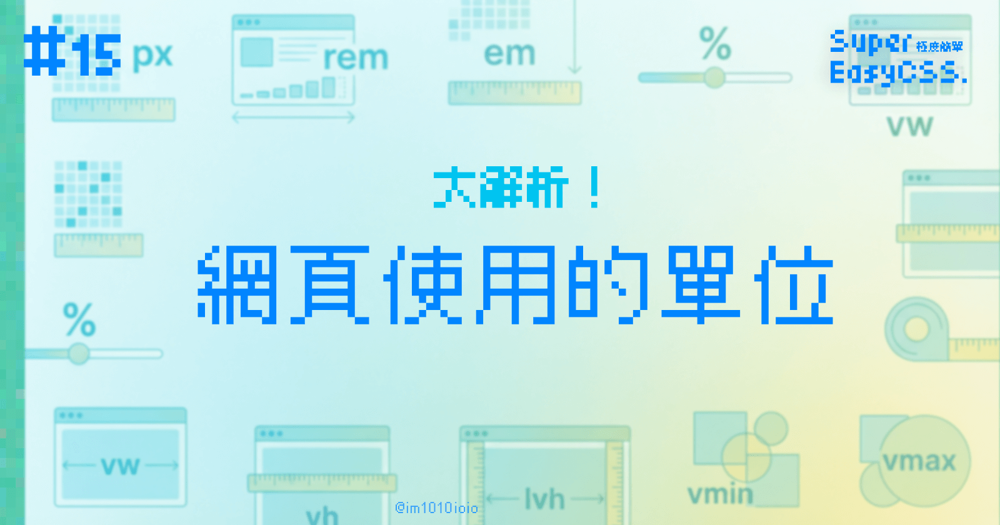
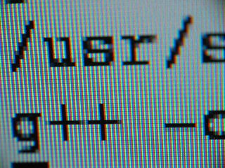
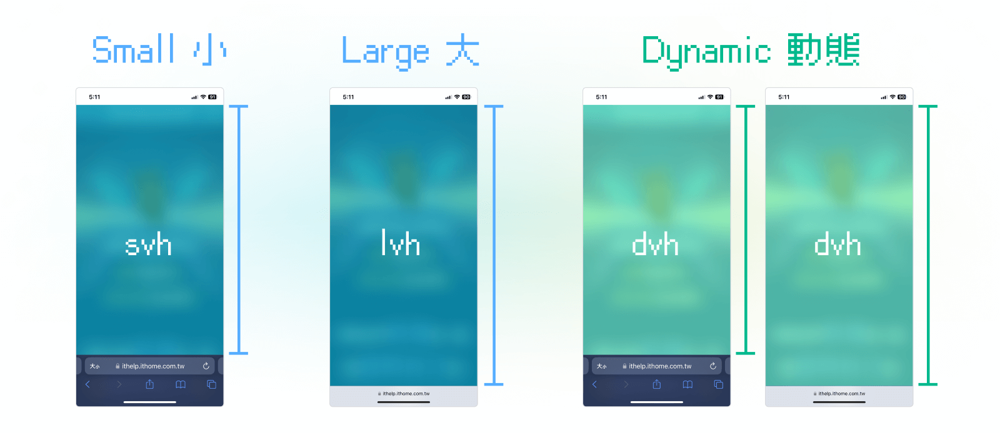

在網頁設計中，我們會使用到各種單位來調整尺寸和排版，而單位分成絕對單位和相對單位。

> #### ↓ 今日學習重點 ↓
> 
> * 了解好用的 CSS 單位並使用它們
>     

以下是各種好用的單位介紹：

## **絕對單位**

### 1\. 像素（pixels, px）

前幾篇的範例我們有使用到的 pixels 像素 (px)，這是最常見的絕對單位。



螢幕的顯示是由很多格子組合起來的，在早期的螢幕上，眼睛湊很近看都能看到一格一格的格子，1 pixel 就代表螢幕上的一個格子。後來，隨著科技進步，螢幕解析度變高，1 pixel 可以代表 2x2、3x3 個格子，讓畫面更加細緻，這就叫作像素密度 (Pixel Density)。

但不管怎麼樣，這是螢幕的最小單位。

> 延伸閱讀：[重新認識 Pixel、DPI / PPI 以及像素密度 | INFOLINK Blog](https://blog.infolink.com.tw/2021/rediscover-pixel-dpi-ppi-and-pixel-density/)

### 2\. 其他

除了 px 外，還有許多其他網頁上可以運用的絕對單位，但是較少用到，因為大多都是使用在印刷上，而網頁通常不會當成印刷的載體。這些其他的單位總共有：

* 英吋 in (1inch = 96px = 2.54cm)
    
* 點 pt (1point = 1/72in，繪圖軟體中常見的單位，如 illustrator, photoshop)
    
* 公分 cm
    
* 毫米 mm
    
* 派卡 pc (1picas = 12pt)
    
* ch（數字 0 的寬度，在英語系網頁中有人當成每個半形文字的寬度，來控制 input 的寬度，但是中文為全形文字，所以不太實用）
    

> 不過偶爾也有例外的時候，例如有本關於 CSS 的好書：[CSS Secrets](https://www.tenlong.com.tw/products/9789863478744)，整本書居然是使用 CSS 排版印刷的。

---

## **相對單位**

### 1\. 百分比（%）

百分比是相對於父層的單位。  
例如，如果將寬度設置為50％，元素的寬度將是其爸爸寬度的 50％。

### 2\. EM（em）

`em` 是相對於自己字體大小的單位。一個 `em` 等於目前的字體大小。  
例如，如果現在 `header` 的字體是 16px，那麼 `header` 內的

* 1em 就是 16px，
    
* 1.5em 就是 16px \* 1.5 = 24px，以此類推。
    

要注意的是，em 會加疊計算，若任何相對單位內有 em 就會一直乘下去，所以使用要小心不要重疊，避免尺寸變得極大或極小。

```css
header {
    font-size: 16px;
    > p {
        font-size: 1.5em; /* 16px * 1.5 = 24px */
        > span {
            font-size: 1.5em; /* 16px * 1.5 * 1.5 = 36px */
        }
    }
}
```

### 3\. REM（rem）

`rem` 是相對於 **HTML 的根**的字體大小的單位。一個 `rem` 等於 **HTML 的根**目前的字體大小。HTML 預設的字體大小是 16px，所以 1rem 就是 16px。

如果想要放大、縮小整個網頁，`rem` 這個單位能讓你很方便調整：只要改變 html 標籤上的 `font-size` ，有使用到 `rem` 的地方就會一起全部跟著放大、縮小。

```css
html {
    font-size: 90%;
}

p {
    font-size: 1rem; /* 16px * 90% = 14.4px */
}
```

### 4\. Viewport相對單位（vw、vh (dvh, lvh, svh)、vmin、vmax）

這些單位相對於瀏覽器視窗大小，而不是父層。常用於 RWD 設計。

#### (1) vw

vw 是視窗寬度的百分比。


#### (2) vh (svh, lvh, dvh)

vh 是視窗高度的百分比。


不過，vh 並沒有計算到手機瀏覽器導覽 UI 出現與消失的情況，在手機上 100vh 常常會被瀏覽器導覽 UI 遮住，所以它又分支出三個新單位：svh、lvh、dvh。其中 dvh 會動態改變高度，更貼近實際情況，未來可能會逐漸取代 vh 這個單位。



> 延伸閱讀：[看图说话，新 CSS 单位 “svh” “dvh” 原来如此 - 掘金 (](https://juejin.cn/post/7172332295058751496)[juejin.cn](http://juejin.cn)[)](https://juejin.cn/post/7172332295058751496)

#### (3) vmin

vmin 是目前 vw 和 vh 較小的那個值。

#### (4) vmax

vmax 是目前 vw 和 vh 較大的那個值。

vmin 和 vmax 特別是針對手機、平板橫豎時候所設計的尺寸。

> 延伸閱讀：[理解CSS中的vMin和vMax - 掘金 (](https://juejin.cn/post/6844903921798889479)[juejin.cn](http://juejin.cn)[)](https://juejin.cn/post/6844903921798889479)

---

#### ↓↓↓↓↓↓↓↓↓↓↓↓↓↓↓↓↓↓↓↓

感謝看到最後的你，若你覺得獲益良多，請不要吝嗇給我按個喜歡。❤️

如果你喜歡我的創作，還想看看其他有趣的分享與日常，  
可以追蹤我的 IG [@im1010ioio](https://www.instagram.com/im1010ioio/)，或者是[🧋送杯珍奶鼓勵我](https://im1010ioio.bobaboba.me/)，謝謝你🥰。

