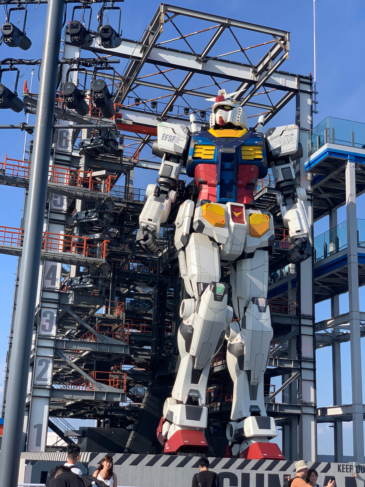

這 30 天真的是很經歷了好多，這中間經歷了去日本玩、首次確診、兩個連假，同時要整理過去熟悉的知識，還要研究其他我不會的，一度還逼近棄賽，能完賽很感動。

今天不寫 CSS，來分享這 30 天的心路歷程。

---

### 流水帳，那些小事

其實去年和同事就說好要參加，隨便寫些什麼，結果呢，我們記錯時間一起錯過開賽時間了！所以只好今年再來參加，也因為多了一年，讓我好好思索要寫什麼。

因為 30 天要緊密發文，所以我就決定主題是自己擅長的 + 想研究的 CSS，接著稍微去圖書館裡翻了 CSS 相關的書，參考了一下前輩們是如何架構章節的，然後最後是參考了 The State of CSS 的架構，先寫出了 30 天的文章標題（殊不知後來它一直在長大），然後就一直放著不動它 XD。

後來，因為規劃要去日本玩，所以我打算要存稿，大約八月下旬就開始寫了，結果事先先寫好了十幾篇左右，但是我覺得還是有點趕，因為要扣掉出去玩的時間，不過沒辦法。前五天是我同事幫忙發的，很感謝他！

中間小趣事，去到日本的富士山淺間神社時，抽籤結果叫我早睡早起，被神明發現我都在熬夜⋯⋯😅

後來，回台灣後就馬上確診了，只能躺著好幾天，真的，還好有存稿！！

開賽到中間大約 15 天左右，平常沒寫文，發了十幾篇後，開始鬆懈，覺得自己好棒，就去看了派對咖孔明，然後就⋯⋯人說 20 天左右容易放棄是真的，這是熱情燒盡的時刻。XD

最後一週，大約維持著今天寫明天的文的速度，不過還是被時間追上了，最後兩三天是當天寫當天發。

---

### 事前預防自己的劣根性

我深知我的劣根性刻在骨子的深處，容易累、三分鐘熱度、完美主義、拖延⋯⋯所以我事前做了一些預防措施：

* 盡量多存稿，讓自己有耍廢空間。
    
* 公告親朋好友，如果沒有完成的話就會尷尬丟臉。XD
    
* 寫好綱要後，利用想拚完拼圖的那種強迫症，堅持下去。
    
* 想清楚我為什麼要寫鐵人賽，因為 30 天馬拉松真的考驗心靈。
    

---

### 為什麼要寫？

#### 為了表達我的世界觀

前幾年我發覺我的口條變差了，本來就沒有多好，又變更差了，一直以來我都比較擅長用圖像表達，可是口說時，會變得千頭萬緒說不出口。我想可能是因為都是面對電腦，太久沒有使用文字組織些什麼，所以覺得可以藉此機會多練習。

#### 預防中年失業

如果有天中年失業，上有父母，下有孩子，肩膀上還有房貸，風雨飄搖之際，我可以貼出一個連結，大聲地說：「嘿！我會！」而且，為自己的職涯留下一個紀念，也滿好的。

---

### 30 天的靈魂拷問

為什麼人要看教學文？寫文對我有什麼意義？有人會看嗎？有人看了又怎麼辦？大家都用 Nocode 或 AI 做網頁還需要教學文嗎？30 天內我內心的天使惡魔爭論不休。😂

我一直告訴自己，文章追求的是累積與長尾的效益，又想想 The State of CSS 這些一直在改進 CSS 與瀏覽器的人的熱情，就在掙扎中度過了。

再來是我應該是真的喜歡 CSS，喜歡動手做些什麼東西吧！其實寫完後我是很開心的。

---

### 我的寫作方法

#### 使用編輯器

其實這系列，我都同步發在我的部落格「[Eva Chen | 網頁設計師下班後](https://im1010ioio.hashnode.dev/)」，這是我在 FB 前端社群發現的部落格，叫作 [Hashnode](https://hashnode.com/)，它是設計給開發者的部落格，它的編輯器很好用。

雖然在這裡推別人部落格平台有點不好意思，但是因為我的時間很少，很需要在通勤時用手機打一點文字。再來是它有一鍵複製 markdown 的功能，雖然貼到 iT 幫邦忙圖片、Youtube 的部分要微調一下。

#### iT 幫邦忙還是勝

但是，我發現 iT 幫邦忙的 SEO 極好，發文隔天馬上就被 Google 收錄了，這一定都是歷屆鐵人賽前輩們累積起來的價值與 SEO 信譽，我覺得還是很值得留在這個平台。

#### 先有架構，再填起骨肉

我的寫作方法一直都是先想個粗糙的架構，再生出內容；生出內容的同時，也會回去微調架構，大至 30 天的架構，小至一篇文章，都是如此。我每篇文章列的「今日學習重點」，其實也算是給我自己的綱要，讓我不要迷航。

#### AI 的幫助

我有試著使用 ChatGPT，在比較簡要的篇章可以很快建立起整個架構，只不過有點受不了它的語言癌⋯⋯許多句子有著用中文說英文思考邏輯的跡象，不知道是不是因為我是免費仔，用舊版 3.5 的關係。XD

像是「這有助於您更好地設計和排列網頁元素，以達到所需的外觀和佈局效果。」，就會被我改為「這樣能夠滿足我們所需的版面，同時還能讓我們切版更加輕鬆」。當我把 AI 寫的所有字詞全部都改掉了，那這篇文章還是 AI 寫的嗎？大家覺得呢？

> 延伸閱讀：[忒修斯之船](https://zh.wikipedia.org/zh-tw/%E5%BF%92%E4%BF%AE%E6%96%AF%E4%B9%8B%E8%88%B9)  
> 如果一艘船每一根木頭都被換過了，這艘船還是原本的那艘忒修斯之船嗎？如果是，可是它已經沒有最初的任何一根木頭了；如果不是，那它是從什麼時候不是的？

儘管如此，它還是幫助我很多了！加快了寫作速度。

---

### 反省

第一次寫沒有經驗，不太能夠預估篇幅，導致有些篇幅過長了。果然，整理已知知識 + 研究新東西可能還是擇一就好，比較身體健康 XD。

還有，有些漏提的小知識，我之後會再回去補上。

---

感謝我同事開頭幫忙發文；感謝 iT 幫邦忙辦了這個活動，讓資訊的世界有著朝氣蓬勃、樂於分享的精神；另外，[我希望在參加 \[iT邦幫忙鐵人賽\] 前就知道的事](https://ithelp.ithome.com.tw/articles/10257627)這篇文章也幫助我很多，謝謝；也謝謝有在發樓這系列的人。

接下來還要繼續把剩餘的坑慢慢填起來，我會努力。

