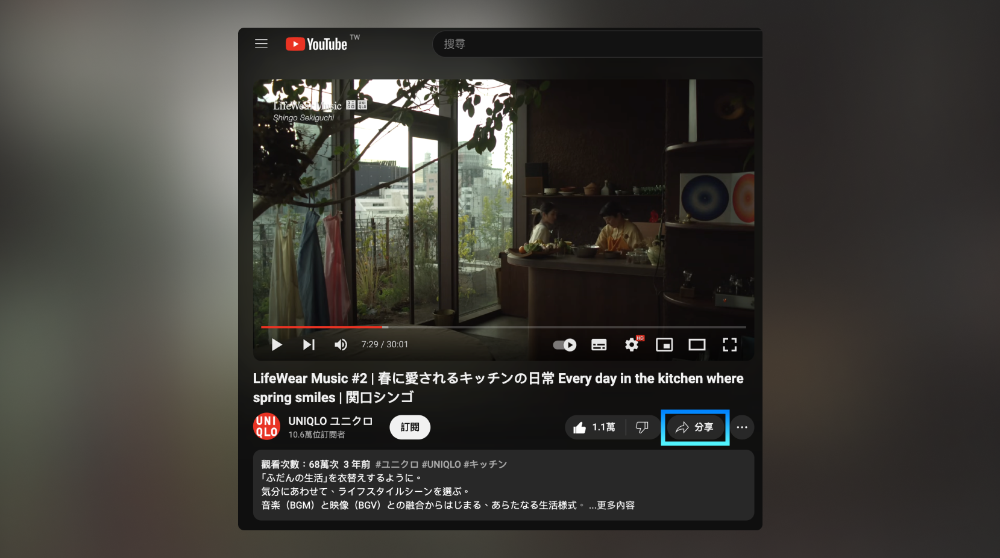
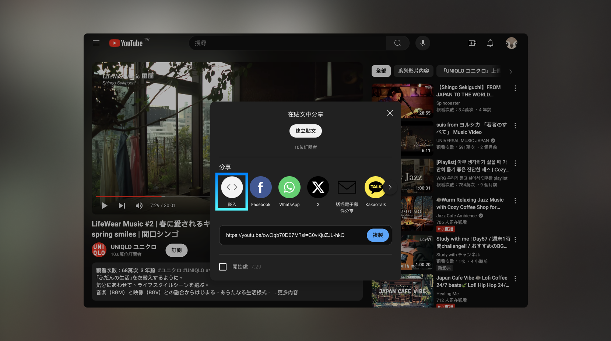
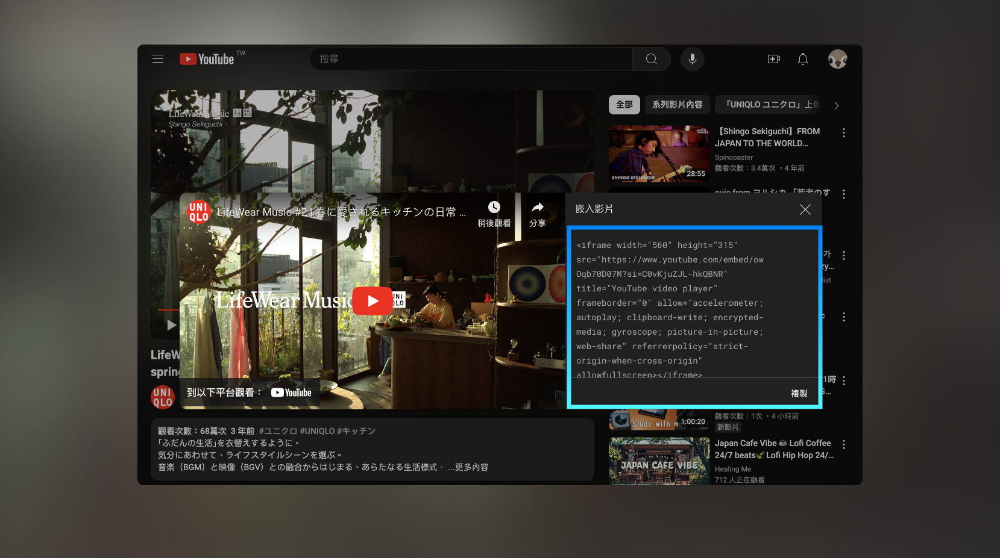
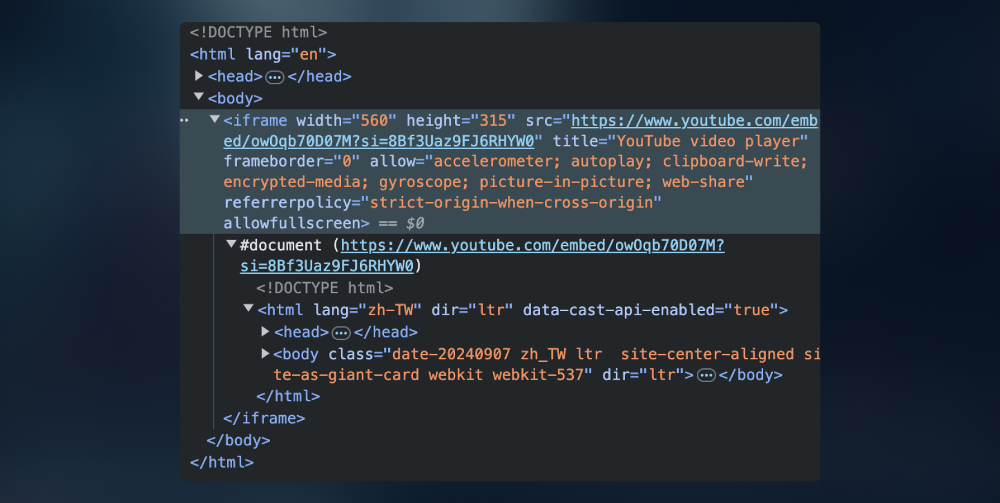
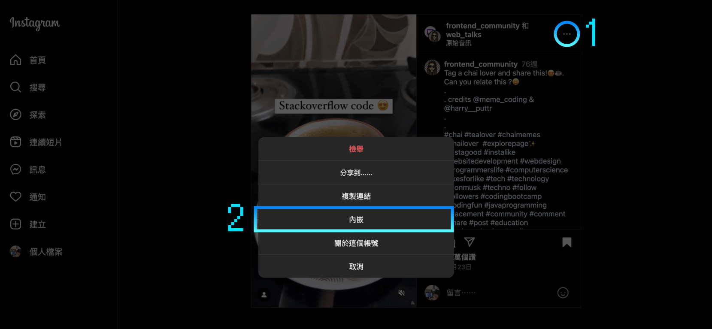
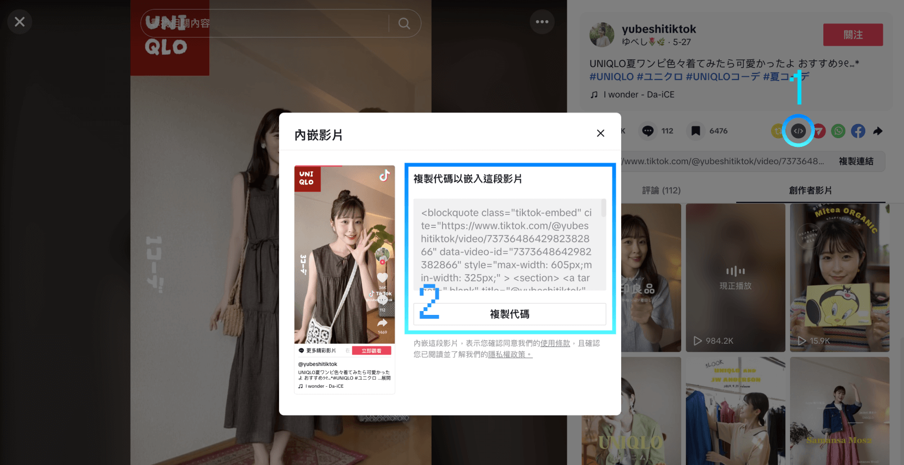
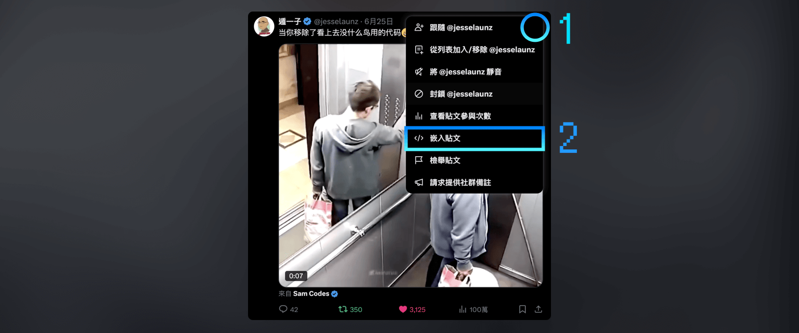
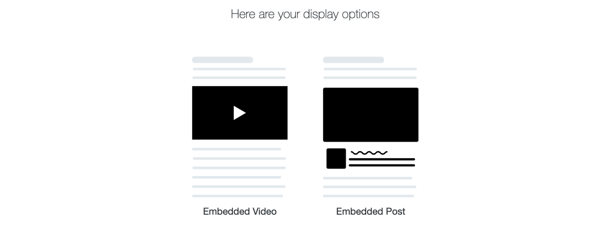

上一篇我們學了如何使用 HTML `<video>` 標籤在網頁上放入自有影片，這一篇要來學另一種方式——**用 `<iframe>` 嵌入外部平台的影片**！  
YouTube、Instagram、TikTok、X (Twitter) 的影片，只需要幾行 code 就能放進你的網頁，非常方便！

> #### **↓ 今日學習重點 ↓**
> 
> * 了解如何嵌入 YouTube 影片並設定自動播放
>     
> * 了解 `<iframe>` 標籤的限制與注意事項
>     
> * 學習嵌入 IG、TikTok、X (Twitter) 影片的方法
>     

---

## 一、YouTube 影片

既然提到了影片，那就順便說一下怎麼放 YouTube 影片吧！

### 1\. 放入方法

#### 官方放入方法

在 YouTube 照著以下步驟操作：分享 &gt; 嵌入。







在嵌入的程式碼這個畫面往下拉，你會發現目前只有幾個選項可以設定：

* **設定開始時間**
    
* **顯示播放器控制選項**：  
    勾了以後就不會出現左下「在以下平台觀看：YouTube」的文字
    
* **啟用隱私權加強保護模式**：  
    勾了以後 YouTube 就不會記錄看影片的人的資訊
    

最後，你就會得到以下的 HTML code，只要貼上就可以了：

```xml
<iframe width="560" height="315" src="https://www.youtube.com/embed/owOqb70D07M?si=C0vKjuZJL-hkQBNR" title="YouTube video player" frameborder="0" allow="accelerometer; autoplay; clipboard-write; encrypted-media; gyroscope; picture-in-picture; web-share" referrerpolicy="strict-origin-when-cross-origin" allowfullscreen></iframe>
```

當然你可以針對寬高（屬性 `width` / `height`）的部分微調。

### 2\. 我想要自動播放怎麼辦？

#### YouTube iFrame 的可調整參數

如果照著 YouTube UI 介面上操作，沒有辦法設定更詳細的設定，YouTube 提供了[  
IFrame Player API](https://developers.google.com/youtube/iframe_api_reference) 文件，裡面有許多參數大家可以參考。使用方法是用 Query String 傳遞參數進去。

所謂的 Query String 就是直接在連結後面用 `?參數1=參數1的值&參數2=參數2的值` 接起來就好，是傳遞參數的一種方式。不過，因為是透過網址公開的方式傳遞，通常都不是放機密資訊。

> BUT！  
> BUT！ YouTube 的 IFrame Player API 有些參數無作用（例如 `loop`），而有些參數不在文件內（例如 `mute`），僅供參考就好。XD

#### YouTube 自動播放

我查到要讓 YouTube 影片自動播放的話，要使用以下的 Code：

```xml
<iframe width="560" height="315" 
    src="https://www.youtube.com/embed/pjFQOLTh7EU?autoplay=1&mute=1&controls=0" frameborder="0" allow="autoplay; encrypted-media" allowfullscreen></iframe>
```

就跟前面提到關於自動播放，瀏覽器的限制一樣：

> 如果在使用者沒有預期下自動播放出聲音，會對使用者體驗不好，所以現在多數瀏覽器預設都已阻擋這樣的行為，除非使用 JS 寫程式強制執行影片/音樂。

所以這裡設定了靜音+自動播放，作為必要條件：

* `autoplay=1`
    
* `mute=1`
    

另外，我還加了 `controls=0`，企圖讓播放器操作選單不見，不過結果是：選單大約要過 4 秒後才會自動消失，hover 過去影片上方就會出現選單。

> 詳細 DEMO 請看：[YouTube Autoplay](https://codepen.io/im1010ioio/pen/xxoBOgE)

### 3\. `<iframe>` 標籤

在網頁偵測模式中，我們可以發現：嵌入 YouTube 影片的是一個叫做 `<iframe>` 的標籤，而 `<iframe>` 中包含著另外一份 HTML 網頁（`<html>` ）。



沒錯，這個標籤就是讓你在網頁中放入其他網頁的標籤，通常都是用來嵌入外部內容，如影片、地圖、社群貼文分享等等。但因為可能放入「其他網站的網頁」，可能會有安全性的問題，所以 `<iframe>` 有一些限制與問題：

* ##### **跨域問題（Same-Origin Policy）**
    
    如果嵌入的內容與主頁面來自不同的來源（不同的域名、協議或端口），跨域安全策略會限制主頁面和嵌入的內容之間的互動行為。例如，無法通過 JS 去看或修改來自不同來源的 `iframe` 中的內容（如 DOM）。  
    解決方案可以是使用 `postMessage` API 在主頁面和 `iframe` 之間安全地傳遞消息。
    
* ##### **安全性風險**
    
    嵌入來自不可信來源的內容可能會引入安全風險，如 XSS（跨站腳本攻擊）或點擊劫持（Clickjacking）。攻擊者可能利用 `iframe` 的嵌入來誘騙使用者進行不安全的操作。  
    使用 `sandbox` 屬性可以限制 `iframe` 中的功能，例如禁止腳本執行或表單提交，從而提高安全性。
    
* ##### **SEO（搜尋引擎最佳化）**
    
    搜尋引擎可能不會索引 `iframe` 中的內容，因為它們屬於嵌入的外部來源。這可能會影響嵌入內容的可見性，對於依賴 SEO 的網站來說是個限制。  
    如果內容對 SEO 非常重要，應考慮其他嵌入方法，而不是使用 `iframe`。
    

#### Youtube 嵌入設定了什麼？

* `allow` 屬性：指定允許影片使用的功能：
    
    * `accelerometer`：允許影片使用加速計
        
    * `autoplay`：允許影片自動播放（但沒有作用）
        
    * `clipboard-write`：允許影片將內容複製到剪貼簿
        
    * `encrypted-media`：允許播放加密媒體
        
    * `gyroscope`：允許影片使用陀螺儀
        
    * `picture-in-picture`：允許影片以畫中畫模式播放
        
    * `web-share`：允許影片使用網頁分享功能
        
* `referrerpolicy` 屬性：
    
    * 控制在跨域請求時，瀏覽器向伺服器傳送的 Referer 標頭資訊。
        
    * `strict-origin-when-cross-origin` 表示只傳送原始域，用於保護使用者隱私。
        
* `allowfullscreen` 屬性：
    
    * 允許使用者將影片全螢幕播放。
        

---

## 二、IG / TikTok / X (Twitter) 影片

如果想放入其他 Social Media 的影片，雖然每家平台實作的方式會略有不同，不過一樣也是使用 `<iframe>` 的概念嵌入。

這邊就不一個個深入探討了，提一下從哪裡取得嵌入的 code 就好了。

### 1\. Instagram



從 Instagram 網頁版，必須要是「公開貼文」，接著在貼文右上角的「點點點」後，就會出現「內嵌」選項，可勾選內容是否要包含貼文文字（包括解說）。

嵌入後，影片不能自動播放，要點擊後才會播放。

另外，如果影片不是使用「原始音訊」，而是使用 Instagram 內選用的音樂，點了不會播放影片，會變成連結至 Instagram（應該是因為版權因素）。

> 話說… 我喜歡這個迷因 🤣：  
> [https://www.instagram.com/reel/CqIaUJAoZpc](https://www.instagram.com/reel/CqIaUJAoZpc/?utm_source=ig_web_copy_link)

### 2\. TikTok



在 TikTok 網頁版中，會有一個「`</>`」圖示的按鈕，點了就會直接出現程式碼了。

嵌入後，TikTok 的影片會靜音+自動播放。

### 3\. X (Twitter)



在 X (Twitter) 網頁版中，和 IG 類似，點了貼文右上角的「點點點」後，就會出現「嵌入貼文」選項，然後會跳新視窗，讓你選想要以哪種方式呈現：



選了後會預覽給你看，直接複製就行囉！

> 話說… 我喜歡這個迷因 🤣：  
> [https://x.com/jesselaunz/status/1805403344548016599](https://x.com/jesselaunz/status/1805403344548016599)

---

## 三、實際使用情境

影片是一種非常棒的行銷素材，如果能好好運用，能夠提高使用者的體驗與停留的時間。

（題外話，提高停留時間，說不定還能提高銷售額，在寫這篇文時我發現一間日本公司—— [LEEEP](https://leeep.jp/) 就是在做這件事，他們幫助電商收集在 Social Media 上與品牌或產品相關的影片，管理並且放到商品頁中。）

如果想要在網頁上放影片，建議可以在網站上放較短秒數吸引人的片段（如 15-30 秒精華影片），這樣就可以設定為自動播放或是做更多進階的控制；而較長、詳細的解說影片則可以放到 YouTube 等其他平台上，讓使用者想了解更多時再點擊播放，分散網站的流量。

這樣既可以達到吸睛效果，又不至於佔用太多網站的流量，還多一種曝光方式，可以說是一舉多得。

---

---

> 👈 **上一篇：[網頁影片怎麼放？HTML <video> 用法與影片當滿版背景的實作](/multimedia/html-video-youtube-iframe)**

---

#### ↓↓↓↓↓↓↓↓↓↓↓↓↓↓↓↓↓↓↓↓

感謝看到最後的你，若你覺得獲益良多，請不要吝嗇給我按個喜歡。❤️

如果你喜歡我的創作，還想看看其他有趣的分享與日常，  
可以追蹤我的 IG [@im1010ioio](https://www.instagram.com/im1010ioio/)，或者是[🧋送杯珍奶鼓勵我](https://im1010ioio.bobaboba.me/)，謝謝你🥰。

