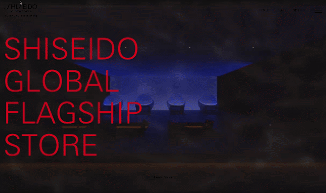

在設計行銷網頁時，放入漂亮的影片是最輕鬆達到吸睛效果的方法之一，例如：把影片放至滿版當成背景，上面再壓上標題與文字，畫面就會很豐富，這是很常見的網頁設計方式。

例如（以下都不是業配啦XD），  
像資生堂的銀座旗艦店官網，也是使用這種方式設計開頭的：  
[SHISEIDO GLOBAL FLAGSHIP STORE | SHISEIDO](https://www.shiseido.co.jp/ginza/ct/)



或是，在遊戲宣傳網頁，也很常使用這種手法，像是最近要推出的遊戲——無限暖暖：  
[《無限暖暖》官網——無論何時都要盛裝登場！](https://infinitynikki.infoldgames.com/zh-TW/home)


這種將大圖或影片放在開頭的區塊，通常被稱作「主頁橫幅 (*Hero Image*)」。今天我們就透過製作這樣的網頁，來練習用 HTML 的 `<video>` Tag 放入影片，並且並操作影片的各種屬性吧！

此外，文章結尾還會提及如何放入用 `<iframe>` 嵌入YouTube 與各種 Social Media 的影片。

> #### **↓ 今日學習重點 ↓**
> 
> * 使用 HTML `<video>` Tag 放入影片並操作各種屬性
>     
> * 使用 CSS 製作網頁的影片主頁橫幅 (*Hero Image*)
>     
> * 使用 `<iframe>` 嵌入YouTube 與各種 Social Media 影片
>     

---

## ㄧ、HTML `<video>`

### 1\. 基本語法

要在網頁中放入影片我們會用以下語法，在 `<video>` 標籤中放入 `<source>` 標籤放入影片。

#### 標準寫法

```xml
<video>
    <source src="movie.mp4" type="video/mp4">
    <source src="movie.ogg" type="video/ogg">
    你的瀏覽器不支援影片播放
</video>
```

* `<video>` 標籤中可以放入多種影片來源，瀏覽器將選擇它的第一個來源的影片，如果不行播放的話再撥下一個，如果都無法播放才會顯示放在內部的文字。
    
* 放在影片中的文字，是在瀏覽器不支援 `<video>` 標籤時才會出現。
    

#### 簡寫

```xml
<video src="movie.mp4"></video>
```

如果覺得這樣的寫法太長，也可以使用用 `src` 這個屬性來指定影片檔案的路徑，不使用 `<source>`。

### 2\. 常用的屬性

其他 `<video>` 標籤最常用的屬性還有：

* `controls`：出現控制面板
    
* `autoplay`：自動播放
    
* `loop`：循環播放
    
* `muted`：靜音播放
    
* `preload`：決定影片如何在頁面載入時進行預載，有三個值可設定：
    
    * `none`：不預載影片，直到用戶按下播放按鈕。
        
    * `metadata`：只預載影片的 metadata（如影片長度等資訊）。
        
    * `auto`：預載整個影片檔案。
        
* `poster`：當影片尚未播放時顯示的圖片，作為縮圖或預覽圖，也可以當成是影片出不來時的替代圖片。如果沒有設定會取影片的第一幀當封面。
    
* `width` 與 `height`：除了使用 CSS 設定寬高外，也可以使用這兩個屬性設定寬高
    

這些屬性就是常用的屬性，不過 `<video>` 標籤還可以設定其他更細節屬性，詳細請看：

> 延伸閱讀：[&lt;video&gt;：视频嵌入元素 - HTML（超文本标记语言） | MDN](https://developer.mozilla.org/zh-CN/docs/Web/HTML/Element/video)

### 3\. 注意事項

#### 關於自動播放

> 如果在使用者沒有預期下自動播放出聲音，會對使用者體驗不好，所以現在多數瀏覽器預設都已阻擋這樣的行為，除非使用 JS 寫程式強制執行影片/音樂。

所以，如果需要影片能自動播放，必須要將影片/音樂設定為「靜音（`muted`）」，影片才會自動播放喔！

```xml
<!-- 有操作介面 -->
<!-- 沒有設定靜音，自動播放無作用 -->
<video width="320" height="240" controls autoplay>
  <source src="影片網址" type="video/mp4">
</video>

<!-- 自動播放 + 靜音 -->
<!-- 要設定為靜音，才允許自動播放 -->
<video width="320" height="240" autoplay muted>
  <source src="影片網址" type="video/mp4">
</video>
```

> 詳細請看 DEMO：[HTML video tag](https://codepen.io/im1010ioio/pen/dyEgdpP)

也就是說，已經不太會發生「在上電腦課偷看部落格，部落格的影片或音樂自動放出聲音來，被老師發現的窘境」。😂

#### 客製選單需要使用 JS

此外，如果要使用自行設計的選單按鈕，都需要使用 JS 操作，用原生的 HTML 只能使用瀏覽器的預設樣式。

### 4\. DEMO

知道如何放入影片後，我們就可以來製作把影片當成背景的網頁了！  
（使用這種方式建議注意影片大小，一來 load 不出來會影響使用者體驗，二來是過多的流量會對自己的網站造成 loading 負荷。）


這邊我們在主要內容區塊 `.container` ：用絕對定位填滿容器，再進行其他額外的排版。

而在 `<video>` 標籤上：

* 使用 `object-fit: cover;` 將影片填滿容器，
    
* 然後使用 `pointer-events: none;` 阻止萬一點擊到影片，出現瀏覽器針對影片的操作選單（因為要當作背景，避免額外的互動，不過這個可有可無，因為將內容絕對定位在影片上，所以也點不到），
    
* 另外，使用 `poster` 屬性設定了影片封面圖片，以防萬一影片跑不出來，還有預設圖可以看。
    

詳細的 code 與 DEMO 可參考下面：

#### HTML

```xml
<header>
    <video autoplay muted loop
           src="https://im1010ioio.github.io/super-easy-css/36/video.mp4"></video>
    <div class="container">
        <nav>
            <ul>
                <li><a href="#">商品說明</a></li>
                <li><a href="#">參考行程</a></li>
                <li><a href="#">交通說明</a></li>
                <li><a href="#">行程規定</a></li>
            </ul>
        </nav>
        <div class="text-content">
            <h1>
                <span class="line-1">馬爾他</span><br>
                <span class="line-2">全世界最小的國家</span>
            </h1>
            <p>馬爾他（Malta）是位於地中海中心的一個小型島國，介於意大利西西里島和北非之間。這個國家由三個主要島嶼組成，分別是馬爾他島（Malta）、戈佐島（Gozo）和科米諾島（Comino）。雖然國土面積不大，但馬爾他有著悠久而豐富的歷史文化。</p>
            <button type="button">開始探索</button>
        </div>
    </div>
</header>
```

#### CSS

```css
header{
    position: relative;
    height: 80vh;
    overflow: hidden;
    color: white;
    text-shadow: 0px .25rem .5rem rgba(0,0,0, .3);
}

video{
    width: 100%;
    height: 100%;
    object-fit: cover;
    pointer-events: none;
}

header .container{
    position: absolute;
    top: 0;
    left: 0;
    right: 0;
    bottom: 0;
    background: rgba(0,0,0, .5);
    display: flex;
    flex-direction: column;
}
```

> DEMO 連結：[Video Full Background](https://codepen.io/im1010ioio/pen/wvLjgWm)

---

---

## 接下來：用 iframe 嵌入各大平台影片

學會了 HTML `<video>` 標籤後，接下來還有另一種放影片的方式——`<iframe>`！  
YouTube、Instagram、TikTok 等社群影片都是透過這個方式嵌入的，還可以設定自動播放，繼續看下一篇吧！

👉 **繼續閱讀下一篇：[用 iframe 嵌入 YouTube、IG、TikTok 影片：一行程式碼搞定社群影片](/multimedia/html-iframe-youtube-social)**

---

#### ↓↓↓↓↓↓↓↓↓↓↓↓↓↓↓↓↓↓↓↓

感謝看到最後的你，若你覺得獲益良多，請不要吝嗇給我按個喜歡。❤️

如果你喜歡我的創作，還想看看其他有趣的分享與日常，  
可以追蹤我的 IG [@im1010ioio](https://www.instagram.com/im1010ioio/)，或者是[🧋送杯珍奶鼓勵我](https://im1010ioio.bobaboba.me/)，謝謝你🥰。

