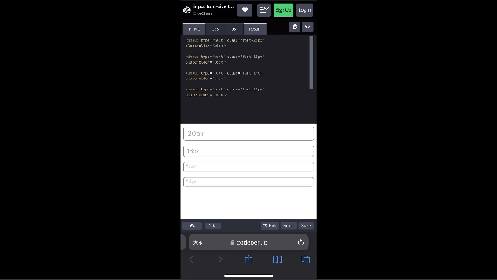
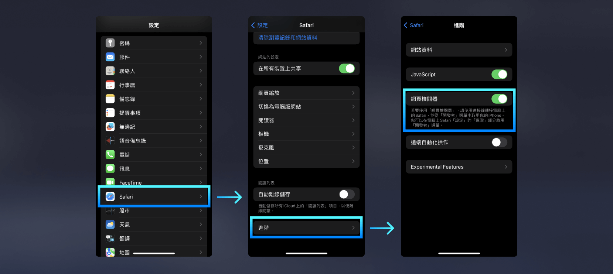
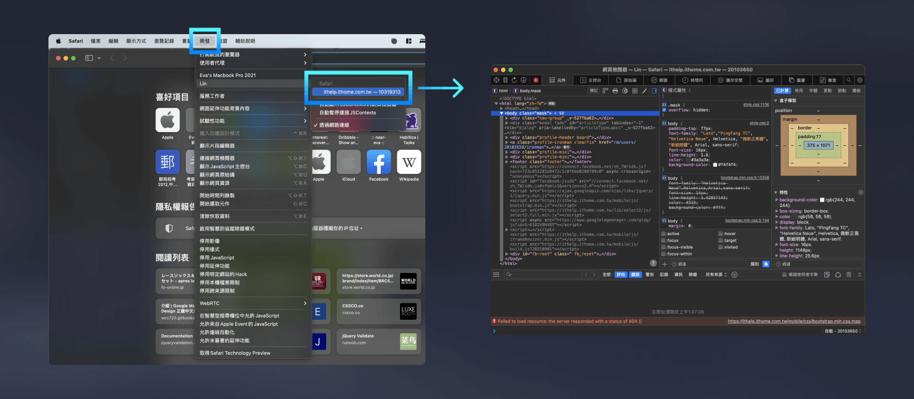

iOS Safari 被戲稱為 Apple 中的 IE，開發者最頭痛的就是它！  
這篇整理了幾個最常見的 iOS Safari 開發陷阱與對應解法，還有教你如何用 Mac Safari 來 debug iPhone 上的頁面。

> #### **↓ 今日學習重點 ↓**
> 
> * 了解 iOS Safari 上 `<input>` 字體放大問題
>     
> * 了解 `overflow: scroll` 在 iOS Safari 失效的原因與解法
>     
> * 學習如何使用 `dvh` 單位解決 100vh 被遮住的問題
>     
> * 學會用 Mac Safari debug iOS Safari
>     

---

## 一、iOS Safari 的開發陷阱

iOS Safari 號稱 Apple 中的 IE，我這邊整理一下在開發上的經驗。

> 由於 Safari 並不是基於 Google 的 Blink 開發，所以與上述三者落差稍微大一點。可是，因為 iPhone、iPad 普及的關係，所以市佔率不低，在這裡也是不能壞掉。
> 
> 也因此，遇到 Safari 的陷阱時就會讓人很傷腦筋，於是被眾人戲稱為 Mac / iPad / iPhone 上的 IE。Mac 和 iPhone 上的呈現有時候也會不一樣，兩者都要測試。
> 
> 此外，由於 iOS 移動裝置（iPad / iPhone）是個很封閉的系統，在 iPad / iPhone 上的其他瀏覽器，如 Chrome、Edge、Firefox 等，其實內部核心都是 Safari，和電腦不同。因此，並不是 Mac 上的 Chrome、Edge、Firefox 沒事就沒問題，要實測一遍才知道會不會有問題喔！

### 1\. `<input><textarea>` 字體大小建議大於 16px

在 iOS Safari 上的 `<input><textarea>` 字體大小建議設定大於 16px，不然的話 Safari 會在 focus 的瞬間將你的網頁連同輸入框一起放大，導致使用者要再來回縮放畫面，造成體驗不佳。有人提議可以在 HTML meta data 上加上 `user-scalable=no` ，但是我實測沒有什麼用 QQ。

如果想測試，可以用 iPhone 打開以下 DEMO 試試看：

> [DEMO 連結：input font-size test for ios safari](https://codepen.io/im1010ioio/pen/qBLLgEZ)

這個小細節很容易沒有注意到，就連 Google 表單也沒有注意到 QQ：

### 2\. 滾動範圍盡量滾動 body，而不是 `overflow: scroll/auto;`

我們有時候會使用 `overflow: scroll/auto;` 來製作 body 內部客製的可滾動區域，然後整個網頁的 `<body>` 設為 `overflow: hidden;`。但是，這種做法在 iPhone Safari 上時常會怪怪的，導致整個網頁無法滑動。

深究其原因，似乎是 Safari 在解析網頁時的渲染前後順序問題：「子元素的高度如果沒有在 ScrollView 建立之前確定，就不會觸發內部滑動，而會觸發外部滑動。」詳細可參考：

> [javascript - iOS Safari浏览器上overflow: scroll元素无法滑动bug解决方法整理 - Kinice的存档点](https://segmentfault.com/a/1190000012761272)  
> [javascript - iOS safari浏览器上overflow: scroll元素无法滚动bug深究 - Kinice的存档点](https://segmentfault.com/a/1190000016408566)

我的解法是在 CSS 規劃時，就盡量滾動 `<body>`，沒有任何 `overflow: hidden;` 設定在 `<body>` 上，給大家參考。

### 3\. 100vh 包含瀏覽器的導覽列，建議使用 dvh 單位

之前在介紹網頁單位時有提過「在手機上 `100vh` 常常會被瀏覽器導覽 UI 遮住」，這個瀏覽器就是 Safari！所幸，現在 CSS 有推出新單位 `dvh` ，可以解決這個問題。

不過 Safari 的版本是跟著 iOS 的，較舊的 iOS 若沒有更新，就無法使用 `dvh` 這個新單位。QQ

> 延伸閱讀：  
> [#15 網頁使用的單位大解析：px、rem、em、%、vw、vh (dvh, lvh, svh)、vmin、vmax](https://im1010ioio.hashnode.dev/css-units)  
> ["dvh" | Can I use... Support tables for HTML5, CSS3, etc](https://caniuse.com/?search=dvh)  
> [實務踩坑恨 - Safari 就是跟別人不一樣之 100% 與 100vh - iT 邦幫忙](https://ithelp.ithome.com.tw/articles/10249090)

### 4\. 使用 Mac Safari debug iOS Safari

要使用 Mac Safari debug iOS Safari，首先 iPhone 的 Safari 必須要開啟「網頁檢閱器」的權限，開啟的位置是：「設定 APP &gt; Safari &gt; 進階」。

接著使用一條線連結 Mac 與 iPhone，這時候 iPhone 可能會跳出通知詢問是否要信任這台電腦，請選信任；Mac 也可能會詢問要允許配件連接嗎，請選允許。

如此一來，在 Mac Safari 的開發選單中，就可以看到你的 iPhone 的名稱與目前 iPhone Safari 正在開啟的頁面，選取它就能夠使用 Safari 的開發者工具 debug 囉！

> 若你在選單列中沒有看到「開發」選單，請選擇 Safari &gt;「設定」，按一下「進階」，然後選取「在選單列中顯示『開發』選單」。（來源：[Apple Safari 使用手冊](https://support.apple.com/zh-tw/guide/safari/sfri20948/16.1/mac/13.6.2)）

---

---

> 👈 **上一篇：[RWD 響應式網頁設計：CSS Media Queries 完整語法與斷點設定](/rwd/css-media-queries)**

---

#### ↓↓↓↓↓↓↓↓↓↓↓↓↓↓↓↓↓↓↓↓

感謝看到最後的你，若你覺得獲益良多，請不要吝嗇給我按個喜歡。❤️

如果你喜歡我的創作，還想看看其他有趣的分享與日常，  
可以追蹤我的 IG [@im1010ioio](https://www.instagram.com/im1010ioio/)，或者是[🧋送杯珍奶鼓勵我](https://im1010ioio.bobaboba.me/)，謝謝你🥰。

