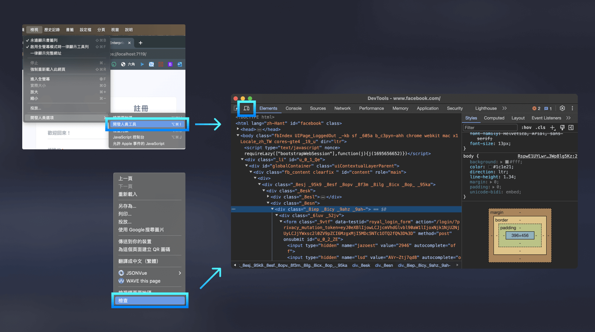

當我們在設計網站時，我們希望網站能夠適應不同的裝置和螢幕尺寸，以提供更好的使用體驗，這就是響應式網頁設計（RWD，Responsive Web Design）。

要製作 RWD 網頁，我們可能會需要用到 CSS 的 Media Queries，透過網頁瀏覽裝置的特性（如裝置種類、寬度、高度、螢幕方向等）來調整畫面。

另外，本篇也會提到在手機 iOS Safari 上的開發經驗，以及如何使用 Mac Safari debug iOS Safari。

> #### **↓ 今日學習重點 ↓**
> 
> * 了解 RWD 的概念與常見螢幕尺寸斷點
>     
> * 了解 Media Queries 的使用方法
>     
> * 了解開發 iOS Safari 的注意事項
>     

---

## 一、響應式網頁設計（RWD，Responsive Web Design）

### **1\. RWD 的原則**

* 除了特殊設計，不該有橫向捲軸出現。
    
* 能用 Flex 或 Grid 自動彈性調整版面，就不用 Media Queries 寫很多行覆蓋用的 CSS，讓 CSS 更簡潔。
    

### 2\. 常見的螢幕斷點（Breakpoints）

讓我們複習一下第 #01 篇所提到 RWD 相關概念：

> 實務上，RWD 會以螢幕寬度作為調整的依據，行銷網頁從最小的手機寬度約 320px，到桌機的 1920px，整整相差 6 倍的寬度內，都要能合理地呈現畫面。
> 
> 各個螢幕裝置常見的大小大約會這樣抓：
> 
> * 手機：小於 767px；
>     
> * 平板：介於 768px - 991px；
>     
> * 桌機：992px - 1920px （甚至以上，但是情況非常少）。
>     
> 
> 在設計上，最理想的情況下一個頁面會設計手機、平板直式、平板橫式、桌機 4 個版本給前端工程師。最常見的情況會設計 3 個版本。如果因時程或成本等因素沒有辦法，最少要設計 2 個版本，可以：
> 
> * 設計手機與平板版本，桌機沿用平板版本再微調；或是
>     
> * 設計手機與桌機版本，中間的平板版本依靠討論溝通。
>     

平板與手機的分界 768px 是依據 iPad 的尺寸（1024px x 768px），其他的斷點是參考 bootstrap 而來的，大家可以依據需求微調斷點，斷點的數值不是絕對。

> 延伸閱讀：  
> [#01 網頁的基本名詞：UI/UX？切版&切圖？前端&後端？靜態&動態？RWD or Mobile First？](https://im1010ioio.hashnode.dev/glossary-of-web-development)  
> [Breakpoints · Bootstrap v5.3](https://getbootstrap.com/docs/5.3/layout/breakpoints/)

### 3\. 使用開發者工具模擬各種裝置與尺寸

各大瀏覽器都有提供開發者工具，以 Chrome 為例，按開發者工具左上角的螢幕 icon 就能模擬各種裝置的瀏覽情況，也可以選擇 Responsive 自由調整視窗寬高。

不過模擬終究只是模擬，實際運作會如何還是需要在該裝置測試一遍才會知道喔！



---

## 二、基本的 Media Queries

要使用 Media Queries，我們需要在 CSS 中添加 `@media` 規則。  
以下是一個基本的 Media Query 範例：

```css
@media screen and (max-width: 767px) {
    /* 在螢幕寬度小於 767px 時使用以下 CSS 規則 */
    body {
        font-size: 16px;
    }
}
```

在上面的例子中，我們在螢幕寬度小於或等於 767px 時（通常是手機尺寸），將 `<body>` 的字體大小設為 16px。

---

## 三、常用的 Media Query 屬性

以下是一些常用的 Media Query 屬性：

### 1\. 寫法

可以同時使用多個規則：

* 使用 `and` 連接起來
    
* 使用逗號 `,` 連接起來（代表 or，任一符合即套用）
    
* 使用 `not` 排除一些規則
    

```css
 /* 當裝置是螢幕，而且寬度小於 767px (包含) 時 */
@media screen and (max-width: 767px) { ... }

 /* 當寬度小於 767px (包含) 或者裝置為直向時 */
@media (max-width: 767px), (orientation: portrait) { ... }

 /* 當裝置不是螢幕，而且是列印時 */
 @media not screen and print { ... }
```

### 2\. 裝置類型 Media types

可以使用 `screen`、`print`、`speech` 等特性來設定裝置的類型：

```css
/* 當裝置是螢幕 */
@media screen { ... }

/* 當裝置是列印 */
@media print { ... }

/* 當裝置是朗讀裝置 */
@media speech { ... }
```

### 3\. 螢幕寬度和高度

#### (1) 基本用法

可以使用 `max-width` 和 `min-width` 以及 `max-height` 和 `min-height` 特性來設定螢幕的寬度和高度。例如：

```css
/* 手機：螢幕寬度小於 767px (包含) 時 */
@media screen and (max-width: 767px) { ... }

/* 平板：螢幕寬度介於 768px 和 991px (包含) 之間時 */
@media screen and (min-width: 768px) and (max-width: 991px) { ... }

/* 桌機：螢幕寬度大於 992px (包含) 時 */
@media screen and (min-width: 992px) { ... }
```

#### (2) Range Context：可以使用普通的數學符號

Media Query 有最新的改良寫法，可以使用普通的數學符號：`>`、`<`、`>=` 或 `<=`。使用在具有「範圍」類型（如寬度或高度）的 Media Query 上，讓開發時更直覺。例如：

```css
/* 手機：螢幕寬度小於 768px 時 */
@media screen and (width < 768px) { ... }

/* 平板：螢幕寬度介於 768px 和 992px 之間時 */
@media screen and (768px <= width <= 992px) { ... }

/* 桌機：螢幕寬度大於 992px 時 */
@media screen and (width > 992px) { ... }
```

不過如果 TA 有使用較舊的瀏覽器的話，要斟酌使用。

> 延伸閱讀：  
> [Media Queries Level 4: Media Query Range Contexts (Media Query Ranges) –](https://www.bram.us/2021/10/26/media-queries-level-4-media-query-range-contexts/#:~:text=In%20CSS%20Media%20Queries%20Level%204%20these%20type,%E2%80%9Cthe%20width%20sits%20in%20between%20the%20two%20values%E2%80%9D)[Bram.us](http://Bram.us)  
> ["Media Query Range Context" | Can I use... Support tables for HTML5, CSS3, etc](https://caniuse.com/?search=Media%20Query%20Range%20Context)

#### (3) 可搭配原生 CSS 巢狀使用

Media Query 可以搭配原生的 CSS 巢狀結構使用，例如：

```css
.item {
    width: 33.33%;
    /* 手機：螢幕寬度小於 768px 時 */
	@media screen and (width < 768px) { 
		width: 100%;
	}
}
```

> 延伸閱讀：[#10 原生的 CSS 巢狀 (CSS Nesting) 終於支援啦！](https://im1010ioio.hashnode.dev/pure-css-nesting)

#### (4) 暫不支援搭配原生 CSS 變數使用

可惜的是這些斷點設定，暫時還不支援搭配原生 CSS 變數使用，要再等等。目前必須先使用 Sass (SCSS) 等預處理器才能使用變數處理斷點的數值。

> 延伸閱讀：[Media Queries Level 5](https://www.w3.org/TR/mediaqueries-5/#custom-mq)

### 4\. 螢幕方向 orientation

使用 `orientation` 屬性可以設定螢幕是橫向還是直向：

```css
/* 當螢幕是橫向時 */
@media screen and (orientation: landscape) { ... }

/* 當螢幕是直向時 */
@media screen and (orientation: portrait) { ... }
```

### 5\. hover

透過判斷有沒有支援 `hover` （滑鼠移到上方的樣式）的行為，我們能夠間接判斷是否為觸控螢幕。例如：當 hover 時，按鈕顏色會變暗，但是在觸控螢幕上會變成類似 focus 的效果，有可能不是我們需要的，這時候就可以透過這個屬性來設定樣式。

```css
/* 當螢幕支援 hover 行為時 (例如：非觸控螢幕) */
@media screen and (hover: hover) { ... }

/* 當螢幕不支援 hover 行為時 (例如：觸控螢幕) */
@media screen and (hover: none) { ... }
```

### 6\. 點擊 pointer

Media Query 可以透過 pointer 來判斷裝置支援點擊的精準度，共有三種精準度可以設定：

* `(pointer: none)`：不能點擊時
    
* `(pointer: fine)`：點擊精準時（例如：滑鼠操作）
    
* `(pointer: coarse)`：點擊不精準時（例如：觸控螢幕）
    

透過判斷裝置支援點擊的精準度，我們也能夠間接判斷是否為觸控螢幕。

可以透過這個屬性優化使用者體驗，例如：在使用滑鼠的裝置上（如桌機）按鈕可以小一點，而在觸控螢幕上按鈕可以大一點，讓使用者比較好點到按鈕。

```css
/* 當螢幕不能點擊時 */
@media screen and (pointer: none) { ... }

/* 當螢幕備可以點擊，而且點擊精準時（例如：滑鼠操作） */
@media screen and (pointer: fine) { ... }

/* 當螢幕可以點擊，但是點擊不精準時（例如：觸控螢幕） */
@media screen and (pointer: coarse) { ... }
```

---

---

## 接下來：iOS Safari 的開發陷阱

寫完 RWD 了，還有個大魔王等著你——**iOS Safari**！它有一些讓前端工程師很頭痛的特殊行為，下一篇將整理常見的坑與解法，還有教你如何用 Mac Safari debug iPhone 上的問題。

👉 **繼續閱讀下一篇：[iOS Safari 陷阱攻略：input 放大、overflow 滑不動、100vh 被遮住怎麼辦？](/rwd/css-ios-safari-tips)**

---

#### ↓↓↓↓↓↓↓↓↓↓↓↓↓↓↓↓↓↓↓↓

感謝看到最後的你，若你覺得獲益良多，請不要吝嗇給我按個喜歡。❤️

如果你喜歡我的創作，還想看看其他有趣的分享與日常，  
可以追蹤我的 IG [@im1010ioio](https://www.instagram.com/im1010ioio/)，或者是[🧋送杯珍奶鼓勵我](https://im1010ioio.bobaboba.me/)，謝謝你🥰。

