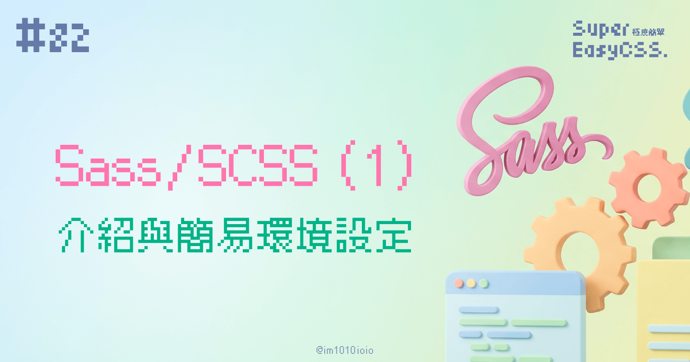
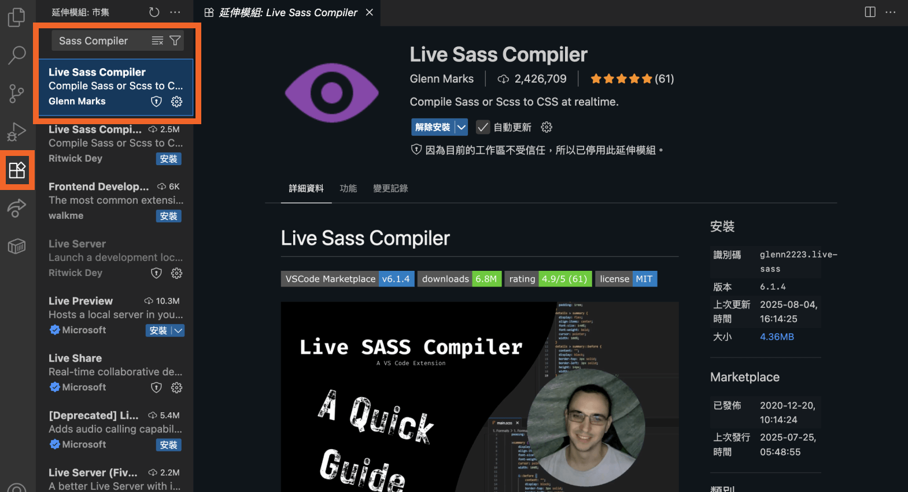
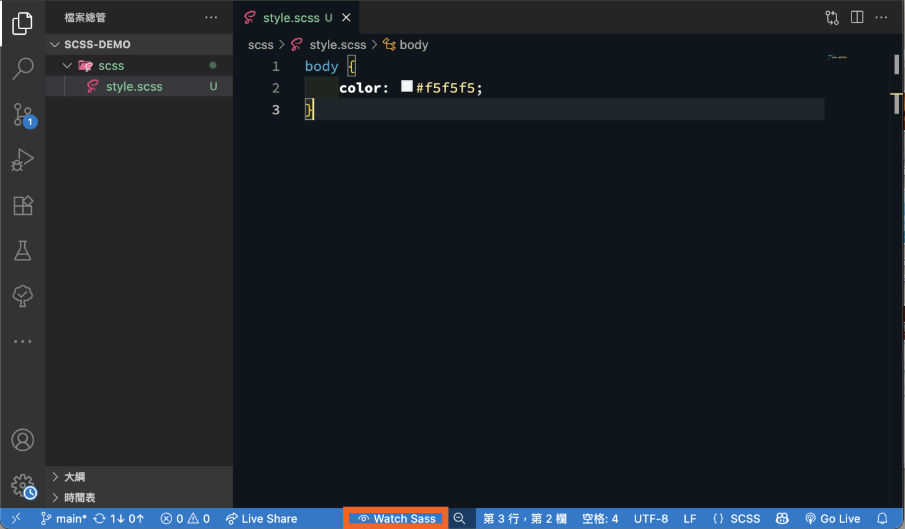
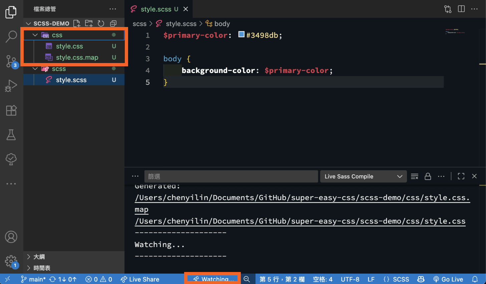
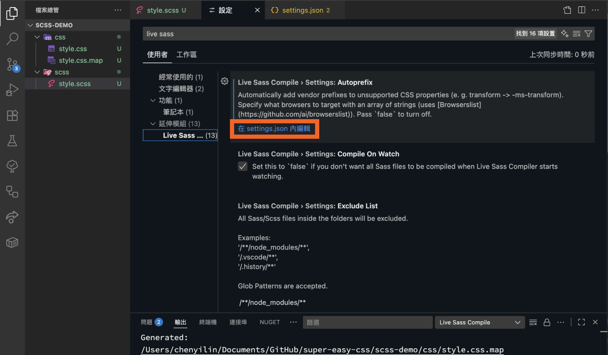
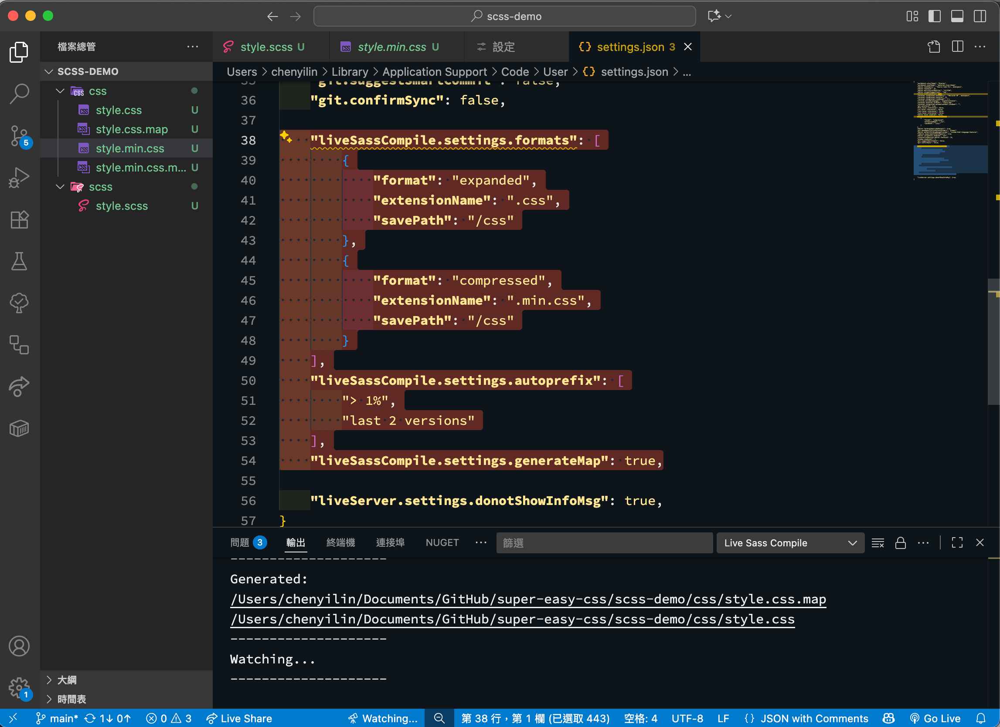
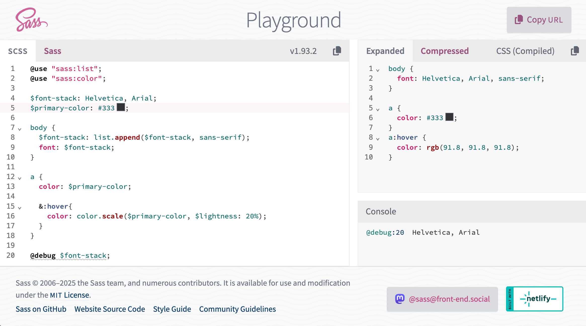

我們基本 CSS 的教學與補充新語法差不多告一個段落了，接下來，我們來學一個也很常用的 CSS 進階用法：CSS 預處理器 SASS/SCSS！

---

## 一、CSS 預處理器是什麼？它跟 CSS 有什麼不同？

CSS 預處理器（CSS Preprocessor）是一種腳本語言，它擴充了 CSS 的語法，讓我們可以用更有效率、更像寫程式的方式來組織我們的樣式碼。

寫好的 Code，需要經過「編譯」這個步驟，轉成瀏覽器看得懂的標準 CSS 檔案。  
你可能會問，為什麼要多此一舉呢？原生的 CSS 在開發大型專案時，會遇到一些挑戰：

* **重複的程式碼：** 很多樣式設定需要不斷重複撰寫。
    
* **不易維護：** 程式碼的結構性較差，在模組化開發時容易變得混亂。
    

CSS 預處理器就是為了解決這些問題而誕生的！ 它加入了許多原生 CSS 所沒有的強大功能，例如：

* **混合 (Mixin):** 可以建立一組可重複使用的樣式宣告，並在需要的地方引入。
    
* **繼承 (Extend):** 讓一個選擇器可以繼承另一個選擇器的所有樣式。
    

雖然 CSS 也在進化中，像原生 CSS 現在已有了變數 (Variables) 與巢狀寫法 (Nesting) 等，但是目前還是沒有辦法像這些預處理器一樣完整，除了上述功能，也無法整合 autoprefix （自動加入 `-webkit-` 前綴語法）等套件。

---

## 二、SASS/SCSS


市面上有許多主流的 CSS 預處理器，像是 Sass、LESS、Stylus 等。這次我們選擇介紹 SASS/SCSS，主要是因為它是目前最受歡迎、社群也最龐大的選項，也有更豐富的學習資源和社群支援。

Sass 其實有兩種語法格式：

1. **SASS (舊版):** 使用縮排來區分層級，不使用大括號 `{}` 和分號 `;`。
    
    ```scss
    div
        background: #f5f5f5
        p
            color: DarkSlateGray
    ```
    
2. **SCSS (新版):** 語法更接近原生的 CSS，使用大括號和分號。 因為與 CSS 的寫法非常相似，對於已經熟悉 CSS 的開發者來說，學習曲線更平緩，這也是為什麼 SCSS 現在比 SASS 更受歡迎的原因。
    
    ```scss
    div {
        background: #f5f5f5;
        p {
            color: DarkSlateGray;
        }
    }
    ```
    

我自己平常的時候有在使用 SCSS，只不過常用的其實就只是一部分，所以趁這次機會一口氣來重新了解他吧！

請 AI 幫忙整理了，一個從入門到精通的現代 SCSS 學習路徑應該如下：

1. **基礎篇**
    
    * **介紹與環境設定** (本篇，Live Sass Compiler)
        
    * [**核心語法** (變數 Variables / 巢狀寫法 Nesting)](https://ithelp.ithome.com.tw/articles/10393252)
        
    * [**檔案管理** (Partials / Modules)](https://ithelp.ithome.com.tw/articles/10393715)
        
2. **進階篇**
    
    * [**樣式重用 I** (Mixins @mixin/@include)](https://ithelp.ithome.com.tw/articles/10394334)
        
    * [**樣式重用 II** (Extend @extend & Placeholder %)](https://ithelp.ithome.com.tw/articles/10394731)
        
    * [**動態計算** (運算符號（加減乘除）)](https://ithelp.ithome.com.tw/articles/10394784)
        
    * [**顏色處理** (sass:color 模組，color.scale/color.adjust)](https://ithelp.ithome.com.tw/articles/10395161)
        
3. **高階與實戰篇**
    
    * [**程式邏輯** (@if, @each, @for, @while)](https://ithelp.ithome.com.tw/articles/10395549)
        
    * [**自訂工具** (Functions)](https://ithelp.ithome.com.tw/articles/10395959)
        
    * [**資料結構 I** (**深入 Lists 的應用**)](https://ithelp.ithome.com.tw/articles/10396602)
        
    * [**資料結構 II** (**深入 Maps 的應用**)](https://ithelp.ithome.com.tw/articles/10396943)
        
    * [**防呆與除錯** (**@debug / @warn / @error**)](https://ithelp.ithome.com.tw/articles/10397043)
        

算了一下，加入這 12 篇，鐵人賽就 30 篇能達標了！  
雖然原本想像中沒有這麼多篇，本來還想要介紹 CSS 框架，不過到時候看狀況再決定會不會寫囉！

---

## 三、使用 VS Code 套件：Live Sass Compiler

要編譯 SCSS，可以整合到 webpack 或是 Vite 等打包工具中一起編譯，但是今天我們只是想要學習而已，除了 CodePen 的 SCSS 模式外，更簡單的做法是使用 VS Code 的一款套件：「[Live Sass Compiler](https://marketplace.visualstudio.com/items?itemName=glenn2223.live-sass)」。 它可以即時監控你的 `.scss` 檔案，當你存檔時，就會自動幫你編譯成 `.css` 檔案。

### Live Sass Compiler 安裝與環境設定教學

假設你已經安裝好 VS Code 了，接下來請跟著以下步驟完成設定：

#### **1\. 步驟一：安裝 Live Sass Compiler 套件**



1. 打開 VS Code。
    
2. 點擊左側活動列的「延伸模組 (Extensions)」圖示 (就是四個方塊的那個圖示)。
    
3. 在搜尋框中輸入「[**Live Sass Compiler**](https://marketplace.visualstudio.com/items?itemName=glenn2223.live-sass)」。
    
4. 找到由 Glenn Marks 開發的套件，點擊藍色的「安裝 (Install)」按鈕。  
    （Ritwick Dey 的版本是原版，但已於 2018 停止維護了，現在由 Glenn Marks 接手）
    

#### **2\. 步驟二：建立你的專案資料夾與檔案**

1. 建立一個專案資料夾，例如 `scss-demo`。
    
2. 在 VS Code 中打開這個資料夾。
    
3. 建立一個 `scss` 資料夾，用來存放你的 SCSS 檔案。
    
4. 在 `scss` 資料夾中，新增一個檔案，例如 `style.scss`。
    

#### **3\. 步驟三：開始編譯**

1. 點開你的 `style.scss` 檔案。
    
2. 你會發現 VS Code 視窗最下方的狀態列，多出了一個「**Watch Sass**」的按鈕。
    
    
    
3. 勇敢地按下去！當它變成「Watching...」時，就表示它正在監控你的檔案了。
    
4. 現在，試著在 `style.scss` 裡面寫一些簡單的 SCSS 變數語法並存檔：
    
    ```scss
    $primary-color: #3498db;
    
    body {
        background-color: $primary-color;
    }
    ```
    
5. 存檔後，你會神奇地發現，`scss` 資料夾內自動生成了 `style.css` 和 `style.css.map` 兩個檔案！打開 `style.css` 看看，裡面的內容就是編譯好的標準 CSS。
    
    
    

#### **4\. 步驟四：設定編譯後的 CSS 路徑與 Autoprefixer**

通常，我們不希望編譯出來的 CSS 檔案跟 SCSS 原始檔混在一起。我們來設定一下，讓編譯後的檔案自動存放到指定的 `css` 資料夾，並且加上 `autoprefix` 功能，讓 CSS 能更好地兼容不同瀏覽器。

1. 在 VS Code 找到「偏好設定 → 設定」。
    
2. 會看到 `autoprefix` 的設定選項，點一下「在 settings.json 內編輯」。
    
    
    
3. 可以在 `settings.json` 檔案中，設定詳細的編譯設定：
    
    ```json
    {
      "liveSassCompile.settings.formats": [
        // 每支CSS會轉譯成兩個檔案: 未壓縮 expanded、壓縮	compressed
        // expanded: 編譯出來的 CSS 會是容易閱讀、有縮排的格式
        // compressed": 編譯出來的 CSS 會是壓縮成一行的格式，檔案較小
        {
          "format": "expanded",
          "extensionName": ".css",
          // 它會將編譯好的檔案儲存到根目錄下的 css 資料夾
          "savePath": "/css"
        },
        {
          "format": "compressed",
          "extensionName": ".min.css",
          "savePath": "/css"
        }
      ],
      // 瀏覽器市占率要大於 1%，要支援最新的兩個版本，就會做 autoprefix
      "liveSassCompile.settings.autoprefix": [
        "> 1%",
        "last 2 versions"
      ],
      // 產生 .map 檔案，讓 css 和 scss 做對應，方便 Debug，如果不需要可以設定為 false
      "liveSassCompile.settings.generateMap": true
    }
    ```
    
    
    

設定完成後，先把舊的 `style.css` 和 `style.css.map` 刪除，然後重新存檔，看看是不是在專案根目錄下自動建立了 `css` 資料夾，而且裡面同時產生了 `style.css` 和 `style.min.css` 兩個檔案呢？

至於 `style.css`、`style.min.scss` 和 `.map` 檔案通常用在哪裡呢？

* `style.css` ：一般，比較好讀的，用在開發時。
    
* `style.min.scss`：用在正式環境，因為被壓縮成一行，檔案會比較小，使用者可以載得比較快，體驗比較好。
    
* `.map`：讓 css 和 scss 做對應的檔案，方便 Debug，在開發者模式打開時，會顯示該 CSS 對應哪一行的 SCSS。
    

這樣就已經成功搭建好 SCSS 的開發環境了。  
接下來，我們再來慢慢學 SCSS 怎麼寫。

---

## 四、Sass Playground 線上即時編譯器

另外，如果只是想要單純練習語法，也可以使用 Sass 提供的線上編輯器，編譯結果所見及所得喔！



> 連結：[Sass: Playground](https://sass-lang.com/playground/)

---

#### ↓↓↓↓↓↓↓↓↓↓↓↓↓↓↓↓↓↓↓↓

感謝看到最後的你，若你覺得獲益良多，請不要吝嗇給我按個喜歡。❤️

如果你喜歡我的創作，還想看看其他有趣的分享與日常，  
可以追蹤我的 IG [@im1010ioio](https://www.instagram.com/im1010ioio/)，或者是[🧋送杯珍奶鼓勵我](https://im1010ioio.bobaboba.me/)，謝謝你🥰。

