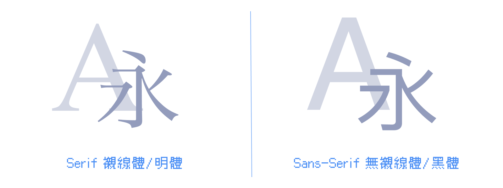

我們關於版面編排與 RWD 的部分終於告一個段落了，現在大觀念了解後，接下來我們要深入各個樣式的細節，例如文字、圖片、圖形、互動等等。首先，我們將從文字的部分開始。

在網頁設計中，字型滿重要的，可以為網頁增加視覺吸引力、改善閱讀體驗，並且讓所有使用者的字體體驗一致。在這篇我們將學習字體的基本知識，以及如何在網頁中使用字體、Icon Font。

> #### **↓ 今日學習重點 ↓**
> 
> * 了解字體的基本知識
>     
> * 了解網頁如何載入字體
>     
> * 了解 CSS font-family、font-weight
>     
> * 了解如何使用 Icon Font
>     

---

## 常見的字體的格式

字體常見的格式共有以下幾種：

1. **TTF （TrueType）：**  
    Windows 跟 Mac OS 最常用的字型格式，較舊的系統能支援，但是檔案偏大。
    
2. **OTF （OpenType）：**  
    Adobe 跟微軟一起改良了 TTF ，平滑、精細，品質表現比 TTF 好，如果字體有 TTF 與 OTF 可以下載，建議下載這種。
    
3. **WOFF （Web Open Font Format）：**  
    是由 Mozilla、微軟、Opera 一起為網站打造的字型格式，將 OTF 或 TFF 加上 Metadata 壓縮而成，是 W3C 官方建議的字型格式。
    
4. **WOFF2 （Web Open Font Format 2）：**  
    第二代的 WOFF，壓縮得更小，是目前最適合網頁的字體格式。
    

> 延伸閱讀：[簡介字型檔格式：TTF、EOT、WOFF、WOFF2-黑暗執行緒](https://blog.darkthread.net/blog/web-font-type/)

---

## 字體的種類



在網頁中，我們最常使用的字體種類是「Serif 襯線體/明體」與「Sans-Serif 無襯線體/黑體」：

### 1\. Serif 襯線體/明體

Serif 有著襯線裝飾（serifs）的特點，在字型的末端具有小小勾起的裝飾。在中文裡稱呼它為明體。

這種字體通常被認為更適合印刷品和長篇文章，因為它能幫助人在閱讀時更順暢。可是在螢幕顯示上，容易受到光暈的影響，而顯得比較不明顯。例如：

> 延伸閱讀：[桃園機場用新細明體，有什麼問題？ - INSIDE](https://www.inside.com.tw/article/3060-airport-pminliu)

當然為了達到各種不同的風格，並不是在螢幕上就不能用，而是要考慮到字級大小與目標族群是否合適。

這種字體給人的感覺通常是古典的、經典的。

### 2\. Sans-Serif 無襯線體/黑體

Sans-Serif 去掉了襯線裝飾，字體末端平滑俐落。在中文裡稱呼它為黑體。

和襯線體相反，由於尾巴沒有裝飾，所以比較不會受到光暈的影響，所以常常被用在數位系統、看板上。

這種字體給人感覺充滿了現代感。

### 3\. Monospace 等寬字體

這種字體在我們使用的程式碼編輯器中常常看見，在網頁上的程式碼顯示段落也會套用這種字體。前面兩種字體為了設計視覺上的和諧，每個字的實際寬度並不一定是相等的，這樣在寫程式時反而會導致上下行不對齊，結果變得不易閱讀程式碼。

所以，一般來說程式碼會使用等寬字體顯示，常見的是打字機的那種字體。

### 4\. 其他

其他的字體還有：手寫體、書法體、圓體、藝術字體等等。通常為了吸睛，特殊字體會被當成標題，而不會被當成內文，因為內文若是太花俏反而會不易閱讀。

---

## 在網頁中載入字體

現在，讓我們試試看在網頁中使用不同的字體。

### 1\. 使用 `<link>` 元素載入字體

通常我們會在 HTML 的 `<head>` 使用 `<link>` 載入字體，越早載入字體使用者體驗會越好，所以放在網頁的一開頭 `<head>` 中載入。

我們以使用 [Google 提供的字體](https://fonts.google.com/)為例，會使用以下方式載入：

```html
<link rel="preconnect" href="https://fonts.googleapis.com">
<link rel="preconnect" href="https://fonts.gstatic.com" crossorigin>
<link href="https://fonts.googleapis.com/css2?family=Noto+Sans+TC&display=swap" rel="stylesheet">
```

這邊 Google 建議我們可以加上 `<link rel="preconnect">`，事先告訴瀏覽器接下來要載入外部網站的資源，告訴它這個外部資源的 domain，讓瀏覽器可以提早建立連線，讓載入速度更快一些。

因為中文字體通常檔案比較大，速度的考量尤其重要。

### 2\. 使用 `@import` 載入字體

另外一種載入方式是使用，CSS 的 `@import` 載入字體：  
（這兩種方式擇一就好，個人偏好第一種）

```css
@import url("https://fonts.googleapis.com/css2?family=Noto+Sans+TC&display=swap");
```

### 3\. 使用 `font-family` 指定字型

一旦我們有載入了字型，在 CSS 的部分，我們就可以使用 `font-family` 設定字體：

```css
body{
	font-family: Arial, "Noto Sans TC", sans-serif;
}
```

這裡我們使用逗號隔開字體，如果文字在這個字體中沒有對應的字的話，就會套用下一個字體。一般來說，最後一個設定的字體會是 `sans-serif` 或 `serif` 這類的通用字型名稱（generic-family），指的是使用者電腦中預設的無襯線體或襯線體。

以上的例子，英文字會使用 Arial 這個字型；而中文字在 Arial 字型找不到編碼後，就會使用思源黑體（Noto Sans TC）。

如果字體為一個單字，就可以不需要使用冒號框 `""` 起來，直接寫單字就好。

其餘的通用字型名稱（generic-family），請參考：

> [font-family - CSS: Cascading Style Sheets | MDN](https://developer.mozilla.org/en-US/docs/Web/CSS/font-family)

如果我們沒有載入字體，但是在 CSS 中有設定的話，瀏覽器會去找使用者電腦中的字體，這樣就會導致有些人可以正常顯示字體，有些人則不行，除非你使用的是系統內建字體（如：Arial、Time New Roman 是許多人電腦中有的字體）。

---

讓我們再試試載入一個特殊字體看看，換了個字體就文青了起來：  
（Code Pen 中 HTML `<head>` 的設定在 Settings 中）


> DEMO 連結：[Font ChenYuluoyan](https://codepen.io/im1010ioio/pen/JjwVdgK)

附帶一提，這個辰宇落雁體是由台灣高中生製作的，很優秀！

> Github：[Chenyu-otf/chenyuluoyan\_thin: 辰宇落雁體](https://github.com/Chenyu-otf/chenyuluoyan_thin)

---

## 字體粗細 `font-weight`

我們還可以為這個字體設定粗細，只不過要載入對應粗細的字體才有作用喔！

```css
p {
    font-weight: 400;
}
```

CSS 中常見的粗細，有 10 級可以設定：

| `font-weight` | 對應字型的命名 |
| --- | --- |
| `100` | Thin |
| `200` |  |
| `300` | Light |
| `400`（等同 `normal`，預設值） | Regular |
| `500` | Medium |
| `600` |  |
| `700`（等同 `bold`） | Bold |
| `800` |  |
| `900` | Black |
| `1000` |  |

另外，還可以設定 `lighter` 與 `bolder` ，不過他們是依據由父層繼承而來的 `font-weight` 而有不同，詳細請見下表：

| 由父層繼承的 `font-weight` | `bolder` | `lighter` |
| --- | --- | --- |
| `100` | `400` | `100` |
| `200` | `400` | `100` |
| `300` | `400` | `100` |
| `400` | `700` | `100` |
| `500` | `700` | `100` |
| `600` | `900` | `400` |
| `700` | `900` | `400` |
| `800` | `900` | `700` |
| `900` | `900` | `700` |

---

---

## 接下來：字體資源與 Icon Font

知道怎麼設定字體後，下一個問題就是——去哪裡找字體？  
下一篇整理了 Google Fonts、justfont、emfont 等免費字體來源，以及 Font Awesome、Google Material Icons 等 Icon Font 的使用方式！

👉 **繼續閱讀下一篇：[哪裡找免費字體？Google Fonts、justfont、Font Awesome Icon 資源大整理](/text/css-font-resources-icon)**

---

#### ↓↓↓↓↓↓↓↓↓↓↓↓↓↓↓↓↓↓↓↓

感謝看到最後的你，若你覺得獲益良多，請不要吝嗇給我按個喜歡。❤️

如果你喜歡我的創作，還想看看其他有趣的分享與日常，  
可以追蹤我的 IG [@im1010ioio](https://www.instagram.com/im1010ioio/)，或者是[🧋送杯珍奶鼓勵我](https://im1010ioio.bobaboba.me/)，謝謝你🥰。

