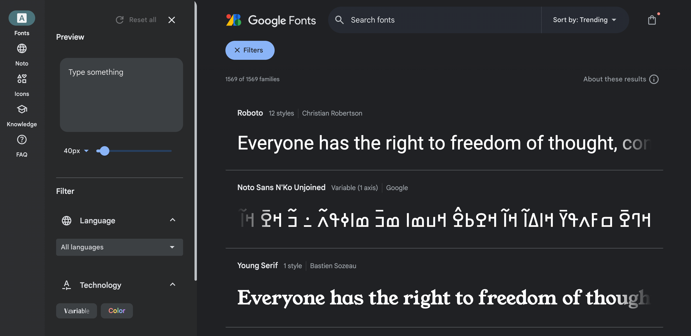
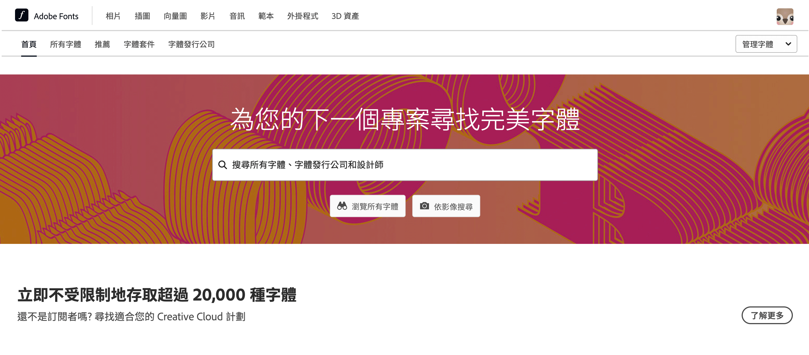
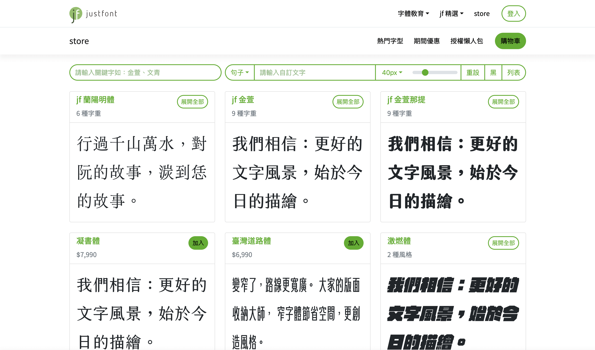
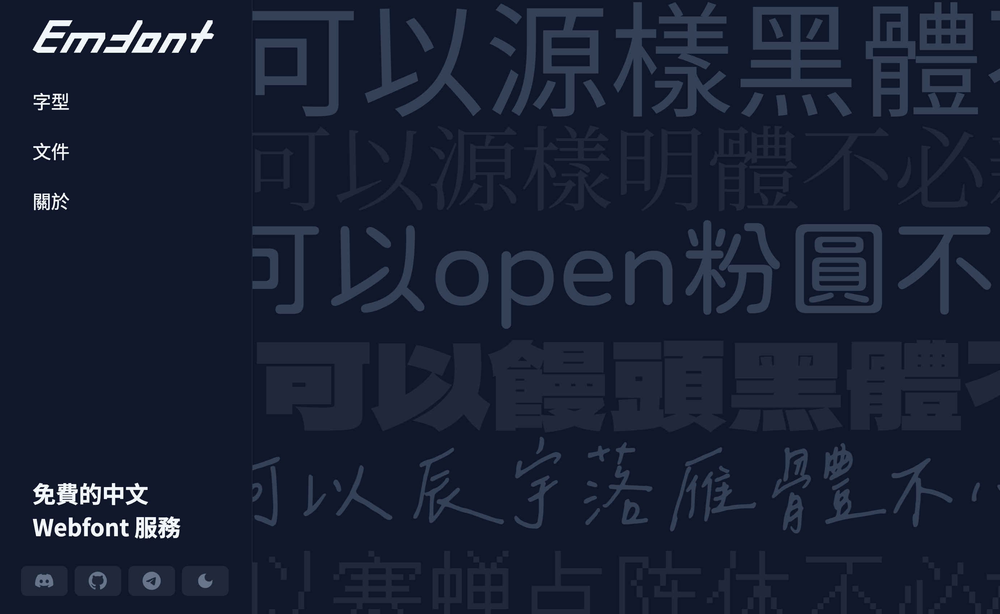
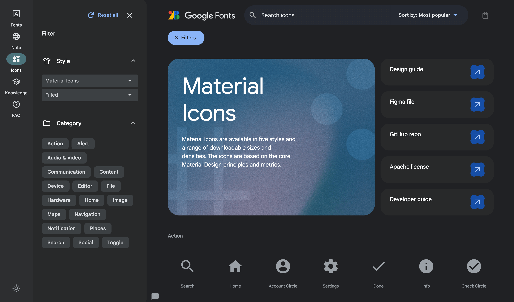
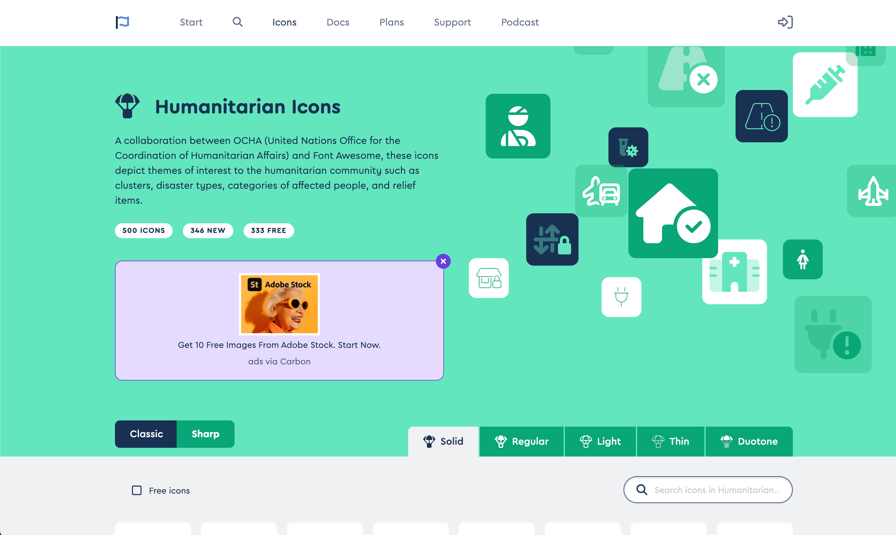
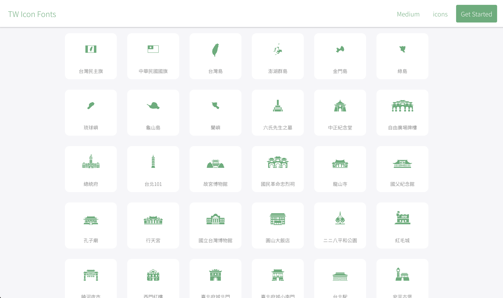
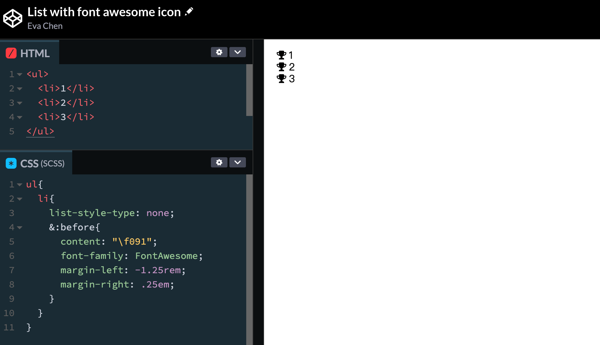

上一篇我們學了 CSS 字體的基礎知識，這一篇來解決最實際的問題——**去哪裡找字體？**  
不管是中文字體、英文字體，還是 Icon Font（圖示字型），這篇都幫你整理好了！

> #### **↓ 今日學習重點 ↓**
> 
> * 了解 Google Fonts、Adobe Font、justfont、emfont 的差異
>     
> * 學習使用 Google Material Symbols 和 Font Awesome Icon
>     
> * 知道如何用純 CSS 搭配 Icon Font 自訂清單樣式
>     

---

## 常見的網頁字體資源

### 1\. Google Font

> 連結：[Browse Fonts - Google Fonts](https://fonts.google.com/)

我們在一開始的範例就是使用 Google Font，Google Font 非常齊全，有各種受歡迎的字體，而且是免費的。只是可惜的是，中文字體只有兩種，就是思源黑體（Noto Sans TC）與思源明體（Noto Serif TC）。

所以在設計時，有的時候我會使用日文字體，比較多樣化，只是容易缺字，與筆順與中文有一些些不同。

### 2\. Adobe Font

> 連結：[Adobe Fonts | 探索無限字體](https://fonts.adobe.com/)

Adobe Font 也是非常有名，也很齊全的字體庫，只不過要使用的話，需要有訂閱他們的方案才能使用。

### 3\. justfont

> 連結：[字型列表 - jf store](https://store.justfont.com/fonts)

justfont 是台灣很有名研究中文字體的公司，之前很火紅的金萱體、蘭陽明體就是他們設計的，他們字體都非常好看！大部分需要購買才能使用。不過，他們曾經有為了回饋大眾，而推出了[粉圓體](https://justfont.com/huninn/)，非常可愛實用。

另外，他們也有經營 Facebook 粉絲專頁與社團：[字戀](https://www.facebook.com/lovefonts)與[字嗨](https://www.facebook.com/groups/149874075167476)，裡面很多關於有趣字體的討論，有興趣的朋友可以去看看。

### 4\. emfont

> 連結：
> 
> * [emfont](https://font.emtech.cc/)
>     
> * [emfont - 純 CSS 載入字體](https://font.emtech.cc/docs/pure-css)
>     

如果想使用免費的中文字型，emfont 這個網站整理了很多開源、免費的字體，也可以試試看喔！詳細使用方法請看他們的[文件](https://font.emtech.cc/docs/setup)。

---

## 常見的網頁 Icon Font

網頁上很多 icon 圖形其實是做成了字體，這樣能夠方便我們變大變小變顏色。

### 1\. Google Material Symbols / Icon

> 連結：[Material Symbols and Icons - Google Fonts](https://fonts.google.com/icons)

Google 推出的 Icon 也很齊全，共有兩種，第一種是舊版本的 Material Icon，第二種則是新版本的 Material Symbols，新版本可以調整 Icon 的粗細、預設大小。

它們的字體運作原理，是將特定的「英文單字」顯示為不同的圖示。不過，這樣有個問題，就是當使用瀏覽器的翻譯功能時，「英文單字」被翻譯了，圖示就會不見，然後變成被翻譯的文字。QQ

所以使用時建議考慮一下使用者會不會有需要翻譯的行為，再決定要不要使用它。

### 2\. Font Awesome

> 連結：[Font Awesome](https://fontawesome.com/)

Font Awesome 是比起 Material Symbols / Icon 更齊全的網頁 icon，但是它需要註冊並且建立專案，有一些 icon 要額外收費。

它的字體運作原理，是將是特定的「代碼」顯示為不同的圖示。它是使用偽元素 `::before` 的 `content` 設定這個代碼，例如：`content: "\f167";`。

### 3\. **Taiwan Icon Font**

> 連結：[Taiwan Icon Font](https://www.twicon.page/index.html)

台灣也有專屬於自己的 Icon Font，是由生活在台南的日本設計師 holoko 和居住在台灣的英國程式設計師 Rob 共同開發，是免費的。雖然我沒有用過，但這些 Icon 應該滿適合使用在國內旅遊的專案上。

它的字體運作原理和 Font Awesome 一樣。

### 4\. 單純只使用 CSS 設定 Icon Font

知道了 Icon Font 的運作原理後，我們也可以用和他們同樣的方式，使用 CSS 設定 Icon 顯示在不同地方，例如改變清單 `<ul>` 的圖示（不過我這裡是使用[舊版的 Font Awesome](https://fontawesome.com/v4/icons/) 作 DEMO）：

> [DEMO 連結： List with font awesome icon](https://codepen.io/im1010ioio/pen/PKpObM)

---

> 參考資料：
> 
> [網頁中英文字型(font-family)跨平台設定最佳化＠WFU BLOG](https://www.wfublog.com/2014/02/font-family-chinese-cross-platform.html)  
> [Font-family - 金魚都能懂的CSS必學屬性 - iT 邦幫忙::一起幫忙解決難題，拯救 IT 人的一天 (](https://ithelp.ithome.com.tw/articles/10238571)[ithome.com.tw](http://ithome.com.tw)[)](https://ithelp.ithome.com.tw/articles/10238571)

---

---

> 👈 **上一篇：[網頁字體基礎：字體格式、種類與 font-family、font-weight 使用方法](/text/css-font-family-font-weight)**

---

#### ↓↓↓↓↓↓↓↓↓↓↓↓↓↓↓↓↓↓↓↓

感謝看到最後的你，若你覺得獲益良多，請不要吝嗇給我按個喜歡。❤️

如果你喜歡我的創作，還想看看其他有趣的分享與日常，  
可以追蹤我的 IG [@im1010ioio](https://www.instagram.com/im1010ioio/)，或者是[🧋送杯珍奶鼓勵我](https://im1010ioio.bobaboba.me/)，謝謝你🥰。

