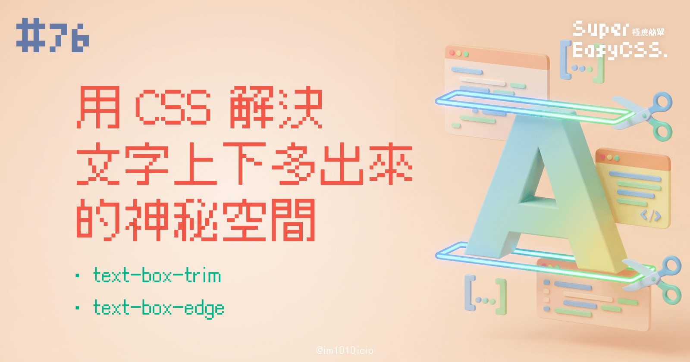
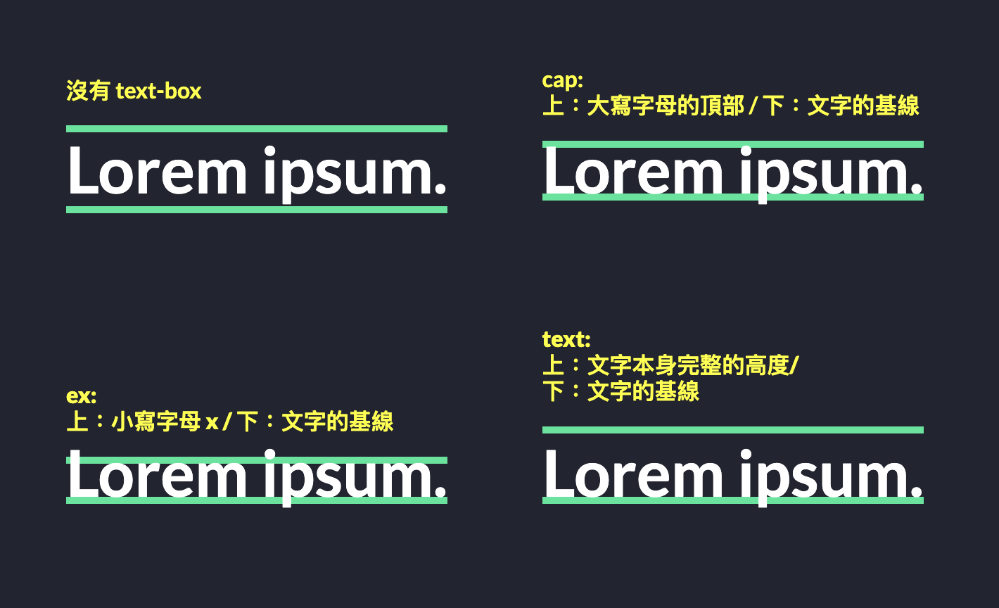
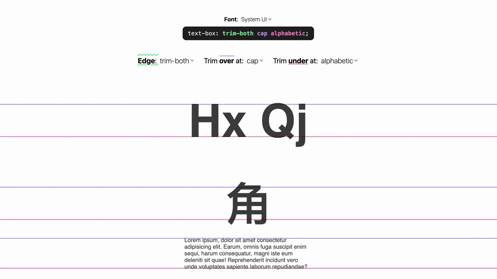

你是不是也常常爲了文字上下多出來的神秘空白間距感到困擾，導致按鈕裡的文字、或是標題跟內文之間的距離怎麼調都感覺不太對勁？

在過去，每個字型本身都會包含一些內建的空間，像是文字的上方（ascender）和下方（descender）會有一些預留的空白。這導致我們用 CSS 設定的 `padding` 或 `margin`，在視覺上看起來總是不太精確。

例如，你可能為一個按鈕設定了上下 `padding: 0.5rem`，但因為文字本身上下自帶的空白，會讓按鈕看起來上方空間特別大，文字沒有真的垂直置中。

而 `text-box-trim` 和 `text-box-edge` 就像一把精密的裁紙刀，可以幫我們把這些多餘的空白「裁掉」，讓文字的邊界更貼合實際的字體本身。

> 註：不過這是比較新的語法，目前 Firefox 暫不支援，iOS 是 18 後才支援，使用時要注意一下喔！  
> 詳細請看 [Can I Use](https://caniuse.com/css-text-box-trim)。

---

## 一、這兩個屬性如何搭配使用？

### 1\. 語法

我們可以把這兩個屬性想像成一個團隊：

#### (1) `text-box-trim`：決定「要裁哪裡」

* `none`（預設）：不裁切
    
* `trim-start`：只裁掉文字**上方**多餘空白
    
* `trim-end`：只裁掉文字**下方**多餘空白
    
* `trim-both`：同時裁掉文字上下的多餘空白
    

#### (2) `text-box-edge`：決定「裁到多精準」

告訴瀏覽器上下邊界要對齊到哪裡。可寫**一或兩個值**（第一個＝**上緣** over，第二個＝**下緣** under）。

> 提醒：只有當 `text-box-trim` 不是 `none` 時，`text-box-edge` 才會生效。

##### **(2-1) 這些可用的值（&lt;text-edge&gt;）**

* `text`  
    對齊到一般「文字邊緣」：概念上接近字體的可讀字面（由字體的上/下邊界決定），不特別鎖定大寫或基線，只是把多餘的行內空白修整到貼近文字外輪廓。可用在**上/下**兩邊。
    
* `cap`（大寫頂端）  
    上緣對齊到**大寫字母的頂端**（cap height）。常見於拉丁字母的標題，希望上邊界貼齊「H、T」等大寫高度。**只用於上緣（over）**。
    
* `ex`（x-height 頂端）  
    上緣對齊到**小寫 x 的高度**（x-height 的頂端）。比 `cap` 再低一點，讓上邊界更貼近小寫主體。**只用於上緣（over）**。
    
* `alphabetic`（西文基線）  
    下緣對齊到**alphabetic baseline**（拉丁系文字的基線）。這是大多數西文字體的「立足線」，讓下邊界整齊地貼齊基線。**只用於下緣（under）**。
    

> 註： 另外還有 `ideographic` 和 `ideographic-ink` 這兩種關鍵字，用來指定特定於漢字圈文字（中、日、韓）的上下緣位置。但目前它們的確切行為正在爭論中，且沒有瀏覽器支援。

##### **(2-2) 常用組合**

* `cap alphabetic`：上對齊到大寫頂端、下對齊到西文基線（很常用在標題/按鈕）。
    
* `ex alphabetic`：上對齊到 x-height 頂端、下對齊到西文基線（比較緊的上邊界）。
    
* `text text`（或省略為 `auto`）：上/下都對一般文字邊緣。
    

### **2\. 實際這樣寫**

```css
/* 標題/按鈕常見做法：上下都裁，視覺貼齊 */
h1, button {
    text-box-trim: trim-both;
    text-box-edge: cap alphabetic; /* 上對 cap、下對 alphabetic 基線 */

    /* 等同於這樣縮寫： */
    text-box: trim-both cap alphabetic;
}
```

當 `text-box-trim` 啟用裁切後，`text-box-edge` 才會生效，來定義裁切的參考線。  
如果 `text-box-trim` 設為 `none`，那麼 `text-box-edge` 就不會有任何作用。

---

## 二、實際應用 DEMO

說了這麼多，我們直接來看個範例最有感。

### 1\. 每種 `text-box-edge` 的值都試一遍

以下的例子全部 `text-box-edge` 的值都試試看，主要改變上緣的部分（`cap`、`ex`、`text`），下緣統一都是依據文字的基線（`alphabetic`）為裁切：



> DEMO 連結：[CSS text-box](https://codepen.io/im1010ioio/pen/azddqxd)

```css
.content-cap h2{
/*   上：大寫字母的頂部 / 下：文字的基線 */
    text-box: trim-both cap alphabetic;
}

.content-ex h2{
  /* 上：小寫字母 x / 下：文字的基線 */
  text-box: trim-both ex alphabetic;
}

.content-text h2{
  /* 上：文字本身完整的高度 / 下：文字的基線 */
  text-box: trim-both text alphabetic;
}
```

### 2\. 修復按鈕位置中問題

在使用[思源黑體（Noto Sans TC）](https://fonts.google.com/noto/specimen/Noto+Sans+TC)製作按鈕時，常常會覺得預設按鈕文字的位置有點偏移（如第一顆按鈕）：


如果你看不出來，試著把 `padding` 改為 0 就會明顯發現，他真的沒對齊：


那麼我們在第二顆按鈕上，使用了：

```css
.btn2 {
    text-box: trim-both cap alphabetic;
}
```

就會發現：  
`text-box` 能夠讓文字與背景色的關係切在較中間的位置，最後加上 `padding` 後，文字就能保持在正中間啦！

> DEMO 連結：[Fix button text not centered using CSS text-box](https://codepen.io/im1010ioio/pen/zxrrJYE)

---

## 二、`text-box` 操作小工具

如果還是不夠清楚，除了自己寫 DEMO 測試外，  
想查看`text-box-trim` 與 `text-box-edge` 實際到底指的是文字的哪個部分，  
可以看看 Google 團隊（Chrome for Developers）做的小工具：



> 連結：[Interactive CSS text-box](https://codepen.io/web-dot-dev/pen/RNbyooE)

---

`text-box-trim` 與 `text-box-edge` 讓我們對文字的控制能力更強大了，可以擺脫字體內建間距的限制，下次當你又在為那惱人的一兩像素間距煩惱時，等到全面支援時，就不用擔心啦！

> 延伸閱讀：
> 
> * [MDN -text-box](https://developer.mozilla.org/en-US/docs/Web/CSS/text-box)
>     
> * [MDN - &lt;text-edge&gt;](https://developer.mozilla.org/en-US/docs/Web/CSS/text-edge#formal_syntax)
>     
> * [Chrome for Developers - CSS text-box-trim](https://developer.chrome.com/blog/css-text-box-trim?hl=zh-tw)
>     

---

#### ↓↓↓↓↓↓↓↓↓↓↓↓↓↓↓↓↓↓↓↓

感謝看到最後的你，若你覺得獲益良多，請不要吝嗇給我按個喜歡。❤️

如果你喜歡我的創作，還想看看其他有趣的分享與日常，  
可以追蹤我的 IG [@im1010ioio](https://www.instagram.com/im1010ioio/)，或者是[🧋送杯珍奶鼓勵我](https://im1010ioio.bobaboba.me/)，謝謝你🥰。

