之前我們都是著重在網頁排版上，今天我們要來做點吸睛的文字視覺效果！我們將會使用 CSS 的 `text-shadow`、`-webkit-text-stroke`、`-webkit-background-clip`，製作出許多特效文字：如霓虹字、立體字、外框字、漸層字等等，可以應用在網頁主視覺上。

使用網頁的文字製作主視覺，雖然不及圖片來得變化多端，但是使用 HTML 與 CSS 製作的話，比較容易被搜尋到，對於 SEO 還是利大於弊。

> #### **↓ 今日學習重點 ↓**
> 
> * 了解 CSS 的 text-shadow 與其應用
>     
> * 了解製作文字外框的方法
>     
> * 了解如何製作 CSS 文字遮罩
>     

---

## 一、文字陰影：`text-shadow`

CSS 中的 text-shadow 可以製作文字的陰影，陰影可以做到許多有趣的事情，我們可以透過它做出立體字、霓虹字等效果。

### 1\. 基本寫法

首先，我們要先了解 text-shadow 的基本寫法：

```css
/* text-shadow: 水平偏移 | 垂直偏移 | 模糊程度 | 顏色 */
h1 {
    text-shadow: 1px 1px 3px black;
}
```

這樣一來，我們就能輕鬆做出文字的陰影：

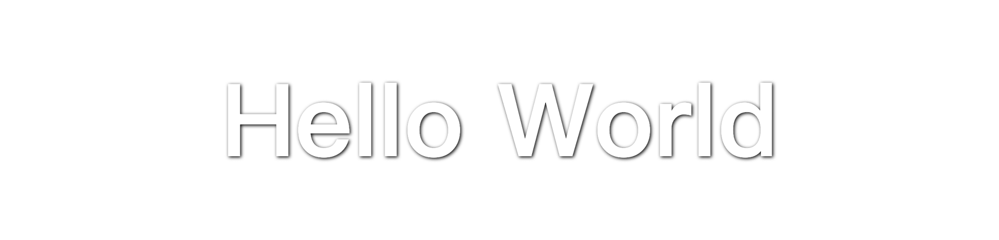

> DEMO 連結：[Text shadow](https://codepen.io/im1010ioio/pen/zYyQwQV)

如果當文字與背景顏色太相近，看不清楚時，可以試者加上一點點陰影，就能讓文字清晰，是個很好用屬性。

`text-shadow` 還有一些簡寫可以使用，但是我覺得最基本的已足矣，不過想知道的話，可以參考以下連結：

> 延伸閱讀：[text-shadow - CSS：层叠样式表 | MDN](https://developer.mozilla.org/zh-CN/docs/Web/CSS/text-shadow)

### 2\. 陰影可以疊加

`text-shadow` 可以連續寫好幾個陰影，會依序疊加，最先寫的陰影會在最上面。寫法很簡單，使用逗號 `,` 隔開就好了，寫法如下：

```css
h1 {
    text-shadow:
		1px 1px 3px black,
		5px 3px 0 orange;
}
```


> DEMO 連結：[Mutiple text shadow](https://codepen.io/im1010ioio/pen/BaveZaJ)

### 3\. 應用：立體字

能夠加疊陰影，我們就能夠來製作立體的文字了，透過多重陰影製造出立體感：

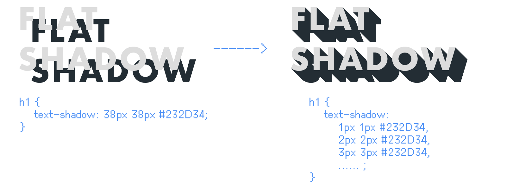

像這樣扁平風的陰影，如果文字的顏色與背景顏色相同，就會有很酷的極簡現代風格：

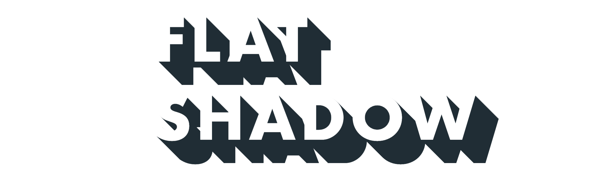

> DEMO 連結：[Flat Shadow](https://codepen.io/im1010ioio/pen/eVdLqQ)

學會了這個方法，我們就可以用電影「小行星城」的 LOGO 來做練習（雖然我還沒有看過這部電影），讓大家對於可以應用在哪裡更有感覺一點。

雖然字體不一樣，但是用了類似的，詳細請看 DEMO：

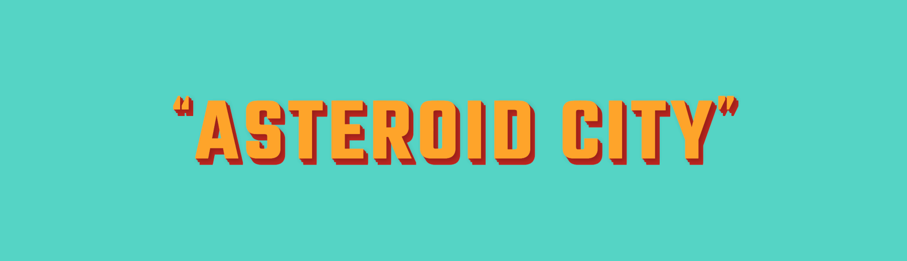

> DEMO 連結：[ASTEROID CITY Logo](https://codepen.io/im1010ioio/pen/GRPaWvL)

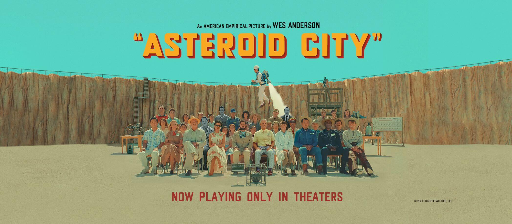

（圖片來源：[Asteroid City Facebook](https://www.facebook.com/AsteroidCityFilm/)）

> 延伸思考：要寫許多重複的 `text-shadow` 的確很麻煩，如果你有使用 CSS 的預處理器 Sass/SCSS 或 Less，可以考慮使用它們的 for /loop 迴圈（例如：[Sass: @for](https://sass-lang.com/documentation/at-rules/control/for/)），CSS 就可以變得精簡許多。

### 4\. 應用：霓虹字

說到陰影，不得不提到陰影的反面，那就是光暈。

透過 `text-shadow` 我們也可以做到光暈效果，不過如果只有單層的 `text-shadow`，顏色會不太明顯，所以這邊疊加了好幾層的藍色陰影，並且在最上層還加上了兩層的白色陰影。

背後的圓圈是使用偽類 `::before` 製作，使用了 `box-shadow` 屬性，它和 `text-shadow` 寫起來差不多，只是多了擴展範圍可以設定，我們之後會再介紹。

詳細請看 DEMO：


> DEMO 連結：[CSS Neon Text](https://codepen.io/im1010ioio/pen/VwqOmVe)

可是，如果你換了個較粗字體，會發覺有地方怪怪的，因為一般來說，霓虹燈是細的，所以建議選擇較細的字體，或者是使用下一個我們要介紹的方法 `-webkit-text-stroke`。

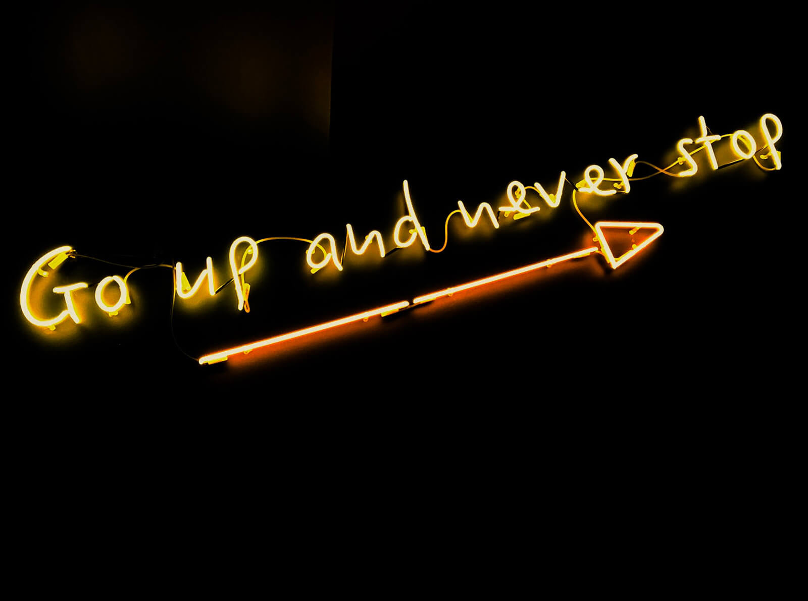

---

## 二、文字外框：`-webkit-text-stroke`

如果你觀察霓虹燈招牌，會發現除了單純的細字外，有許多霓虹燈是使用文字外框製作的：

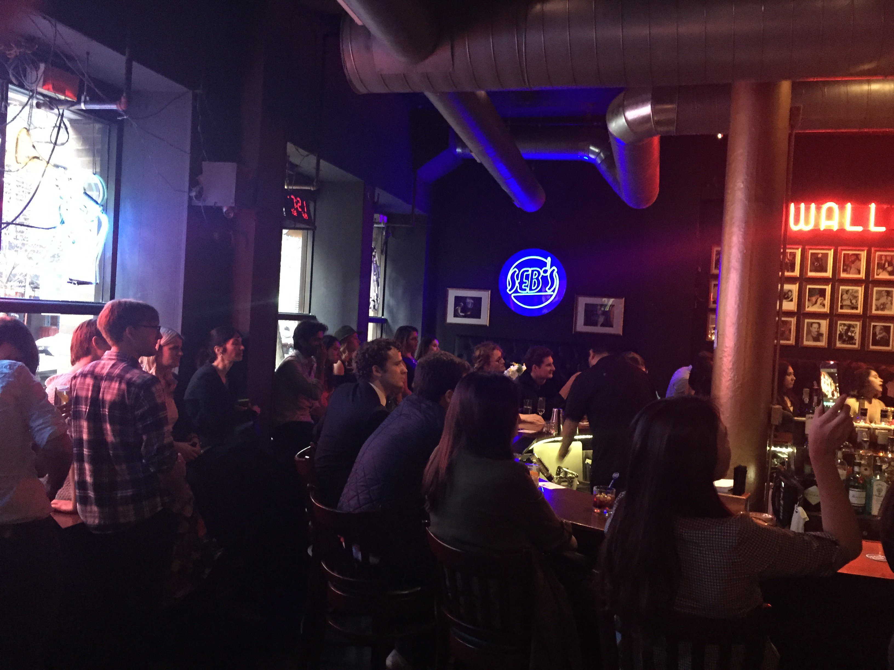

（圖片來源：[Lalaland Twitter/X](https://twitter.com/LaLaLand/status/857420433657692160)）

所以，這時我們就可以使用 CSS `-webkit-text-stroke` 屬性來製作外框，並且把文字設為透明的：

```css
h1 {
	color: transparent;
	-webkit-text-stroke: 2px #fff;
}
```

也許你猜到了，我們也要來用電影 LALALAND 裡面的酒吧 LOGO 來做練習（如果不想被雷不要看這部影片）：

%[https://youtu.be/G6p--mEgvVM?si=aUqUnvQPhcVw19IX] 

讓我們改造一下上一個 DEMO，雖然字體不一樣，但是盡量用了類似的：

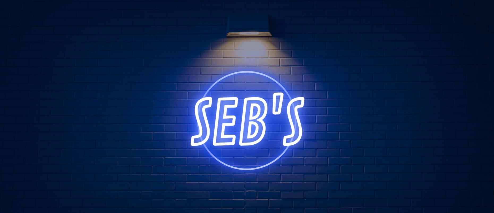

> DEMO 連結：[CSS Neon Text (stroke text)](https://codepen.io/im1010ioio/pen/jOXoyQj)

不過實際測試這個屬性後，我發現框線的粗細似乎會受到字體設計的影響，因為若放大來看，這個字體套用後的外框 1px 原來是有這麼多線條組成，所以才會那麼粗：

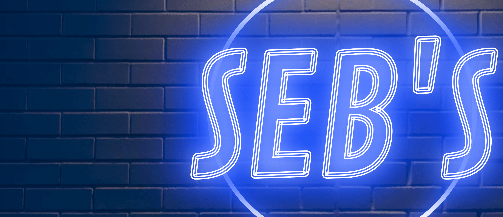

然後在開頭 DEMO，小行星城 LOGO 的字體則會變成這樣：


而我試了其他字體，有的則是單純 1px 的外框：

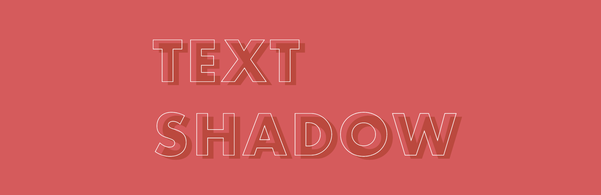

總之，搭配字體後這個屬性還滿微妙的。如果真的效果不符合預期，可以考慮使用 `text-shadow` 疊加出外框來：

```css
h1 {
    text-shadow:
        -1px -1px 0 #fff,
        1px -1px 0 #fff,
        -1px 1px 0 #fff,
        1px 1px 0 #fff;
}
```

另外，`-webkit-text-stroke` 的粗細，是平均往內、往外增粗，所以文字本身會被吃掉一些粗度而變細，這時候可以考慮使用偽類解決，詳細請參考：

> 延伸閱讀：[如何利用 CSS 製作完美的文字外框 | 聖誕老人網頁設計公司](https://www.hellosanta.com.tw/knowledge/category-13/post-433)

---

## 三、文字遮罩：`-webkit-background-clip`

CSS 中有個屬性是 `-webkit-background-clip`，它可以設定元素的背景（背景圖片或顏色）是否延伸到邊框、內邊距盒子、內容盒子或文字下方，簡單來說是個遮罩功能。

> 延伸閱讀：[background-clip - CSS：层叠样式表 | MDN](https://developer.mozilla.org/zh-CN/docs/Web/CSS/background-clip)

我們可以使用 `-webkit-background-clip` 中的值 `text`，達到文字遮罩的效果。

它使用時有一些條件：

* `-webkit-background-clip` 要放在背景的後面
    
* 文字顏色必須要設為透明 `transparent`，不然會遮住背景
    

```css
h1 {
	background: linear-gradient(135deg, rgba(0,140,110,1) 20%, rgba(180,164,136,1) 25%, rgba(239,191,173,1) 30%, rgba(239,191,174,1) 35%, rgba(238,157,131,1) 50%, rgba(209,55,2,1) 70%, rgba(163,59,137,1) 85%, rgba(7,88,155,1) 100%);
	/* background-clip 要在背景的後面 */
	-webkit-background-clip: text;
	color: transparent;
}
```

CSS 的背景 `background` 屬性可以製作漸層色，也可以套用背景圖片，所以我們就可以來做漸層文字與圖片背景文字，詳細可以看以下的 DEMO：

> 此外，要製作 CSS 漸層，大家可以使用這個小工具：  
> [CSS Gradient — Generator, Maker, and Background](https://cssgradient.io/)

### 1\. 漸層文字

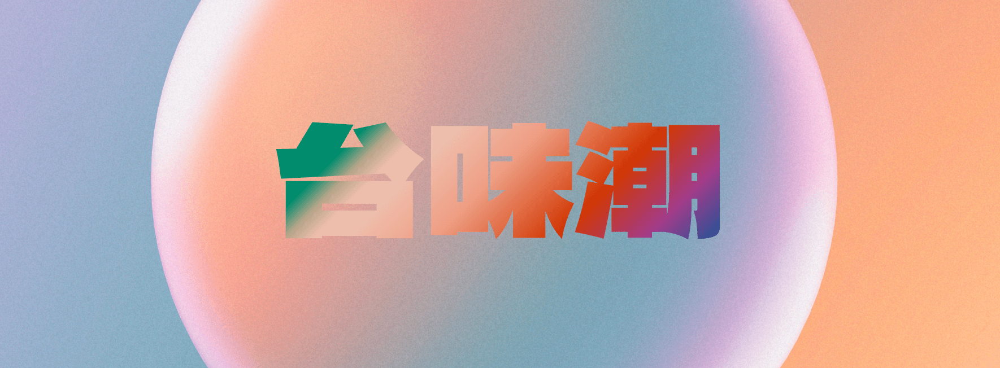

> DEMO 連結：[Gradient Text](https://codepen.io/im1010ioio/pen/MWZdpNO)

這個範例是參考 iOS App Store 裡面的廣告頁面，背景與字體都找了類似的：

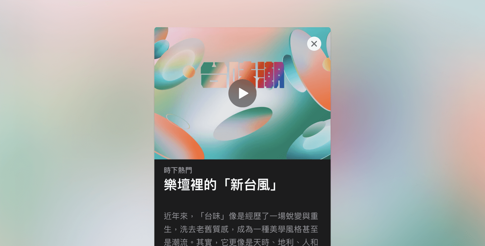

### 2\. 背景圖片文字

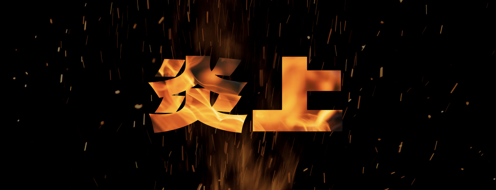

> DEMO 連結：[Text with background image](https://codepen.io/im1010ioio/pen/QWzRvvq)

使用背景圖片當文字遮罩，非常適合用在要為文字添加材質時，用得好的話，效果應該會很不錯，交給大家去探索囉！

---

哇！30 天終於完賽啦！  
不過當初範圍訂得有點大，所以這系列還沒有結束呢⋯⋯ TvT  
容我慢慢更新。

下篇來寫寫鐵人賽的心得。XD

---

#### ↓↓↓↓↓↓↓↓↓↓↓↓↓↓↓↓↓↓↓↓

感謝看到最後的你，若你覺得獲益良多，請不要吝嗇給我按個喜歡。❤️

如果你喜歡我的創作，還想看看其他有趣的分享與日常，  
可以追蹤我的 IG [@im1010ioio](https://www.instagram.com/im1010ioio/)，或者是[🧋送杯珍奶鼓勵我](https://im1010ioio.bobaboba.me/)，謝謝你🥰。

