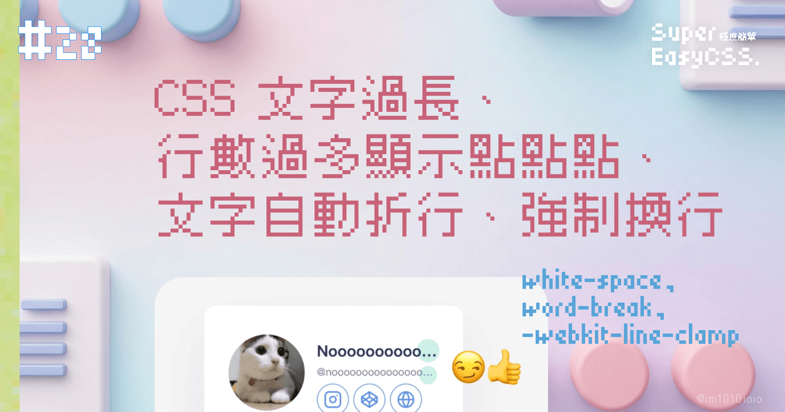
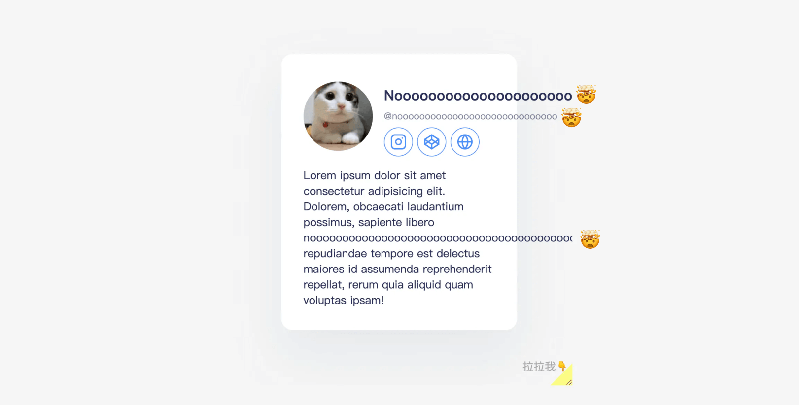
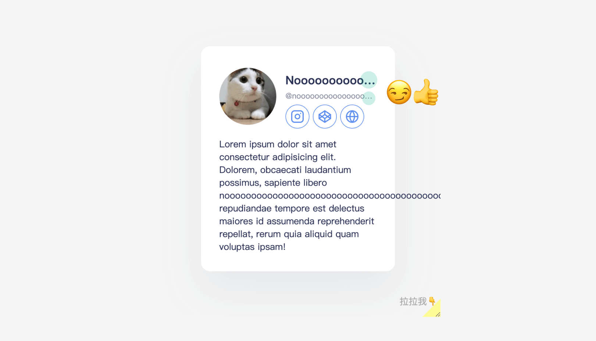
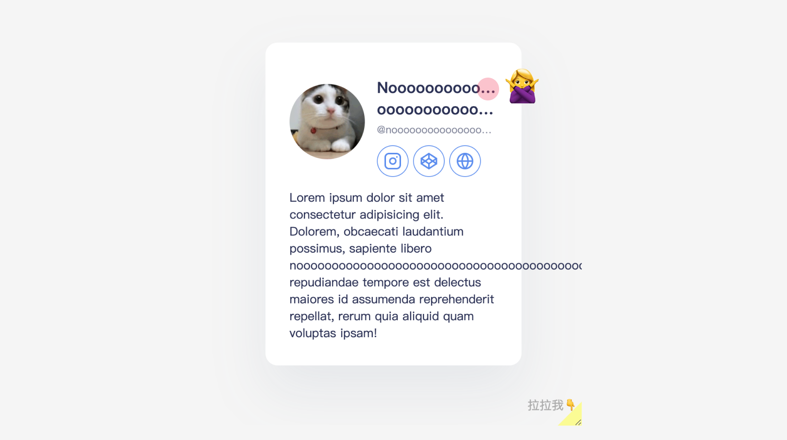
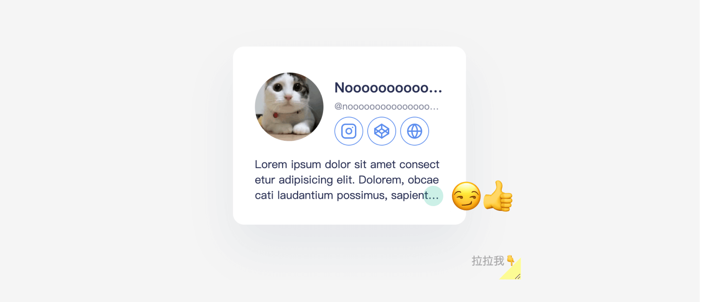
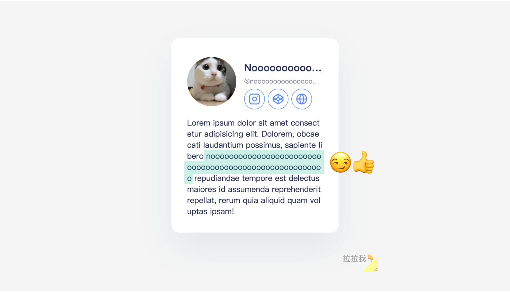
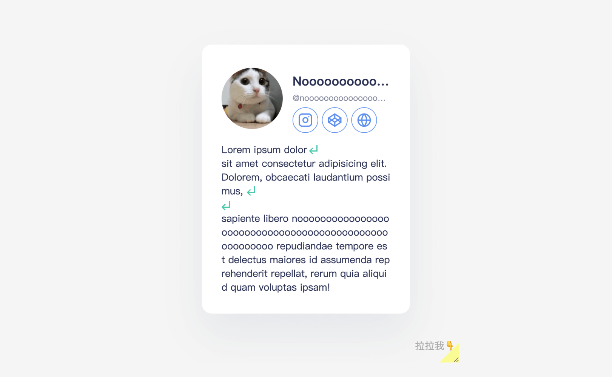

在網頁中，許多資料是動態產生的，也就是說我們沒有辦法控制內容的長短，版面可能被文字擠到破版，也可能會該換行的沒有換行。

今天我們就要來學習各種 CSS 文字的處理技巧。

> #### **↓ 今日學習重點 ↓**
> 
> * 學會設定文字過長、行數過多顯示點點點（刪節號 ellipsis）
>     
> * 了解如何讓文字強制換行
>     
> * 學會如何讓文字依據 `\r\n` 自動折行
>     

---

## 過長的內容

當文字過短時，有可能只是畫面不夠好看，不至於無法使用；而過長時會較嚴重，因為它可能會直接讓畫面破版，甚至影響到功能操作。

讓我們用前幾天 Container Queries 的 DEMO，然後把它弄爆：



> DEMO 連結：[Broken webpage layout because of long text](https://codepen.io/im1010ioio/pen/VwqNNyq)

哇⋯⋯精美的破版。TvT

這種情況又稱為文字溢排，解決方法是讓他強制換行，或者在超出可顯示的範圍時顯示點點點（刪節號 ellipsis）。接下來，就讓我們來了解各種解法吧！

> 延伸閱讀：  
> [【Day06】內容長度 - 過長的內容 - iT 邦幫忙](https://ithelp.ithome.com.tw/articles/10294537)  
> [【Day07】內容長度 - 過短的內容 - iT 邦幫忙](https://ithelp.ithome.com.tw/articles/10295299)  
> （這系列「防禦性 CSS」推薦大家去看完全系列喔！可以預防踩到坑。）

### 1\. 文字過長顯示點點點：`text-overflow`



> DEMO 連結：[text-overflow: ellipsis](https://codepen.io/im1010ioio/pen/xxmeewP)

當我們需要超出可顯示的範圍時顯示點點點（刪節號 ellipsis），可以使用 CSS 中的 `text-overflow` 屬性，他會在文字的尾端添加「…」。

這種方式建議**只使用在單行的時候**：如果使用在多行的情況，它會在每一行的尾巴都添加「…」，但這並不是我們期望的效果，如果多行，我們只需要最後一行有添加「…」就好了 。



而 `text-overflow` 有一些使用條件：

* 設定的容器必須有寬度，而不是 `auto`
    
* 必須搭配 `overflow: hidden;` ，設定可顯示的範圍
    
* 由於只適合單行使用，所以我們要強制讓文字無法折行，必須搭配 `white-space: nowrap;` 使用  
    （CSS 中的 `white-space` 是處理遇到空白時的情況，這邊設定遇到空格時不要折行）
    

所以寫起來會像下面這樣：

```css
h1, small{
	width: 100%;
	text-overflow: ellipsis;
	overflow: hidden;
	white-space: nowrap;
}
```

這樣一來，我們如果文字超出範圍，就能順利加上尾部的點點點了。

> 延伸閱讀：  
> [text-overflow - CSS：层叠样式表 | MDN](https://developer.mozilla.org/zh-CN/docs/Web/CSS/text-overflow)  
> [overflow - CSS：层叠样式表 | MDN](https://developer.mozilla.org/zh-CN/docs/Web/CSS/overflow)  
> [white-space - CSS：层叠样式表 | MDN](https://developer.mozilla.org/zh-CN/docs/Web/CSS/white-space)

### 2\. 行數過多顯示點點點：`-webkit-line-clamp`



> DEMO 連結：[line-clamp](https://codepen.io/im1010ioio/pen/xxmeezJ)

如果要處理多行的情況，我們將會使用 `-webkit-line-clamp` 設定要顯示的行數，而它也有一些使用條件：

* `display` 的屬性要設成 `-webkit-box` 或 `-webkit-inline-box`
    
* 要設定 `-webkit-box-orient` 屬性為 `vertical`
    
* 通常要搭配 `overflow: hidden;` 使用
    

所以，它寫起來會像以下這樣：

```css
p{
    display: -webkit-box;
    -webkit-line-clamp: 3; /* 設定顯示 3 行 */
    -webkit-box-orient: vertical;
    overflow: hidden;
}
```

這樣就能很輕易解決文字過多且多行的情況了！

不過 CSS 屬性有前綴（`-webkit-`）就代表還在實驗階段，未來有可能會有寫法上的更新，但是未來若改變寫法，應該也能相容舊版寫法，所以不影響。

> 延伸閱讀：[\-webkit-line-clamp - CSS：层叠样式表 | MDN](https://developer.mozilla.org/zh-CN/docs/Web/CSS/-webkit-line-clamp)

### 3\. 單字過長強制換行：`word-break`



> DEMO 連結：[word-break: beak-all](https://codepen.io/im1010ioio/pen/RwEOOym)

HTML 中的文字有一個特性：將兩個空格之間的英數視為一個單字，為了讓人閱讀完整的一個單字，所以他不會將其折行。不過，中間有一槓 `-`（hyphen）時不算，而中文、日文、韓文，由於每一個字是獨立的，所以也不算。

大部分的時候，單字通常不會過長，除非用到火山矽肺症之類的英文，不然不太會破版，可是萬一我們今天要顯示的是一串駝峰式文字（如：HelloHelloHelloHelloWorld），或一串極長數字（如：圓周率 3.14159... ），就可能會撐爆版面了。

要解決這個問題，我們可以使用 CSS 的 `word-break` 屬性，將其設定為 `break-all`，強制所要文字都要依據容器的寬度換行，寫法如下：

```css
p{
	word-break: break-all;
}
```

`word-break` 還有其他屬性可以設定，不過較少使用，詳細可參考：

> 延伸閱讀：[word-break - CSS：层叠样式表 | MDN](https://developer.mozilla.org/zh-CN/docs/Web/CSS/word-break)

### 4\. 小結：很長的範例文字

有了這些小技巧，就可以大幅減少版面壞掉的可能性。此外，在切版時可以參考一些很長的範例文字，給大家參考：

* 英文中最長的單字：火山矽肺症 Pneumonoultramicroscopicsilicovolcanoconiosis
    
* 英文中名字很長的人：Benedict Timothy Carlton Cumberbatch
    
* 台灣最長的人名：陳政成有震天龍砲變身基隆最專情於二零二一三月十四日與孔安穩定交往中愛妳愛一生一世此生想帶妳一起吃鮭魚
    
* 台灣最長的原住民姓名：朗論·馬哩吉·以斯馬哈善·以斯立段
    
    > 延伸閱讀：[中華民國國民姓名字數排行 - 維基百科，自由的百科全書](https://zh.wikipedia.org/wiki/%E4%B8%AD%E8%8F%AF%E6%B0%91%E5%9C%8B%E5%9C%8B%E6%B0%91%E5%A7%93%E5%90%8D%E5%AD%97%E6%95%B8%E6%8E%92%E8%A1%8C)
    

---

## 需要斷行的內容

### 依據內容的 `\r\n` 自動斷行

如果我們使用 HTML `<textarea>` 送出有「斷行」的一段文字，在資料上會將這些「斷行」儲存為 `\r` 或 `\n` 的格式，只不過在前端中我們看不見。這時，若直接將這段資料套用到前端上，這些「斷行」會全部不見，讓使用者很難閱讀。

這種情況，可以使用 JS 判斷資料中是否有 `\r` 或 `\n`，有的話將它們轉為 HTML 的 `<br>` 斷行標籤，就能解決了。不過，其實在 CSS 中，我們還有個更簡便的方法，我們要使用 `white-space: pre-line;` 。

#### Pre 是什麼？

在了解 `pre-line` 是什麼前，我們要了解 `pre` 是什麼。

`<pre>` 是 HTML 中用來顯示程式碼片段的標籤，預設具有「依據內容（`\r\n`）自動斷行，但是當文字超出容器時不會斷行，並且所有空格都會如實顯示」的特性，這段對應的 CSS 屬性，便是 `white-space: pre;`。

#### `white-space` 可用的值

`white-space` 我們在上面也有提到過，是用於設定如何處理元素內的空白符號的 CSS，而與自動斷行有關的值，有以下可以使用：

| 值 | 依據內容（`\r\n`）自動斷行 | 超出容器時 | 空格 |
| --- | --- | --- | --- |
| `pre` | 斷 | 不斷行 | 顯示所有空格 |
| `pre-wrap` | 斷 | 斷行 | 顯示所有空格 |
| `pre-line` | 斷 | 斷行 | 多個空格，視為一個 |

以上最貼近我們需求的，就是 `pre-line` 這個值了，它既能夠自動斷行，又不會因為使用者誤打的多餘空格造成多餘的空白。

> 延伸閱讀：  
> [&lt;pre&gt; - HTML（超文本标记语言） | MDN](https://developer.mozilla.org/zh-CN/docs/Web/HTML/Element/pre)  
> [white-space - CSS：层叠样式表 | MDN](https://developer.mozilla.org/zh-CN/docs/Web/CSS/white-space)

#### 實際使用 `white-space: pre-line;` 的效果



> DEMO 連結：[white-space: pre-line](https://codepen.io/im1010ioio/pen/wvRZZYM)

實際的效果如以上 DEMO，寫起來很簡單，如下：

```css
p{
	white-space: pre-line;
}
```

---

好的，今天關於文字處理的各種小技巧就先到這裡囉！  
終於快要完賽啦！

---

#### ↓↓↓↓↓↓↓↓↓↓↓↓↓↓↓↓↓↓↓↓

感謝看到最後的你，若你覺得獲益良多，請不要吝嗇給我按個喜歡。❤️

如果你喜歡我的創作，還想看看其他有趣的分享與日常，  
可以追蹤我的 IG [@im1010ioio](https://www.instagram.com/im1010ioio/)，或者是[🧋送杯珍奶鼓勵我](https://im1010ioio.bobaboba.me/)，謝謝你🥰。

